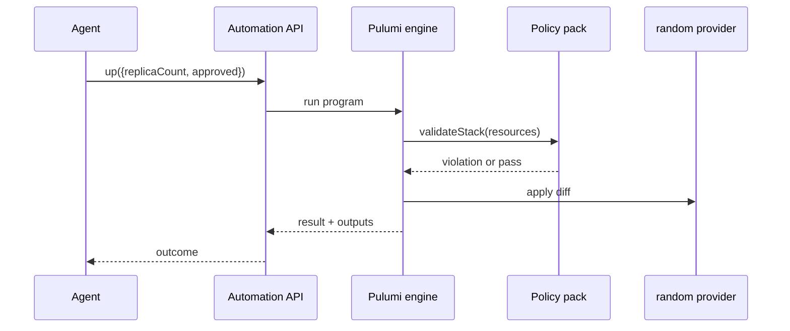

<div class="absolute inset-0 flex flex-col justify-center items-start px-20">
  <h1 class="!text-[5rem] !leading-[1.02] !font-semibold !tracking-tight !mb-6 !max-w-[95%]">
    Putting Agents to Work
  </h1>
  <p class="!mt-1 !text-[2rem] text-[var(--p-fg-muted)] !m-0 !leading-relaxed !max-w-[90%]">
    Agent-driven orchestration you can govern, trust, and repeat
  </p>
  <p class="!mt-8 !text-[1.6rem] text-[var(--p-fg-muted)] !m-0 !leading-relaxed">
    Speaker · Role, Pulumi
  </p>
</div>

<!--
(1 min) Welcome. One line: today an agent is going to make four real changes
to a running system, and every one of them is going to be governed,
approved-or-blocked, and logged. Nothing here needs a cloud account.
-->

---

<div class="absolute inset-0 flex items-center px-24 gap-20">
  <div class="flex-shrink-0">
    
  </div>
  <div class="flex-1">
    <h1 class="!text-[7rem] !leading-[1.02] !font-semibold !tracking-tight !mb-4 !text-[var(--p-primary)]">Speaker Name</h1>
    <p class="!text-[2.2rem] !leading-relaxed !m-0 opacity-90">
      Role at <strong class="!text-[var(--p-primary)]">Pulumi</strong>
    </p>
    <div class="!mt-8 flex items-center gap-8 !text-[1.5rem] opacity-70">
      <span class="flex items-center gap-2"><carbon-logo-x /> @handle</span>
      <span class="flex items-center gap-2"><carbon-logo-github /> handle</span>
    </div>
    <p class="!mt-10 !text-[1.5rem] !leading-relaxed opacity-80 !max-w-[85%]">
      Two lines on what this person actually does, filled in once a speaker
      is assigned to this session.
    </p>
  </div>
</div>

<!-- TODO(presenter): replace photo, name, role, socials and bio. The brief lists no speaker for this session yet. -->

<!--
(2 min) Introduce yourself for real once you're assigned to this slot.
Placeholder note only: no speaker has been named for this session yet.
-->

---

# Housekeeping

<div class="zoom-content">

<ul class="!mt-8 !text-[1.6rem] !leading-relaxed space-y-5">
  <li>Be chatty in the chat tab</li>
  <li>Ask questions in the Q&amp;A tab</li>
  <li>The handouts tab has slides and scripts</li>
  <li>The recording link comes by email</li>
</ul>

</div>

<style scoped>
.zoom-content { zoom: 1.8; }
</style>

<!--
(1 min) Quick and mechanical. Point at each tab in the actual platform UI as
you say it, then move on.
-->

---
layout: two-cols
---

::header::

# Who this is for

::left::

<div class="!mt-4 !text-[1.35rem] !leading-relaxed">

**Audience**

- Platform engineers and infra leads
- Piloting AI agents for day-2 operations
- Intermediate level: comfortable with a Pulumi program already

</div>

::right::

<div class="!mt-4 !text-[1.35rem] !leading-relaxed">

**Before today**

- Node 20.x LTS and the Pulumi CLI installed
- Basic TypeScript Pulumi program familiarity
- No cloud credentials needed, no Pulumi Cloud account: everything runs on a local backend

</div>

<!--
(2 min) Say plainly: you don't need to follow along live today, this session
is watch-and-discuss. If people want to run it afterward, the prerequisites
are on this slide and in the repo README.
-->

---
layout: statement
---

Orchestrate a multi-step infrastructure change through an agent,
and keep every action **auditable**, **approval-gated**, and **repeatable**.

<!--
(1 min) This sentence is the whole workshop. Read it, pause, move to the
agenda. Everything after this slide either builds toward it or demonstrates it.
-->

---

# Agenda

<div class="zoom-content">

<ul class="!mt-8 !text-[1.6rem] !leading-relaxed space-y-5">
  <li>Why agents changing infrastructure is a different problem</li>
  <li>Two ways to let an agent act, and how Automation API drives either one</li>
  <li>The governance gate: a policy pack that blocks unapproved changes</li>
  <li>Live demo: four agent-driven changes, some blocked, some approved</li>
  <li>Reading the audit trail</li>
  <li>Where to take this next</li>
</ul>

</div>

<style scoped>
.zoom-content { zoom: 1.5; }
</style>

<!--
(2 min) Walk the six lines once, fast. Don't explain any of them yet.
That's what the rest of the deck is for.
-->

---
layout: statement
---

An agent that can run `pulumi up` can also run it **wrong**, at 2am,
with nobody watching.

<!--
(5 min) This is the hook. Ask the room: who already has an agent that can
touch infrastructure, even read-only? Most hands go up. Now ask: who has a
gate that stops it from applying something nobody approved? Far fewer hands.
That gap is today's topic. Give it a beat before moving on. Don't rush past
the silence.
-->

---

# Delegation is not the hard part

<div class="zoom-content">

<div class="grid grid-cols-2 gap-10 mt-6">
  <div class="gpu-card gpu-card--muted" v-click>
    <div class="gpu-caption gpu-caption--muted">Easy</div>
    <ul class="!mt-4 !text-[1.2rem] !leading-relaxed space-y-2">
      <li>Point an agent at a repo</li>
      <li>Let it read state and propose a diff</li>
      <li>Anyone can undo a proposal nobody applied</li>
    </ul>
  </div>
  <div class="gpu-card gpu-card--primary" v-click>
    <div class="gpu-caption gpu-caption--accent">Hard</div>
    <ul class="!mt-4 !text-[1.2rem] !leading-relaxed space-y-2">
      <li>Deciding which changes it may apply on its own</li>
      <li>Proving after the fact who approved what</li>
      <li>Making that gate hold on the 500th run, not just the first</li>
    </ul>
  </div>
</div>

</div>

<style scoped>
.zoom-content { zoom: 1.3; }
</style>

<!--
(part of the 5 min hook block, continued) Land the point: reading and
proposing are the easy 80%. Governing the apply is the other 20%, and it's
the part that actually matters once an agent runs unattended. That's what
we build today.
-->

---
layout: two-cols
---

::header::

# Two ways to let an agent act

::left::

<div class="!mt-4 !text-[1.25rem] !leading-relaxed">

**Bring your own agent**

- Claude Code, Cursor, Copilot, or another MCP-capable agent
- The Pulumi MCP server for Pulumi Cloud resources and the Registry
- An agent-friendly CLI: `npx pulumi`, `pulumi do`, structured JSON output
- Agent Skills teach it Pulumi's own workflows

</div>

::right::

<div class="!mt-4 !text-[1.25rem] !leading-relaxed">

**Pulumi Neo**

- Pulumi's purpose-built infrastructure agent
- Investigates live infrastructure, proposes changes to IaC code
- Takes on recurring maintenance on its own

</div>

<!--
(5 min) Today's demo is agent-agnostic on purpose: the orchestrator script
stands in for whichever agent drives it, bring-your-own or Neo. The part
that doesn't change no matter which agent is in the seat is what comes
next: Automation API and the policy pack.
-->

---
layout: diagram-right
---

# One interface underneath either agent

Whether the agent is a bring-your-own MCP client or Pulumi Neo, it still has
to get a program from "I want this" to "this is applied." That's
Automation API: a typed SDK that runs `pulumi up`, `preview`, and `destroy`
as library calls instead of shell commands, so an agent (or any program)
drives Pulumi without shelling out to the CLI.

::diagram::



<!--
(7 min) Walk the sequence left to right. The agent never talks to the
policy pack directly. It talks to Automation API, and Automation API drives the
engine, and the engine is the thing that asks the policy pack before it
touches the provider. That ordering is exactly why the gate is trustworthy:
the agent cannot skip it even if it wanted to, because the check happens
inside the engine's own apply path, not in the orchestrator's code.
-->

---

# The governance gate

<div class="zoom-content">

<ul class="!mt-6 !text-[1.3rem] !leading-relaxed space-y-4">
  <li>A <strong>policy pack</strong> is code that runs inside the engine's apply path, not beside it</li>
  <li><strong>Preventative</strong> mode blocks a non-compliant change before it lands; <strong>audit</strong> mode scans and records without blocking</li>
  <li>Today's pack is mandatory and preventative: one rule, <code>require-approval-flag</code></li>
  <li>Docs describe the rule reading stack config directly. There's no documented way to do that from inside a policy, so ours reads the flag off a resource instead, and says so on screen</li>
</ul>

</div>

<style scoped>
.zoom-content { zoom: 1.15; }
</style>

<!--
(6 min) The honest part: the brief describes require-approval-flag as
inspecting `demo:approved = true` in stack config directly. Pulumi Policies
validate resources or a stack's resource list, and there's no documented
mechanism for a policy to read `pulumi.Config` values directly, per
pulumi.com/docs read for this build. So the demo carries the approval flag
on a random.RandomId marker resource's keepers, and the policy reads it from
there. Say this out loud during the demo: the marker stands in for wherever
a real approval would actually live, such as a change ticket, a ChatOps /approve,
or a break-glass token. It is not a claim that config you set yourself is a real
approval.
-->

---
layout: section
---

# Live demo.

<!--
(1 min) No talking here beyond "let's see it." Switch to the terminal.
-->

---
layout: code
---

# An agent tries a change with no approval

```bash
scripts/setup.sh
cd 03-orchestrator
node bin/orchestrator.js scale-up --replicas 4
```

<div class="!mt-6 !text-[1.15rem] opacity-80">
Exit code 1. The policy pack's <code>require-approval-flag</code> blocks it.
<code>replicaCountOut</code> stays at 2. The audit log records a
<code>BLOCKED</code> entry naming the rule.
</div>

<!--
(14 min) Run scripts/setup.sh live, then the first orchestrator command,
unapproved. Let the failure print in full. Don't skip past the policy
violation text, it's the point of the slide. If setup.sh fails for any
reason (typo in a config key, policy pack not loaded), paste the known-good
snippet from the repo README and narrate from there rather than debugging
live. This whole segment is folder 01-fleet (the target program) and
02-policy (the policy pack) doing their job together for the first time.
-->

---
layout: code
---

# The same script, now approved, three times

```bash
node bin/orchestrator.js scale-up --replicas 4 --approve
node bin/orchestrator.js rotate --approve
node bin/orchestrator.js scale-down --replicas 2 --approve
cd ..
node 04-audit/bin/read-audit.js
```

<div class="!mt-6 !text-[1.15rem] opacity-80">
Each call passes. <code>replicaCountOut</code> goes 2 → 4 → 4 → 2;
<code>configVersion</code> rotates once. <code>04-audit</code> prints all
four attempts in order, each marked approved or blocked, with its reason.
</div>

<!--
(18 min) Run the three approved actions, then the audit reader. Narrate each
diff as pulumi up prints it: scale-up adds worker identities, rotate changes
only configVersion, scale-down removes them again. When the audit reader
prints, read the four-line summary out loud. That log is the deliverable
of this whole segment, not the infrastructure change itself. If time is
short, this is the point to skip the LLM stretch slide and go straight to
"what just happened." Teardown (06-teardown/teardown.sh) runs after the
session, not on screen. Mention it exists for resetting between rehearsals.
-->

---
layout: statement
---

Same code path. Same policy. **Two outcomes.**
One log that can answer for both.

<!--
(4 min) This is the recap of the demo, said in one breath: nothing about
the program or the policy changed between the blocked run and the approved
runs. The only thing that changed was the approval flag, and the only
record of that difference is the audit log we just read. That's the
teaching point: repeatable governance, not a one-off script.
-->

---
layout: code
---

# Stretch goal: let a model propose the next move

```bash
node 05-llm-stretch/bin/propose-next-action.js
```

<div class="!mt-6 !text-[1.15rem] opacity-80">
Optional, skip if short on time. With no <code>OPENAI_API_KEY</code> set it
prints a deterministic proposal and says plainly no model call was made. It
never applies its own proposal. It prints the exact orchestrator command,
gated by the same unmodified policy pack.
</div>

<!--
(5 min) This is genuinely optional. Cut it first if the earlier segments
ran long. The point isn't the model call, it's the boundary: a live LLM
agent can suggest, and a deterministic script can suggest the same thing,
but neither one is allowed to skip the gate we just watched block an
unapproved change. That's the tradeoff between a scripted stand-in and a
live agent: the scripted version is what we rehearsed and verified, and a live
one adds judgment at the cost of predictability.
-->

---

# Where to take this next

<div class="zoom-content">

<ul class="!mt-6 !text-[1.3rem] !leading-relaxed space-y-4">
  <li>Swap the scripted orchestrator for a real MCP-capable agent, or for Pulumi Neo</li>
  <li>Replace the <code>keepers</code> marker with your actual approval source: a change ticket, a ChatOps <code>/approve</code>, a break-glass token</li>
  <li>Move from one mandatory rule to a full policy group, preventative for the changes that matter, audit mode for the rest</li>
  <li>Run <code>06-teardown/teardown.sh</code> and repeat the whole sequence from a clean state: that's what "repeatable" means here</li>
</ul>

</div>

<style scoped>
.zoom-content { zoom: 1.15; }
</style>

<!--
(4 min) Point at the repo folder structure again as you say this. Every
line here maps to a folder participants can go modify themselves.
-->

---

# What you can do now

<div class="zoom-content">

<ul class="!mt-6 !text-[1.25rem] !leading-relaxed space-y-4">
  <li>Explain when Automation API is the right tool instead of the CLI, and drive one from your own code</li>
  <li>Write a policy rule that blocks a change unless an approval flag is present</li>
  <li>Wire an orchestrator that issues scale and rotation actions and watch the gate accept or reject each one</li>
  <li>Read an audit trail and say plainly what was approved, what was blocked, and why</li>
  <li>Weigh a deterministic scripted stand-in against a live LLM agent, and say which one you'd trust unattended</li>
</ul>

</div>

<style scoped>
.zoom-content { zoom: 1.1; }
</style>

<!--
(4 min) This is the recap of the learning outcomes from the brief. Read it
as a checklist, not a summary. Ask the room if any of the five feels
shaky, and offer to go back to that segment's slide during Q&A.
-->

---

# Continue your Pulumi journey!

<div class="zoom-content">

<div class="grid grid-cols-3 gap-6 mt-6">
  <div class="gpu-card gpu-card--primary journey-card" v-click>
    <div class="journey-card__title">Join the Pulumi Community Slack</div>
    <div class="journey-card__qr"><QRCode data="https://slack.pulumi.com" dark="#000000" /></div>
    <p class="journey-card__body">slack.pulumi.com</p>
  </div>
  <div class="gpu-card gpu-card--primary journey-card" v-click>
    <div class="journey-card__title">Sign up for Pulumi Cloud, free</div>
    <div class="journey-card__qr"><QRCode data="https://app.pulumi.com/signup" dark="#000000" /></div>
    <p class="journey-card__body">app.pulumi.com/signup</p>
  </div>
  <div class="gpu-card gpu-card--accent journey-card" v-click>
    <div class="journey-card__title">This workshop's repo</div>
    <div class="journey-card__qr"><QRCode data="https://github.com/pulumi/workshops/pull/239" dark="#000000" /></div>
    <p class="journey-card__body">pulumi/workshops (pull request #239, not yet merged)</p>
  </div>
</div>

</div>

<style scoped>
.zoom-content { zoom: 1.15; }
.journey-card { display: flex; flex-direction: column; align-items: center; text-align: center; }
.journey-card__title { font-size: 1.35rem; font-weight: 600; line-height: 1.25; margin-bottom: 0.7rem; color: var(--p-fg); }
.journey-card__qr { width: 8rem; height: 8rem; margin: 0.4rem 0; padding: 0.4rem; background: #ffffff; border-radius: 10px; box-shadow: 0 10px 24px rgba(0, 0, 0, 0.18); }
.journey-card__body { font-family: var(--slidev-font-mono); font-size: 0.9rem; line-height: 1.5; margin: 0 !important; color: var(--p-fg-muted); }
</style>

<!--
(2 min) The repo QR points at the pull request, not a merged tree URL,
since this folder hasn't landed on main yet. Update this QR to the merged
tree URL (github.com/pulumi/workshops/tree/main/agent-driven-orchestration-governable)
once the PR merges, before the actual delivery.
-->

---
layout: end
---

<div class="absolute inset-0 flex flex-col justify-center items-center px-16">
  <div class="thanks__kicker">Thank you</div>
  <h1 class="!text-[4.5rem] !leading-[1.02] !font-semibold !tracking-tight !mt-3 !mb-12 text-center">Questions?</h1>
  <div class="thanks">
    <div class="thanks__person">
      
      <div class="thanks__name">Speaker Name</div>
      <div class="thanks__org">Pulumi</div>
      <div class="thanks__handles">
        <span><carbon-logo-x />@handle</span>
      </div>
      <div class="thanks__qr"><QRCode data="https://www.linkedin.com/company/pulumi/" dark="#000000" /></div>
      <div class="thanks__qr-label"><carbon-logo-linkedin />pulumi</div>
    </div>
    <div class="thanks__person">
      <div class="thanks__avatar thanks__avatar--icon"><carbon-logo-github /></div>
      <div class="thanks__name">Workshop repo</div>
      <div class="thanks__org">demo · slides</div>
      <div class="thanks__handles">
        <span>pulumi/workshops #239</span>
      </div>
      <div class="thanks__qr"><QRCode data="https://github.com/pulumi/workshops/pull/239" dark="#000000" /></div>
      <div class="thanks__qr-label">pull request #239</div>
    </div>
  </div>
</div>

<style scoped>
.thanks__kicker { font-family: var(--slidev-font-mono); font-size: 1.15rem; font-weight: 700; letter-spacing: 0.6em; text-transform: uppercase; color: var(--p-fg-muted); }
.thanks { display: grid; grid-template-columns: repeat(2, 1fr); gap: 4rem; justify-items: center; }
.thanks__person { display: flex; flex-direction: column; align-items: center; text-align: center; height: 100%; }
.thanks__avatar { width: 7rem; height: 7rem; border-radius: 9999px; object-fit: cover; border: 3px solid color-mix(in srgb, var(--p-primary) 45%, transparent); }
.thanks__avatar--icon { display: flex; align-items: center; justify-content: center; font-size: 3.6rem; color: var(--p-fg); background: var(--p-bg-elevated); }
.thanks__name { margin-top: 0.9rem; font-size: 1.45rem; font-weight: 700; color: var(--p-fg); }
.thanks__org { font-size: 1.1rem; color: var(--p-fg-muted); }
.thanks__handles { display: flex; flex-direction: column; align-items: center; justify-content: flex-start; gap: 0.15rem; margin-top: 0.5rem; min-height: 1.6rem; font-size: 1rem; color: var(--p-fg-muted); }
.thanks__handles span { display: inline-flex; align-items: center; gap: 0.35rem; }
.thanks__qr { width: 8rem; height: 8rem; margin-top: 1.1rem; padding: 0.45rem; background: #ffffff; border-radius: 10px; box-shadow: 0 10px 24px rgba(0, 0, 0, 0.18); }
.thanks__qr-label { display: inline-flex; align-items: center; gap: 0.35rem; margin-top: 0.55rem; font-family: var(--slidev-font-mono); font-size: 0.85rem; color: var(--p-fg-muted); }
</style>

<!-- TODO(presenter): replace the speaker card once a speaker is assigned; the LinkedIn QR points at Pulumi's company page as a stand-in for a personal profile. -->

<!--
(6 min) This slide stays up through Q&A, so the QR codes are the thing
people actually photograph. If a question needs a specific earlier slide,
say the slide title and jump back to it rather than trying to answer from
memory alone.
-->
