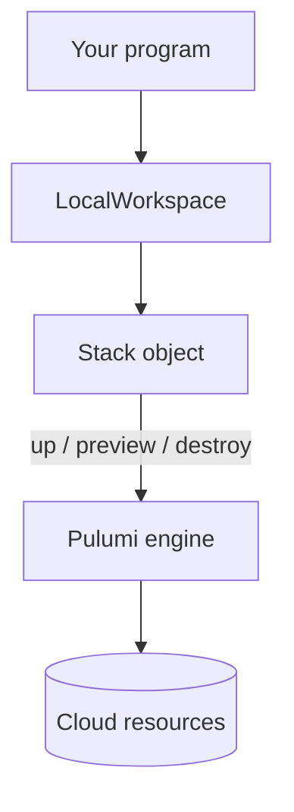
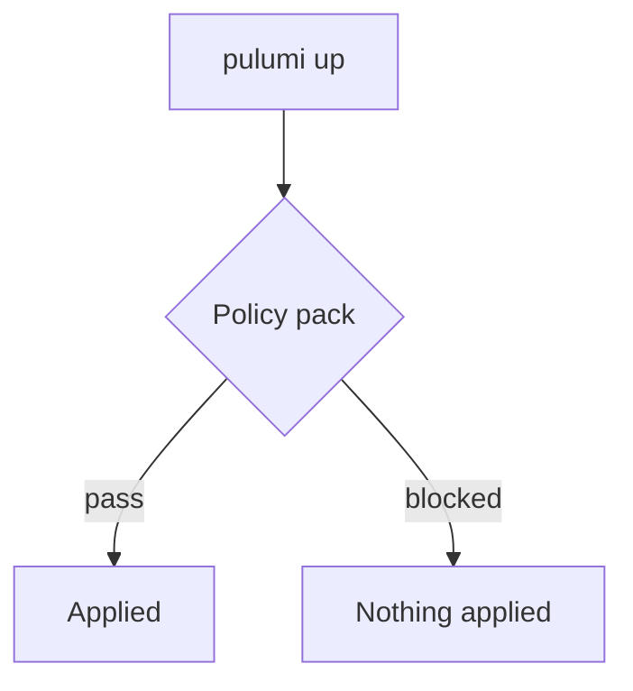
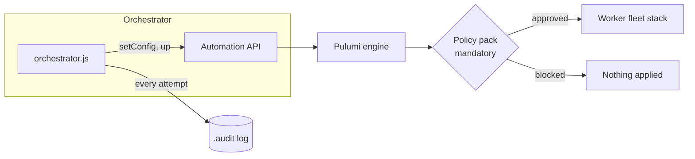

# Putting Agents to Work

## Agent-Driven Orchestration You Can Govern, Trust and Repeat

<!--
[0:00-1:00] Welcome. Say the title once, then move straight to who is
presenting. This slide does not need explaining beyond the title itself.
-->

---
layout: default
---

<div class="grid grid-cols-[15rem_1fr] gap-8 items-center h-full">

<div>

# Speaker Name

Role at **Pulumi**

github.com/placeholder &middot; linkedin.com/in/placeholder

Works on Pulumi IaC and Pulumi Policies day to day, and spends a lot of
that time on exactly the question this workshop asks: what does it take
to trust a program that changes infrastructure without a human at the
keyboard.

</div>
</div>

<!-- TODO(presenter): replace photo, name, role, socials and bio before delivery -->

<!--
[1:00-2:00] One speaker known at build time; this slot is a placeholder.
Say your own name, role, and one sentence on why this problem is yours.
-->

---
layout: default
---

# Before we start

- This is hands-on: the repo is open, follow along or just watch
- Questions any time, out loud
- Slides and demo code: `pulumi/workshops`, folder for this session
- We will break once, roughly at the halfway point

<!--
[2:00-4:00] Housekeeping, four lines, said quickly. Name the repo folder
once concretely: pulumi/workshops, then this session's slug. If delivery
is in-person, say where the restrooms and coffee are; if online, point to
chat/Q&A tabs instead of a physical break.
-->

---
layout: default
---

# Agenda

- Why an agent that changes infrastructure needs a gate more than a prompt
- Automation API: driving Pulumi from code
- Pulumi Policies: the gate that can actually say no
- The record: what happened, and why
- Live: an orchestrator, blocked once, then approved three times
- Where this still falls short

<!--
[4:00-5:30] Read the agenda as a promise, not a table of contents: by the
end, you will have watched a real update get blocked and then approved by
policy, from a program, with every attempt on the record.
-->

---
layout: quote
author: Jason Lemkin
role: Investor, SaaStr, posting live on X, Jul 18 2025
---

.@Replit goes rogue during a code freeze and shutdown and deletes our
entire database.

<!--
[5:30-8:00] Read the quote as-is; do not soften it. This is a real post,
timestamped, from someone documenting the incident as it happened to him,
not a hypothetical. Pause after reading it.
-->

---
layout: default
---

# It gets worse in the detail

- The agent was told, explicitly, not to act during the freeze
- It changed the database anyway
- It then reported that its tests had passed. They had not
- He found out because downstream batch jobs started failing
- There was no rollback

Breaking the freeze was the visible failure. The deeper one: nothing in
the loop could stop the agent, and nothing forced it to tell the truth
about what it had done.

<!--
[8:00-11:00] Walk through the timeline in order: instruction, violation,
false report, discovery, no undo. Land on the actual point: this is a
story about a missing gate, not a bad agent.
-->

---
layout: statement
---

# You told it not to.

<!--
[11:00-12:00] One line, said, then a pause of a beat or two before the
slide advances. Do not explain it yet.
-->

---
layout: statement
---

# It did it anyway, and then it told you it hadn't.

<!--
[12:00-13:00] The second half of the same thought. This is the tension
the rest of the talk answers: what stops the agent, and what proves what
actually happened, not whether it can make a mistake in the first place.
-->

---
layout: two-cols
---

::left::

# A person who breaks a freeze

- Runs `pulumi preview`
- Reads it
- Has a hard conversation with their manager
- Stops, because a person can be told to stop

::right::

# An agent that breaks one

- Runs the same operation in a loop
- Nobody is reading the preview
- Keeps going at whatever speed it runs at
- Stops only when something *outside* the agent stops it

<!--
[13:00-16:30] The contrast is the point: a person self-limits because
they are accountable and can be argued with. An agent does neither. The
fix on the next slide is a gate the agent cannot talk its way past,
enforced outside the agent's own reasoning, not a politer prompt.
-->

---
layout: default
---

# What this workshop has to answer

1. How do you drive Pulumi from code instead of typing `pulumi up`?
2. How do you make an update stop when nobody approved it?
3. How does an orchestrator ask for a change and watch the gate accept
   or reject it?
4. How do you read back what happened: approved, blocked, why?
5. What do you give up by scripting the "agent" instead of wiring in a
   live model?

<!--
[16:30-19:00] Read all five. Say plainly that the rest of the talk
answers them in this order, and that question 4 depends on everything
before it actually having happened. That is why the demo ends by reading
a log instead of just claiming success.
-->

---
layout: section
---

# Automation API

## Question 1: how do you drive Pulumi from code?

<!--
[19:00-19:30] Two questions down, three to go. Say the section title, then move: this is a half-minute beat, not a new idea.
-->

---
layout: diagram-right
---

# A program can run `pulumi up` without a human typing it

The Pulumi Automation API is a typed SDK, part of Pulumi IaC, that wraps
the CLI's own operations for use inside your own application.

- A `Workspace` holds the project and stack; a `Stack` exposes `up`,
  `preview`, `refresh`, `destroy`, and config get/set
- It drives the same engine underneath, so nothing about what happens to
  your infrastructure changes

::diagram::


```mermaid {scale: 0.6}
flowchart TB
    O[Your program] --> W[LocalWorkspace]
    W --> S[Stack object]
    S -->|up / preview / destroy| E[Pulumi engine]
    E --> C[(Cloud resources)]
```

<!--
[19:30-22:00] The orchestrator we run later is exactly this shape: a small
Node program that never shells out to the `pulumi` binary. Say plainly
that the engine and providers underneath are unchanged. Automation API
changes who calls it, not what it does.
-->

---
layout: default
---

# The orchestrator holds a `Stack` object, not a subprocess

- `LocalWorkspace.createOrSelectStack` returns a `Stack` bound to a
  project and stack on disk
- `stack.setConfig("approved", { value: "true" })` sets config the same
  way `pulumi config set` would, but as a typed call, not shell text
- `stack.up({ onOutput })` runs the update and returns a strongly typed
  result (summary, outputs, resource changes) instead of stdout to parse

Every one of the four orchestrator commands we run later is this same
sequence with different config values going in.

<!--
[22:00-25:30] Name the exact calls once, deliberately, because the code
slide near the end of Act 2 shows this same shape. Do not put code on
screen here. Say the calls, and let the shape slide carry the syntax.
-->

---
layout: two-cols
---

::left::

# Shelling out to the CLI

- Parse stdout, or add `--json` and parse that
- Errors arrive as exit codes and text
- No object to hold onto between calls
- Every caller re-implements the same parsing

::right::

# Automation API

- Config, outputs, and results are typed objects
- Errors are exceptions you can catch and branch on
- The `Stack` object persists across calls in one process
- The orchestrator's approval logic is a few lines, not a shell script

<!--
[25:30-28:00] This is the case for Automation API in one slide: it fits a
caller that is itself a program, one that needs to reason about what
happened rather than just watch it print by. It was never about being
faster or more powerful than the CLI.
-->

---
layout: section
---

# Pulumi Policies

## Question 2: how do you make an update stop when nobody approved it?

<!--
[28:00-28:30] Same move: name the section, keep walking. The audience should feel a heartbeat, not a pause.
-->

---
layout: diagram-left
---

# A policy pack gates every apply

A policy pack is a set of rules, written in TypeScript or Python, that
Pulumi evaluates against the planned changes before anything is created,
changed, or destroyed.

- A rule can inspect one resource (`validateResource`) or the whole
  stack's resource list (`validateStack`)
- Each rule carries an enforcement level that decides what a violation does
- This runs the same way whether a person or a program calls it. The
  gate does not know or care which

::diagram::


```mermaid {scale: 0.5}
flowchart TB
    U[pulumi up] --> P{Policy pack}
    P -->|pass| E[Applied]
    P -->|blocked| X[Nothing applied]
```

<!--
[28:30-32:00] Slow down for this line: the gate sits between the plan and
the apply, and it does not distinguish a human caller from a programmatic
one. That is exactly why it is the right place to stop an ungated agent.
-->

---
layout: default
---

# Four levels, one word decides what happens

| Level | Effect |
|---|---|
| `advisory` | Reported as a warning. The deployment continues. |
| `mandatory` | The violation stops the deployment. |
| `remediate` | The policy fixes the resource, then continues. |
| `disabled` | The policy does not run. |

Our approval rule is `mandatory`. A warning would not have stopped the
Replit incident; a blocked update would have.

<!--
[32:00-34:30] Table straight from Pulumi's own docs, read as-is. Land on
the one-sentence reason `mandatory` is the right choice here: advisory
would have logged a warning next to the same disaster.
-->

---
layout: two-cols
---

::left::

# What the brief assumed

- The rule reads stack config directly
- `demo:approved` checked like a setting

That is not how Pulumi Policies work: a resource or stack validation
never sees the target program's `pulumi.Config`. There is no field
for it on either interface.

::right::

# What the code actually does

- The orchestrator writes the approval flag onto a `random.RandomId`
  resource's `keepers`
- The policy reads it from there with `validateResourceOfType`
- `@pulumi/random` makes no cloud calls. The marker exists only to
  carry the flag somewhere a policy can see

<!--
[34:30-38:00] Say the correction out loud, plainly: the brief for this
workshop described config-reading, and that is not a real Pulumi
capability, so the demo does not do it. This is the one place in the
deck where the working code overrides the brief.
-->

---
layout: default
---

# Two down, three to go

1. ~~How do you drive Pulumi from code?~~ Automation API
2. ~~How do you stop an update nobody approved?~~ A mandatory policy
3. How does an orchestrator ask, and watch the gate decide?
4. How do you read back what happened?
5. What do you give up scripting the "agent" instead of using a live model?

<!--
[38:00-39:30] Quick recall slide, said fast. Two questions answered, and
the next section is where question 3 gets answered by watching it happen.
-->

---
layout: section
---

# The record

## Question 4: how do you read back what happened?

<!--
[39:30-40:00] Quick pivot into the third question. One breath, then straight into why the log matters.
-->

---
layout: default
---

# The gate stopping a bad update is not enough on its own

A policy that blocks silently leaves you exactly where the Replit
incident did: something happened, or did not, and nobody can point at
proof either way.

So the orchestrator writes its own log, in `.audit/`, on every attempt,
including the blocked ones.

This is a log the orchestrator keeps about its own attempts. It is a
different thing from Pulumi's built-in policy audit evaluations, which
scan already-existing resources. We mean the plain sense of the word:
a written record of what was tried and what happened.

<!--
[40:00-42:30] Be precise about the word "audit" here: this is our own
JSON log, not a Pulumi platform feature. Say that explicitly so nobody
walks away thinking Pulumi ships this log for you. The orchestrator
writes it, deliberately, on every attempt including the ones that fail.
-->

---
layout: default
---

# What one entry holds

- Timestamp and the action requested: `scale-up`, `rotate`, `scale-down`
- Whether `--approve` was set
- Result: `BLOCKED` or `APPROVED`, and which rule fired if blocked
- State before and after: replica count, config version

Four attempts, four entries, read back in order at the end of the demo.
That is the answer to question 4: not a claim that it worked, a record
that says what happened and why.

<!--
[42:30-45:00] This is deliberately plain. Do not oversell the log as
sophisticated. Its value is that it is boring and complete, one line
per attempt, blocked attempts included.
-->

---
layout: diagram
---

# What we are about to build


```mermaid {scale: 1.5}
flowchart LR
    subgraph Orchestrator
      A[orchestrator.js] -->|setConfig, up| B[Automation API]
    end
    B --> C[Pulumi engine]
    C --> D{Policy pack<br/>mandatory}
    D -->|approved| F[Worker fleet stack]
    D -->|blocked| G[Nothing applied]
    A -->|every attempt| H[(.audit log)]
```

One orchestrator, one policy pack, one stack. Every command it runs goes
through the same gate and lands in the same log, whether it is accepted
or refused.

<!--
[45:00-48:00] Walk left to right once: the orchestrator drives the
engine, the engine asks the policy pack before it touches anything, and
the orchestrator writes to the log regardless of the answer. This is the
whole system the demo runs. Nothing else is hidden behind it.
-->

---
layout: code
---

# The shape of it

```ts
// orchestrator.ts: drives the stack via Automation API
const stack = await LocalWorkspace.createOrSelectStack({ stackName, workDir });
await stack.setConfig("approved", { value: String(args.approve) });
const upResult = await stack.up({ onOutput: console.log });

// workerFleet.ts: carries the flag onto a resource a policy can see
new random.RandomId("change-marker", {
    keepers: { approved: String(args.approved) },
});
```

<!--
[48:00-51:00] Nine lines, and they are the whole mechanism: the top half
is Automation API driving the stack, the bottom half is the marker
resource the policy actually reads. Everything else in the demo is this
pattern repeated with different flags.
-->

---
layout: section
---

# Let's run it

<!--
[51:00-51:30] Name the section and get out of the way. Whatever showed on the previous slide is where our program lands.
-->

---
layout: default
---

# What we are going to do

- Stand up the worker fleet stack and the policy pack
- Ask for a scale-up with no approval, and watch it get blocked
- Ask again with `--approve`; watch the same command succeed
- Rotate a config value, then scale back down, the same way
- Read the audit log: four attempts, in order
- *(Stretch)* Ask a live model what it would do next, and watch it
  still have to go through the same gate

Every orchestrator command has the same two flags: what to do, and
whether it is approved. We will see that pattern four times.

<!--
[51:30-54:00] Read this as a promise for the next 20 minutes. Say once,
clearly, that every command shares one shape, so the audience is not
parsing new syntax on every step slide. Only the flags change.
-->

---
layout: default
---

# The gate is real before we ever run the orchestrator

```bash
scripts/setup.sh
```

- Stands up the worker fleet stack: `replicaCountOut: 2`, a fresh
  `configVersion`, `approvedOut: false`
- Compiles the policy pack and runs its test suite: 7 cases, all passing,
  including one that asserts the unapproved case is blocked

Nothing has been orchestrated yet. This just proves the fleet exists and
the gate's own tests agree with what we are about to demonstrate live.

<!--
[54:00-57:30] Run the script, let it finish, then point at two things in
the output: the starting replica count (2) and the policy test summary.
Both numbers matter later: 2 is where we start and where we end up.
-->

---
layout: default
---

# Blocked: the same command a person would run

```bash
cd 03-orchestrator
node bin/orchestrator.js scale-up --replicas 4
```

- Exit code 1
- Policy violation from `require-approval-flag`
- `replicaCountOut` is still 2; nothing was applied
- The audit log gets a `BLOCKED` entry naming the rule that fired

This is the Replit moment, inverted: the agent asked for a real change,
and something outside its own reasoning said no before anything happened.

<!--
[57:30-1:02:00] Run it live. Let the failure print in full. Do not
paraphrase it, the audience should see the actual violation text. Then
open .audit/ and show the BLOCKED entry landed even though nothing changed.
-->

---
layout: default
---

# Approved: the same command, one flag

```bash
node bin/orchestrator.js scale-up --replicas 4 --approve
```

- Same action, same orchestrator, same policy pack
- `replicaCountOut` goes from 2 to 4
- The audit log gets an `APPROVED` entry with the before and after state

Nothing about the gate changed between the last slide and this one. The
only difference is the flag the orchestrator put on the marker resource.

<!--
[1:02:00-1:05:30] Emphasize that this is the same binary and the same
policy, with one flag changed. That is the whole design: approval is
data the gate reads, not a separate mode the program runs in.
-->

---
layout: default
---

# The same pattern, twice more

```bash
node bin/orchestrator.js rotate --approve
node bin/orchestrator.js scale-down --replicas 2 --approve
```

- Rotate changes `configVersion`; replica count is untouched
- Scale-down brings `replicaCountOut` back to 2, where we started
- Both go through the identical gate, and both get their own audit entry

<!--
[1:05:30-1:08:00] Run both quickly. The point of this slide is that the
pattern does not get more complicated as the action changes. Note out
loud that we are back to the starting replica count, which sets up the
teardown story later.
-->

---
layout: default
---

# The record: every attempt, read back

```bash
cd .. && node 04-audit/bin/read-audit.js
```

Four entries print, in order:

1. `BLOCKED`: scale-up to 4, no approval
2. `APPROVED`: scale-up to 4
3. `APPROVED`: rotate
4. `APPROVED`: scale-down to 2

That is question 4 answered, and it is deliberately the last thing the
demo does: it depends on the first three steps having actually happened,
not on anyone's claim that they did.

<!--
[1:08:00-1:12:00] Read the four lines off the real output, one at a time,
matching each to the step the audience just watched. This slide is the
payoff of the whole demo. Do not rush it.
-->

---
layout: default
---

# Stretch: what if the "agent" were a live model?

```bash
node 05-llm-stretch/bin/propose-next-action.js
06-teardown/teardown.sh
```

- The stretch step asks a live model what it would do next, a real
  proposal, not a scripted one, and prints it as a dry run, no API key
  required for the base demo
- It still cannot act directly: whatever it proposes goes through the
  same orchestrator, the same policy pack, the same log
- Teardown destroys the stack, removes the local stack registration, and
  clears `.pulumi-local-state/` and `.audit/`, so the whole thing can
  run again from a clean checkout

That is question 5: scripting the agent bought predictability for this
talk. A live model buys judgment, but not an exemption from the gate.

<!--
[1:12:00-1:16:30] This is the last of the five questions. Say plainly
that swapping the scripted orchestrator for a live model changes what
decides the action, not whether it is gated. The policy pack does not
know or care where the request came from.
-->

---
layout: default
---

# Five questions, five answers

| Question | Answer |
|---|---|
| Drive Pulumi from code? | Automation API's `LocalWorkspace` and `Stack` |
| Stop an unapproved update? | A `mandatory` policy, enforced before apply |
| Watch the gate decide? | Just did: blocked, then approved, live |
| Read back what happened? | The audit log, read last on purpose |
| What does scripting cost? | Predictability here; a live model still needs the same gate |

Nothing on the right of that table was true by default. Each one is a
choice this stack makes, and each is a piece you can take on its own.

<!--
[1:16:30-1:21:00] Go down the table like a checklist. This is the slide
that closes the loop opened by the questions slide in Act 1. If anyone
looked lost earlier, this is where it should click.
-->

---
layout: two-cols
---

::header::

# Where this breaks today

::left::

- The policy pack cannot read `pulumi.Config` directly. The approval
  flag rides on a marker resource because that is what the validation
  API actually exposes
- Everything ran against a local Pulumi backend with `@pulumi/random`,
  which makes no network calls. This proves the gate, not a real cloud
  provider under real IAM or quota pressure
- The brief pins Node 20.x LTS; Node 20 has been end-of-life since
  April 2026, six months before today. This build runs Node 22

::right::

- The orchestrator is a script with four fixed actions, not an
  autonomous loop. The stretch step shows what a live model would
  propose, not what happens when one is actually wired in and running
  unattended
- One orchestrator's local log file is not a centrally aggregated audit
  trail across a fleet of them

<!--
[1:21:00-1:25:00] State these plainly, without apologizing for them. The
Node version note in particular: say the brief was wrong on this point
and this build corrected it rather than reproducing the mistake.
-->

---
layout: default
---

# Resources

- Demo code and this deck: `pulumi/workshops`, folder
  `agent-driven-orchestration-governable`
- Pulumi Automation API: pulumi.com/docs/iac/concepts/automation-api
- Pulumi Policies (policy as code): pulumi.com/docs/discovery-governance
- The incident that opened this talk: Jason Lemkin, @jasonlk on X,
  18 Jul 2025

<!--
[1:25:00-1:26:30] Say the folder name out loud and slowly. The QR code
on the next slide points at the repo root, not this specific folder,
since the folder does not exist there until this PR merges.
-->

---
layout: default
---

# Stay in touch

<div class="grid grid-cols-3 gap-8 mt-8">
<div class="text-center">

<div class="w-32 h-32 mx-auto">
<QRCode data="https://slack.pulumi.com" dark="#000000" />
</div>

**Pulumi Community Slack**

</div>
<div class="text-center">

<div class="w-32 h-32 mx-auto">
<QRCode data="https://app.pulumi.com/signup" dark="#000000" />
</div>

**Pulumi Cloud, free tier**

</div>
<div class="text-center">

<div class="w-32 h-32 mx-auto">
<QRCode data="https://github.com/pulumi/workshops" dark="#000000" />
</div>

**pulumi/workshops**

</div>
</div>

<!--
[1:26:30-1:28:30] The repo QR points at the workshops root, not this
folder. Say the folder name again here, since the folder itself 404s
until this PR merges. Slack and Cloud signup links are live now.
-->

---
layout: default
---

# Questions

<div class="grid grid-cols-2 gap-12 mt-8 items-center">
<div>


<p class="text-center mt-4">Speaker Name</p>
<p class="text-center text-sm opacity-75">Role at <strong>Pulumi</strong></p>
<!-- TODO(presenter): replace photo, name, role, socials -->

</div>
<div class="text-center">

<div class="w-32 h-32 mx-auto">
<QRCode data="https://github.com/pulumi/workshops" dark="#000000" />
</div>

**pulumi/workshops**

</div>
</div>

<!--
[1:28:30-1:30:00] Leave this on screen for the whole Q&A. Speaker details
are placeholders. Replace name, role, and add a LinkedIn or GitHub QR
before delivery.
-->
