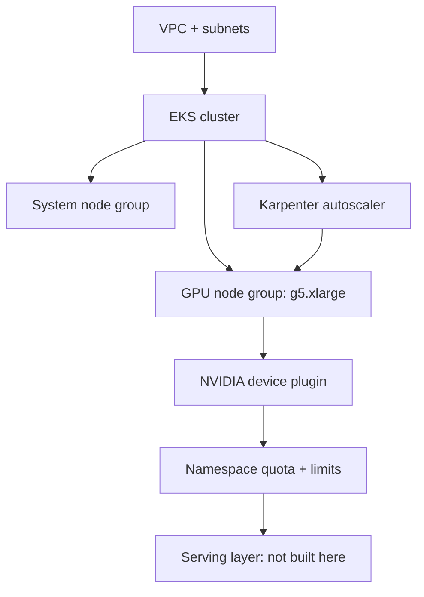

# Provisioning the AI Inference Platform

## GPU node pools, autoscaling and quotas with Pulumi

Speaker name · Role, Pulumi

<!--
(1 min) Welcome. Name the promise up front: by the end of this session you can
provision the platform a GPU inference workload runs on, in Pulumi, from a
clean AWS account. We are not touching the model or the serving framework
today. That is a separate layer, and we will be explicit about where it
starts.
-->

---
layout: default
---

<div class="flex items-center gap-16 h-full">
  
  <div class="flex-1">

# Speaker Name

Role at **Pulumi**

- github.com/handle
- linkedin.com/in/handle

Builds platform tooling and infrastructure as code.

  </div>
</div>

<!-- TODO(presenter): replace photo, name, role, socials and bio. No speaker has been confirmed for this session yet. -->

<!--
(2 min) This slot is reserved for the presenter's own introduction: who you
are, what you work on day to day, and why a GPU platform ticket is something
you have actually dealt with. Keep it short, the room is here for the
platform, not the bio.
-->

---
layout: default
---

# Housekeeping

- Be chatty in the chat tab
- Ask questions in the Q&A tab
- Slides and scripts are in the handouts tab
- The recording link comes by email

<!--
(1 min) Four lines, said quickly. The point is to lower the bar for
interrupting: this is a live demo and things can go sideways, so questions
mid-flow are welcome, not a distraction.
-->

---
layout: default
---

# Agenda

- Why the platform layer, why now
- The two problems people conflate
- What Pulumi already does well here
- What it does not package yet
- Live demo: cluster to autoscaling
- Recap, resources, Q&A

<!--
(1 min) Six lines, the shape of the next ninety minutes. No numbers, no
promises beyond what is actually on the slides that follow.
-->

---
layout: default
---

# What you need to follow along

- An AWS account with GPU instance quota in `us-west-2`
- Pulumi CLI, Python 3.10+, `kubectl`, `helm`
- A free Pulumi Cloud account for state (`app.pulumi.com/signup`)
- None of this is required to watch; only to run it yourself

<!--
(3 min) GPU quota is the one prerequisite that bites people: most fresh AWS
accounts default to zero for accelerated instance families, and getting a
limit increase approved can take from minutes to a day, so it is not
something to discover the morning of. Everything else here is ordinary
tooling. If you want to follow along later, request the quota increase
first and come back to the repo.
-->

---
layout: default
---

# The AI inference track is the biggest room at KubeCon

- KubeCon NA 2026: AI Inference + Agentic, ~50 sessions of 12 tracks
- Ahead of Platform Engineering (33) and Security (17)
- Plus two co-located days: Agentics (31), Platform Engineering (29)
- AI Engineer World's Fair: Inference (12) + Sandbox/Platform (11) of 561

<!--
(3 min) This is schedule data, not a survey: track sizes at KubeCon North
America 2026 and session counts at the AI Engineer World's Fair 2026. Google
Cloud Next 2026 carried five-plus AI infrastructure sessions and Open Source
Summit EU about six, so the pattern holds outside KubeCon too. One honest
caveat for the next slide.
-->

---
layout: statement
---

# Flagship conferences are convinced. **Community meetups have not caught up yet.**

<!--
(1 min) DevOpsDays Boston and Raleigh carried zero sessions on this in 2026;
Austin had two open-space slots. That is not a contradiction, it is a
maturity signal: this is validated at the flagship level, ahead of the
grassroots level. Worth knowing if you are deciding how to pitch a workshop
like this one beyond a KubeCon audience.
-->

---
layout: default
---

# Two problems get bundled into one ticket

- "Add GPU inference support" is a platform problem and a serving problem
- Platform: node pools, drivers, networking, autoscaling, quotas
- Serving: the model server, the request routing, the model itself
- This workshop is the platform half, built end to end

<!--
(4 min) When a ticket says "add GPU support," it is asking for both a
platform underneath and something serving requests on top, and treating
them as one problem is how projects stall. This session deliberately does
only the platform half, because that half is where the infrastructure code
actually lives and where most teams get stuck first: a cluster with no GPU
node group, a node group with no driver, drivers with no quota to keep one
team from starving the rest.
-->

---
layout: default
---

# Where Pulumi is mature for this platform

- `pulumi_eks`: managed cluster and GPU-capable node groups from code
- `pulumi_kubernetes`: Helm releases, quotas, limits, custom resources
- The same review, preview, and state model as any other Pulumi stack
- A `pulumi up` for the node group is the same command as any other resource

<!--
(4 min) None of the platform layer needs a special tool. The EKS package
creates the cluster and the GPU node group, the Kubernetes package installs
the device plugin as a Helm release and writes the ResourceQuota and
LimitRange objects, and Karpenter's own CRDs get applied the same way. It is
ordinary Pulumi, reviewed and previewed like anything else in your stack.
-->

---
layout: default
---

# Where Pulumi stops today

- No first-party package for KServe or Ray Serve (checked against the
  registry, both return 404)
- The serving layer is expressed through `pulumi_kubernetes`'s generic
  Helm and custom-resource APIs, not a dedicated SDK
- That is a real gap, not a hidden one, and we will show exactly where it starts

<!--
(3 min) This is worth saying plainly rather than skating past it: if your
ticket also covers the serving layer, Pulumi does not hand you a typed
InferenceService or RayService resource today. You would reach for the same
generic Kubernetes APIs this demo already uses for Karpenter's CRDs. That is
a scope boundary, not a defect, and naming it now means the demo's step 6
does not surprise anyone.
-->

---
layout: diagram
---

# The platform, top to bottom



<!--
(5 min) One diagram, the whole platform. A VPC and cluster from `pulumi_eks`,
a GPU node group config-gated on top of it, the device plugin as a Helm
release, a namespace quota holding capacity accountable, and Karpenter
watching pending pods to grow or shrink the GPU node group. The serving
layer sits above all of it and is out of scope, which is exactly what the
last two slides said.
-->

---
layout: section
---

# Live demo

## Six steps, one AWS account, one region

<!--
(1 min) Everything from here runs from the workshop repo, `us-west-2`, a
shared `dev` stack per project. If GPU quota does not come through in time,
the fallback is a pre-provisioned cluster and the same commands run against
it, with saved `kubectl` output standing in for anything that cannot run
live.
-->

---
layout: code
---

# 1 · Cluster, then the GPU node group

```bash
cd 01-cluster && pulumi up          # nodes, no GPUs yet
pulumi config set gpuNodeGroupEnabled true
pulumi up                           # the g5.xlarge node appears
```

<!--
(14 min) One Pulumi project for both steps, not two. `pulumi_eks`'s
`ManagedNodeGroup` takes a live `eks.Cluster` object as its `cluster`
argument, never a name or an ARN, so the GPU node group cannot be built in a
second project reading the cluster through a `StackReference`. A config
value keeps the step boundary the room experiences even though the code
lives in one place. First `pulumi up` brings up the cluster and its system
node group: `kubectl get nodes` shows healthy nodes and no GPUs. Setting
`gpuNodeGroupEnabled` and running `pulumi up` again adds the `g5.xlarge` node
group with the `AL2023_x86_64_NVIDIA` AMI type. If GPU quota is not
approved, this is the step that fails first: fall back to the
pre-provisioned cluster and walk the code instead.
-->

---
layout: code
---

# 2 · Drivers, as a Helm release

```bash
cd 02-device-plugin && pulumi up
kubectl describe node <gpu-node>    # nvidia.com/gpu: 1 allocatable
```

<!--
(10 min) The NVIDIA device plugin is installed as a Pulumi-managed Helm
release from `pulumi_kubernetes`, chart version pinned to appVersion 0.20.0.
No custom controller, no manual driver install: the release watches the
node, exposes `nvidia.com/gpu` as an allocatable resource, and
`kubectl describe node` on the GPU node is the proof. The GPU Operator is
the documented alternative when a team also needs MIG partitioning or DCGM
metrics; it is not what this build uses, and that tradeoff is worth naming
out loud if someone asks.
-->

---
layout: code
---

# 3 · Quotas keep one team from eating the cluster

```bash
cd 03-quotas && pulumi up
kubectl apply -f manifests/oversized-gpu-pod.yaml -n gpu-workloads
# Error: exceeded quota
```

<!--
(9 min) A namespace, a `ResourceQuota`, and a `LimitRange`, all Pulumi
resources. The oversized pod's manifest asks for more GPUs than the
namespace's quota allows, and the API server rejects it outright before it
ever reaches the scheduler. This is the slide that makes "quota" concrete
for a room that has only heard the word in passing: it is the difference
between GPU capacity being shared on purpose and being shared by accident.
-->

---
layout: code
---

# 4 · Autoscaling that understands GPUs

```bash
cd 04-autoscaling && pulumi up
kubectl scale deploy/gpu-echo -n gpu-workloads --replicas=2   # node appears
kubectl scale deploy/gpu-echo -n gpu-workloads --replicas=0   # node reclaimed
```

<!--
(12 min) Karpenter's IAM role, SQS queue, Helm release, and a GPU-aware
NodePool are all Pulumi resources here, chart pinned to 1.14.1. Scaling the
deployment up creates pending GPU pods Karpenter cannot place on the
existing nodes, so it provisions a new `g5.xlarge` to fit them; scaling back
to zero reclaims that node once nothing needs it. Point at the timestamps
in `kubectl get nodes -w` while this runs, since the audience needs to see
the lag between the scale command and the new node, not just the end state.
This is the step most likely to run long if the room has questions about
consolidation policy, so watch the clock here specifically.
-->

---
layout: code
---

# 5 · Where the serving layer would start

```yaml
# 05-serving-layer/kserve-example.yaml (illustrative, not applied)
apiVersion: serving.kserve.io/v1beta1
kind: InferenceService
```

<!--
(5 min) Nothing runs in this step. `05-serving-layer/` holds a KServe
`InferenceService` and a Ray Serve `RayService` manifest so we can point at
concrete YAML and say plainly: Pulumi has no typed resource for either
today. A team wiring this in would apply these through `pulumi_kubernetes`'s
generic custom-resource APIs, the same mechanism `04-autoscaling` already
used for Karpenter's own CRDs. Nothing new to learn, just a gap to know
about.
-->

---
layout: code
---

# 6 · Tear it all down

```bash
06-teardown/teardown.sh       # reverse dependency order
06-teardown/verify-clean.sh   # confirms nothing orphaned
```

<!--
(4 min) Destroy runs in the reverse of the order we built in, and the verify
script checks AWS directly for anything left behind: an EC2 instance, an
EBS volume, a load balancer. Cost for a session like this one, one
`g5.xlarge` for roughly ninety minutes, torn down promptly, lands around
six to ten dollars on demand. Run this before the room's attention moves on
to Q&A, not after.
-->

---
layout: default
---

# What you can provision now

1. A cluster and GPU node pool with the right AMI and instance type
2. Drivers via a Pulumi-managed Helm release, GPUs confirmed allocatable
3. Quotas and limits for predictable multi-tenant GPU sharing
4. Autoscaling that tracks pending GPU work, not a fixed node count
5. Where this platform layer ends and the serving layer begins

<!--
(3 min) Read these back against the ticket from the first slide: "add GPU
inference support" now decomposes into five concrete, code-reviewed pieces,
plus a clear line marking where Pulumi's tooling stops and a team's own
serving choice starts.
-->

---
layout: default
---

# Where to go next

- Workshop repo: `pulumi/workshops` → `ai-inference-platform-on-kubernetes`
- Pulumi Registry: `eks.Cluster`, `eks.ManagedNodeGroup`, `kubernetes.helm.v4.Chart`
- `pulumi-labs/pulumi-nvidia-aicr` for a maintained GPU/AI reference stack
- Karpenter docs for NodePool and EC2NodeClass beyond what we covered today

<!--
(2 min) The repo has every step in this demo, runnable end to end. The
registry pages document every resource we used. `pulumi-labs/pulumi-nvidia-aicr`
is a good next stop if you want a more complete AI-infrastructure reference
built the same way.
-->

---
layout: default
---

# Keep going

<div class="grid grid-cols-3 gap-8 mt-8">
  <div class="text-center">
    <div class="w-32 h-32 mx-auto"><QRCode data="https://slack.pulumi.com" dark="#000000" /></div>
    <p class="mt-2">Pulumi Community Slack</p>
  </div>
  <div class="text-center">
    <div class="w-32 h-32 mx-auto"><QRCode data="https://app.pulumi.com/signup" dark="#000000" /></div>
    <p class="mt-2">Pulumi Cloud, free tier</p>
  </div>
  <div class="text-center">
    <div class="w-32 h-32 mx-auto"><QRCode data="https://github.com/pulumi/workshops" dark="#000000" /></div>
    <p class="mt-2">pulumi/workshops repo</p>
  </div>
</div>

<!--
(1 min) Three QR codes: the community Slack, a free Pulumi Cloud account,
and the workshops repo root. The demo folder is
`ai-inference-platform-on-kubernetes` inside that repo; it will not resolve
as a direct link until this workshop's pull request merges, so the repo
root is the safe target to print today.
-->

---
layout: end
---

# Thank you. Questions?

<div class="grid grid-cols-2 gap-8 mt-8">
  <div class="text-center">
    
    <div class="w-24 h-24 mx-auto mt-2"><QRCode data="https://github.com/pulumi/workshops" dark="#000000" /></div>
    <p class="mt-1">github.com/handle</p>
  </div>
  <div class="text-center">
    <div class="w-32 h-32 mx-auto"><QRCode data="https://github.com/pulumi/workshops" dark="#000000" /></div>
    <p class="mt-2">Workshop repo</p>
  </div>
</div>

<!-- TODO(presenter): replace the speaker QR target with a personal LinkedIn or GitHub profile once a speaker is confirmed. -->

<!--
(1 min) This slide stays up through Q&A, so it carries the links people
will actually use: the speaker's profile once one is confirmed, and the
workshop repo. Thanks for the room's time and attention.
-->
