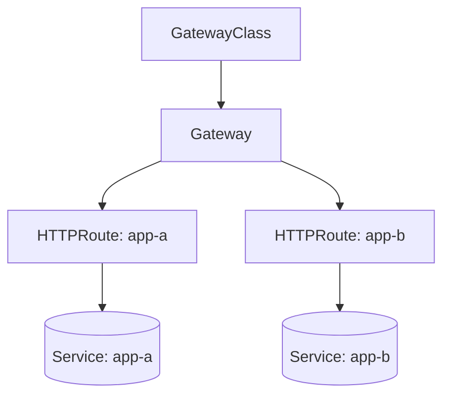

<div class="absolute inset-0 flex flex-col justify-center items-start px-20">
  <h1 class="!text-[5rem] !leading-[1.05] !font-semibold !tracking-tight !mb-6 !max-w-[90%]">
    API gateways as code
  </h1>
  <p class="!mt-1 !text-[2rem] text-[var(--p-fg-muted)] !m-0 !leading-relaxed !max-w-[85%]">
    kgateway and Gateway API on Kubernetes with Pulumi
  </p>
  <p class="!mt-8 !text-[1.5rem] text-[var(--p-fg-muted)] !m-0 !leading-relaxed">
    Speaker Name · Role, Pulumi
  </p>
</div>

<!--
Welcome. State the promise directly: by the end of the next 90 minutes,
everyone in the room has a working Gateway API deployment on their own
laptop, routing HTTP traffic to two backend services by path and by
header, provisioned entirely with Pulumi. No cloud account, no cost.
(1 min)
-->

---

<div class="absolute inset-0 flex items-center px-24 gap-20">
  <div class="flex-shrink-0">
    
  </div>
  <div class="flex-1">
    <h1 class="!text-[6rem] !leading-[1.02] !font-semibold !tracking-tight !mb-4 !text-[var(--p-primary)]">Speaker Name</h1>
    <p class="!text-[2rem] !leading-relaxed !m-0 opacity-90">
      Role at <strong class="!text-[var(--p-primary)]">Pulumi</strong>
    </p>
    <div class="!mt-8 flex items-center gap-8 !text-[1.4rem] opacity-70">
      <span class="flex items-center gap-2"><carbon-logo-x /> @handle</span>
      <span class="flex items-center gap-2"><carbon-logo-github /> github-handle</span>
    </div>
  </div>
</div>

<!-- TODO(presenter): replace photo, name, role, socials and bio -->

<!--
No speaker is assigned to this workshop yet. Placeholder only: swap in
the real photo, name, role, and a sentence or two on what they actually
work on before this deck goes in front of a room. (2 min)
-->

---

# Housekeeping

<div class="zoom-content">

<ul class="!mt-8 !text-[1.5rem] !leading-relaxed space-y-4">
  <li>Be chatty in the chat tab</li>
  <li>Ask questions in the Q&amp;A tab</li>
  <li>The handouts tab has slides and scripts</li>
  <li>The recording link comes by email</li>
</ul>

</div>

<style scoped>
.zoom-content { zoom: 1.6; }
</style>

<!--
Four lines, no more. Point at the tabs and move on. (1 min)
-->

---

# Today's agenda

<div class="zoom-content">

<ul class="!mt-8 !text-[1.5rem] !leading-relaxed space-y-4">
  <li>Why Ingress is running out of road</li>
  <li>The Gateway API's resource model</li>
  <li>Meet kgateway</li>
  <li>Build it: cluster, controller, Gateway, routes</li>
  <li>Where this fits next to what you run today</li>
  <li>Wrap-up and Q&amp;A</li>
</ul>

</div>

<style scoped>
.zoom-content { zoom: 1.6; }
</style>

<!--
Six lines, matching the six sections that follow. Read it once, do not
over-explain it. (1 min)
-->

---
layout: code
---

# Your Ingress resource, today

```yaml
apiVersion: networking.k8s.io/v1
kind: Ingress
metadata:
  name: checkout
  annotations:
    nginx.ingress.kubernetes.io/rewrite-target: /$2
    nginx.ingress.kubernetes.io/use-regex: "true"
    nginx.ingress.kubernetes.io/proxy-body-size: 8m
    cert-manager.io/cluster-issuer: letsencrypt-prod
spec:
  rules:
    - host: shop.example.com
      http:
        paths:
          - path: /checkout(/|$)(.*)
            pathType: ImplementationSpecific
            backend:
              service:
                name: checkout-svc
                port: { number: 80 }
```

<!--
This is a real annotation set from an nginx-ingress Ingress: a rewrite
rule, a body-size limit, and a cert-manager hook, all riding on
annotations a different controller would ignore or interpret
differently. None of that is expressible in the Ingress spec itself.
Switch to Traefik or ALB and every one of these annotations needs
rewriting. That is the problem Gateway API was built to fix: routing,
TLS, and ownership as first-class fields instead of vendor prayers
written in string keys. (4 min)
-->

---
layout: diagram-left
---

# Three resources, three owners

- **GatewayClass**: which controller implements this Gateway. A platform
  team declares it once.
- **Gateway**: the listener; ports, protocols, TLS. Platform team owns it.
- **HTTPRoute**: routing rules attached to a Gateway. App teams own their
  own routes without touching the Gateway.

Ingress collapsed all three into one resource one team had to own.

::diagram::



<!--
Walk the diagram top to bottom. GatewayClass names the controller, a
platform-team, install-once concern. Gateway is the shared listener,
still platform-owned. HTTPRoute is where an app team's ownership starts,
and two teams can each own an HTTPRoute against the same Gateway without
touching each other's YAML. That split is the whole pitch, more than
any single feature. (6 min)
-->

---

# Meet kgateway

kgateway is a CNCF sandbox project that implements the Gateway API on
Envoy. It reads GatewayClass, Gateway, and HTTPRoute objects and
configures an Envoy proxy to match.

- `controllerName: kgateway.dev/kgateway`
- Ships as an OCI Helm chart, installed with Pulumi like any other chart
- Conformant to the Gateway API's **standard** channel, not experimental

kgateway launched at KubeCon London 2025 and has been picking up
independent attention since, including discussion tied to Kong's OSS
Ingress controller deprecation.

<!--
Say plainly that kgateway is younger than Istio or Linkerd, with less
battle-tested failure-mode documentation in the wild. That is a real
trade against maturity, and it is why today's rehearsal matters more
than it would for an older project. (3 min)
-->

---

# Prerequisites check

| Tool | Version | Source |
|---|---|---|
| Pulumi CLI | latest | pulumi.com/docs/install |
| Node.js | 20.x or later | nodejs.org |
| kind | latest stable | kubernetes-sigs/kind releases |
| Docker (or Podman) | recent stable | kind's own requirement |
| kubectl | matching your kind node's minor | kubernetes.io/docs/tasks/tools |
| curl | any recent version | every routing check today |

No cloud account needed. Everything today runs against a local `kind`
cluster, at zero cost.

<!--
Give people sixty seconds to check `docker version`, `kind version`,
`kubectl version --client`. Anyone missing kind or Docker should pair
with a neighbor rather than lose the next hour installing. (2 min)
-->

---
layout: section
---

# Let's build it

## Cluster, controller, Gateway, routes, all as Pulumi code

<!--
One line: the whole stack from here is Pulumi projects, run in order,
each reading the previous project's stack outputs. (1 min)
-->

---
layout: code
---

# Step 1: cluster, CRDs, and the kgateway controller

```bash
cd 01-kgateway-install
kind create cluster --config kind.yaml --name api-gateways-workshop-demo
npm install
pulumi up
```

Applies the Gateway API v1.6.1 standard CRDs, then installs kgateway
2.4.5 into `kgateway-system` through a Pulumi-managed OCI Helm chart.

```bash
kubectl --context kind-api-gateways-workshop-demo get pods -n kgateway-system
```

Expect the kgateway controller pod `Running`.

<!--
`kind create cluster` runs once, before the first `pulumi up`, and is
not itself a Pulumi resource; kind has no Pulumi provider. Everything
after that line is Pulumi. If the controller pod is stuck in
ImagePullBackOff, the OCI chart pull failed; that is exactly why the
prerequisites slide told you to pre-pull charts before a live session.
CRD and controller version drift is this workshop's top risk: pin both,
and rehearse against the pinned pair, not "latest". (9 min)
-->

---
layout: code
---

# Step 2: GatewayClass and Gateway

```bash
cd 02-gatewayclass && npm install && pulumi up
```

A GatewayClass named `kgateway-workshop`, pointed at
`kgateway.dev/kgateway`. kgateway's own chart already creates a default
class; this one is ours, to make the ownership explicit.

```bash
cd 03-gateway && npm install && pulumi up
```

A `gateway-demo` namespace and a Gateway named `http`, one HTTP listener
on port 80.

```bash
kubectl get gatewayclass kgateway-workshop
kubectl -n gateway-demo get gateway http
```

Expect `Accepted: True`, then `Programmed: True` with an assigned
address.

<!--
Two commands, two checks, in sequence: GatewayClass first, because a
Gateway that names a class that is not Accepted will never itself
report Programmed. If Programmed never flips to True, the first thing
to check is whether the GatewayClass's controllerName actually matches
what the kgateway controller is watching for; a typo there is the
single most common way this step fails silently. (9 min)
-->

---
layout: code
---

# Step 3: two backend services

```bash
cd 04-backends && npm install && pulumi up
```

Deployments and Services for `app-a` and `app-b`, each a pinned
`hashicorp/http-echo` container that answers every request with its own
name.

```bash
kubectl -n gateway-demo run tmp --rm -it --image=busybox --restart=Never -- \
  wget -qO- app-a-svc:5678
```

Expect `app-a`. Same check against `app-b-svc` should return `app-b`.

<!--
This is the plumbing, not the point; move through it briskly. The only
thing worth calling out is that http-echo is a single static binary with
nothing to configure, which is exactly why it is the backend here:
routing is what we are testing, not the app. (5 min)
-->

---
layout: code
---

# Step 4: your first HTTPRoute, path-based

```bash
cd 05-path-routing && npm install && pulumi up
```

An HTTPRoute attached to the `http` Gateway: `/a` splits to `app-a-svc`,
`/b` splits to `app-b-svc`.

```bash
kubectl -n gateway-demo port-forward svc/http 8080:80 &
curl localhost:8080/a
curl localhost:8080/b
```

Expect `app-a`, then `app-b`.

<!--
kind runs with no external load balancer, so port-forward against the
Gateway's own proxy Service stands in for a real front door; say that
plainly rather than let it look like a workaround. This is the slide
where the resource model from earlier becomes visible traffic: two
paths, one Gateway, no Ingress annotation anywhere. (10 min)
-->

---
layout: code
---

# Step 5: header-based routing, same Gateway

```bash
cd 06-header-routing && npm install && pulumi up
```

A second HTTPRoute on `/headers`: the `x-backend: b` header routes to
`app-b-svc`; without it, `app-a-svc`.

```bash
curl localhost:8080/headers
curl -H "x-backend: b" localhost:8080/headers
```

Expect `app-a`, then `app-b`.

<!--
Ask the room: what happens if a path rule and a header rule could both
match the same request? The Gateway API's own precedence rules resolve
it (more specific match wins, then rule order), and that is worth a
sentence, not a deep dive. Mention teardown here rather than a slide of
its own: `07-teardown/teardown.sh` destroys 06 through 01 in reverse,
deletes the kind cluster, then verifies nothing was left behind. (10 min)
-->

---
layout: two-cols
---

::left::

# Where this fits next to Ingress

- Nothing forces a rip-and-replace. Gateway API and Ingress controllers
  can run on the same cluster.
- Start with one team's routes as HTTPRoutes behind a new Gateway; leave
  the rest on Ingress.
- Migrate namespace by namespace, at whatever pace matches your risk
  tolerance.

::right::

# What moves, in order

1. Pick one low-risk namespace.
2. Stand up a Gateway with kgateway, alongside existing Ingress.
3. Convert that namespace's Ingress rules to HTTPRoutes.
4. Cut a DNS record, watch it, then repeat.

<!--
The point of this slide is permission, not a roadmap: nobody has to
touch every Ingress resource in the cluster this quarter. Say that
explicitly, because "we'd have to migrate everything" is the objection
that kills adoption before anyone tries it. (4 min)
-->

---

# Common pitfalls

- **GatewayClass and controllerName mismatch.** A typo in
  `controllerName` leaves the Gateway forever un-Programmed, with no
  error that names the typo.
- **CRD and controller version drift.** kgateway 2.4.x pins to a Gateway
  API CRD range; installing a newer CRD set than the controller
  understands produces confusing partial failures, not a clean error.
- **Standard versus experimental channel confusion.** kgateway is only
  conformant on the standard channel. Reaching for an experimental
  feature like TCPRoute will not behave the way the docs for a different
  implementation describe.

<!--
These three came directly out of the version-drift risk in the brief
for this workshop, and out of rehearsing this build. If time is short,
this is the slide to compress, not skip; it is the one that saves
someone a bad afternoon after the workshop ends. (4 min)
-->

---
layout: two-cols
---

::left::

# kgateway vs. Higress vs. your mesh's gateway

- **kgateway**: Envoy-based, CNCF sandbox, closest fit for a general
  Ingress-replacement audience. What today built.
- **Higress**: also an Envoy-based Gateway API implementation, with an
  AI-gateway angle (LLM routing, token-aware rate limiting) that got its
  own conference and podcast attention in early 2026.
- **Your mesh's own gateway**: Istio and Linkerd both ship gateway
  capability today. If you already run a mesh, start there before adding
  a second control plane.

::right::

# When to reach for which

- Plain HTTP/gRPC ingress replacement, no mesh in place: kgateway.
- Routing in front of LLM or AI workloads specifically: look at Higress.
- Already running a service mesh: use its built-in gateway first.

<!--
Be honest that this build defaults to kgateway per the brief, and that
the choice between kgateway and Higress is a live one, not settled by
this workshop. If the room skews toward an AI-platform audience, say so
and point them at Higress's own docs afterward. (4 min)
-->

---

# What you now know how to do

1. Explain the Ingress versus Gateway API resource model, and why the
   three-way split changes who owns what.
2. Provision a GatewayClass and Gateway with Pulumi's Kubernetes
   provider, backed by kgateway.
3. Write an HTTPRoute that splits traffic by path prefix across two
   Services.
4. Add a second HTTPRoute rule that routes by HTTP header, and verify it
   with `curl`.

<!--
This maps directly to the four learning outcomes promised at the start.
Read it as a recap, not new material; pause after each line rather than
rushing through. (2 min)
-->

---
layout: statement
---

# What would you change on Monday?

<!--
Open discussion prompt. Push for one specific answer: an existing
Ingress resource in their own cluster that this model would simplify,
or a team boundary that a GatewayClass/Gateway split would clarify.
"Nothing" is a fine answer if someone means it, but ask why. (3 min)
-->

---

# Resources and follow-up

<div class="zoom-content">

<div class="grid grid-cols-3 gap-6 mt-4">
  <div class="res-card">
    <div class="qr-wrap"><QRCode data="https://slack.pulumi.com" dark="#000000" /></div>
    <div class="res-card__title">Pulumi Community Slack</div>
    <div class="res-card__body">slack.pulumi.com</div>
  </div>
  <div class="res-card">
    <div class="qr-wrap"><QRCode data="https://app.pulumi.com/signup" dark="#000000" /></div>
    <div class="res-card__title">Pulumi Cloud, free tier</div>
    <div class="res-card__body">app.pulumi.com/signup</div>
  </div>
  <div class="res-card">
    <div class="qr-wrap"><QRCode data="https://github.com/pulumi/workshops/tree/main/api-gateways-on-kubernetes-kgateway" dark="#000000" /></div>
    <div class="res-card__title">Workshop repo</div>
    <div class="res-card__body">pulumi/workshops → api-gateways-on-kubernetes-kgateway</div>
  </div>
</div>

</div>

<style scoped>
.zoom-content { zoom: 1.3; }
.res-card { display: flex; flex-direction: column; align-items: center; text-align: center; gap: 0.4rem; }
.res-card .qr-wrap { width: 9rem; height: 9rem; background: #ffffff; padding: 0.45rem; border-radius: 10px; box-shadow: 0 10px 24px rgba(0, 0, 0, 0.18); }
.res-card__title { font-size: 1.15rem; font-weight: 600; color: var(--p-fg); margin-top: 0.4rem; }
.res-card__body { font-family: var(--slidev-font-mono); font-size: 0.8rem; color: var(--p-fg-muted); line-height: 1.4; word-break: break-all; }
</style>

<!--
Point at the workshop repo QR specifically: everything built today,
including the exact pinned versions, is in that folder. The repo link
uses the `main` branch path; if this deck is presented before the
branch merges, swap in the branch URL instead. (2 min)
-->

---
layout: end
---

# Thank you.

<div class="grid grid-cols-2 gap-10 mt-8 place-items-center">
  <div class="thanks">
    
    <div class="thanks__name text-xl font-semibold mt-3">Speaker Name</div>
    <div class="thanks__org opacity-70">Pulumi</div>
    <div class="qr-wrap w-24 h-24 mx-auto mt-3 bg-white p-2 rounded-lg">
      <QRCode data="https://github.com/pulumi/workshops/tree/main/api-gateways-on-kubernetes-kgateway" dark="#000000" />
    </div>
  </div>
</div>

<!-- TODO(presenter): replace photo, name, socials once assigned -->

<!--
This slide stays on screen through Q&A, so it is the one people
photograph. Both QR codes need to resolve before you present this: the
repo link and, once a speaker is assigned, their own LinkedIn or GitHub.
(7 min)
-->
