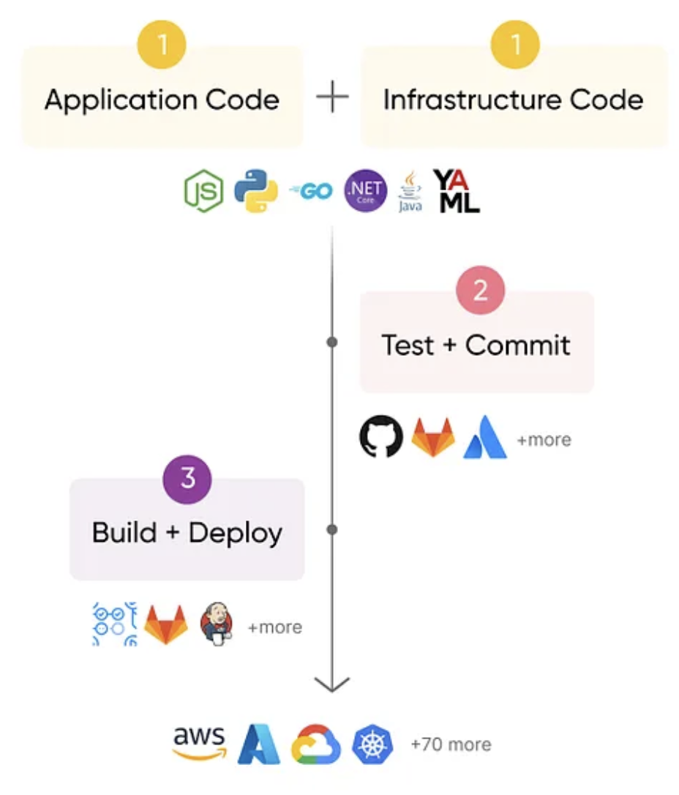

# Getting started with CI/CD for AWS using Pulumi and GitHub Actions

## 🌐 Overview

In this workshop, you will learn the fundamentals of an infrastructure ci/cd pipeline through guided exercises. You will be introduced to Pulumi, an infrastructure-as-code platform designed to provision modern cloud infrastructure using familiar programming languages.

This workshop introduces new users to DevOps best practices. You will become familiar with the core concepts needed to deploy cloud resources _continuously_. Walk through configuring Pulumi GitHub Actions to deploy AWS resources programmatically and accelerate your cloud projects with the skeleton code provided.

## 🎯 Learning Objectives 

- The basics of the Pulumi programming model
- The key components of a continuous pipeline
- How to build your own infrastructure CI/CD pipeline
- Configuring the Pulumi GitHub Actions to deploy AWS resources

## Table of Contents  

* [🧰 Prerequisites](#-prerequisites)
* [<strong>Part 1</strong> Define infrastructure as code](#part-1-define-infrastructure-as-code)
    * [🎯 Goal](#-goal)
    * [📚 Concepts](#-concepts)
    * [🎬 Steps](#-steps)
        * [1. Set up a new directory](#1-set-up-a-new-directory)
        * [2. Use a template](#2-use-a-template)
        * [3. (Optional) Explore the program](#3-optional-explore-the-program)
        * [4. Perform your first deployment](#4-perform-your-first-deployment)
* [<strong>Part 2</strong> Automatically deploy the IaC](#part-2-automatically-deploy-the-iac)
    * [🎯 Goal](#-goal-1)
    * [📚 Concepts](#-concepts-1)
    * [🎬 Steps](#-steps-1)
        * [1. Add version control](#1-add-version-control)
        * [2. Configure Pulumi GitHub Actions](#2-configure-pulumi-github-actions)
        * [3. Create a Pull Request](#3-create-a-pull-request)
* [(Optional) <strong>Part 3</strong> Make a fun PR!](#optional-part-3-make-a-fun-pr)
    * [🎯 Goal](#-goal-2)
    * [💡 Suggestions](#-suggestions)
* [🚀 Next steps](#-next-steps)


## 🧰 Prerequisites

To go through this workshop with us, here is what you need

### Pulumi

1. A Pulumi Cloud account, head to [app.pulumi.com](https://app.pulumi.com/signup/?utm_source=da&utm_medium=referral&utm_campaign=workshops&utm_content=ced-fall2022-workshops) and follow the sign-up process.
2. An [access token](https://www.pulumi.com/docs/intro/pulumi-service/accounts/#access-tokens?utm_source=da&utm_medium=referral&utm_campaign=workshops&utm_content=ced-fall2022-workshops) from your Pulumi Cloud account.
3. The [Pulumi CLI]((https://www.pulumi.com/docs/get-started/install/?utm_source=da&utm_medium=referral&utm_campaign=workshops&utm_content=ced-fall2022-workshops)) installed in your development environment.

### GitHub

1. A [GitHub](https://github.com/join) account.
2. The [GitHub CLI](https://cli.github.com/), [`gh`](https://cli.github.com/) installed in your development environment.
3. [Git](https://git-scm.com/book/en/v2/Getting-Started-Installing-Git) installed in your development environment.

### AWS

1. The [`aws` CLI](https://docs.aws.amazon.com/cli/latest/userguide/getting-started-install.html) installed in your development environment.
2. [Set up your local AWS credentials](https://www.pulumi.com/registry/packages/aws/installation-configuration/#credentials).


[**Click here to jump back to the Table of Contents**](#table-of-contents)

## **Part 1** Define infrastructure as code

### 🎯 Goal

Attendees will be able to practice configuring the basics of the Pulumi programming model:
* project; 
* program; and
* stack in Pulumi.

### 📚 Concepts

The *Pulumi programming model* is centered around defining infrastructure using familiar programming languages. 

A *Pulumi template* refers to a configuration and infrastructure-as-code (IaC) project created using the Pulumi programming model so that it may be easily reused. At Pulumi, we have curated a list of 100s of out-of-the-box templates for the most popular providers at https://github.com/pulumi/templates. These are directly integrated with the CLI via `pulumi new`. Users can also create templates.

### 🎬 Steps

You will add cloud infrastructure to a Hello World web app so that it runs in an Amazon S3 bucket.

#### 1. Set up a new directory

The Pulumi program needs an empty directory. Oftentimes, this is a subfolder within your application's repository named something along the lines of 'infra'. However, because Pulumi templates are standalone full-working solutions, you'll see the app folder nested. 

✅ Create a project and program folders

```bash
mkdir iac-workshop && cd iac-workshop
mkdir infra
```

#### 2. Use a template

We're going to use a Pulumi template to generate our program's scaffolding. 

✅ Run the following command in your terminal

```bash
# To walk through the prompts
$ cd infra
$ pulumi new
#   Select 'template'
#   Select `static-website-aws-typescript`
#   Project name: iac-workshop   
#   Description: <Enter> to select the default
#   Stack name: local
#   Select defaults for the remaining prompts


# Or, using advance settings
$ pulumi new static-website-aws-typescript --dir infra --template-mode  --stack local  --name iac-workshop --yes --non-interactive
# Note: The --dir specificed will be created, if it doesn't exist.
```

#### 3. (Optional) Explore the program

Each time you create a new Pulumi program, you'll see the following:

1. `Pulumi.yaml` contains the project and top-level configuration settings.
2. A `Pulumi.<stackName>.yaml` file for each stack within your program. This is the stack configuration file, e.g., `Pulumi.local.yaml`
3. A language-specific Pulumi program entrypoint. This is `index.ts` in our example.
4. Other language-specific package and dependency files. 

For TypeScript, the tree structure is shown below:

```bash
.
├── Pulumi.local.yaml
├── Pulumi.yaml
├── index.ts
├── node_modules
├── package-lock.json
├── package.json
├── tsconfig.json
└── www

3 directories, 6 files
```

✅ Inspect your `local` stack.

> [!TIP] 
> *Stacks*: Stacks are logical environments within your Pulumi project. Each stack can have its own configuration and resources. For example, you might have a development stack and a production stack within the same project.

```bash
$ cat Pulumi.local.yaml        
config:
  aws:region: us-west-2
  iac-workshop:errorDocument: error.html
  iac-workshop:indexDocument: index.html
  iac-workshop:path: ./www
```


✅ Inspect the `index.ts` file to identify its key elements.

> [!TIP] 
> *Pulumi program entrypoint*: Your Pulumi program starts with an entry point, typically a function written in your chosen programming language. This function defines the infrastructure resources and configurations for your project.

The key elements in the Pulumi program entrypoint file are defined below.

* **Providers** are a crucial part of Pulumi's infrastructure as code (IaC) framework, as they enable you to define and deploy resources in your target environment using familiar programming languages. There are over [150+ providers available](https://www.pulumi.com/registry/) that allow you to interact with and manage resources in a specific cloud or infrastructure environment, such as AWS, Azure, or Google Cloud. 
* **Configurations**. Pulumi allows you to configure your infrastructure by setting variables. These variables can be set via command-line arguments, environment variables, configuration files (e.g., Pulumi.local.yaml), or secrets. This flexibility makes it easy to manage different configurations for different environments.
* **Resources** represent cloud infrastructure components, like virtual machines, databases, networks, etc. You define resources using constructors specific to the cloud provider you're working with. For instance, in AWS, you might create an S3 bucket resource.
* **Outputs**  You can define outputs in your Pulumi program to expose information about your infrastructure. These outputs can be used for debugging, integration with other services, or to provide information to other parts of your application. 

```bash
$ cat -n index.ts
```

> [!IMPORTANT] 
> *Pulumi is declarative*: Pulumi allows you to define your desired infrastructure state using code in a declarative manner. In a declarative approach to infrastructure management, you **specify what you want** the infrastructure to look like, and the underlying system (Pulumi in this case) takes care of figuring out how to achieve that desired state.

#### 4. Perform your first deployment

✅ Deploy the Pulumi program using `local` stack via the terminal by running the following commands:

```bash
# Check you're logged into Pulumi Cloud
$ pulumi whoami
# If not logged in, run
$ pulumi login
# Provide your access token at the prompt to connect to your Pulumi Cloud account


# A preview of the changes will be printed on the screen
$ pulumi up
# Select 'yes' to confirm the changes and wait a few seconds

# Or, using advance settings to skip the preview
$ pulumi up --yes --skip-preview --non-interactive --stack dev

🎉 **Congratulations**! 🎉  Your application is now up and running!
```

✅ Access the `url` Output to confirm your website is accessible.

```bash
# To view all your stack outputs
$ pulumi stack output 
# To view an output
$ pulumi stack output url

# Validate the app has a working endpoint!
$ curl $(pulumi stack output url)
```

[**Click here to jump back to the Table of Contents**](#table-of-contents)

## **Part 2** Automatically deploy the IaC
 
In [Part 1](TODO), you manually ran commands using the Pulumi CLI to get your application and cloud infrastructure running. In a DevOps fashion, however, you would deploy everything *programmatically*. 

### 🎯 Goal

Attendees will be able to understand and configure the three stages of an infrastructure ci/cd pipeline to automatically deploy changes.



### 📚 Concepts

An **Infrastructure CI/CD pipeline** is a set of automated processes and tools designed to manage and deploy infrastructure as code (IaC) in a consistent, efficient, and reliable manner. It's an essential part of modern DevOps practices and is used to streamline the provisioning and maintenance of infrastructure resources, such as servers, networks, and cloud services. 

### 🎬 Steps

#### 1. Add version control

✅ Turn your Pulumi project into a GitHub repository

```bash
# Ensure you're in the project, `iac-workshop`, directory
cd ../iac-workshop # if currently in the infra dir.

# Update these variables
owner=desteves
repo=iac-workshop

# Initialize the repository
git init
git remote add origin https://github.com/${owner}/${repo}.git
git branch -M main
git push -u origin main

# Prepare first commit
git touch .gitignore
echo "**node_modules" >> .gitignore
echo "infra/Pulumi.local.yaml" >> .gitignore
git add .gitignore
git commit -m "Initial commit"
git push -u origin main
```

#### 2. Configure Pulumi GitHub Actions

With IaC and version control in place, we are one step closer to defining the infrastructure pipeline. As a next step, we need to add a trigger to run the IaC automatically. We'll use the [Pulumi GitHub Actions](https://github.com/pulumi/actions), which is responsible for instantiating the infrastructure and running the application. 

✅ Add a secret to store your Pulumi access token to be used by Actions.

```bash
# Log in
$ gh auth login

# Create the secret
$ gh secret set PULUMI_ACCESS_TOKEN -b pl-123

# Verify it's there
$ gh secret list
```

And let's do the same for the `aws` credentials. You may have dynamic or traditional credentials. Update the names of the keys accordingly.

```bash
$ gh secret set TODO -b pl-123
$ gh secret set TODO -b pl-123
$ gh secret set TODO -b pl-123
$ gh secret list
```

Next, we configure a pipeline to be triggered by changes to a PR against the main branch. A commit will result in automatically:
- Verifying the Pulumi secret is configured; and
- Testing the IaC by creating `test` stack.


✅ Add a workflow

```bash
$ mkdir -p .github/workflows
$ cd  .github/workflows
$ vi pipeline.yml
# paste the contents below and save the file.
```


```yaml
# Contents of pipeline.yml
name: pr-main

on:
  pull_request:
    branches: [ "main" ]

  workflow_dispatch:

jobs:
  check-secret:
    runs-on: ubuntu-latest
    steps:
      - name: Checkout repository
        uses: actions/checkout@v4

      - name: Check if secret exists
        run: |
            if [ -n "${{ secrets.PULUMI_ACCESS_TOKEN }}" ]; then
            echo "Found Pulumi access token. Proceeding with workflow..."
            else
            echo "Pulumi access token does not exist. Aborting workflow..."
            exit 1
            fi
  pulumi-up:
    name: pulumi-up
    needs: check-secret
    runs-on: ubuntu-latest
    steps:
      - name: Checkout repository
        uses: actions/checkout@v4

      - name: Set up Node.js 18
        uses: actions/setup-node@v4
        with:
          node-version: 18

      - name: Install Dependencies
        working-directory: ./infra
        run: npm install

      - uses: pulumi/actions@v5
        with:
          command: up
          stack-name: diana-pulumi-corp/iac-workshop/test
          work-dir: ./infra
        env:
          PULUMI_ACCESS_TOKEN: ${{ secrets.PULUMI_ACCESS_TOKEN }}
          AWS_TODO: ${{ secrets.AWS_TODO }}
          AWS_TODO: ${{ secrets.AWS_TODO }}
```


TODO: Add AWS CREDS
<!--  -->
<!-- View an example of a run after updating the Workflow contents -->
<!-- TODO-TODO-TODO -->


#### 3. Create a Pull Request

✅ Commit all the changes as a PR.

```bash
# Commit your changes
git add .
git commit -m "add cicd"

# Create a new feature branch
git checkout -b feature-cicd

# Create a PR as a draft
gh pr create --base main --head feature-cicd --title "Adds a IaC CI/CD pipeline" --body "" --draft 
## wait a couple of minutes for Actions to run.
```

After creating the PR, the Actions will run shortly. 

✅ Navigate and inspect the Actions' results in your browser.

<!-- TODO -->

✅ Merge the PR 

```bash
gh pr merge 1
```

[**Click here to jump back to the Table of Contents**](#table-of-contents)

## (Optional) **Part 3** Make a fun PR!

At this point, you have 

- a GitHub repository with a sample application; 
- AWS cloud infrastructure defined as code; and
- a CI/CD pipeline to test any change automatically. 

We encourage you to modify your app or infra and watch the changes be tested programmatically.

### 🎯 Goal

Attendees will be able to practice enhancing the infrastructure CI/CD pipeline.

### 💡 Suggestions

Create a new PR that:

- Adds a `/healthcheck` endpoint to the application and redeploy it.
- Modifies the pipeline to destroy the stack, `test` upon a successful merge to `main`.
- (Advanced) Uses Pulumi ESC to dynamically auth against AWS via OIDC.

## 🚀 Next steps

Ready for more? Follow the [Advanced CI/CD for AWS using Pulumi and GitHub Actions](../aws-advanced-cicd/) to take your infrastructure pipeline to the next level with AWS Policies, Secrets Management, Drift Detection, and Review Stacks.
