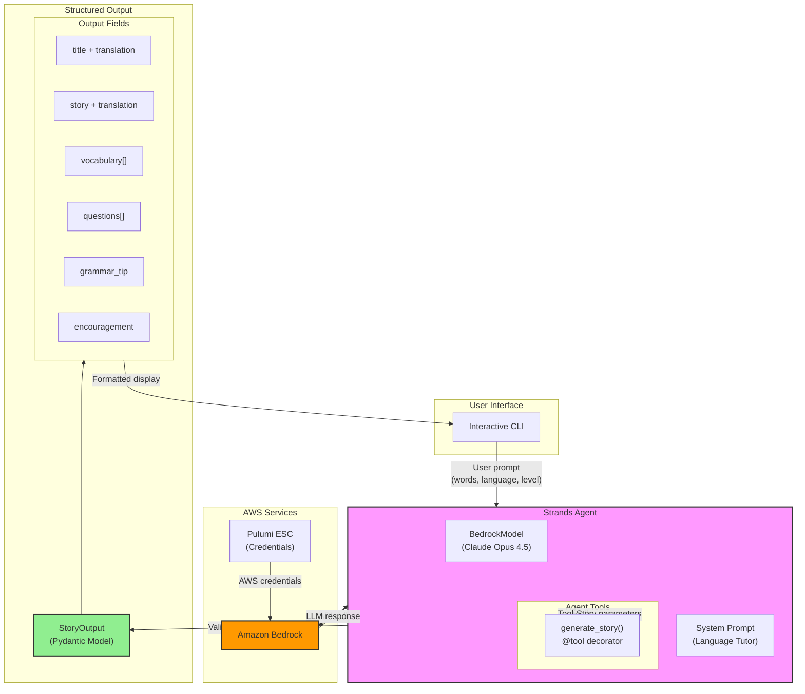

# Language Tutor Agent

An AI-powered language tutor that generates stories using vocabulary words to help learners practice in context. Built with [Strands Agents SDK](https://strandsagents.com/) and Amazon Bedrock.

## Features

- **Structured Output**: Type-safe responses using Pydantic models
- **Multi-language Support**: Spanish, French, German, Hebrew, English, and more
- **CEFR Proficiency Levels**: A1 (Beginner) through C2 (Mastery)
- **Comprehensive Learning**: Stories, vocabulary review, comprehension questions, grammar tips
- **Amazon Bedrock**: Powered by Claude Opus 4.5

## Architecture



## Project Structure

```
language-tutor-agent/
├── agent.py          # Main agent with Bedrock config
├── tools.py          # generate_story tool (@tool decorator)
├── models.py         # Pydantic models (StoryOutput, VocabularyItem)
├── run.sh            # Local run script with Pulumi ESC
├── pyproject.toml    # Project config (uv)
├── uv.lock           # Lock file
└── README.md
```

## Quick Start

### Prerequisites

- Python 3.10+
- [uv](https://github.com/astral-sh/uv) package manager
- [Pulumi CLI](https://www.pulumi.com/docs/install/) (for AWS credentials)
- Access to Amazon Bedrock with Claude Opus 4.5

### Run Locally

```bash
cd language-tutor-agent

# Run with Pulumi ESC for AWS credentials
./run.sh
```

Or manually:

```bash
uv sync
pulumi env run pulumi-idp/auth -- uv run python -u agent.py
```

## Usage Examples

```
You: Create a Spanish story using: gato, casa, dormir, feliz

You: Generate an A1 French story with these words: bonjour, manger, maison

You: Write a C1 English story incorporating: ephemeral, serendipity, melancholy

You: Generate an A1 Hebrew story using: שלום, בית, אוכל, טוב
```

## Structured Output

The agent returns type-safe responses using Pydantic models:

```python
class StoryOutput(BaseModel):
    title: str                      # Story title in target language
    title_translation: str          # English translation of title
    story: str                      # Full story in target language
    translation: str                # English translation
    vocabulary: list[VocabularyItem]  # Word details with usage
    questions: list[str]            # Comprehension questions
    grammar_tip: str                # Relevant grammar tip
    encouragement: str              # Motivational message

class VocabularyItem(BaseModel):
    word: str                       # Word in target language
    transliteration: str            # Pronunciation guide
    meaning: str                    # English meaning
    usage: str                      # How it was used in story
```

## Language Levels (CEFR)

| Level | Description | Story Characteristics |
|-------|-------------|----------------------|
| A1 | Beginner | Very simple sentences, present tense only, 50-100 words |
| A2 | Elementary | Simple sentences, basic past/future, 100-150 words |
| B1 | Intermediate | Compound sentences, varied vocabulary, 150-250 words |
| B2 | Upper-Intermediate | Complex structures, idioms, 250-350 words |
| C1 | Advanced | Sophisticated language, nuanced vocabulary, 350-450 words |
| C2 | Mastery | Native-like fluency, literary style, 450-600 words |

## Configuration

| Environment Variable | Description | Default |
|---------------------|-------------|---------|
| `BEDROCK_MODEL_ID` | Bedrock model identifier | `us.anthropic.claude-opus-4-5-20251101-v1:0` |
| `AWS_REGION` | AWS region for Bedrock | `us-east-1` |

## Dependencies

- `strands-agents>=1.23.0` - Strands Agents SDK
- `strands-agents-tools>=0.2.19` - Built-in tools
- `boto3>=1.42.0` - AWS SDK
- `pydantic` - Data validation (included with strands-agents)

## License

Apache-2.0
