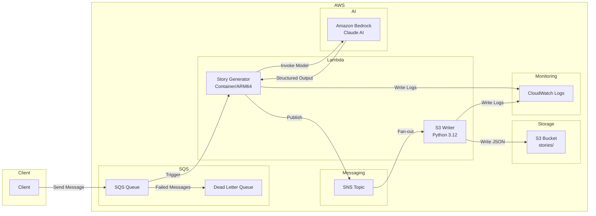
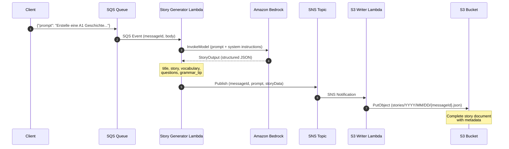

# Language Tutor Agent - AWS Lambda Deployment

This Pulumi project deploys the Language Tutor Agent as a containerized AWS Lambda function triggered by SQS messages.

## Architecture



### Data Flow



#### Message Formats

**1. SQS Input Message:**
```json
{"prompt": "Erstelle eine A1 Geschichte auf Deutsch mit: Hund, Park, spielen"}
```

**2. SNS Message (Lambda → SNS):**
```json
{
  "messageId": "abc-123",
  "prompt": "Erstelle eine A1 Geschichte...",
  "timestamp": "2026-01-22T10:24:05Z",
  "storyData": {
    "title": "Max und sein Hund",
    "story": "...",
    "vocabulary": [...],
    "questions": [...],
    "grammar_tip": "..."
  }
}
```

**3. S3 Output (stories/YYYY/MM/DD/{messageId}.json):**
```json
{
  "messageId": "abc-123",
  "prompt": "...",
  "timestamp": "...",
  "story": {
    "title": "Max und sein Hund",
    "title_translation": "Max and His Dog",
    "story": "Max hat einen Hund...",
    "translation": "Max has a dog...",
    "vocabulary": [
      {"word": "der Hund", "meaning": "the dog", "usage": "..."}
    ],
    "questions": ["Wie heißt der Hund?"],
    "grammar_tip": "...",
    "encouragement": "Toll gemacht!"
  }
}
```

## Prerequisites

- [Pulumi CLI](https://www.pulumi.com/docs/install/)
- [uv](https://docs.astral.sh/uv/) (Python package manager)
- [Docker](https://docs.docker.com/get-docker/)
- AWS credentials configured (via Pulumi ESC or environment variables)

## Quick Start

### 1. Install Dependencies

```bash
cd aws-getting-started-py/solution
uv sync
```

### 2. Configure Stack

The project uses Pulumi ESC for AWS credentials. Ensure you have access to the `pulumi-idp/auth` environment:

```bash
pulumi env open pulumi-idp/auth
```

### 3. Deploy

```bash
# Preview changes
pulumi preview

# Deploy
pulumi up
```

### 4. Test the Deployment

Send a test message to the queue:

```bash
# Using Pulumi ESC for credentials
pulumi env run pulumi-idp/auth -- uv run python test_queue.py

# Send multiple messages
pulumi env run pulumi-idp/auth -- uv run python test_queue.py --count 5

# Send a custom prompt
pulumi env run pulumi-idp/auth -- uv run python test_queue.py -p "Schreibe eine B1 Geschichte auf Deutsch mit: Urlaub, Strand, schwimmen"
```

### 5. View Logs

```bash
pulumi env run pulumi-idp/auth -- aws logs tail /aws/lambda/language-tutor-agent --follow --region us-east-1
```

## Project Structure

```
aws-getting-started-py/
├── language-tutor-agent/      # Original agent code (shared)
│   ├── agent.py               # Language Tutor Agent
│   ├── tools.py               # Agent tools
│   ├── models.py              # Pydantic models for structured output
│   ├── pyproject.toml         # App dependencies
│   └── README.md
└── solution/                  # Pulumi infrastructure
    ├── __main__.py            # Pulumi infrastructure code (includes S3 writer inline)
    ├── Pulumi.yaml            # Project configuration
    ├── Pulumi.dev.yaml        # Dev stack configuration (ESC)
    ├── pyproject.toml         # Python dependencies (uv)
    ├── test_queue.py          # Test script with S3 operations
    ├── app/
    │   ├── Dockerfile         # Lambda container (references ../language-tutor-agent/)
    │   └── handler.py         # Lambda handler with SNS publishing
    └── README.md
```

The Docker build uses the parent directory as context, referencing the original agent code from `language-tutor-agent/`. This means changes to `agent.py` or `tools.py` only need to be made in one place.

## Infrastructure Components

| Resource | Description |
|----------|-------------|
| ECR Repository | Stores the Lambda container image |
| Story Generator Lambda | Runs the Language Tutor Agent (ARM64, 1024MB, 5min timeout) |
| S3 Writer Lambda | Writes stories to S3 (Python 3.12, 256MB, 30s timeout) |
| SQS Queue | Receives language tutoring requests |
| Dead Letter Queue | Captures failed messages after 3 retries |
| SNS Topic | Fan-out for story results |
| S3 Bucket | Stores generated stories with date partitioning |
| CloudWatch Log Groups | Stores Lambda execution logs (14-day retention) |
| IAM Roles | Grants Lambda access to SQS, CloudWatch, Bedrock, SNS, and S3 |

## Configuration

Stack configuration options in `Pulumi.dev.yaml`:

| Config Key | Default | Description |
|------------|---------|-------------|
| `aws:region` | `us-east-1` | AWS region for deployment |
| `lambdaMemory` | `1024` | Lambda memory in MB |
| `lambdaTimeout` | `300` | Lambda timeout in seconds |
| `logRetentionDays` | `14` | CloudWatch log retention |

## Test Script Options

```
usage: test_queue.py [-h] [--prompt PROMPT] [--count COUNT] [--queue-url QUEUE_URL]
                     [--list-stories] [--get-story KEY] [--wait-for-s3]

Send test messages to the Language Tutor SQS queue

options:
  -h, --help            show this help message and exit
  --prompt, -p PROMPT   Custom prompt to send (default: sample German story prompt)
  --count, -c COUNT     Number of messages to send (default: 1)
  --queue-url, -q URL   SQS queue URL (default: from Pulumi stack output)
  --list-stories, -l    List recent stories from S3 bucket
  --get-story, -g KEY   Get a specific story from S3 by key
  --wait-for-s3, -w     Wait for story to appear in S3 after sending message
```

### S3 Operations

```bash
# List all stories in S3
pulumi env run pulumi-idp/auth -- uv run python test_queue.py --list-stories

# Get a specific story
pulumi env run pulumi-idp/auth -- uv run python test_queue.py --get-story "stories/2026/01/22/abc123.json"

# Send message and wait for S3 result
pulumi env run pulumi-idp/auth -- uv run python test_queue.py --wait-for-s3
```

## Sample Prompts

The test script includes sample German prompts at different CEFR levels:

- **A1**: Basic vocabulary (Hund, spielen, Park, Freund, laufen)
- **A2**: School vocabulary (Schule, lernen, Lehrer, Buch, verstehen)
- **B1**: Travel vocabulary (Reise, Flugzeug, Hotel, Abenteuer, entdecken)

## Outputs

After deployment, the following outputs are available:

```bash
pulumi stack output
```

| Output | Description |
|--------|-------------|
| `repository_url` | ECR repository URL |
| `image_uri` | Container image URI |
| `queue_url` | SQS queue URL for sending messages |
| `dlq_url` | Dead letter queue URL |
| `lambda_name` | Story generator Lambda function name |
| `lambda_arn` | Story generator Lambda function ARN |
| `log_group_name` | CloudWatch log group name |
| `sns_topic_arn` | SNS topic ARN for story results |
| `story_bucket_name` | S3 bucket name for stored stories |
| `s3_writer_lambda_name` | S3 writer Lambda function name |

## Cleanup

To destroy all resources:

```bash
pulumi destroy
```

## Troubleshooting

### Lambda timeout
Increase the timeout in `Pulumi.dev.yaml`:
```yaml
config:
  language-tutor-agent:lambdaTimeout: "600"
```

### Check DLQ for failed messages
```bash
pulumi env run pulumi-idp/auth -- aws sqs receive-message \
  --queue-url $(pulumi stack output dlq_url) \
  --region us-east-1
```

### View recent Lambda invocations
```bash
pulumi env run pulumi-idp/auth -- aws logs describe-log-streams \
  --log-group-name /aws/lambda/language-tutor-agent \
  --order-by LastEventTime --descending --limit 5 \
  --region us-east-1
```
