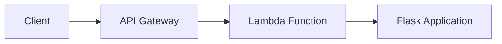

# AWS Python Workshop with Pulumi

This workshop guides you through deploying a serverless Flask application on AWS using Pulumi for infrastructure as code. You'll learn how to create cloud resources programmatically, package a Flask application in a container, and expose it through API Gateway.

## Architecture

## Prerequisites

To complete this workshop, you'll need:

- [Pulumi CLI](https://www.pulumi.com/docs/install/) installed
- [AWS CLI](https://docs.aws.amazon.com/cli/latest/userguide/getting-started-install.html) installed and configured
- [Docker](https://docs.docker.com/get-docker/) installed
- Python 3.10+ installed
- An AWS account with appropriate permissions

## Workshop Content

Follow the instructions in [demo.md](./demo.md) to complete the following sections:

1. **S3 Bucket Creation** - Learn to create and manage S3 buckets with Pulumi
2. **Flask Application Setup** - Create a simple Flask web application
3. **Lambda Deployment** - Package and deploy your Flask app as a Lambda function
4. **API Gateway Configuration** - Create an HTTP endpoint for your Lambda function
5. **Testing and Validation** - Test your deployed application

