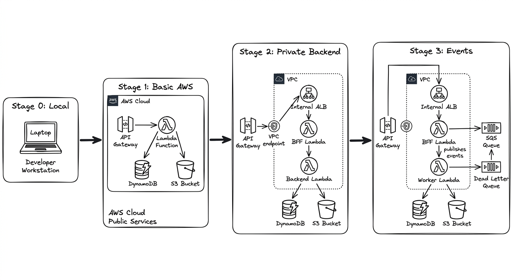
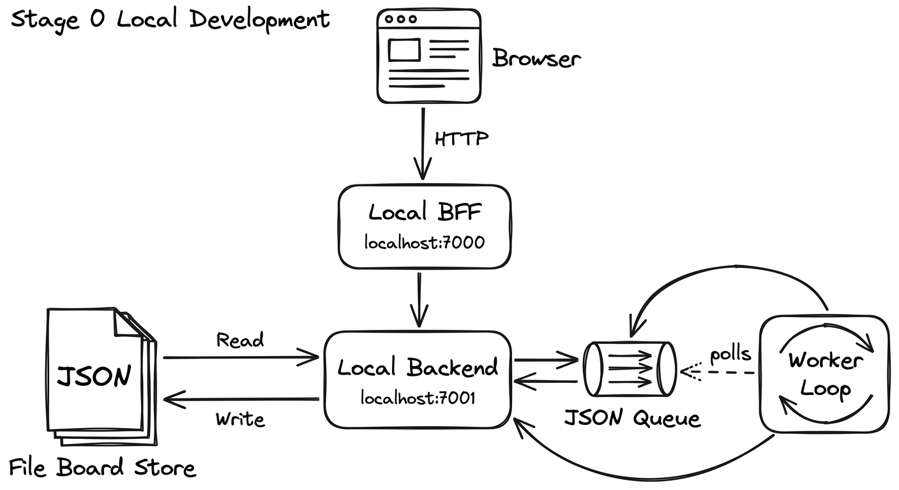
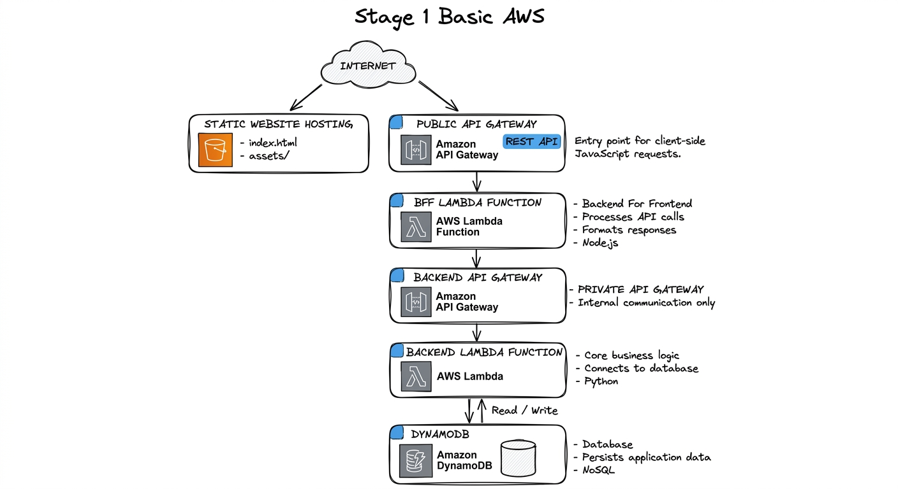
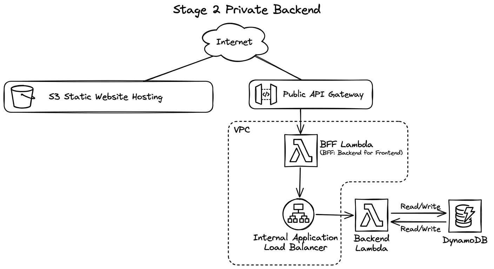
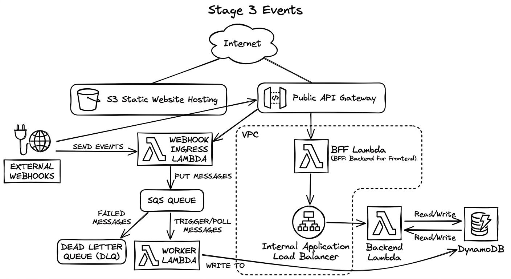
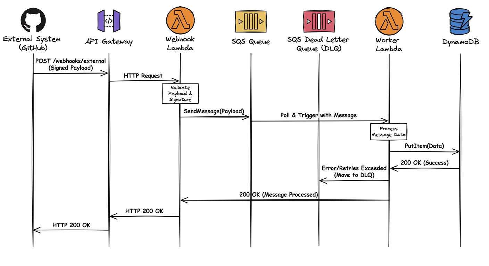
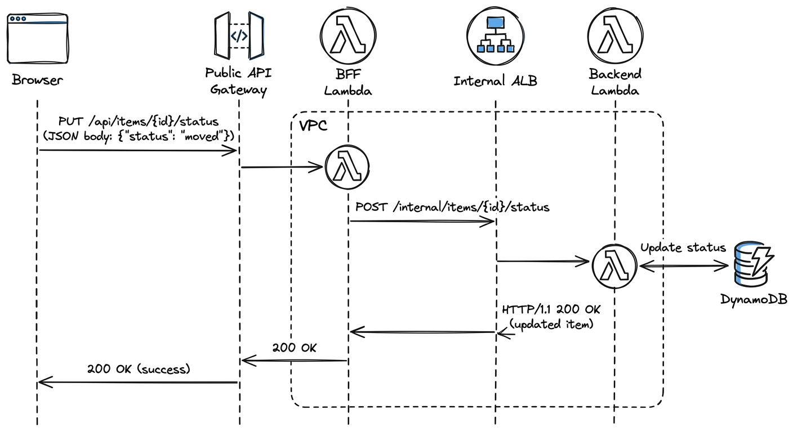

# Architecture Diagrams

Workshop-ready diagrams for the staged AWS story.

## Progression

## Stage 0: Local

## Stage 1: Basic AWS

## Stage 2: Private Backend

## Stage 3: Events

## Sequence Diagrams

### Webhook Flow

External webhooks arrive at the public API, get queued in SQS, and are processed asynchronously by the worker Lambda.

### Card Movement

Card movements go through the BFF to the backend, which persists the change to DynamoDB.
