# Azure Container Apps Workshop: From Local to Cloud-Native

**Build a real application, not just examples.** This workshop takes you from running a todo app on your laptop to deploying it on Azure Container Apps—with three increasingly sophisticated infrastructure patterns.

## What You'll Build

A production-grade Kanban board application with:
- **React + TypeScript** frontend with drag-and-drop
- **.NET 8 API** backend with real persistence
- **Azure Blob Storage** for state (no databases to manage)
- **Managed Identity** authentication (zero secrets in code)

The app is real. The infrastructure is real. The patterns are production-ready.

## The Workshop Journey

You'll deploy the same application three different ways, learning key Azure Container Apps patterns at each stage:

```mermaid
graph LR
    A[🏠 Local Dev] --> B[☁️ Basic Azure]
    B --> C[🔒 Native Resilience]
    C --> D[🎯 Dapr + Events]

    style A fill:#e1f5ff
    style B fill:#b3e5fc
    style C fill:#81d4fa
    style D fill:#4fc3f7
```



### Stage 1: Local Development
**Get familiar with the app**

Run everything locally—React frontend, .NET backend, file-based storage. See how the pieces fit together before deploying anywhere.


### Stage 2: Basic Azure (`infra-basic/`)
**Your first cloud deployment**

Both apps deployed to Azure Container Apps. Public endpoints. Direct communication. Docker images in Azure Container Registry. State persisted to Blob Storage with managed identity (no connection strings!).


**What you learn:** Container Apps basics, managed identity, Pulumi infrastructure as code

### Stage 3: Native Resilience (`infra-native/`)
**Production-grade patterns**

Backend goes internal-only. Add native Container Apps resiliency policies: retries, timeouts, circuit breakers. Frontend uses internal service discovery. No Dapr needed—pure Azure Container Apps features.


**What you learn:** Internal networking, service discovery, built-in resiliency policies, production security

### Stage 4: Dapr + Events (`infra-dapr/`)
**Event-driven architecture**

Add Azure Service Bus for webhook ingestion. Backend subscribes via Dapr pub/sub. Now external systems can send events without direct access to your backend.

```mermaid
graph TB
    Webhooks[External Webhooks<br/>GitHub · Slack · etc] -->|POST| ServiceBus[Azure Service Bus<br/>Topic: external-tasks]
    ServiceBus -->|Dapr Pub/Sub| Backend[Backend + Dapr Sidecar<br/>🔒 Internal]
    Frontend[Frontend Container App<br/>🌐 Public] -->|Internal FQDN| Backend
    Backend -->|Managed Identity| Blob[Azure Blob Storage]

    style Webhooks fill:#9c27b0
    style ServiceBus fill:#673ab7
    style Backend fill:#ff5722
    style Frontend fill:#4caf50
    style Blob fill:#ff9800
```



**What you learn:** Dapr integration, pub/sub patterns, decoupled architectures, webhook ingestion

## Why This Workshop Works

**It's a real application.** Not a Hello World. You get a working Kanban board with drag-and-drop, persistence, and API integration.

**Progressive complexity.** Each stage builds on the last. You can stop at any stage and have a complete, working deployment.

**Infrastructure-focused.** Less about React components, more about how to structure Azure Container Apps deployments for real projects.

**Production patterns.** Managed identity, internal networking, resiliency policies, event-driven architecture—things you'll actually use.

## Quick Start

### Prerequisites
- Node.js 18+, .NET 8 SDK
- Azure CLI + Pulumi CLI (for cloud deployment)
- Docker Desktop (for containerized development)

### Run Locally
```bash
just install    # Install dependencies
just dev        # Start frontend + backend
```
Visit http://localhost:5173

### Deploy to Azure
Choose your infrastructure stage and deploy:

```bash
cd infra-basic/        # Start here
pulumi up              # Deploy (~3 minutes)
pulumi stack output frontendUrl  # Get your app URL
```

Switch between stages:
```bash
cd ../infra-native/    # Try internal networking + resiliency
pulumi up

cd ../infra-dapr/      # Add event-driven patterns
pulumi up
```

Tear it down:
```bash
pulumi destroy         # Remove all resources
```

## What's Included

**A complete application:**
- Drag-and-drop Kanban board with natural language commands
- Event simulation for testing webhook flows
- Production-ready .NET backend with tests
- Modern React frontend with TypeScript

**Three infrastructure approaches:**
- `infra-basic/` - Simple public deployment pattern
- `infra-native/` - Production security + built-in resiliency
- `infra-dapr/` - Event-driven architecture with Service Bus

**Real production patterns:**
- Managed Identity (zero secrets in code)
- Internal networking and service discovery
- Native resiliency policies (retry, timeout, circuit breaker)
- Dapr pub/sub for decoupled event processing
- Pulumi ESC for centralized configuration
- Automated Docker builds and registry pushes

## Cost Estimate

Running 24/7 in Azure (West US 2):
- **~$50/month** for all resources (Container Apps, Storage, Registry)
- Use `pulumi destroy` when not in use to avoid charges

## Learn More

- **[Infrastructure Deep Dive](./workshop-infra.md)** - Detailed walkthrough of the Pulumi code
- **[Architecture Diagrams](./images/architecture-diagrams.md)** - Visual comparison of all three stages
- **API Docs** - Visit `/swagger` on your backend URL

## Helpful Commands

```bash
# Local development
just dev          # Run frontend + backend
just test         # Run backend tests
just reset        # Reset board to initial state

# Docker development
just docker-build # Build containers
just docker-dev   # Run with docker-compose

# Azure deployment
pulumi preview    # See what will change
pulumi up         # Deploy infrastructure
pulumi destroy    # Remove all resources
pulumi stack output frontendUrl  # Get app URL
```

## License

MIT
