# Todo Demo Workshop - Deploying Multi-Service Apps to Azure Container Apps

## Workshop Overview

**Duration:** 60 minutes

Learn how to deploy a complete multi-service application to Azure Container Apps, including:

- Frontend (React SPA)
- Backend-for-Frontend (BFF)
- Backend API (.NET 8)
- Service-to-service communication (direct, then with Dapr)
- Infrastructure as Code with Pulumi

**What You'll Learn:**

- Deploy containerized apps to Azure
- Implement BFF pattern for API protection
- Secure service-to-service communication with Dapr
- Manage infrastructure with Pulumi

---

## Part 1: The Problem Statement

### The Real-World Challenge

In modern work environments, tasks come from everywhere:

- Slack messages and threads
- Project management tools (Monday, Jira, Asana)
- Email threads
- GitHub issues and pull requests
- Direct messages from various platforms

**The Vision:** A unified inbox that aggregates tasks from all these sources into one Kanban-style interface where you can:

- See everything in one place
- Drag and drop between states
- Use natural language commands to manage tasks
- Have changes sync back to the original sources

### What We're Building Today

This demo is a **prototype** of that vision. Currently it:

- ✅ Provides a beautiful Kanban UI with 5 columns (Inbox, Doing, Blocked, Done, Snoozed)
- ✅ Supports drag-and-drop and natural language chat commands
- ✅ Simulates webhook events from external systems
- ✅ Stores state persistently in cloud storage
- ⏳ Does not yet pull from real integrations (that's the next phase!)

Think of this as the **foundation** - we're building the architecture that will support real integrations in the future.

---

## Part 2: The Architecture & Demo

### Start Here: Architecture Diagram

Show the complete system architecture:

```
┌─────────────────────────────────────────────────────────┐
│                    User Browser                         │
└────────────────────────┬────────────────────────────────┘
                         │ HTTPS
                         ▼
              ┌──────────────────────┐
              │   Frontend (React)   │
              │   + BFF (Express)    │  ← Port 5174
              └──────────┬───────────┘
                         │ HTTP
                         ▼
              ┌──────────────────────┐
              │   Backend API        │
              │   (.NET 8)           │  ← Port 5001
              └──────────┬───────────┘
                         │
                         ▼
              ┌──────────────────────┐
              │   Data Store         │
              │   (File/Blob)        │
              └──────────────────────┘
```

**Key Points:**

- Frontend: React SPA (built with LLM assistance)
- BFF: Express.js proxy with business logic
- Backend: .NET 8 API with domain models
- Data: File storage (local) or Blob Storage (Azure)

### Start the Application

```bash
# Build and start
just docker-build
just docker-dev

# Open in browser
open http://localhost:5174
```

### Show the UI

**Demo Points:**

- Kanban board with 5 columns (Inbox, Doing, Blocked, Done, Snoozed)
- Drag items between columns
- Simulate webhook events (future: GitHub, Slack, Monday integrations)
- Activity log shows all API calls
- Reset board to demo state

### Test the API

Show how the services communicate:

```bash
# Get the board state
curl http://localhost:5001/api/board | jq

# Get a specific item with history
curl http://localhost:5001/api/items/item_001 | jq

# Create a new item (simulating a webhook)
curl -X POST http://localhost:5001/api/items \
  -H "Content-Type: application/json" \
  -d '{"title": "New task from curl", "sourceType": "github", "externalId": "GH-123"}'

# Update an item's status
curl -X POST http://localhost:5001/api/items/item_001/status \
  -H "Content-Type: application/json" \
  -d '{"status": "doing"}'
```

---

## Part 3: Understanding the Code

### The Backend API (.NET 8)

**Domain Models**

Show the core data structures:

- `Item` record with id, title, status, source, timestamps → api/Models/Item.cs:9
- `Source` record (type, external ID, display name) → api/Models/Item.cs:3
- `Status` enum (inbox, doing, blocked, done, snoozed) → api/Models/Enums.cs:3
- `SourceType` enum (github, jira, custom) → api/Models/Enums.cs:12

**API Endpoints**

Show the main endpoints in api/Program.cs:

- `GET /api/board` - Get full board state → api/Program.cs:96
- `POST /api/items` - Create item (webhook simulation) → api/Program.cs:123
- `GET /api/items/{id}` - Get item with history → api/Program.cs:107
- `POST /api/items/{id}/status` - Update status → api/Program.cs:134
- `POST /api/items/{id}/notify-team` - Send notifications to team → api/Program.cs:183
  - ⚠️ **Note:** This endpoint will become important later when we talk about security

### Backend for Frontend (BFF) Pattern

**The Pattern:**

- Each frontend (web, mobile, etc.) can have its own dedicated backend
- Aggregates data from multiple services
- Adds business logic specific to that UI
- Simplifies and protects backend APIs

**Our Implementation**

Open → frontend/bff/server.js:62

Show how the BFF protects the notification endpoint:
1. **Rate limiting** - Prevents spam (10 requests/minute)
2. **Validation** - Ensures item exists before notifying
3. **Business logic** - Enforces rules (e.g., no notifications for completed items)
4. **Enrichment** - Adds context the frontend doesn't have (title, priority, source)

**Key Point:** This pattern lets us add protection without complex authentication

---

## Part 4: Moving to the Cloud

Now that we understand the application, let's deploy it to Azure!

### Why Azure Container Apps?

- **Serverless** - scale to zero when not in use
- **Fully managed** - no Kubernetes cluster to manage
- **Built-in HTTPS** and load balancing
- **Integrated with Azure** - Storage, Identity, Monitoring
- **Cost-effective** - pay only for what you use

Instead of clicking through the Azure Portal, we'll define our infrastructure in code using Pulumi. This gives us:

- **Reproducible** infrastructure we can recreate anytime
- **Version controlled** - track changes with git
- **Preview before apply** - see what will change
- **Code as documentation** - the infrastructure is self-documenting

---

## Part 5: Hands-On - Building Infrastructure from Scratch

We'll start by deploying a simple version without a service mesh. This will help us understand **why Dapr is needed** later.

### Step 1: Create Your Pulumi Project

First, create a new directory for your infrastructure code:

```bash
mkdir infra
cd infra
```

Now initialize a new Pulumi project:

```bash
pulumi new azure-csharp
```

This will prompt you for:
- **project name**: `todo-demo-infra` (or your preference)
- **project description**: Infrastructure for Todo Demo on Azure Container Apps
- **stack name**: `dev`
- **azure-native:location**: `westus2` (or your preferred region)

Pulumi will create several files:
- `Program.cs` - Your infrastructure code goes here
- `infra.csproj` - .NET project file with dependencies
- `Pulumi.yaml` - Project configuration
- `Pulumi.dev.yaml` - Stack-specific configuration

**About Pulumi:**
- **Pulumi CLI** is the tool we just installed (open source)
- **app.pulumi.com** is where your state and deployment history is stored
- Free for individuals, commercial offering for organizations
- Think of it like Git (open source CLI) + GitHub (hosted service)

### Step 2: Preview the Default Project

Let's see what the default template would create:

```bash
pulumi preview
```

You'll see it wants to create a resource group. Let's deploy it to see how Pulumi works:

```bash
pulumi up
```

At `app.pulumi.com` you can see:
- Timeline of all deployments
- What resources were created
- Outputs and configuration
- Full history and diffs

### Step 3: Examine the Generated Files

Open `Program.cs` to see what was generated:

```csharp
using Pulumi;
using Pulumi.AzureNative.Resources;

return await Deployment.RunAsync(() =>
{
    // Create an Azure Resource Group
    var resourceGroup = new ResourceGroup("resourceGroup");

    // Export the resource group name
    return new Dictionary<string, object?>
    {
        ["resourceGroupName"] = resourceGroup.Name
    };
});
```

This is a minimal Pulumi program. Let's build on it!

### Step 4: Start Building - Resource Group

Clear out the default code and let's start fresh. We'll type out a simple resource group:

```csharp
using System.Collections.Generic;
using Pulumi;
using Pulumi.AzureNative.Resources;
using Pulumi.AzureNative.Storage;

return await Deployment.RunAsync(() =>
{
    var stackName = Deployment.Instance.StackName;

    // Create Resource Group
    var resourceGroup = new ResourceGroup("resourceGroup", new ResourceGroupArgs
    {
        ResourceGroupName = $"rg-todo-demo-{stackName}"
    });

    // We'll add more resources here...

    return new Dictionary<string, object?>
    {
        ["resourceGroupName"] = resourceGroup.Name
    };
});
```

**What's happening here:**
- We get the stack name (e.g., "dev") from Pulumi
- We name the resource group `rg-todo-demo-{stackName}`
- Location comes from the config we set during `pulumi new` (westus2)

### Step 5: Add Storage Account

Now let's add a storage account for our board state. Type this in (we'll explain as we go):

```csharp
// Create Storage Account (add after Resource Group)
var storageAccount = new StorageAccount("storage", new StorageAccountArgs
{
    AccountName = $"sttododemo{stackName}",
    ResourceGroupName = resourceGroup.Name,
    Sku = new Pulumi.AzureNative.Storage.Inputs.SkuArgs
    {
        Name = Pulumi.AzureNative.Storage.SkuName.Standard_LRS
    },
    Kind = Pulumi.AzureNative.Storage.Kind.StorageV2
});
```

**Key points:**
- Storage account names must be globally unique, lowercase, and have no dashes
- We use `Standard_LRS` (locally-redundant storage) for cost savings
- Location is inherited from the resource group

Add the storage account name to outputs:

```csharp
return new Dictionary<string, object?>
{
    ["resourceGroupName"] = resourceGroup.Name,
    ["storageAccountName"] = storageAccount.Name
};
```

### Step 6: Preview and Deploy

Let's see what Pulumi will create:

```bash
pulumi preview
```

You should see:
- Resource group (already exists, no changes)
- Storage account (will be created)

Deploy it:

```bash
pulumi up
```

Watch as Pulumi creates the storage account! This takes about 30 seconds.


```bash
pulumi stack output
```

### Step 7: Add More Resources (Guided Copy/Paste)

Now we'll add the remaining resources incrementally. We'll use the diff view to see what to add next.

**Compare with the complete version:**

```bash
# From inside infra/ directory:
code --diff Program.cs ../infra-basic/Program.cs

# Or from project root:
code --diff infra/Program.cs infra-basic/Program.cs
```

This shows your current code (left) vs. the complete version (right). You'll see all the resources we need to add.

**Add these imports at the top:**

```csharp
using Pulumi.AzureNative.App;
using Pulumi.AzureNative.Authorization;
using Pulumi.AzureNative.ContainerRegistry;
using Pulumi.AzureNative.ManagedIdentity;
using Pulumi.Docker;
```

**Copy sections from infra-basic/Program.cs one by one:**

Between each section, you can run `code --diff` again to see what's left to add, or `pulumi preview` to see what will be created.

1. **Blob Container** - Create a container in the storage account for board state
2. **Upload initial board blob** - Copy initial-board.json to storage
3. **Container Registry (ACR)** - Where we'll push our Docker images
4. **Get registry credentials** - For Docker push authentication
5. **Build backend image** - Build and push .NET API to ACR
6. **Container Apps Environment** - The hosting environment for our apps
7. **Managed Identity** - For backend to access storage without secrets
8. **Role Assignment** - Grant backend identity access to storage
9. **Backend Container App** - Deploy the .NET API
10. **Frontend image and app** - Build and deploy React + BFF

**Tip:** After copying each section, check the diff to see your progress toward the complete version.

### Step 8: Understanding Outputs

Pulumi **outputs** are values you want to access after deployment. Add these to your return statement:

```csharp
return new Dictionary<string, object?>
{
    ["resourceGroupName"] = resourceGroup.Name,
    ["storageAccountName"] = storageAccount.Name,
    ["frontendUrl"] = frontendApp.Configuration.Apply(c =>
        $"https://{c!.Ingress!.Fqdn}"),
    ["backendUrl"] = backendApp.Configuration.Apply(c =>
        $"https://{c!.Ingress!.Fqdn}")
};
```

### Step 9: Final Deployment

Run the complete deployment:

```bash
pulumi up
```

This will take about 3-5 minutes. You'll see:
- Building Docker images
- Pushing to ACR
- Creating Container Apps Environment
- Deploying backend and frontend containers
- Setting up managed identity and permissions

### Step 10: Access Your Deployed App

Get the frontend URL:

```bash
pulumi stack output frontendUrl
```

Open it in your browser! You should see your Kanban board running in Azure.

Get the backend URL:

```bash
pulumi stack output backendUrl_out
```

### Step 11: The Security Problem

Now let's demonstrate why we need Dapr. With our current deployment, **both the frontend and backend have public endpoints**.

Try calling the backend's notification endpoint directly:

```bash
BACKEND_URL=$(pulumi stack output backendUrl_out)

# Call the protected notification endpoint directly (bypassing the BFF)
curl -X POST "$BACKEND_URL/api/items/item_002/notify-team" \
  -H "Content-Type: application/json" \
  -d '{"message":"SPAM MESSAGE"}' | jq
```

**Result:** It works! ⚠️

```json
{
  "success": true,
  "message": "Notified 3 team members",
  "notificationsSent": 3
}
```

**The Problem:** Anyone with the backend URL can spam notifications. There's no:
- ❌ Rate limiting
- ❌ Validation
- ❌ Business logic enforcement
- ❌ Authentication

Try spamming it:

```bash
# Spam the endpoint (this should NOT be possible!)
for i in {1..20}; do
  curl -X POST "$BACKEND_URL/api/items/item_002/notify-team" \
    -H "Content-Type: application/json" \
    -d '{"message":"Spam '$i'"}' &
done
```

All 20 requests succeed! 😱 In a real system, this would flood your team with notifications.

### Discussion: Current Challenges

With our basic deployment, we have several issues:

**Security:**

- ❌ Backend API is publicly exposed (anyone can call it directly)
- ❌ No rate limiting or protection against abuse
- ❌ Frontend and backend both have external ingress

**Operations:**

- ❌ No automatic retries if backend is temporarily down
- ❌ No circuit breakers to prevent cascade failures
- ❌ Limited observability into service-to-service calls

**Example Attack Vector:**

We've implemented a team notification endpoint in the backend that simulates sending emails/Slack messages:

```csharp
// Backend: /api/items/{id}/notify-team
// ⚠️ DANGEROUS: This endpoint should NOT be publicly exposed!
app.MapPost("/api/items/{id}/notify-team", async (string id, NotificationRequest request, ...) =>
{
    var teamMembers = new[] { "alice@example.com", "bob@example.com", "charlie@example.com" };

    foreach (var member in teamMembers)
    {
        logger.LogInformation("📧 [SIMULATED] Sending notification to {Member}: '{Message}'",
            member, request.Message);
        // In production: await emailService.SendAsync(member, ...);
    }

    return Results.Ok(new NotificationResponse(Success: true, NotificationsSent: teamMembers.Length));
})
.WithDescription("⚠️ PROTECTED: Send notifications to team members (should only be called via BFF)");
```

With the current setup (infra-basic), **anyone with the backend URL** could spam this endpoint and flood team communications:

```bash
# Spam attack without protection
while true; do
  curl -X POST https://backend.azurecontainerapps.io/api/items/1/notify-team \
    -H "Content-Type: application/json" -d '{"message":"spam"}'
done
# → Sends unlimited notifications! 😱
```

This is exactly what Dapr + BFF will protect against.

---

## Part 6: Securing the Backend with Native Azure Features

We've seen the security problem - anyone can call our backend API directly. Let's fix this using Azure Container Apps' native features.

### The Solution: Internal Backend + Resiliency Policies

Instead of making the backend publicly accessible, we'll:

1. **Make the backend internal-only** - no public endpoint
2. **Use native service discovery** - frontend calls backend by name
3. **Add resiliency policies** - automatic retries for transient failures

This gives us security AND resilience without additional complexity.

When you set External = false, Azure gives your service an internal-only name. When other services call that name:
  1. DNS resolves the name to a stable virtual IP (this doesn't change)
  2. A load balancer at that IP distributes requests across your healthy replicas
  3. Both are managed automatically - you just call the service by name

### Step 1: Compare with Native Version

Open the diff in VS Code to see what needs to change:

```bash
# From inside infra/ directory:
code --diff Program.cs ../infra-native/Program.cs

# Or from project root:
code --diff infra/Program.cs infra-native/Program.cs
```

You'll see three main changes:

1. Backend ingress becomes internal-only (`External = false`)
3. Resiliency policy added to backend

### Step 2: Make Backend Internal-Only

Change the backend ingress from `External = true` to `External = false`:

```csharp
Ingress = new Pulumi.AzureNative.App.Inputs.IngressArgs
{
    External = false,  // Changed from true - backend is now internal!
    TargetPort = 8080,
    Transport = IngressTransportMethod.Auto,
    AllowInsecure = false
},
```

**What this does:**
- Backend no longer has a public URL
- Only accessible from within the Container Apps Environment
- Attackers can't reach it directly


#### Compare Infrastructure Changes

The `infra-dapr/` folder shows what would change. Let's compare:

```bash
# Compare native vs. Dapr infrastructure
code --diff Program.cs ../infra-native/Program.cs
```

### Step 4: Add Resiliency Policy

Add a resiliency policy to automatically retry failed requests to the backend:

```csharp
var backendResiliencyPolicy = new ConnectedEnvironmentDaprComponentResiliencyPolicy("backendResiliency", new()
{
    Name = "backend-resiliency",
    ResourceGroupName = resourceGroup.Name,
    ConnectedEnvironmentName = containerAppEnv.Name,
    TargetContainerAppName = backendApp.Name,

    InboundPolicy = new DaprComponentResiliencyPolicyConfigurationArgs
    {
        HttpRetryPolicy = new DaprComponentResiliencyPolicyHttpRetryPolicyConfigurationArgs
        {
            MaxRetries = 3,
            RetryBackOff = new DaprComponentResiliencyPolicyHttpRetryBackOffConfigurationArgs
            {
                InitialDelayInMilliseconds = 500,
                MaxIntervalInMilliseconds = 5000
            }
        },
        TimeoutPolicy = new DaprComponentResiliencyPolicyTimeoutPolicyConfigurationArgs
        {
            ResponseTimeoutInSeconds = 30
        }
    }
});
```

**What this provides:**
- Automatic retries (up to 3 times)
- Exponential backoff between retries
- Timeout protection
- Happens at the platform level - transparent to your code

### Step 5: Preview Changes

See what Pulumi will change:

```bash
pulumi preview
```

You should see:
- Backend ContainerApp (ingress changed to internal)
- Frontend ContainerApp (BACKEND_URL changed)
- New resiliency policy resource

### Step 6: Deploy

Deploy the secured infrastructure:

```bash
pulumi up
```

This takes about 2-3 minutes.

### Step 7: Test Backend Protection

Get your frontend URL:

```bash
FRONTEND_URL=$(pulumi stack output frontendUrl)
```

Try to get the backend URL (should be empty or internal-only):

```bash
pulumi stack output backendUrl_out
```

**Result:** Backend has no public endpoint!

### Step 8: Test Resiliency

The backend is configured with a 30% failure rate to demonstrate automatic retries. Make multiple requests:

```bash
# Call the frontend 10 times
for i in {1..10}; do
  curl -s $FRONTEND_URL/api/board | jq -r '.columns[0].title // .error'
done
```

**Expected result:** You should see "Inbox" 10 times (no errors!)

Even though the backend fails 30% of the time, the resiliency policy automatically retries failed requests. The frontend never sees these failures.

### Step 9: Verify Security

Try to spam the notification endpoint:

```bash
# This should NOT work anymore
curl -X POST "$FRONTEND_URL/api/items/item_002/notify-team" \
  -H "Content-Type: application/json" \
  -d '{"message":"SPAM"}'
```

**Result:** The BFF blocks this (rate limiting and validation), and even if it got through, there's no way to bypass the BFF since the backend has no public endpoint.

### What We Accomplished

✅ **Security:** Backend is not publicly accessible (internal-only ingress)
✅ **Resilience:** Automatic retries for transient failures (actually works!)
✅ **Simplicity:** Native Azure features, no additional sidecars or complexity
✅ **Service Discovery:** Services find each other by name within the environment
✅ **Protection:** BFF enforces rate limiting and business logic

---

## Part 7: When to Use Dapr

We've secured our backend using Azure Container Apps' native features. But you might have heard about **Dapr** (Distributed Application Runtime). When should you use it?

### What is Dapr?

**Dapr** is a CNCF project that provides portable building blocks for distributed applications:

- 📮 **Pub/sub messaging** - abstract message brokers (Service Bus, Kafka, RabbitMQ)
- 💾 **State management** - abstract state stores (Cosmos DB, Redis, PostgreSQL)
- 🔌 **Bindings** - connect to external systems (Twilio, SendGrid, S3)
- 🔐 **Secrets management** - abstract secret stores (Key Vault, AWS Secrets Manager)
- 🎯 **Observability** - distributed tracing and metrics

### Dapr vs. Native Azure Features

**Native Azure Container Apps features are better for:**
- Simple service-to-service HTTP calls
- Staying within Azure
- Automatic retries and resilience
- Simpler architecture

**Dapr is better for:**
- Multi-cloud portability (run same code on AWS, Azure, K8s)
- Abstracting infrastructure (swap Service Bus for Kafka without code changes)
- Pub/sub messaging patterns
- State management abstraction
- Complex distributed systems

### Example: Webhook Events with Dapr Pub/Sub

Remember our vision - aggregating todos from GitHub, Slack, Monday.com, and email. With our current architecture, the backend is private. **How do we receive webhook events?**

This is where Dapr's pub/sub pattern shines:

```
External Webhooks → Azure Service Bus → Dapr Pub/Sub → Backend
```

#### Compare Infrastructure Changes

The `infra-dapr/` folder shows what would change. Let's compare:

```bash
# Compare native vs. Dapr infrastructure
code --diff infra-native/Program.cs infra-dapr/Program.cs
```

**Key differences you'll see:**

1. **Service Bus added** - Namespace and topic for webhook events
2. **Dapr component added** - Connects Service Bus to backend via pub/sub
3. **Backend keeps Dapr** - Enabled for pub/sub subscriptions
4. **Frontend stays simple** - No Dapr, just native HTTP calls
5. **No resiliency policy** - Different use case (event processing, not retries)

This shows Dapr is **only enabled where needed** (backend for pub/sub), not everywhere.

#### Backend Code with Dapr Pub/Sub

```csharp
// Backend subscribes to webhook events
app.MapGet("/dapr/subscribe", () => new[]
{
    new {
        pubsubname = "pubsub",
        topic = "external-tasks",
        route = "/events/tasks"
    }
});

// Receive events from any source (GitHub, Slack, Monday)
app.MapPost("/events/tasks", async (TaskEvent evt, BoardService board) =>
{
    var item = new Item(
        Id: Guid.NewGuid().ToString(),
        Title: evt.Title,
        Source: new Source(evt.SourceType, evt.ExternalId, evt.DisplayName),
        Status: Status.Inbox,
        CreatedAt: DateTime.UtcNow
    );

    await board.AddItemAsync(item);
    return Results.Ok();
});

public record TaskEvent(
    string Title,
    string SourceType,  // "github", "slack", "monday"
    string ExternalId,
    string DisplayName
);
```

#### Infrastructure with Dapr Component

```csharp
// Azure Service Bus for webhook events
var serviceBusNamespace = new ServiceBusNamespace("todo-webhooks", new()
{
    ResourceGroupName = resourceGroup.Name,
    Sku = new ServiceBusNamespaceSku { Name = "Standard" }
});

var topic = new Topic("external-tasks", new()
{
    NamespaceName = serviceBusNamespace.Name,
    ResourceGroupName = resourceGroup.Name
});

// Dapr pub/sub component
var daprPubSubComponent = new DaprComponent("pubsub", new()
{
    ComponentName = "pubsub",
    EnvironmentName = containerAppEnv.Name,
    ResourceGroupName = resourceGroup.Name,
    ComponentType = "pubsub.azure.servicebus",
    Metadata = new[]
    {
        new DaprMetadataArgs
        {
            Name = "connectionString",
            SecretRef = "servicebus-connection-string"
        }
    }
});

// Backend with Dapr enabled (for pub/sub only)
var backendApp = new ContainerApp("backendApp", new()
{
    Configuration = new ConfigurationArgs
    {
        Dapr = new DaprArgs
        {
            Enabled = true,
            AppId = "backend",
            AppPort = 8080,
            AppProtocol = "http"
        },
        Ingress = new IngressArgs
        {
            External = false,  // Still internal!
            TargetPort = 8080
        }
    }
});
```

#### Benefits of This Approach

✅ **Backend stays private** - webhooks go to Service Bus, not your API
✅ **Buffering** - events are queued if backend is down
✅ **Decoupling** - add new sources without changing backend
✅ **Portability** - swap Service Bus for Kafka or RabbitMQ with just config changes
✅ **Reliability** - dead letter queue for failed events

### The Dapr Decision

**Use native Azure features when:**
- Simple service-to-service calls
- Azure-only deployment
- Want simplicity and fewer moving parts

**Use Dapr when:**
- Need pub/sub messaging abstraction
- Want multi-cloud portability
- Building complex distributed systems
- Need state management or bindings

For this workshop, we've used native features because they're simpler and solve the immediate problem. The `infra-dapr/` folder shows what Dapr deployment would look like if you need pub/sub later.

---

## Part 8: Configuration with Pulumi ESC

### The Secrets Problem

Our app needs configuration:

- Storage account names
- API URLs
- Feature flags
- Database connection strings (future)
- Third-party API keys (future Slack/GitHub integrations)

**Bad practices:**

- ❌ Hardcode in code (security risk, not flexible)
- ❌ .env files in repo (secrets in git!)
- ❌ Azure Key Vault with connection strings (still have a secret!)

### Pulumi ESC (Environments, Secrets, and Configuration)

**ESC** is a centralized configuration service that:

- Stores secrets securely
- Works across any environment (dev, staging, prod)
- Integrates with cloud providers (Azure, AWS, etc.)
- Can be used by any application (not just Pulumi!)

**Our ESC environment:**
View it at: `https://app.pulumi.com/adamgordonbell-org/envs/todo-demo-dev`

```yaml
values:
  azure:
    location: westus2

  app:
    # Local dev
    VITE_API_BASE_URL: "http://localhost:5000"
    CORS_ORIGINS: "http://localhost:5173"

    # Azure config
    Azure__UseStorage: "true"
    Azure__UseManagedIdentity: "true"

  # Can also pull secrets from Azure Key Vault, AWS Secrets Manager, etc.
  secrets:
    fn::open::azure-secrets:
      login: ... # OIDC auth to Azure
      get:
        sendgrid-api-key: # For future email notifications
          secretName: sendgrid-key
```

### Using ESC in Your App

**In Pulumi infrastructure:**

```csharp
// Import the environment
var config = await ESC.GetEnvironment("todo-demo-dev");

// Use values
var location = config["azure"]["location"];
var storageConfig = config["app"]["Azure__UseStorage"];
```

**Locally for development:**

```bash
# Load ESC environment variables
pulumi env run todo-demo-dev -- npm run dev

# Or export them
eval $(pulumi env run todo-demo-dev -- env)
```

### Exercise: Add a Secret

**Add a SendGrid API key for email notifications:**

1. Store the secret in Azure Key Vault (or use ESC directly)
2. Reference it in your ESC environment
3. Pass it to your container as an environment variable
4. Use it in your code to send emails

**Update infrastructure:**

```csharp
var backendApp = new ContainerApp("backend", new ContainerAppArgs
{
    Configuration = new ConfigurationArgs
    {
        Secrets = new[]
        {
            new SecretArgs
            {
                Name = "sendgrid-key",
                Value = config.Require("sendgrid-api-key")
            }
        }
    },
    Template = new TemplateArgs
    {
        Containers = new ContainerArgs
        {
            Env = new[]
            {
                new EnvironmentVarArgs
                {
                    Name = "SendGrid__ApiKey",
                    SecretRef = "sendgrid-key"
                }
            }
        }
    }
});
```

Now your backend can send emails without the API key ever being in code or git!

---

## Part 9: What We Built

### Final Architecture

```
┌──────────────────────────────────────────────────────────────┐
│                         Internet                              │
└───────────────────────────────┬──────────────────────────────┘
                                │ HTTPS
                                ▼
                    ┌───────────────────────┐
                    │  Frontend Container   │
                    │  (BFF + React SPA)    │
                    │  ┌─────────────────┐  │
                    │  │  Dapr Sidecar   │  │
                    │  │  (mTLS enabled) │  │
                    │  └─────────────────┘  │
                    └───────────┬───────────┘
                                │ Dapr Service Invocation
                                ▼
                    ┌───────────────────────┐
                    │  Backend Container    │
                    │  (.NET 8 API)         │
                    │  ┌─────────────────┐  │
                    │  │  Dapr Sidecar   │  │
                    │  │  (mTLS enabled) │  │
                    │  └─────────────────┘  │
                    │  + Managed Identity   │
                    └───────────┬───────────┘
                                │ RBAC Auth
                                ▼
                    ┌───────────────────────┐
                    │  Azure Blob Storage   │
                    │  board-state/         │
                    │  └─ board.json        │
                    └───────────────────────┘
```

### Key Patterns Demonstrated

1. **Backend for Frontend (BFF)**
   - Dedicated backend per frontend
   - Aggregates/transforms data
   - Handles auth and routing

2. **Infrastructure as Code**
   - All resources defined in Pulumi
   - Preview before apply
   - Version controlled

3. **Service Mesh with Dapr**
   - mTLS encryption
   - Automatic retries
   - Service discovery
   - Internal-only backends

4. **Managed Identity**
   - No connection strings
   - RBAC for storage
   - Automatic credential rotation

5. **Configuration Management**
   - Pulumi ESC for secrets
   - Environment-specific config
   - No secrets in git

---

## Part 10: Next Steps

### Immediate Improvements

**For the Demo:**

1. ✅ Add real email notification endpoint to show Dapr protection
2. ✅ Implement BFF aggregation (not just proxying)
3. ✅ Add Application Insights for observability
4. ⏳ Add Dapr pub/sub for event-driven architecture
5. ⏳ Implement real GitHub webhook integration

**For Production:**

1. CI/CD pipeline (GitHub Actions)
2. Multiple environments (dev, staging, prod)
3. Blue/green deployments
4. Cosmos DB instead of Blob Storage (for querying)
5. CDN for static assets

### Real Integrations to Build

**Slack Integration:**

```csharp
[HttpPost("api/integrations/slack")]
public async Task<IActionResult> SlackWebhook([FromBody] SlackEvent evt)
{
    // Parse Slack message
    // Create TodoItem
    // Store in board
    // Post ack back to Slack
}
```

**GitHub Integration:**

```csharp
[HttpPost("api/integrations/github")]
public async Task<IActionResult> GitHubWebhook([FromBody] GitHubEvent evt)
{
    // Parse GitHub issue/PR
    // Create TodoItem with source="GitHub"
    // Add to board
}
```

**Monday.com Integration:**

```csharp
[HttpPost("api/integrations/monday")]
public async Task<IActionResult> MondayWebhook([FromBody] MondayEvent evt)
{
    // Parse Monday task
    // Sync to board
    // Post updates back to Monday
}
```

### Learning Resources

**Dapr:**

- [Dapr Docs](https://docs.dapr.io/)
- [Azure Container Apps Dapr](https://learn.microsoft.com/azure/container-apps/dapr-overview)

**Pulumi:**

- [Pulumi Docs](https://www.pulumi.com/docs/)
- [Pulumi ESC](https://www.pulumi.com/docs/esc/)
- [Azure Native Provider](https://www.pulumi.com/registry/packages/azure-native/)

**Container Apps:**

- [Azure Container Apps Docs](https://learn.microsoft.com/azure/container-apps/)
- [Container Apps Best Practices](https://learn.microsoft.com/azure/container-apps/best-practices)

---

## Appendix: Common Issues

### Deployment Failures

**RBAC propagation delay:**

```bash
# If you get "403 Forbidden" on first deploy, wait 5-10 minutes
# Azure RBAC can take time to propagate
# Then restart the backend:
pulumi up --refresh
```

**Docker build issues:**

```bash
# Make sure Docker Desktop is running
docker ps

# Clean and rebuild
just docker-clean
just docker-build
```

### Local Development

**Port conflicts:**

```bash
# Check what's using ports 5000, 5173, 5174
lsof -i:5000
lsof -i:5173

# Kill processes if needed
kill -9 <PID>
```

**ESC environment issues:**

```bash
# Make sure you're logged into Pulumi
pulumi login

# Verify ESC access
pulumi env ls

# View environment values
pulumi env run todo-demo-dev -- env | grep VITE
```

### Azure Issues

**Container won't start:**

```bash
# Check logs
az containerapp logs show \
  --name ca-todo-demo-backend-dev \
  --resource-group rg-todo-demo-dev \
  --follow

# Check provisioning state
az containerapp show \
  --name ca-todo-demo-backend-dev \
  --resource-group rg-todo-demo-dev \
  --query properties.provisioningState
```

**Dapr sidecar issues:**

```bash
# Verify Dapr is enabled
az containerapp show \
  --name ca-todo-demo-backend-dev \
  --resource-group rg-todo-demo-dev \
  --query properties.configuration.dapr

# Check Dapr logs
az containerapp logs show \
  --name ca-todo-demo-backend-dev \
  --resource-group rg-todo-demo-dev \
  --container dapr
```

---

## Workshop Feedback

After completing this workshop, you should be able to:

✅ Explain the Backend for Frontend pattern
✅ Deploy containers to Azure Container Apps
✅ Write infrastructure as code with Pulumi
✅ Use Dapr for service mesh capabilities
✅ Implement managed identity for secure cloud resources
✅ Manage configuration and secrets with Pulumi ESC

**Questions? Issues? Suggestions?**
Open an issue at: [github.com/your-repo/todo-demo](https://github.com/your-repo/todo-demo)

---

**Built with:**

- [Pulumi](https://www.pulumi.com/) - Infrastructure as Code
- [Azure Container Apps](https://azure.microsoft.com/products/container-apps/) - Serverless containers
- [Dapr](https://dapr.io/) - Distributed application runtime
- [.NET 8](https://dotnet.microsoft.com/) - Backend API
- [React 18](https://react.dev/) - Frontend SPA
- [TypeScript](https://www.typescriptlang.org/) - Type-safe development

---

## Application Architecture - Local


## Application Architecture - Azure Container Apps


## Application Architecture - Private Backend with Native Resiliency

```mermaid
graph LR
    User[User Browser]
    Attacker[Attacker]

    subgraph "Azure Container Apps"
        Frontend[Frontend<br/>React + BFF<br/>External]
        Backend[Backend API<br/>.NET 8<br/>⚠️ Internal Only]
    end

    Storage[Azure Blob Storage<br/>board.json]

    User -->|HTTPS ✅| Frontend
    Frontend -->|Native Service Discovery ✅<br/>with Resiliency Policy| Backend
    Attacker -.->|HTTPS ❌<br/>Blocked| Backend
    Backend -->|Read/Write| Storage

    style Frontend fill:#61dafb,stroke:#333,stroke-width:2px
    style Backend fill:#512bd4,stroke:#333,stroke-width:2px,stroke-dasharray: 5 5
    style Storage fill:#0078d4,stroke:#333,stroke-width:2px
    style Attacker fill:#ff6b6b,stroke:#333,stroke-width:2px
```



## Native Resiliency Flow with Automatic Retries


## Application Architecture - Dapr Pub/Sub for Webhook Events


## Dapr Pub/Sub Event Flow - Webhook Processing


---

*Last updated: January 2026*
