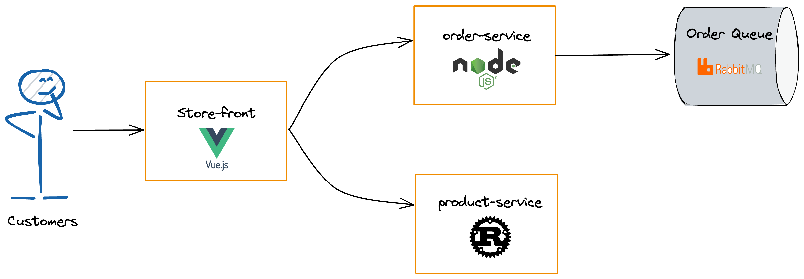
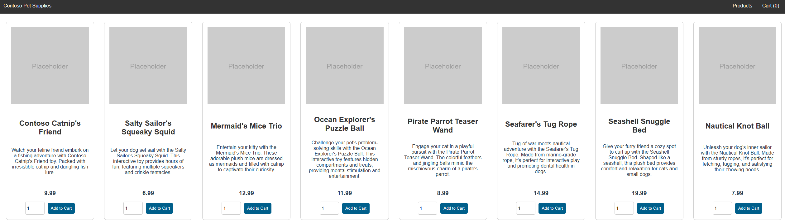

# Getting started with Kubernetes on AKS with Pulumi - YAML edition

## Prerequisites

This workshop assumes a basic understanding of Kubernetes concepts. For more information, see [Kubernetes core concepts
for Azure Kubernetes Service (AKS)](https://learn.microsoft.com/en-us/azure/aks/concepts-clusters-workloads).

- If you don't have an Azure subscription, create an Azure free account before you begin.
- Make sure the identity you use to create your cluster has the appropriate minimum permissions. 
- Install the [Azure CLI](https://docs.microsoft.com/en-us/cli/azure/install-azure-cli).
- Install the [Pulumi CLI](https://www.pulumi.com/docs/get-started/install/).

## Overview

In this workshop, we will create a Kubernetes cluster on Azure Kubernetes Service (AKS) using Pulumi. We will use
Pulumi's YAML configuration to define the infrastructure and deploy it to Azure. Afterward, we will deploy a sample
multi-container application with a group of microservices and web front ends simulating a retail scenario.

> **Note:** Before deploying a production-ready cluster, we recommend that you
> familiarize yourself with the
>
Azure [baseline reference architecture](https://learn.microsoft.com/en-us/azure/architecture/reference-architectures/containers/aks/baseline-aks?toc=/azure/aks/toc.json&bc=/azure/aks/breadcrumb/toc.json)
> to consider how it aligns with your business
> requirements.

## Instructions

### Step 1: Authenticate to Azure

In this workshop, we will use the Azure CLI to authenticate to Azure. Run the following command to log in:

```shell
az login
A web browser has been opened at https://login.microsoftonline.com/organizations/oauth2/v2.0/authorize. Please continue the login in the web browser. If no web browser is available or if the web browser fails to open, use device code flow with `az login --use-device-code`
```

Do as instructed to log in. After completed, `az login` will return and you are ready to go.

The Azure CLI, and thus Pulumi, will use the Default Subscription by default. You can override the subscription by
setting your subscription ID to the id output from az account list’s output:

```shell
az account list
```

Pick out the <id> from the list and run:

```shell
az account set --subscription=<id>
```

### Step 2 - Configure the Pulumi CLI

> If you run Pulumi for the first time, you will be asked to log in. Follow the instructions on the screen to
> login. You may need to create an account first, don't worry it is free.

To initialize a new Pulumi project, run `pulumi new` and select from all the available templates the `yaml`.

```bash
pulumi new yaml
```

> **Note**: If you run this command in an existing directory, you may need to pass the `--force` flag to
> the `pulumi new` command.

You will be guided through a wizard to create a new Pulumi project. You can use the following values:

```shell
pulumi new yaml --force
This command will walk you through creating a new Pulumi project.

Enter a value or leave blank to accept the (default), and press <ENTER>.
Press ^C at any time to quit.

project name (az-getting-started-aks-yaml):
project description (A minimal Pulumi YAML program):  
Created project 'az-getting-started-aks-yaml'

Please enter your desired stack name.
To create a stack in an organization, use the format <org-name>/<stack-name> (e.g. `acmecorp/dev`).
stack name (dev):  
Created stack 'getting-started-kubernetes-aks-20240326/dev'

Your new project is ready to go! ✨

To perform an initial deployment, run `pulumi up`
```

### Step 3 - Define the AKS Cluster

Before we start to define the AKS cluster, we need to set the Azure region where the cluster will be deployed. We will
use the `pulumi config` command to set the region.

```shell
pulumi config set azure-native:location westeurope
```

I am based in Europe, so I chose `westeurope` as the region. You can choose any region that is available in Azure.

You should now have a `Pulumi.dev.yaml` file in your project directory. Open it and it should look like this:

```yaml
config:
  azure-native:location: westeurope
```

> **Note**: Doing this in the stack configuration will give you the flexibility to deploy the same infrastructure code
> for different environments, like dev, test, and production and have different regions for each environment.

Perfect! Now we can define the AKS cluster. We will use the `azure-native` provider to define the AKS cluster. First, we
need to define the resource group where the cluster will be deployed. Add the following to the `Pulumi.yaml` file:

> **Note**: As we used the `yaml` template, there is already some boilerplate code in the `Pulumi.yaml` file. You can
> safely remove it beginning from the `config` section (Should be line 4).

```yaml
name: az-getting-started-aks-yaml
runtime: yaml
description: A minimal Pulumi YAML program

resources:
  myAKSClusterResourceGroup:
    type: azure-native:resources:ResourceGroup
    properties:
      resourceGroupName: my-aks-cluster-rg
```

Go ahead and run `pulumi up` to create the resource group.

```shell
pulumi up
```

You will be prompted to confirm the changes. Type `yes` and press `Enter`.

Depending on your internet connection, the process may take a few minutes. Once the process is complete, you should see
a message similar to the following.

```shell
➜ pulumi up     
Updating (dev)

View in Browser (Ctrl+O): https://app.pulumi.com/dirien/az-getting-started-aks-yaml/dev/updates/1

     Type                                     Name                             Status              
 +   pulumi:pulumi:Stack                      az-getting-started-aks-yaml-dev  created (0.94s)     
 +   └─ azure-native:resources:ResourceGroup  myAKSClusterResourceGroup        created (0.88s)     

Resources:
    + 2 created

Duration: 14s
```

> **Note**: If you get an errors regarding the Azure provider, you may need to install the provider. You can do this by
> running `pulumi plugin install resource azure-native`.

This is great! We have created the resource group. Now let's define the AKS cluster.

```yaml
name: az-getting-started-aks-yaml
runtime: yaml
description: A minimal Pulumi YAML program

resources:
  myAKSClusterResourceGroup:
    type: azure-native:resources:ResourceGroup
    properties:
      resourceGroupName: my-aks-cluster-rg
  myAKSCluster:
    type: azure-native:containerservice/v20240102preview:ManagedCluster
    properties:
      kubernetesVersion: 1.29.0
      resourceGroupName: ${myAKSClusterResourceGroup.name}
      resourceName: my-aks-cluster
      nodeResourceGroup: ${myAKSClusterResourceGroup.name}-nodes
      dnsPrefix: ${myAKSClusterResourceGroup.name}
      networkProfile:
        networkDataplane: cilium
        networkPlugin: azure
        networkPluginMode: overlay
        networkPolicy: cilium
        podCidr: 192.168.0.0/16
      servicePrincipalProfile:
      identity:
        type: SystemAssigned
      agentPoolProfiles:
      - name: agentpool
        count: 3
        vmSize: Standard_B2ms
        osType: Linux
        osDiskSizeGB: 30
        type: VirtualMachineScaleSets
        mode: System 
```

Run `pulumi up` to create the AKS cluster.

```shell
pulumi up
```

You will be prompted to confirm the changes. Type `yes` and press `Enter`.

It takes a few minutes to create the AKS cluster. Wait for the cluster successfully deploy before you move on to the
next step.

### Step 4 - Deploy the Application

Now that we have the AKS cluster up and running, we can deploy the application. We will deploy a sample multi-container

First, we need to retrieve the kubeconfig for the AKS cluster so tht we can create the Pulumi Kubernetes provider to
deploy the application.

Create a new tag called `variables` in the `Pulumi.yaml` file and add the following.

```yaml
name: az-getting-started-aks-yaml
runtime: yaml
description: A minimal Pulumi YAML program

variables:
  kubeconfig:
    fn::invoke:
      function: azure-native:containerservice/v20240102preview:listManagedClusterUserCredentials
      arguments:
        resourceGroupName: ${myAKSClusterResourceGroup.name}
        resourceName: ${myAKSCluster.name}

resources:
# omitted for brevity
```

This will call the `listManagedClusterUserCredentials` function from the `azure-native` provider to retrieve the
kubeconfig for the AKS cluster.

Next, we will create the Kubernetes provider and deploy the application. Add the following to the `Pulumi.yaml` file.

```yaml
name: az-getting-started-aks-yaml
runtime: yaml
description: A minimal Pulumi YAML program

variables:
  kubeconfig:
    fn::invoke:
      function: azure-native:containerservice/v20240102preview:listManagedClusterUserCredentials
      arguments:
        resourceGroupName: ${myAKSClusterResourceGroup.name}
        resourceName: ${myAKSCluster.name}

resources: # other resources 
  # omitted for brevity
  myk8sProvider:
    type: pulumi:providers:kubernetes
    properties:
      kubeconfig:
        fn::fromBase64: ${kubeconfig.kubeconfigs[0].value}
      enableServerSideApply: true
```

To deploy the application, we are going to define all Kubernetes objects using the Pulumi Kubernetes provider required
to run the [AKS Store application](https://github.com/Azure-Samples/aks-store-demo).

The Pulumi Kubernetes objects includes the following Kubernetes deployments and services:



* Store front: Web application for customers to view products and place orders.
* Product service: Shows product information.
* Order service: Places orders.
* Rabbit MQ: Message queue for an order queue.

Add the following to the `Pulumi.yaml` file.

```yaml
# omitted for brevity

resources: # omitted for brevity
  myk8sProvider:
    type: pulumi:providers:kubernetes
    properties:
      kubeconfig:
        fn::fromBase64: ${kubeconfig.kubeconfigs[0].value}
      enableServerSideApply: true

  rabbitmqDeployment:
    type: kubernetes:apps/v1:Deployment
    options:
      provider: ${myk8sProvider}
    properties:
      metadata:
        name: rabbitmq
      spec:
        replicas: 1
        selector:
          matchLabels: {app: rabbitmq}
        template:
          metadata: {labels: {app: rabbitmq}}
          spec:
            nodeSelector: {"kubernetes.io/os": linux}
            volumes:
            - name: rabbitmq-enabled-plugins
              configMap:
                name: rabbitmq-enabled-plugins
                items:
                - key: rabbitmq_enabled_plugins
                  path: enabled_plugins
            containers:
            - name: rabbitmq
              image: mcr.microsoft.com/mirror/docker/library/rabbitmq:3.10-management-alpine
              ports:
              - name: rabbitmq-amqp
                containerPort: 5672
              - name: rabbitmq-http
                containerPort: 15672
              env:
              - name: RABBITMQ_DEFAULT_USER
                value: "username"
              - name: RABBITMQ_DEFAULT_PASS
                value: "password"
              resources:
                requests:
                  cpu: 10m
                  memory: 128Mi
                limits:
                  cpu: 250m
                  memory: 256Mi
              volumeMounts:
              - name: rabbitmq-enabled-plugins
                mountPath: /etc/rabbitmq/enabled_plugins
                subPath: enabled_plugins
  rabbitmqConfigMap:
    type: kubernetes:core/v1:ConfigMap
    options:
      provider: ${myk8sProvider}
    properties:
      metadata:
        name: rabbitmq-enabled-plugins
      data:
        rabbitmq_enabled_plugins: |
          [rabbitmq_management,rabbitmq_prometheus,rabbitmq_amqp1_0].
  rabbitmqService:
    type: kubernetes:core/v1:Service
    options:
      provider: ${myk8sProvider}
    properties:
      metadata:
        name: rabbitmq
      spec:
        selector: {app: rabbitmq}
        type: ClusterIP
        ports:
        - name: rabbitmq-amqp
          port: 5672
          targetPort: 5672
        - name: rabbitmq-http
          port: 15672
          targetPort: 15672
  orderServiceDeployment:
    type: kubernetes:apps/v1:Deployment
    options:
      provider: ${myk8sProvider}
    properties:
      metadata:
        name: order-service
      spec:
        replicas: 1
        selector:
          matchLabels: {app: order-service}
        template:
          metadata: {labels: {app: order-service}}
          spec:
            nodeSelector: {"kubernetes.io/os": linux}
            initContainers:
            - name: wait-for-rabbitmq
              image: busybox
              command: ['sh', '-c', 'until nc -zv rabbitmq 5672; do echo waiting for rabbitmq; sleep 2; done;']
              resources:
                requests:
                  cpu: 1m
                  memory: 50Mi
                limits:
                  cpu: 75m
                  memory: 128Mi
            containers:
            - name: order-service
              image: ghcr.io/azure-samples/aks-store-demo/order-service:latest
              ports: [{containerPort: 3000}]
              resources:
                requests:
                  cpu: 1m
                  memory: 50Mi
                limits:
                  cpu: 75m
                  memory: 128Mi
              env:
              - name: ORDER_QUEUE_HOSTNAME
                value: "rabbitmq"
              - name: ORDER_QUEUE_PORT
                value: "5672"
              - name: ORDER_QUEUE_USERNAME
                value: "username"
              - name: ORDER_QUEUE_PASSWORD
                value: "password"
              - name: FASTIFY_ADDRESS
                value: "0.0.0.0"
  orderServiceService:
    type: kubernetes:core/v1:Service
    options:
      provider: ${myk8sProvider}
    properties:
      metadata:
        name: order-service
      spec:
        type: ClusterIP
        ports:
        - name: http
          port: 3000
          targetPort: 3000
        selector:
          app: order-service
  productServiceDeployment:
    type: kubernetes:apps/v1:Deployment
    options:
      provider: ${myk8sProvider}
    properties:
      metadata:
        name: product-service
      spec:
        replicas: 1
        selector:
          matchLabels: {app: product-service}
        template:
          metadata: {labels: {app: product-service}}
          spec:
            nodeSelector: {"kubernetes.io/os": linux}
            containers:
            - name: product-service
              image: ghcr.io/azure-samples/aks-store-demo/product-service:latest
              ports: [{containerPort: 3002}]
              resources:
                requests:
                  cpu: 1m
                  memory: 1Mi
                limits:
                  cpu: 1m
                  memory: 7Mi
  productServiceService:
    type: kubernetes:core/v1:Service
    options:
      provider: ${myk8sProvider}
    properties:
      metadata:
        name: product-service
      spec:
        type: ClusterIP
        ports:
        - name: http
          port: 3002
          targetPort: 3002
        selector:
          app: product-service
  frontendDeployment:
    type: kubernetes:apps/v1:Deployment
    options:
      provider: ${myk8sProvider}
    properties:
      metadata:
        name: store-front
      spec:
        replicas: 1
        selector:
          matchLabels: {app: store-front}
        template:
          metadata: {labels: {app: store-front}}
          spec:
            nodeSelector: {"kubernetes.io/os": linux}
            containers:
            - name: store-front
              image: ghcr.io/azure-samples/aks-store-demo/store-front:latest
              ports: [{containerPort: 8080, name: store-front}]
              resources:
                requests:
                  cpu: 1m
                  memory: 200Mi
                limits:
                  cpu: 1000m
                  memory: 512Mi
              env:
              - name: VUE_APP_ORDER_SERVICE_URL
                value: "http://order-service:3000/"
              - name: VUE_APP_PRODUCT_SERVICE_URL
                value: "http://product-service:3002/"
  frontendService:
    type: kubernetes:core/v1:Service
    options:
      provider: ${myk8sProvider}
    properties:
      metadata:
        name: store-front
      spec:
        type: LoadBalancer
        selector: {app: store-front}
        ports:
        - port: 80
          targetPort: 8080

outputs:
  serviceIp: ${frontendService.status.loadBalancer.ingress[0].ip}
```

Run `pulumi up` to deploy the application.

```shell
pulumi up
```

You will be prompted to confirm the changes. Type `yes` and press `Enter`.

At the end of the deployment, you will see the output of the `serviceIp` which is the IP address of the load balancer.

### Step 5 - Access the Application

To access the application, open a web browser and navigate to the IP address of the load balancer. You should see the
AKS Store application.



### Step 6 - Clean Up

To clean up the resources, run `pulumi destroy`.

```shell
pulumi destroy
```

You will be prompted to confirm the deletion. Type `yes` and press `Enter`.

After the resources are deleted, you can remove the stack by running `pulumi stack rm`.

```shell
pulumi stack rm dev

```

You have successfully deployed a Kubernetes cluster on Azure Kubernetes Service (AKS) using Pulumi.
