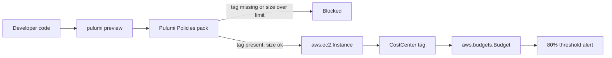

<div class="absolute inset-0 flex flex-col justify-center items-start px-20">
  <h1 class="!text-[5.4rem] !leading-[1.02] !font-semibold !tracking-tight !mb-6 !max-w-[95%]">
    Cost-aware infrastructure as code
  </h1>
  <p class="!mt-1 !text-[2.2rem] text-[var(--p-fg-muted)] !m-0 !leading-relaxed !max-w-[90%]">
    Tagging, budgets and FinOps guardrails with Pulumi
  </p>
  <p class="!mt-8 !text-[1.6rem] text-[var(--p-fg-muted)] !m-0 !leading-relaxed">
    TODO(presenter) · Role, Pulumi
  </p>
</div>

<!-- (1 min) Welcome the room. One line: this workshop turns three cost controls -- a budget, a tag, and a size limit -- into code that runs before anything touches the cloud bill. -->

---

<div class="absolute inset-0 flex items-center px-24 gap-20">
  <div class="flex-shrink-0">
    
  </div>
  <div class="flex-1">
    <h1 class="!text-[7rem] !leading-[1.02] !font-semibold !tracking-tight !mb-4 !text-[var(--p-primary)]">Speaker Name</h1>
    <p class="!text-[2.2rem] !leading-relaxed !m-0 opacity-90">
      Role at <strong class="!text-[var(--p-primary)]">Pulumi</strong>
    </p>
    <div class="!mt-8 flex items-center gap-8 !text-[1.5rem] opacity-70">
      <span class="flex items-center gap-2"><carbon-logo-x /> @handle</span>
      <span class="flex items-center gap-2"><carbon-logo-linkedin /> handle</span>
      <span class="flex items-center gap-2"><carbon-logo-github /> handle</span>
    </div>
    <p class="!mt-10 !text-[1.75rem] !leading-relaxed opacity-70 !m-0">
      Two lines on what this presenter actually does.<br/>
      <!-- TODO(presenter): replace photo, name, role, socials and bio -->
    </p>
  </div>
</div>

<!-- (1 min) Introduce yourself in your own words. Swap the placeholder for your real name, role, and socials before this runs. -->

---
layout: section
---

# Housekeeping and agenda

## Before we get into it

<!-- (1 min) Cover logistics fast so we get to the demo. -->

---

# Housekeeping

<div class="zoom-content">

<ul class="!mt-8 !text-[1.6rem] !leading-relaxed space-y-5">
  <li>Be chatty in the chat tab</li>
  <li>Ask questions in the Q&amp;A tab</li>
  <li>The handouts tab has slides and scripts</li>
  <li>The recording link comes by email</li>
</ul>

</div>

<style scoped>
.zoom-content { zoom: 1.8; }
</style>

<!-- (1 min) Point out chat vs Q&A, mention the handouts tab holds the repo link, and that the recording follows by email. -->

---

# Today's agenda

<div class="zoom-content">

<ul class="!mt-8 !text-[1.6rem] !leading-relaxed space-y-5">
  <li>Why a cloud bill is a code problem</li>
  <li>Budgets, tags, and guardrails as Pulumi code</li>
  <li>How Pulumi Policies blocks a bad deploy</li>
  <li>The demo, five steps</li>
  <li>Teardown and wrap-up</li>
</ul>

</div>

<style scoped>
.zoom-content { zoom: 1.6; }
</style>

<!-- (2 min) Walk the agenda in one breath. Set the expectation: five demo folders, each proving one thing. -->

---
layout: statement
---

# Someone on your team spun up a `t3.2xlarge` on Friday. Nobody notices until the invoice.

<!-- (5 min) Ask the room: has this happened to you? A console click that nobody reviews, no tag, no size limit, and the bill shows up weeks later with no owner. That's the gap this workshop closes. Make it concrete: a single oversized, untagged instance running unattended for a month is real money with nobody to ask about it. -->

---
layout: two-cols
---

# Tags are a policy, not a habit

Asking engineers to remember a `CostCenter` tag on every resource does not scale past the second team.

- A tag someone forgot to add can't be billed to anyone
- Code review catches typos, not omissions
- By the time finance notices, the resource has been running for weeks

::right::

# The fix has to run before `pulumi up`

Not a dashboard that reports the damage afterward. A check that blocks the deploy.

- Same CLI command, same review step
- No separate tool for engineers to learn
- The rule lives next to the code it governs

<!-- (5 min) The pain isn't the missing tag, it's that nobody catches it until the invoice arrives. A guardrail that runs at review time, not audit time, is the whole point. -->

---

# Untagged today, unbounded tomorrow

A missing `CostCenter` tag and an oversized instance type are the same failure: nobody decided this cost on purpose.

- No tag: this instance's spend can't be attributed to a team or a budget
- No size limit: a typo in `instanceType` becomes a five-figure surprise
- Both pass a normal `pulumi up` today, because nothing is checking

<!-- (4 min) Two failure modes, one root cause: cost decisions made by accident. Set up that the fix for both is the same mechanism. -->

---

# Pulumi Policies enforces both, before deploy

Pulumi Policies is Pulumi's policy-as-code product. A **policy pack** is a versioned bundle of rules you pass to the CLI with `--policy-pack`.

- **Preventative** policy groups run at `pulumi preview` and `pulumi up`, and can block the deployment
- **Audit** policy groups check existing resources and report, without blocking
- This workshop uses preventative, mandatory policies for both the tag and the size rule

<!-- (6 min) Name the product correctly: Pulumi Policies, not CrossGuard -- that name was retired years ago. Preventative vs. audit is the distinction that matters: we want a hard stop, not a report next week. -->

---
layout: diagram-left
---

# Where each check runs

The budget sets the ceiling. The tag says whose ceiling it is. The size guardrail keeps a single resource from blowing through it alone.

- `aws.budgets.Budget`: the monthly limit and an 80% alert
- `CostCenter` tag: attributes spend to a team
- Size guardrail: caps any one instance's blast radius

::diagram::



<!-- (8 min) Walk the diagram left to right: code goes through preview, the policy pack checks it, and only a tagged, correctly-sized instance reaches the account, where the tag lets its cost roll up into the budget's alert. This is the map for the whole demo that follows. -->

---
layout: section
---

# The demo

## Five folders, one flow: budget, then an untagged instance, then the policy that catches it, then the fix, then a second guardrail

<!-- (1 min) Frame the demo as five short stops, each numbered folder building on the last. -->

---
layout: code
---

# Step 1: the budget, as code

```bash
cd 01-budget
pulumi stack init dev
pulumi config set alertEmail <your-confirmable-email>
pulumi up
```

`aws.budgets.Budget`: monthly limit, 80%-of-limit alert.

<!-- (6 min) This is an aws.budgets.Budget resource: budgetType COST, timeUnit MONTHLY, an 80% threshold that emails a subscriber. It's the ceiling everything else in this demo respects. Say plainly: pulumi up here was not run against live AWS in this pipeline run -- no credentials on the build machine -- so this step was verified with a compile check and a credential-less pulumi preview, not a real deploy. If asked, that's the honest answer. -->

---
layout: code
---

# Step 2: an untagged instance ships clean

```bash
cd 02-untagged-instance
pulumi stack init dev
pulumi config set amiId <ami-id-for-us-east-1>
pulumi up
```

No `CostCenter` tag. No policy pack yet. It deploys without complaint.

<!-- (6 min) This is the "before" picture: an EC2 instance with no cost-allocation tag, and pulumi up succeeds because nothing is enforcing the tag yet. That's the gap. Same caveat as step 1: not run against live AWS here, verified with py_compile and a credential-less preview. -->

---
layout: code
---

# Step 3: the tagging policy catches it

```bash
pulumi preview --policy-pack ../03-tagging-policy
```

> EC2 instance 'demo-instance-untagged' is missing the required 'CostCenter' tag. Add it so the cost this instance drives can be attributed to a budget.

<!-- (8 min) Run this from inside 02-untagged-instance. The policy pack is a ResourceValidationPolicy in Python: a mandatory rule that requires the CostCenter tag on every aws.ec2.Instance. Its logic was verified offline with python -m unittest test_policy.py -- three tests, missing-tag and present-tag cases, all passing. Be straight with the room: running this preview command against a real, deployed instance without live AWS credentials produces a false negative here, because the AWS provider fails to authenticate before the instance ever registers, so the policy never actually evaluates it. The unit tests are the real proof the rule works; the live preview needs a real AWS account to demonstrate end to end. -->

---
layout: code
---

# Step 4: fix the tag, it passes

```bash
cd 04-tagged-instance
pulumi config set amiId <ami-id-for-us-east-1>
pulumi preview --policy-pack ../03-tagging-policy
pulumi up
```

Same instance, `CostCenter` tag added. The preview is clean.

<!-- (6 min) Same instance shape as step 2, with the tag added and instanceType exposed as config -- this folder also carries step 5's demo. Same live-AWS caveat as before: this was verified with py_compile and an offline preview, not a real deploy. -->

---
layout: code
---

# Step 5: the size guardrail catches a second problem

```bash
pulumi config set instanceType t3.2xlarge
pulumi preview --policy-pack ../05-size-guardrail
pulumi config set instanceType t3.micro
pulumi preview --policy-pack ../05-size-guardrail
```

> EC2 instance 'demo-instance-tagged' requests instance type 't3.2xlarge', which exceeds this workshop's size guardrail. Allowed types: t3.large, t3.medium, t3.micro, t3.nano, t3.small.

<!-- (8 min) A correctly tagged instance can still be too big. This policy pack carries the same tagging rule plus a second, independent rule: reject any instance type not in a small allow-list. Bump it to t3.2xlarge and the size rule blocks it; drop it back to t3.micro and the preview is clean again. Verified offline the same way as step 3 -- python -m unittest test_policy.py, five tests covering both rules -- and the same false-negative caveat applies to any preview run without live AWS credentials. -->

---

# What we actually verified

<div class="zoom-content">

<ul class="!mt-8 !text-[1.5rem] !leading-relaxed space-y-4">
  <li><strong>Verified:</strong> both policy packs' rule logic, with offline unit tests</li>
  <li><strong>Verified:</strong> every program compiles (<code>py_compile</code>)</li>
  <li><strong>Not verified here:</strong> a real <code>pulumi up</code> against live AWS</li>
  <li><strong>Not verified here:</strong> the budget's 80% alert actually firing</li>
</ul>

</div>

<style scoped>
.zoom-content { zoom: 1.4; }
</style>

<!-- (6 min) Say this out loud if nobody asks: this build machine had no AWS credentials, so pulumi up and any live policy enforcement were never run against a real account in this pipeline. The unit tests are real and passing; the live deploy is the presenter's job to run once, ahead of time, with a real AWS account, to confirm the full path end to end. -->

---
layout: two-cols
---

# Teardown

```bash
cd 04-tagged-instance && pulumi destroy && cd ..
cd 02-untagged-instance && pulumi destroy && cd ..
cd 01-budget && pulumi destroy && cd ..
```

Budget last: nothing else depends on it.

::right::

# One thing to remember

AWS Budgets has no soft delete. `pulumi destroy` on `01-budget` is the only way to remove it. Confirm it's gone in the console.

<!-- (4 min) Reverse order of creation, budget last since it has no dependents. Flag the AWS Budgets quirk: there's no trash can to recover from, and this removal hasn't been checked against a live account in this pipeline, so verify it yourself the first time you run this. -->

---
layout: statement
---

# One budget, one tag, one size limit. All three checked before the bill exists.

<!-- (4 min) Recap: a spending ceiling as code, a mandatory tag that ties spend to a team, and a guardrail that stops one resource from blowing past its size. None of it depends on someone remembering to look. -->

---

# Keep going

<div class="zoom-content">

<div class="grid grid-cols-3 gap-6 mt-6">
  <div class="res-card">
    <div class="res-card__qr"><QRCode data="https://slack.pulumi.com" dark="#000000" /></div>
    <div class="res-card__title">Pulumi Community Slack</div>
    <div class="res-card__body">slack.pulumi.com</div>
  </div>
  <div class="res-card">
    <div class="res-card__qr"><QRCode data="https://app.pulumi.com/signup" dark="#000000" /></div>
    <div class="res-card__title">Pulumi Cloud, free tier</div>
    <div class="res-card__body">app.pulumi.com/signup</div>
  </div>
  <div class="res-card">
    <div class="res-card__qr"><QRCode data="https://github.com/pulumi/workshops" dark="#000000" /></div>
    <div class="res-card__title">Workshop repo</div>
    <div class="res-card__body">github.com/pulumi/workshops</div>
  </div>
</div>

</div>

<style scoped>
.zoom-content { zoom: 1.3; }
.res-card { display: flex; flex-direction: column; align-items: center; text-align: center; gap: 0.4rem; }
.res-card__qr { width: 9rem; height: 9rem; background: #ffffff; padding: 0.45rem; border-radius: 10px; box-shadow: 0 10px 24px rgba(0, 0, 0, 0.18); }
.res-card__title { font-size: 1.15rem; font-weight: 600; color: var(--p-fg); margin-top: 0.4rem; }
.res-card__body { font-family: var(--slidev-font-mono); font-size: 0.9rem; color: var(--p-fg-muted); }
</style>

<!-- (4 min) Slack for questions after today, Pulumi Cloud's free tier to run this yourself, and the workshops repo. This folder is still on its own branch, not yet on main, so the QR points at the repo root -- search for cost-aware-iac-finops-guardrails once it lands. -->

---
layout: end
---

<div class="absolute inset-0 flex flex-col justify-center items-center px-16">
  <div class="thanks__kicker">Thank you</div>
  <h1 class="!text-[4.5rem] !leading-[1.02] !font-semibold !tracking-tight !mt-3 !mb-12 text-center">Questions?</h1>
  <div class="thanks">
    <div class="thanks__person">
      
      <div class="thanks__name">Speaker Name</div>
      <div class="thanks__org">Pulumi</div>
      <!-- TODO(presenter): replace photo, name, and handles -->
      <div class="thanks__handles">
        <span><carbon-logo-github />handle</span>
      </div>
    </div>
    <div class="thanks__person">
      <div class="thanks__avatar thanks__avatar--icon"><carbon-logo-github /></div>
      <div class="thanks__name">Workshop repo</div>
      <div class="thanks__org">slides · demo code</div>
      <div class="thanks__handles">
        <span>pulumi/workshops</span>
      </div>
      <div class="thanks__qr"><QRCode data="https://github.com/pulumi/workshops" dark="#000000" /></div>
      <div class="thanks__qr-label">pulumi/workshops</div>
    </div>
  </div>
</div>

<style scoped>
.thanks__kicker { font-family: var(--slidev-font-mono); font-size: 1.15rem; font-weight: 700; letter-spacing: 0.6em; text-transform: uppercase; color: var(--p-fg-muted); }
.thanks { display: grid; grid-template-columns: repeat(2, 1fr); gap: 2.5rem; justify-items: center; }
.thanks__person { display: flex; flex-direction: column; align-items: center; text-align: center; height: 100%; }
.thanks__avatar { width: 7rem; height: 7rem; border-radius: 9999px; object-fit: cover; border: 3px solid color-mix(in srgb, var(--p-primary) 45%, transparent); }
.thanks__avatar--icon { display: flex; align-items: center; justify-content: center; font-size: 3.6rem; color: var(--p-fg); background: var(--p-bg-elevated); }
.thanks__name { margin-top: 0.9rem; font-size: 1.45rem; font-weight: 700; color: var(--p-fg); }
.thanks__org { font-size: 1.1rem; color: var(--p-fg-muted); }
.thanks__handles { display: flex; flex-direction: column; align-items: center; justify-content: flex-start; gap: 0.15rem; margin-top: 0.5rem; min-height: 3rem; font-size: 1rem; color: var(--p-fg-muted); }
.thanks__handles span { display: inline-flex; align-items: center; gap: 0.35rem; }
.thanks__qr { width: 8rem; height: 8rem; margin-top: 1.1rem; padding: 0.45rem; background: #ffffff; border-radius: 10px; box-shadow: 0 10px 24px rgba(0, 0, 0, 0.18); }
.thanks__qr-label { display: inline-flex; align-items: center; gap: 0.35rem; margin-top: 0.55rem; font-family: var(--slidev-font-mono); font-size: 0.85rem; color: var(--p-fg-muted); }
</style>

<!-- (3 min) Open it up for questions. Repeat the repo name for anyone who wants to find it once it's merged. -->
