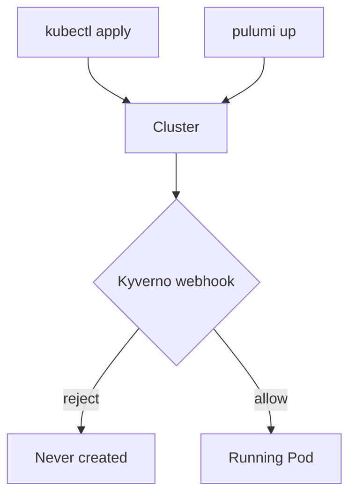
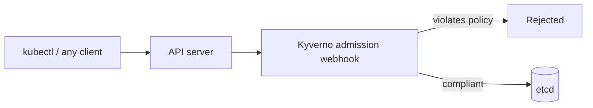
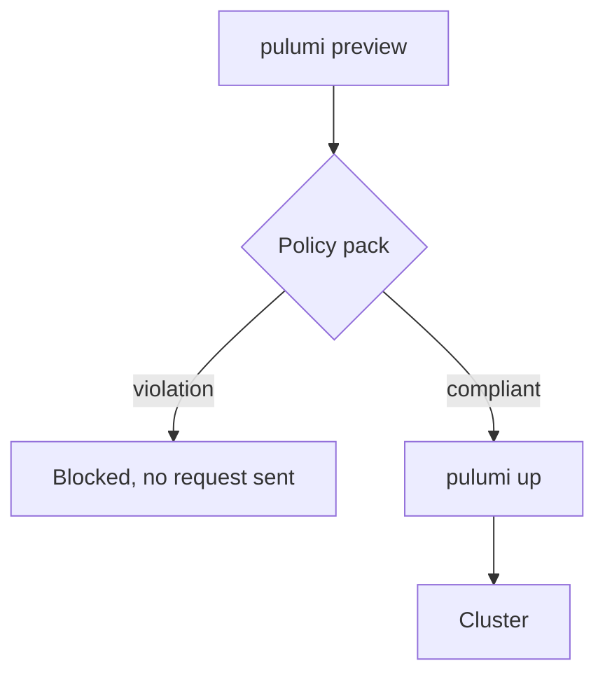

# Defense in depth as code

## Kyverno admission control and Pulumi Policies

Speaker Name · Role, Pulumi

<!-- 1 min. Title only. Say the workshop name once, let it sit, move on. -->

---
layout: image-left
image: /img/speaker-placeholder.png
---

# Speaker Name

Role at **Pulumi**

@handle · linkedin.com/in/handle · github.com/handle

Two lines on what they actually do, replaced before delivery.

<!-- TODO(presenter): replace photo, name, role, socials and bio -->

<!-- 1 min. Read your own bio in one breath, then move on. -->

---

# Before we start

- Questions in the chat tab, any time
- Save the harder ones for the Q&A tab
- Slides and scripts are in the handouts tab
- Recording goes out by email afterward

<!-- 1 min. Point at each tab as you name it. -->

---

# Agenda

- Two layers, one policy
- Admission control with Kyverno
- Policy as code with Pulumi Policies
- Live demo: blocked at the cluster, blocked at the pipeline
- Which layer catches what

<!-- 2 min. Read the shape of the next 90 minutes, don't explain any of it yet. -->

---

# Follow along

- A laptop with Docker running: ~4 vCPU, 6 GB RAM free
- Node.js LTS and the Pulumi CLI installed
- `kubectl` and `kind` on your PATH
- Clone `pulumi/workshops`, folder `defense-in-depth-kyverno-pulumi-policies`

<!-- 3 min. Give people a minute to actually check Docker's resource settings; this is the most common thing that goes wrong before anyone types a command. -->

---
layout: diagram-left
---

# Why one policy needs two layers

A Pod can reach a cluster two ways: through `kubectl`, or through a Pulumi
program. A rule enforced only in the cluster misses the second path until
the resource already exists.

::diagram::



<!-- 8 min. Four sources back this: Falco on EKS runtime security, the OPA intro deep dive at KubeCon EU 2026, cert-manager's zero-trust piece from Red Hat, and Unit 42's SPIFFE/SPIRE identity research. None of them argue for one layer over the other — they're all describing pieces of the same defense-in-depth stack. Name that this workshop only covers two of those pieces: admission control and policy-as-code, not identity or runtime detection. -->

---
layout: statement
---

# A Pod with no resource limits is one bad night on call.

<!-- 3 min. This is the incident, not a hypothetical: an unbounded container that gets scheduled next to something critical, no cap on its memory, and it takes the node down with it. That's the entire justification for every rule this workshop enforces. -->

---
layout: diagram-right
---

# Layer one: admission control

Kyverno sits in front of the Kubernetes API server as a validating webhook.
Every `kubectl apply` and every Pulumi-created resource passes through it —
this is the layer that catches requests Pulumi never made.

- Runs inside the cluster, evaluates every write
- Written as a `ClusterPolicy`, not general-purpose code
- Blind to anything that isn't already a request against the API

::diagram::



<!-- 9 min. The honest limit here: admission control only sees things once they're already a request. It cannot stop a Pulumi program from ever proposing the resource — that's what layer two is for. Also flag the deprecation: ClusterPolicy and validationFailureAction are both marked deprecated in Kyverno's own docs in favor of CEL-based ValidatingPolicy and per-rule failureAction, but they're what the demo uses today and what Kyverno's sample library still ships. -->

---
layout: section
---

# Demo

## A cluster that rejects, a pipeline that never asks

<!-- 1 min. Section divider. Say what's about to happen: build the cluster, install Kyverno, watch it reject a bad Pod, then move the same rule into the Pulumi pipeline. -->

---
layout: code
---

# Step 1–3: install Kyverno as Pulumi code

```ts
const kyverno = new k8s.helm.v4.Chart(
  "kyverno",
  {
    namespace: namespace.metadata.name,
    chart: "kyverno",
    version: "3.9.1",
    repositoryOpts: { repo: "https://kyverno.github.io/kyverno/" },
  },
  { provider, dependsOn: [namespace] },
);
```

```bash
01-cluster/preflight.sh && 01-cluster/create-cluster.sh
cd 02-kyverno && npm install
pulumi stack init dev && pulumi preview && pulumi up
kubectl --context kind-policy-demo get pods -n kyverno
```

<!-- 8 min. This is 02-kyverno: a Helm chart installed through the Pulumi Kubernetes provider, pinned to chart version 3.9.1 (artifacthub.io, read 2026-09-25). crds.install defaults to true on this chart, so the ClusterPolicy CRD the next step needs comes along for free. Watch the admission-controller pods come Ready in the kubectl output — that's the thing the next step waits on. -->

---
layout: code
---

# Step 4: the rule, as a ClusterPolicy

```ts
const clusterPolicy = new k8s.apiextensions.CustomResource(
  "require-resource-limits",
  {
    apiVersion: "kyverno.io/v1",
    kind: "ClusterPolicy",
    spec: {
      rules: [{
        name: "validate-resources",
        match: { any: [{ resources: { kinds: ["Pod"] } }] },
        validate: {
          failureAction: "Enforce",
          pattern: { spec: { containers: [
            { resources: { limits: { cpu: "?*", memory: "?*" } } },
          ] } },
        },
      }],
    },
  },
  { provider },
);
```

```bash
cd 03-cluster-policy && npm install
pulumi stack init dev
./wait-for-kyverno.sh && pulumi up
kubectl --context kind-policy-demo get clusterpolicy
```

<!-- 8 min. This is its own Pulumi project, separate from 02-kyverno, so it can't dependsOn the Helm chart directly — wait-for-kyverno.sh solves the same ordering problem `kubectl wait` would solve by hand: the webhook Deployment can report Ready to the API server a few seconds before it's actually registered. Skip that wait and this apply can race the webhook. Point out failureAction: Enforce is the current per-rule syntax; the old top-level validationFailureAction still works but is deprecated. -->

---
layout: code
---

# Step 5: reject it at the cluster

```yaml
apiVersion: v1
kind: Pod
metadata:
  name: unsafe-pod
spec:
  containers:
    - name: app
      image: nginx:1.27
      # no resources.limits
```

```bash
04-admission-denied/try-apply.sh
```

<!-- 7 min. Run it live. The script's own exit code isn't the point — it's expected to be non-zero — read the printed Kyverno admission error naming require-resource-limits. This Pod was never a Pulumi resource; it's a plain kubectl apply, which is exactly the case layer one exists for and layer two cannot reach. -->

---
layout: diagram-left
---

# Layer two: the pipeline itself

The same rule, checked before Pulumi ever proposes creating the resource —
not after the API server sees it.

::diagram::



<!-- 7 min. This is where "which layer should catch this" gets a real answer: a policy pack blocks the developer's own workstation before anything reaches the network. It also runs in CI, against a preview, with no cluster required. That's the case a cluster-side webhook can't touch: nobody has to apply anything for the check to run. -->

---
layout: code
---

# Step 6: the same rule, as a Pulumi Policy

```ts
new PolicyPack("require-resource-limits", {
  policies: [{
    name: "containers-must-set-resource-limits",
    enforcementLevel: "mandatory",
    validateResource: validateResourceOfType(
      kubernetes.core.v1.Pod,
      (pod, _args, reportViolation) => {
        const offenders = missingResourceLimits(
          pod.spec?.containers ?? [],
        );
        for (const name of offenders) {
          reportViolation(`Container "${name}" is missing limits.`);
        }
      },
    ),
  }],
});
```

<!-- 8 min. This is 05-pipeline-policy/policy-pack/index.ts. The check itself lives in rules.ts as a plain function, missingResourceLimits, so it's unit-testable without Pulumi Cloud — see test/rules-test.ts. Same violation, same wording, as the ClusterPolicy two slides back; that's deliberate, one rule expressed twice. -->

---
layout: code
---

# Step 6 continued: blocked before it exists

```ts
const pod = new k8s.core.v1.Pod("unsafe-workload", {
  metadata: { name: "unsafe-workload" },
  spec: {
    containers: [{ name: "app", image: "nginx:1.27" }],
    // no resources.limits
  },
}, { provider });
```

```bash
cd 05-pipeline-policy/policy-pack && npm install
cd ../workload && npm install
pulumi stack init dev
pulumi preview --policy-pack ../policy-pack
```

<!-- 7 min. Run the preview live and read the mandatory violation in the output. Nothing was created, nothing was even proposed to the cluster — this failed on the laptop running the preview. Compare this output side by side with the admission error from three slides ago; they're reporting the same violation from two different places. -->

---
layout: two-cols
---

::header::

# What each layer catches

::left::

**Kyverno (admission)**

- Runs inside the cluster
- Sees every request, any client
- Cannot stop a bad program from existing

::right::

**Pulumi Policies (pipeline)**

- Only Pulumi-managed resources
- Checked before `pulumi up` runs
- No cluster required to check it

<!-- 5 min. The honest answer to "which layer should catch this" is both, for different reasons: Kyverno is the backstop that sees traffic it doesn't control the source of; Pulumi Policies is the earlier, cheaper catch for anything that goes through your own pipeline. Neither replaces the other. -->

---

# What you can do now

- Write a Kyverno `ClusterPolicy` for a real constraint your cluster needs
- Add a Pulumi Policy Pack to a pipeline you already run
- Decide, for your next rule, which layer actually needs to see it
- Read Kyverno's docs on the CEL-based policy kinds before you build on `ClusterPolicy`
- Treat "which layer catches this" as a design question, not an afterthought

<!-- 3 min. This is the five learning outcomes from the brief, read as a recap rather than a new list — nothing here should be new by this point in the talk. -->

---
layout: code
---

# Cleanup and where to go next

```bash
./teardown.sh
```

- Pulumi Policies docs: pulumi.com/docs/using-pulumi/crossguard
- Kyverno policy library: kyverno.io/policies
- The demo repo has an `AGENTS.md` in every numbered folder

<!-- 4 min. teardown.sh tears down the kind cluster and any stack state left behind; run it before closing the laptop lid, not after. Point at the per-folder AGENTS.md files as the place with more context than the slides had room for. -->

---

# Keep going

<div class="grid grid-cols-3 gap-8 mt-8">
<div class="text-center">
<div class="w-32 h-32 mx-auto"><QRCode data="https://slack.pulumi.com" /></div>
<p class="mt-2">Pulumi Community Slack</p>
</div>
<div class="text-center">
<div class="w-32 h-32 mx-auto"><QRCode data="https://app.pulumi.com/signup" /></div>
<p class="mt-2">Pulumi Cloud, free tier</p>
</div>
<div class="text-center">
<div class="w-32 h-32 mx-auto"><QRCode data="https://github.com/pulumi/workshops/tree/anvil/defense-in-depth-kyverno-pulumi-policies/defense-in-depth-kyverno-pulumi-policies" /></div>
<p class="mt-2">Workshop repo</p>
</div>
</div>

<!-- 2 min. The repo QR points at the branch tree for now; it becomes the main-branch URL once this merges — say so if anyone asks. -->

---
layout: end
---

# Thank you.

<div class="grid grid-cols-2 gap-8 mt-8">
<div class="text-center">
<div class="w-32 h-32 mx-auto"></div>
<p class="mt-2">Speaker Name</p>
<!-- TODO(presenter): swap in a real handle QR once socials are known -->
</div>
<div class="text-center">
<div class="w-32 h-32 mx-auto"><QRCode data="https://github.com/pulumi/workshops/tree/anvil/defense-in-depth-kyverno-pulumi-policies/defense-in-depth-kyverno-pulumi-policies" dark="#000000" /></div>
<p class="mt-2">Workshop repo</p>
</div>
</div>

<!-- 2 min. Stays on screen through Q&A; this is the slide people photograph, so it carries the links. -->
