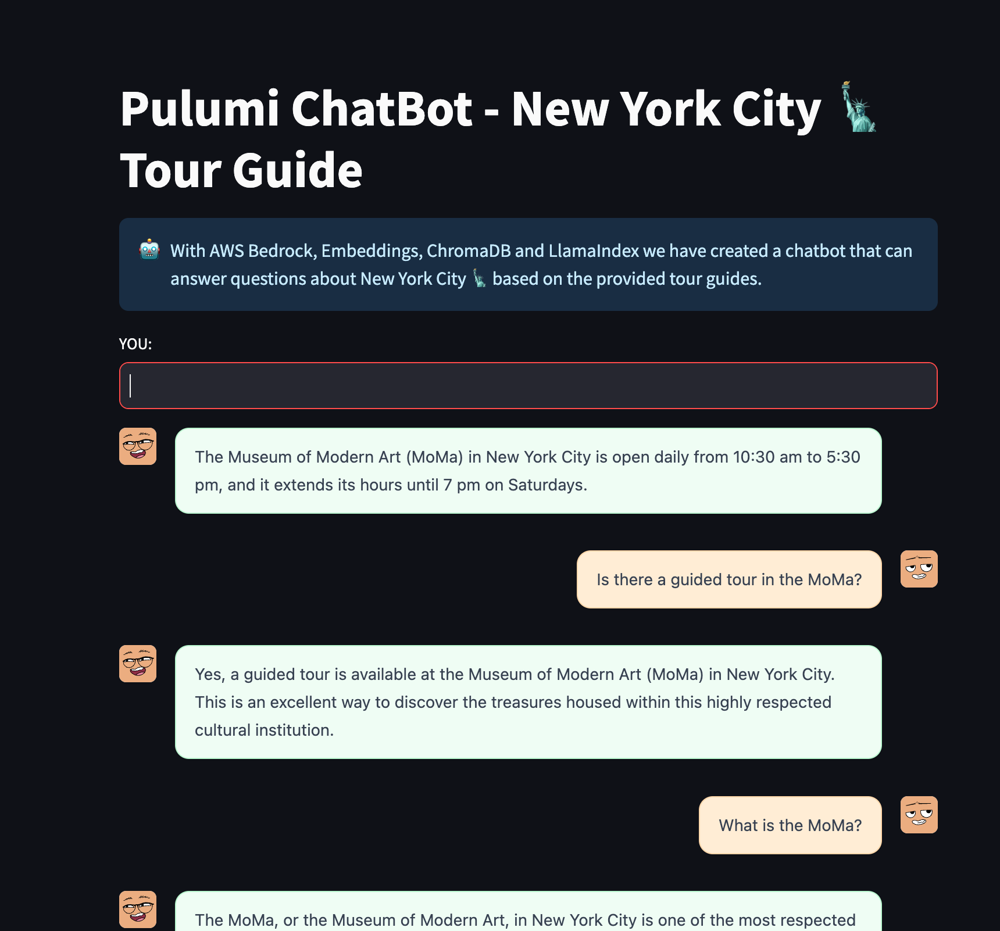

# Deploying LlamaIndex Applications on AWS with Pulumi

This folder contains the code for the workshop "Deploying LlamaIndex Applications on AWS with Pulumi".

## Prerequisites

- If you don't have an AWS account, create one [here](https://aws.amazon.com/).
- Make sure your User has the necessary permissions to create the resources.
- Install the [AWS CLI](https://docs.aws.amazon.com/cli/latest/userguide/getting-started-install.html).
- Install the [Pulumi CLI](https://www.pulumi.com/docs/get-started/install/?utm_source=GitHub&utm_medium=referral&utm_campaign=workshops).

## Instructions

### Step 1: Authenticate with AWS

I use for the AWS CLI with SSO:

```bash
aws sso login
```

### Step 2 - Configure the Pulumi CLI

> If you run Pulumi for the first time, you will be asked to log in. Follow the instructions on the screen to
> login. You may need to create an account first, don't worry it is free.

To initialize a new Pulumi project, run `pulumi new` and select from all the available templates the `yaml`.

> **Note**: If you run this command in an existing directory, you may need to pass the `--force` flag to
> the `pulumi new` command.

You will be guided through a wizard to create a new Pulumi project. You can use the following values:

```shell
pulumi new yaml --force
This command will walk you through creating a new Pulumi project.

Enter a value or leave blank to accept the (default), and press <ENTER>.
Press ^C at any time to quit.

project name (llamanindex):
project description (A minimal Pulumi YAML program):
Created project 'llamanindex'

Please enter your desired stack name.
To create a stack in an organization, use the format <org-name>/<stack-name> (e.g. `acmecorp/dev`).
stack name (dev): dev
Created stack 'dev'

Your new project is ready to go! ✨

To perform an initial deployment, run `pulumi up`
```

### Step 3 - Configure the Pulumi stack

Set the AWS region in the Pulumi stack configuration.

```bash
pulumi config set aws:region <your region>
```

> **Note**: Doing this in the stack configuration will give you the flexibility to deploy the same infrastructure code
> for different environments, like dev, test, and production and have different regions for each environment.

### Step 4 - The LlamaIndex application

> **Note**: Best way to avoid any copy-paste errors is to clone the repository and navigate to the `workshops/deploying-llamaindex-applications-on-aws-with-pulumi` folder.

```bash
git https://github.com/pulumi/workshops.git
cd workshops/deploying-llamaindex-applications-on-aws-with-pulumi
``` 

> **Note**: The application need a folder called `guides` with PDF files in it. You can download the PDF files from the following link:
> [New York City Tour Guides](https://github.com/pulumi/workshops/blob/main/deploying-llamaindex-applications-on-aws-with-pulumi/app/guides/newyork.pdf)
> and place them in the `guides` folder.

Create a new directory for the LlamaIndex application and create a new file called `streamlit_app.py` with the following
content:

```python
from dotenv import load_dotenv
from itertools import zip_longest

import streamlit as st
from st_chat_message import message

from llama_index_client import MessageRole
from llama_index.llms.bedrock import Bedrock
from llama_index.llms.bedrock.utils import ChatMessage
from llama_index.core import VectorStoreIndex, SimpleDirectoryReader
from llama_index.core.settings import Settings
import chromadb
from llama_index.embeddings.bedrock import BedrockEmbedding
from llama_index.core.text_splitter import SentenceSplitter
from llama_index.vector_stores.chroma import ChromaVectorStore
from llama_index.core.storage.storage_context import StorageContext

load_dotenv()


def load_text(path_to_pdfs):
    documents = SimpleDirectoryReader(path_to_pdfs).load_data()
    return documents


def load_embeddings():
    model = BedrockEmbedding(model="amazon.titan-embed-text-v1")
    return model


def load_llm():
    llm = Bedrock(model="mistral.mistral-large-2402-v1:0", region_name="us-east-1")
    return llm


def setting_the_indexing(llm, embed_model):
    Settings.llm = llm
    Settings.embed_model = embed_model
    Settings.node_parser = SentenceSplitter(chunk_size=1024, chunk_overlap=64)
    Settings.num_output = 256
    Settings.context_window = 4096
    Settings.chunk_size = 512
    Settings.chunk_overlap = 64


def setup_vector_database_and_create_vector_index(documents, collection_name):
    db = chromadb.PersistentClient(path="./chroma_db")

    chroma_collection = db.get_or_create_collection(collection_name)

    vector_store = ChromaVectorStore(chroma_collection=chroma_collection)
    storage_context = StorageContext.from_defaults(vector_store=vector_store)

    vector_index = VectorStoreIndex.from_documents(documents=documents,
                                                   storage_context=storage_context
                                                   )

    return vector_index


st.set_page_config(page_title="Pulumi ChatBot - New York City Tour Guide", page_icon="🤖")
st.title("Pulumi ChatBot - New York City 🗽 Tour Guide")
st.info("""
        With AWS Bedrock, Embeddings, ChromaDB and LlamaIndex we have created a chatbot that can answer questions about New York City 🗽 based on the provided tour guides.
        """,
        icon="🤖")

if 'generated' not in st.session_state:
    st.session_state['generated'] = []

if 'past' not in st.session_state:
    st.session_state['past'] = []

if 'entered_prompt' not in st.session_state:
    st.session_state['entered_prompt'] = ""

documents = load_text(path_to_pdfs="./guides/")
llm = load_llm()
embed_model = load_embeddings()
setting_the_indexing(llm=llm, embed_model=embed_model)
vector_index = setup_vector_database_and_create_vector_index(documents=documents,
                                                             collection_name="tour-guides")


def build_message_list():
    zipped_messages = [ChatMessage(
        role=MessageRole.SYSTEM,
        content="""
        You are a knowledgable New York City guide talking with a human. If you do not know an answer, just say 'I don't know', do not make up an answer.
        """)]

    for human_msg, ai_msg in zip_longest(st.session_state['past'], st.session_state['generated']):
        if human_msg is not None:
            zipped_messages.append(ChatMessage(
                role=MessageRole.USER,
                content=human_msg))
        if ai_msg is not None:
            zipped_messages.append(
                ChatMessage(
                    role=MessageRole.ASSISTANT,
                    content=ai_msg))

    return zipped_messages


def generate_response():
    zipped_messages = build_message_list()
    chat_engine = vector_index.as_chat_engine(chat_mode="condense_question")
    ai_response = chat_engine.chat(zipped_messages)
    return ai_response


def submit():
    st.session_state.entered_prompt = st.session_state.prompt_input
    st.session_state.prompt_input = ""


st.text_input('YOU: ', key='prompt_input', on_change=submit)

if st.session_state.entered_prompt != "":
    user_query = st.session_state.entered_prompt
    st.session_state.past.append(user_query)
    output = generate_response()
    st.session_state.generated.append(output.response)

if st.session_state['generated']:
    for i in range(len(st.session_state['generated']) - 1, -1, -1):
        message(st.session_state["generated"][i], key=str(i), avatar_style='adventurer-neutral', seed="Pulumi")
        message(st.session_state['past'][i],
                is_user=True, key=str(i) + '_user', avatar_style='adventurer-neutral')

st.markdown("""
---
Made with ❤️ by [Pulumi](https://www.pulumi.com/?utm_source=GitHub&utm_medium=referral&utm_campaign=workshops)""")
```

This code is a Streamlit application that uses the `llamaindex` library to create a chatbot that can answer questions.
To run this application, you need to install first the necessary libraries. For this you can create a new virtual
environment and install the necessary libraries:

```bash
python3 -m venv venv
source venv/bin/activate
touch requirements.txt
```

Add the following libraries to the `requirements.txt` file:

```text
streamlit>=1.33.0
streamlit-chat>=0.1.1
python-dotenv>=1.0.1
langchain>=0.1.16
openai>=1.23.2
llama-index>=0.10.30
llama-index-llms-bedrock>=0.1.6
st-chat-message>=0.3.8
llama-index-vector-stores-chroma>=0.1.6
llama-index-embeddings-bedrock>=0.1.4
```

Install the libraries:

```bash
pip install -r requirements.txt
```

To run the application, you can use the following command:

```bash
streamlit run streamlit_app.py
```

> **Note**: Take care that you are logged in with the correct AWS account and have the necessary permissions to use the
> foundation model from AWS Bedrock: `mistral.mistral-large-2402-v1:0` and the embedding model from AWS
> Bedrock: `amazon.titan-embed-text-v1`.

You can now access the application in your browser at `http://localhost:8501`.

As we are going to deploy this application on AWS Fargate, we need to create a Docker image. Create a new file
called `Dockerfile` with the following content:

```dockerfile
# Dockerfile
FROM python:3.11-slim
WORKDIR /app
COPY . .
RUN pip install --requirement requirements.txt && pip cache purge
ARG PORT
EXPOSE ${PORT:-8000}
CMD streamlit run --server.port ${PORT:-8000} streamlit_app.py
```

With this all in place, we can head over to the next step and define the infrastructure we need to run this application.

### Step 5 - Define the infrastructure

Now we can start to define the infrastructure. As we're going to run everything on AWS Fargate, we need to define a VPC,
a subnet, a security group, and an ECS cluster.

First we will create the ECR repository and build the Container image. All using Pulumi.

```yaml
name: deploying-llamaindex-applications-on-aws-with-pulumi
runtime: yaml
description: A minimal AWS Pulumi YAML program

variables:
  authToken:
    fn::aws:ecr:getAuthorizationToken:
      registryId: ${ecr-llamaindex-repo.registryId}

resources:
  ecr-llamaindex-repo:
    type: aws:ecr:Repository
    properties:
      forceDelete: true
      name: "llamaindex-chatbot"

  llamaindex-app:
    type: docker:Image
    properties:
      build:
        context: app/
        dockerfile: app/Dockerfile
        platform: linux/amd64
        builderVersion: "BuilderBuildKit"
      imageName: ${ecr-llamaindex-repo.repositoryUrl}:latest
      registry:
        password: ${authToken.password}
        username: ${authToken.userName}
        server: ${ecr-llamaindex-repo.repositoryUrl}
```

Now we can define the infrastructure for the VPC, subnet, security group, and ECS cluster.

```yaml
name: deploying-llamaindex-applications-on-aws-with-pulumi
runtime: yaml
description: A minimal AWS Pulumi YAML program

# omitted code

resources:
  
  # omitted code


  llamaindex-vpc:
    type: awsx:ec2:Vpc
    properties:
      numberOfAvailabilityZones: 2
      enableDnsSupport: true
      enableDnsHostnames: true

  llamaindex-cluster-capacity-providers:
    properties:
      capacityProviders:
      - FARGATE
      - FARGATE_SPOT
      clusterName: ${llamaindex-ecs-cluster.name}
    type: aws:ecs:ClusterCapacityProviders

  llamaindex-ecs-cluster:
    properties:
      configuration:
        executeCommandConfiguration:
          logging: DEFAULT
      settings:
      - name: containerInsights
        value: disabled
    type: aws:ecs:Cluster

  llamaindex-ecs-security-group:
    properties:
      egress:
      - cidrBlocks:
        - 0.0.0.0/0
        fromPort: 0
        protocol: -1
        toPort: 0
      ingress:
      - cidrBlocks:
        - 0.0.0.0/0
        fromPort: 0
        protocol: -1
        toPort: 0
      vpcId: ${llamaindex-vpc.vpcId}
    type: aws:ec2:SecurityGroup

  llamaindex-execution-role:
    properties:
      assumeRolePolicy:
        fn::toJSON:
          Statement:
          - Action: sts:AssumeRole
            Effect: Allow
            Principal:
              Service: ecs-tasks.amazonaws.com
          Version: '2012-10-17'
      managedPolicyArns:
      - arn:aws:iam::aws:policy/service-role/AmazonECSTaskExecutionRolePolicy
    type: aws:iam:Role

  llamaindex-target-group:
    properties:
      port: 80
      protocol: HTTP
      targetType: ip
      vpcId: ${llamaindex-vpc.vpcId}
    type: aws:lb:TargetGroup

  llamaindex-listener:
    properties:
      defaultActions:
      - targetGroupArn: ${llamaindex-target-group.arn}
        type: forward
      loadBalancerArn: ${llamaindex-load-balancer.arn}
      port: 80
      protocol: HTTP
    type: aws:lb:Listener

  llamaindex-security-group:
    properties:
      egress:
      - cidrBlocks:
        - 0.0.0.0/0
        fromPort: 0
        protocol: -1
        toPort: 0
      ingress:
      - cidrBlocks:
        - 0.0.0.0/0
        fromPort: 80
        protocol: tcp
        toPort: 80
      vpcId: ${llamaindex-vpc.vpcId}
    type: aws:ec2:SecurityGroup

  llamaindex-load-balancer:
    properties:
      loadBalancerType: application
      securityGroups:
      - ${llamaindex-security-group.id}
      subnets: ${llamaindex-vpc.publicSubnetIds}
    type: aws:lb:LoadBalancer

  llamaindex-service:
    properties:
      cluster: ${llamaindex-ecs-cluster.arn}
      desiredCount: 1
      launchType: FARGATE
      loadBalancers:
      - containerName: llamaindex-app
        containerPort: 8000
        targetGroupArn: ${llamaindex-target-group.arn}
      networkConfiguration:
        assignPublicIp: true
        securityGroups:
        - ${llamaindex-ecs-security-group.id}
        subnets: ${llamaindex-vpc.publicSubnetIds}
      schedulingStrategy: REPLICA
      healthCheckGracePeriodSeconds: 180
      serviceConnectConfiguration:
        enabled: true
        namespace: ${llamaindex-service-discovery-namespace.arn}
      taskDefinition: ${llamaindex-task-definition.arn}
    type: aws:ecs:Service

  llamaindex-log-group:
    properties:
      retentionInDays: 7
    type: aws:cloudwatch:LogGroup
```

Last one is the task definition and the task execution role, which we need to access the AWS Bedrock model.

```yaml
name: deploying-llamaindex-applications-on-aws-with-pulumi
runtime: yaml
description: A minimal AWS Pulumi YAML program

# omitted code

resources:
  
  # omitted code

  llamaindex-service-discovery-namespace:
    properties:
      name: llamaindex.local
      vpc: ${llamaindex-vpc.vpcId}
    type: aws:servicediscovery:PrivateDnsNamespace

  llamaindex-task-definition:
    properties:
      containerDefinitions:
        fn::toJSON:
        - essential: true
          image: ${llamaindex-app.repoDigest}
          logConfiguration:
            logDriver: awslogs
            options:
              awslogs-group: ${llamaindex-log-group.name}
              awslogs-region: ${aws:region}
              awslogs-stream-prefix: chroma
          name: llamaindex-app
          portMappings:
          - containerPort: 8000
            hostPort: 8000
            name: chroma
            protocol: tcp
      cpu: 256
      executionRoleArn: ${llamaindex-execution-role.arn}
      family: llamaindex-task
      memory: 512
      networkMode: awsvpc
      requiresCompatibilities:
      - FARGATE
      taskRoleArn: ${llamaindex-task-role.arn}
    type: aws:ecs:TaskDefinition

  llamaindex-task-role:
    properties:
      assumeRolePolicy:
        fn::toJSON:
          Statement:
          - Action: sts:AssumeRole
            Effect: Allow
            Principal:
              Service: ecs-tasks.amazonaws.com
          Version: '2012-10-17'
      inlinePolicies:
      - name: bedrock-policy
        policy:
          fn::toJSON:
            Statement:
            - Action:
              - bedrock:InvokeModel
              Effect: Allow
              Resource:
              - "arn:aws:bedrock:*::foundation-model/*"
            Version: '2012-10-17'
      - name: ExecuteCommand
        policy:
          fn::toJSON:
            Statement:
            - Action:
              - ssmmessages:CreateControlChannel
              - ssmmessages:OpenControlChannel
              - ssmmessages:CreateDataChannel
              - ssmmessages:OpenDataChannel
              Effect: Allow
              Resource: "*"
            - Action:
              - logs:CreateLogStream
              - logs:DescribeLogGroups
              - logs:DescribeLogStreams
              - logs:PutLogEvents
              Effect: Allow
              Resource: "*"
            Version: '2012-10-17'
      - name: DenyIAM
        policy:
          fn::toJSON:
            Statement:
            - Action: iam:*
              Effect: Deny
              Resource: "*"
            Version: '2012-10-17'
    type: aws:iam:Role

outputs:
  llamaindex-app: ${llamaindex-app.repoDigest}
  url: ${llamaindex-load-balancer.dnsName}
```

Run `pulumi up` to deploy the infrastructure.

```shell
pulumi up
```

After the deployment is finished, you will see the URL where you can access the application.

```shell
Updating (dev)

View in Browser (Ctrl+O): https://app.pulumi.com/dirien/deploying-llamaindex-applications-on-aws-with-pulumi/dev/updates/1

     Type                                          Name                                                      Status              
 +   pulumi:pulumi:Stack                           deploying-llamaindex-applications-on-aws-with-pulumi-dev  created (333s)      
 +   ├─ aws:ecr:Repository                         ecr-llamaindex-repo                                       created (1s)        
 +   ├─ aws:ecs:Cluster                            llamaindex-ecs-cluster                                    created (11s)       
 +   ├─ aws:iam:Role                               llamaindex-execution-role                                 created (2s)        
 +   ├─ aws:cloudwatch:LogGroup                    llamaindex-log-group                                      created (1s)        
 +   ├─ aws:iam:Role                               llamaindex-task-role                                      created (2s)        
 +   ├─ awsx:ec2:Vpc                               llamaindex-vpc                                            created (1s)        
 +   │  └─ aws:ec2:Vpc                             llamaindex-vpc                                            created (13s)       
 +   │     ├─ aws:ec2:InternetGateway              llamaindex-vpc                                            created (1s)        
 +   │     ├─ aws:ec2:Subnet                       llamaindex-vpc-private-2                                  created (1s)        
 +   │     │  └─ aws:ec2:RouteTable                llamaindex-vpc-private-2                                  created (1s)        
 +   │     │     ├─ aws:ec2:RouteTableAssociation  llamaindex-vpc-private-2                                  created (0.90s)     
 +   │     │     └─ aws:ec2:Route                  llamaindex-vpc-private-2                                  created (1s)        
 +   │     ├─ aws:ec2:Subnet                       llamaindex-vpc-public-1                                   created (13s)       
 +   │     │  ├─ aws:ec2:Eip                       llamaindex-vpc-1                                          created (1s)        
 +   │     │  ├─ aws:ec2:RouteTable                llamaindex-vpc-public-1                                   created (2s)        
 +   │     │  │  ├─ aws:ec2:Route                  llamaindex-vpc-public-1                                   created (1s)        
 +   │     │  │  └─ aws:ec2:RouteTableAssociation  llamaindex-vpc-public-1                                   created (1s)        
 +   │     │  └─ aws:ec2:NatGateway                llamaindex-vpc-1                                          created (97s)       
 +   │     ├─ aws:ec2:Subnet                       llamaindex-vpc-private-1                                  created (2s)        
 +   │     │  └─ aws:ec2:RouteTable                llamaindex-vpc-private-1                                  created (1s)        
 +   │     │     ├─ aws:ec2:RouteTableAssociation  llamaindex-vpc-private-1                                  created (0.80s)     
 +   │     │     └─ aws:ec2:Route                  llamaindex-vpc-private-1                                  created (1s)        
 +   │     └─ aws:ec2:Subnet                       llamaindex-vpc-public-2                                   created (12s)       
 +   │        ├─ aws:ec2:Eip                       llamaindex-vpc-2                                          created (1s)        
 +   │        ├─ aws:ec2:RouteTable                llamaindex-vpc-public-2                                   created (1s)        
 +   │        │  ├─ aws:ec2:RouteTableAssociation  llamaindex-vpc-public-2                                   created (1s)        
 +   │        │  └─ aws:ec2:Route                  llamaindex-vpc-public-2                                   created (1s)        
 +   │        └─ aws:ec2:NatGateway                llamaindex-vpc-2                                          created (96s)       
 +   ├─ docker:index:Image                         llamaindex-app                                            created (248s)      
 +   ├─ aws:ecs:ClusterCapacityProviders           llamaindex-cluster-capacity-providers                     created (11s)       
 +   ├─ aws:ec2:SecurityGroup                      llamaindex-security-group                                 created (4s)        
 +   ├─ aws:servicediscovery:PrivateDnsNamespace   llamaindex-service-discovery-namespace                    created (45s)       
 +   ├─ aws:ec2:SecurityGroup                      llamaindex-ecs-security-group                             created (4s)        
 +   ├─ aws:lb:TargetGroup                         llamaindex-target-group                                   created (3s)        
 +   ├─ aws:lb:LoadBalancer                        llamaindex-load-balancer                                  created (175s)      
 +   ├─ aws:ecs:TaskDefinition                     llamaindex-task-definition                                created (1s)        
 +   ├─ aws:ecs:Service                            llamaindex-service                                        created (67s)       
 +   └─ aws:lb:Listener                            llamaindex-listener                                       created (1s)        

Outputs:
    url           : "xyz.us-east-1.elb.amazonaws.com"

Resources:
    + 39 created

Duration: 5m35s
```

### Step 6 - Access the application

You can now access the application by opening the URL in your browser.

```shell
url: "xyz.us-east-1.elb.amazonaws.com"
```

As some questions to the chatbot, like "What is the best place to eat in New York City?"



### Step 7 - Clean up

To clean up the resources, run `pulumi destroy`.

```shell
pulumi destroy
```

You will be prompted to confirm the deletion. Type `yes` and press `Enter`.

After the resources are deleted, you can remove the stack by running `pulumi stack rm`.

```shell
pulumi stack rm dev
```
