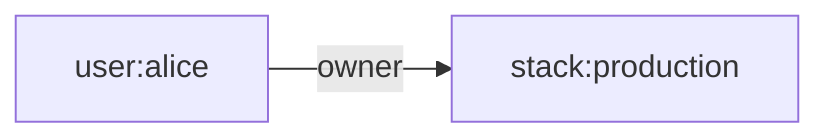
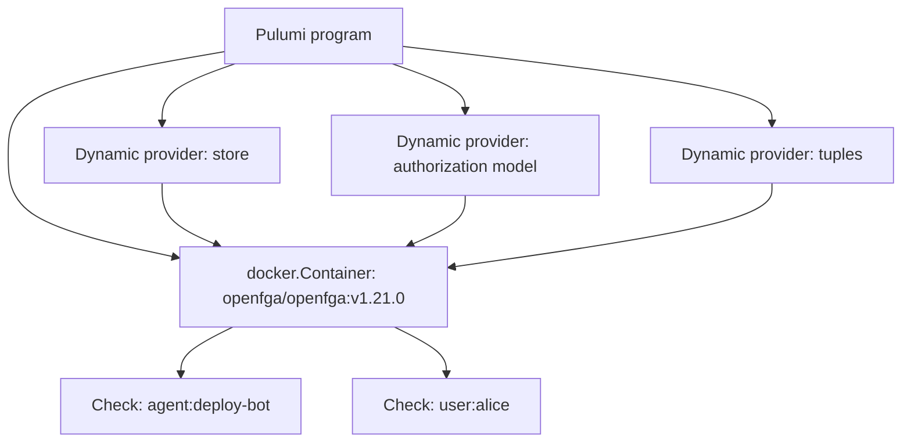

# Fine-grained authorization as code

## OpenFGA relationship-based access control with Pulumi

Speaker Name · Role, Pulumi

<!-- (1 min) Open with the title as written, then name yourself once the room has settled. -->

---
layout: default
---

<div class="absolute inset-0 flex items-center px-24 gap-20">
  <div class="flex-shrink-0">
    
  </div>
  <div class="flex-1">
    <h1 class="!text-[6rem] !leading-[1.02] !font-semibold !tracking-tight !mb-4 !text-[var(--p-primary)]">Speaker Name</h1>
    <p class="!text-[2.2rem] !leading-relaxed !m-0 opacity-90">
      Role at <strong class="!text-[var(--p-primary)]">Pulumi</strong>
    </p>
    <p class="!mt-10 !text-[1.6rem] !leading-relaxed opacity-70 !m-0">
      Two lines on what they actually do, once a speaker is assigned.
    </p>
  </div>
</div>

<!--
(2 min) TODO(presenter): replace photo, name, role, socials and bio before this
session is scheduled. No speaker is assigned to this workshop yet.
-->

---
layout: default
---

# Before we start

- Chat is open, use it
- Save questions for the Q&A tab
- Slides and the demo repo are in the handouts tab
- The recording goes out by email afterward

<!-- (1 min) Four lines, no more. Point at the handouts tab directly so nobody hunts for the repo link mid-demo. -->

---
layout: default
---

# Agenda

- Why RBAC breaks down for AI agents
- What OpenFGA adds: the relationship tuple
- Live demo: a ReBAC model, deployed as Pulumi code
- Deny an agent, grant one relation, watch the check flip
- Tear down and verify nothing is left

<!-- (2 min) Read the five lines straight. Save the argument for the pain slide, this is just the map. -->

---
layout: default
---

# Follow along

- Docker, running locally
- Pulumi CLI, logged in
- Python 3.10+
- This repo, checked out

```bash
docker pull openfga/openfga:v1.21.0
```

<!-- (2 min) If you haven't pulled the image, do it now while I talk. Everything in this demo runs against a local container; there's no cloud account to create beyond a free Pulumi login. -->

---
layout: statement
---

# Can this agent deploy to production?

## Your RBAC system can't answer that cleanly.

<!-- (3 min) Say it plainly, then pause. This is the question every team building agent access is now asking, and a role table has nowhere to put the answer. -->

---
layout: two-cols
---

::left::

# Roles have no slot for "this resource, this relationship"

RBAC answers "what can this role do." It has no native way to say alice owns *this* stack, not *that* one.

- One role, every stack it applies to
- Scoping means minting a new role per resource
- Agents get bolted onto human roles after the fact

::right::

# Where it actually breaks

- A viewer can't become a deployer without a whole new role
- No first-class way to say this agent, this one stack, this one relation
- Arcade.dev (Jun 2026): agents belong in the model as principals, not exceptions

<!-- (5 min) Walk both columns. The Arcade.dev framing is the sharpest one: agents as first-class principals, not humans plus an asterisk. -->

---
layout: default
---

# Five sources, one gap

- KubeCon EU 2026 (Mar 26): Tetrate and Okta, fine-grained authorization at the gateway with OpenFGA
- Arcade.dev (Jun 23): OpenFGA formalizes agents as first-class principals
- JAVAPRO (May 14): OpenFeature tutorial, adjacent identity and config-flag attention
- Debezium (Aug 27): a Kubernetes deployment put behind Keycloak SSO
- NetEye (Mar 31): centralizing authentication and authorization with Keycloak and OIDC

All read September 26, 2026. None of this is in the Pulumi workshops catalog yet.

<!-- (4 min) The middle three are adjacent, not ReBAC itself, say that out loud. The KubeCon and Arcade.dev sources carry the actual argument. -->

---
layout: diagram-right
---

# The tuple is the whole model

OpenFGA implements Google's Zanzibar model. Every authorization decision reduces to one shape:

**user, relation, object**

`user:alice` is `owner` of `stack:production`. That is a tuple. A `Check` call asks whether one holds, directly or through a computed relation.

::diagram::



<!-- (7 min) Write the tuple on the board if you have one. Everything downstream, the model, the writes, the checks, is this one triple repeated. -->

---
layout: diagram
---

# What we're standing up



<!-- (6 min) Three dynamic providers because there is no dedicated Pulumi OpenFGA provider, checked the registry September 26, 2026. Each one is a thin HTTP call to the container's own API. -->

---
layout: section
---

# Live demo

## Steps 1 through 8, one continuous run

<!-- (1 min) No slides for the next 46 minutes except the two breaks already on the schedule. Everything happens in the terminal from here. -->

---
layout: code
---

# Bring up the stack

```bash
cd 01-stack
pulumi stack init dev
pulumi up --yes
```

Provisions, in order: the container, the store, the authorization model, and two tuples. `user:alice` owns `stack:production`; `agent:deploy-bot` only views it.

<!--
(19 min) Narrate each resource as it creates. If the container fails to
start, switch to the pre-started backup container in the second tab and
keep going rather than debugging live. If the model write throws, paste
the pre-validated 01-stack/model.json and call it a teaching moment about
model validation, not a failure.
-->

---
layout: code
---

# Deny, a one-line diff, then allow

```bash
cd ../02-checks
./check.sh agent:deploy-bot can_deploy stack:production   # allowed: false

# uncomment the deployer tuple in 01-stack/__main__.py
cd ../01-stack && pulumi up --yes

cd ../02-checks
./check.sh agent:deploy-bot can_deploy stack:production   # allowed: true
./check.sh user:alice can_deploy stack:production          # allowed: true, unchanged
```

<!--
(20 min) This is the slide the whole talk is built around. If a Check
call hangs past 15 seconds, stop waiting and show the saved dry-run
output instead of narrating dead air. Alice's check never changes,
that's the point: her access came from owner the whole time.
-->

---
layout: code
---

# Tear down and verify

```bash
cd ../01-stack
pulumi destroy --yes

cd ../03-teardown
./verify-teardown.sh
```

`verify-teardown.sh` checks for a `pulumi-workshop-openfga` container and confirms the stack outputs are empty. Both should come back negative.

<!-- (7 min) Run it and read the script's own output aloud, don't just say "looks clean." -->

---
layout: default
---

# What you can do now

- Explain a ReBAC tuple and how it differs from a role
- Write a Pulumi program that provisions a store, model, and tuples
- Run a Check call and predict allow or deny before you see the result
- Add an agent as its own principal type with a narrower relation set
- Tear down a stack and confirm nothing survived it

<!-- (4 min) Map each line back to something they watched happen minutes ago, not an abstract claim. -->

---
layout: default
---

# Where this goes next

- Keycloak, or another OIDC provider, as the identity source feeding these principals: an open question, not built here
- OpenFGA's configuration language covers conditions and unions beyond what this model needed
- Authorization models are append-only; you never edit one in place, only add a new version

<!-- (3 min) Say plainly that Keycloak integration is unbuilt, not just unshown. If asked why step 6 added a tuple instead of a new model version, cite openfga.dev's immutable-models page. -->

---
layout: default
---

# Keep going

<div class="grid grid-cols-3 gap-8 mt-8">
  <div class="text-center">
    <div class="w-32 h-32 mx-auto"><QRCode data="https://slack.pulumi.com" dark="#000000" /></div>
    <div class="mt-2">Pulumi Community Slack</div>
  </div>
  <div class="text-center">
    <div class="w-32 h-32 mx-auto"><QRCode data="https://app.pulumi.com/signup" dark="#000000" /></div>
    <div class="mt-2">Pulumi Cloud, free tier</div>
  </div>
  <div class="text-center">
    <div class="w-32 h-32 mx-auto"><QRCode data="https://github.com/pulumi/workshops/pull/241" dark="#000000" /></div>
    <div class="mt-2">This workshop's repo</div>
  </div>
</div>

<!--
(1 min) Point at each QR in turn. The repo QR goes to the pull request for
now; TODO(presenter): swap it for the pulumi/workshops/tree/main path once
this branch merges.
-->

---
layout: end
class: dark
---

# Questions?

<div class="flex items-center gap-16 justify-center mt-8">
  <div class="text-center">
    
    <div class="mt-2">Speaker Name</div>
  </div>
  <div class="w-32 h-32"><QRCode data="https://github.com/pulumi/workshops/pull/241" dark="#000000" /></div>
</div>

<!-- (2 min) This stays on screen through Q&A, that's why the repo QR is here too. -->
