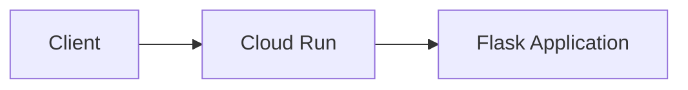

# GCP Python Workshop with Pulumi

This workshop guides you through deploying infrastructure on Google Cloud using Pulumi and Python. You'll start with a simple storage bucket and build up to a containerized Flask application running on Cloud Run.

## Architecture



## Prerequisites

To complete this workshop, you'll need:

- [Pulumi CLI](https://www.pulumi.com/docs/install/) installed
- [gcloud CLI](https://cloud.google.com/sdk/docs/install) installed and authenticated
- [Docker](https://docs.docker.com/get-docker/) installed
- Python 3.10+ installed
- A GCP account with a project and billing enabled

### GCP Setup

Authenticate with GCP:

```bash
gcloud auth login
gcloud auth application-default login
```

Configure Docker for Artifact Registry:

```bash
gcloud auth configure-docker us-central1-docker.pkg.dev
```

## Workshop Content

Follow the instructions in [tutorial.md](./tutorial.md) to complete the following sections:

1. **Storage Bucket** — Create a GCS bucket and upload a file using Pulumi
2. **Cloud Run Deployment** — Package a Flask app in Docker and deploy to Cloud Run

Each section has a corresponding folder (`01-storage/`, `02-cloud-run/`) with the completed code as a reference.
