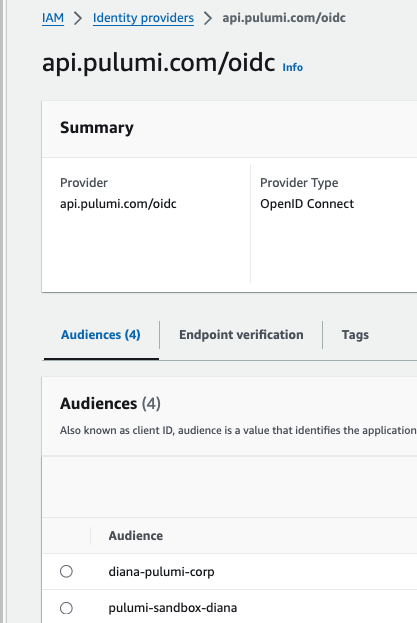
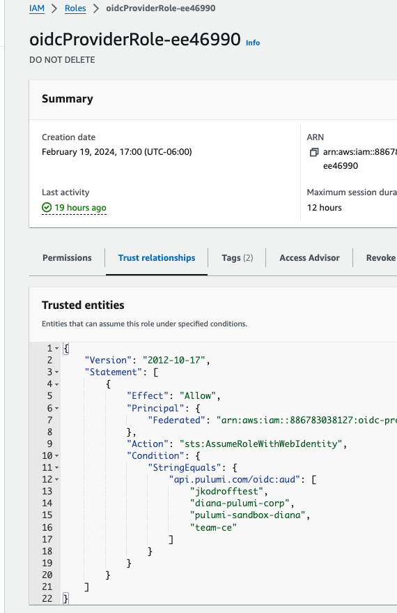
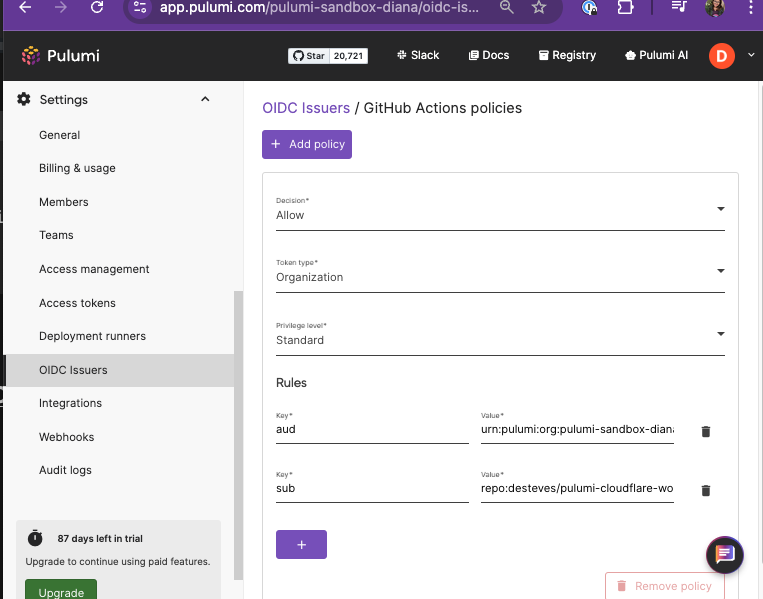

# Advanced CI/CD with GitHub Actions and Pulumi for AWS

Last revision: August 2024.

> [!IMPORTANT]
> This is an advanced workshop that builds upon the concepts of the [Getting Started workshop](../github-aws-cicd-getting-started/). It is highly recommended that workshop is completled before proceeding.

In this workshop, you will learn advanced topics that make up a robust infrastructure CI/CD pipeline through guided exercises. You will use Pulumi tooling to take your cloud infrastructure pipeline one step closer to production.

This workshop introduces users to advanced best practices. You will add compliance checks via policies, drift detection, and isolated test environments to an existing GitHub Actions pipeline. This will help accelerate your AWS projects with the code examples provided.

## 🎯 Learn how to

- Add AWS OIDC credentials to your stack with Pulumi ESC.
- Add GitHub OIDC to auth with Pulumi Cloud thereby creating a secret-less pipeline.
- Add a policy check GitHub Action step to automatically check your infrastructure for compliance.
- Add a cron job GitHub Action workflow to check for drift.
- Configure a dedicated environment for your current branch with Pulumi Deployments.

<!-- markdownlint-disable MD033 -->

> [!NOTE]
> **Presenter**: Any steps labeled "[prep]" should be completed prior the workshop. Any steps labeled "[live]" are meant be completed live. In addition, all steps should have a completed version with the `-done` suffix in case the live demo goes awry.

## 🧰 Prerequisites

To go through this workshop with us, here is what you need:

<details>
<summary> ✅ Pulumi </summary>

- Pulumi Cloud account, sign up at [app.pulumi.com](https://app.pulumi.com/signup/?utm_source=GitHub&utm_medium=referral&utm_campaign=workshops)
- Pulumi [access token](https://www.pulumi.com/docs/intro/pulumi-service/accounts/#access-tokens?utm_source=GitHub&utm_medium=referral&utm_campaign=workshops).
- [Pulumi CLI]((https://www.pulumi.com/docs/get-started/install/?utm_source=GitHub&utm_medium=referral&utm_campaign=workshops)) is installed in your development environment.

</details>

<details>
<summary> ✅ GitHub </summary>

- A [GitHub](https://github.com/join) account.
- The [GitHub CLI](https://cli.github.com/), [`gh`](https://cli.github.com/) is installed in your development environment.
- [Git](https://git-scm.com/book/en/v2/Getting-Started-Installing-Git) is installed in your development environment.

</details>

<details>
<summary> ✅ AWS </summary>

- [`aws` CLI](https://docs.aws.amazon.com/cli/latest/userguide/getting-started-install.html)
- [Set up your local AWS credentials](https://www.pulumi.com/registry/packages/aws/installation-configuration/#credentials?utm_source=GitHub&utm_medium=referral&utm_campaign=workshops).

</details>

## **Part I** Set up your Pulumi project with Pulumi ESC

This workshop picks up right where the [Getting Started](../github-aws-cicd-getting-started/) workshop left off, so we'll start with a sample application and a basic pipeline already in hand.

### **Part I** 🎯 Goal

Attendees will be able to authenticate using Dynamic Credentials by adding a Pulumi ESC Environment with an AWS OIDC configuration as well as configure GitHub OIDC with your Pulumi Cloud organization. This effectively results in a secret-less pipeline.

<details>
<summary> Expand on the 📚 concepts </summary>

**Dynamic Credentials**: Unlike static credentials, which remain constant over time, dynamic credentials are generated on the fly and have a short validity period, enhancing security by reducing the risk of unauthorized access from credential theft or misuse. It also eliminates the need for developers to manage the lifecycle of individual access keys for instances.

**OIDC**:  OpenID Connect (OIDC) is an authentication protocol built on top of the OAuth 2.0 framework. enables clients to authenticate users with a high degree of confidence while supporting single sign-on (SSO) and other identity-related functionalities.

**Pulumi ESC**: Pulumi ESC enables you to define Environments, which contain collections of secrets and configurations. Each Environment can be composed of multiple environments. An Environment may be used to store dynamic credentials from an OIDC IdP such as Pulumi Cloud to connect to your AWS.

</details>

### **Part I** 🎬 Steps

<details>
<summary> ✅ [prep] Clone the Getting Started solution </summary>

```bash
# Clone the Getting Started repo
# The name of the cloned repo
$ newrepo=pulumi-workshop-cicd-advanced
$ gh repo clone desteves/pulumi-workshop-cicd ${newrepo}
$ gh repo create desteves/${newrepo} --public
$ cd ${newrepo}
$ git remote set-url origin https://github.com/desteves/${newrepo}.git 
$ git push
```

</details>
<details>
<summary> ✅ [prep] Create AWS OIDC resources and an ESC Environment </summary>

> [!WARNING]
> If your AWS Account already has an OIDC IDP for Pulumi Cloud, this will **not** work. Instead:
> 1. Update your existing audience for the AWS IAM Identity Provider. Example: 
> 2. Add the name of your Pulumi Org to the Trust Relationship JSON for the corresponding AWS IAM Role. Example, 

```bash
# Ensure you're in ./infra
$ TEMPLATE_URL=https://github.com/pulumi/examples/tree/master/aws-ts-oidc-provider-pulumi-cloud
# Use a Pulumi template to create AWS OIDC Resources
$ pulumi new ${TEMPLATE_URL} --dir aws-oidc
# Go through the wizard and update the defaults as necessary
# Use SSO Token in the meantime.
$ aws sso login --profile work
$ pulumi up --yes --cwd aws-oidc  --stack dev --continue-on-error
# wait for the resources to get created; this can take a couple of minutes
# Obtain the name of the ESC Environment
```

- Check your ESC Environment should look like the following:

```yml
# EXAMPLE OF CONFIGURING AWS FOR OIDC
values:
  aws:
    login:
      fn::open::aws-login:
        oidc:
          duration: 1h
          roleArn: arn:aws:iam::886783038127:role/oidcProviderRole-ee46990
          sessionName: pulumi-environments-session
  environmentVariables:
    AWS_ACCESS_KEY_ID: ${aws.login.accessKeyId}
    AWS_SECRET_ACCESS_KEY: ${aws.login.secretAccessKey}
    AWS_SESSION_TOKEN: ${aws.login.sessionToken}
  pulumiConfig:
    aws:region: us-west-2
```


</details>
<details>
<summary> ✅ [live] Add the ESC Environment to your infra project. </summary>

```bash
# If using the template, obtain the ESC Environment name from the config
# $ e=$(pulumi config get escEnv --cwd aws-oidc)
#
# name of the ESC Environment
# Ensure you're in the infra folder
$ e=aws-oidc-env
# Add the ESC Environment to your Stack
$ pulumi config env add ${e} --yes --non-interactive --stack dev
# Test the changes locally
$ pulumi preview
```

</details>
<details>
<summary> ✅ [prep] Add GitHub OIDC to your Pulumi Cloud </summary>

[Follow the guide](https://www.pulumi.com/docs/pulumi-cloud/oidc/client/github/) to enable the [Pulumi Auth Action](https://github.com/marketplace/actions/pulumi-auth-action). Example, 

</details>
<details>
<summary> ✅ [live] Update the GitHub workflows to use the Pulumi Auth action. </summary>

- The `id-token` will now need  `write` permission.

  ```yml
  permissions:
    id-token: write
    # other permissions...
  ```
  
- Add a step before the `pulumi/actions`:
  
  ```yml
      - name: auth pulumi cloud
        uses: pulumi/auth-actions@v1
        with:
          organization: pulumi-sandbox-diana
          requested-token-type: urn:pulumi:token-type:access_token:organization
    ```

- Remove any reference to the `PULUMI_ACCESS_TOKEN` and `AWS_...` secrets.

</details>

<details>
<summary> ✅ [live] PR commit / merge the changes </summary>

```bash
# Commit your changes
$ git add .
$ git commit -m "add oidc"

# Create a new feature branch
$ git checkout -b feature-oidc

# Push the changes
$ git push --set-upstream origin feature-oidc

# Create a PR
$ gh pr create --title "adds oidc" --body ""
# Follow the link to see the Actions
# It can take a few minutes for the GHA Runner to complete

# Merge the PR
# !!! Update the PR merge number as needed
$ m=1 
$ gh pr merge $m --squash

$ git checkout main
```

</details>

## **Part II** Add CIS compliance with Policy as Code

### **Part II** 🎯 Goal

Attendees will be able to add compliance checks to the CI/CD pipeline using [Pulumi CrossGuard](https://www.pulumi.com/crossguard/?utm_source=GitHub&utm_medium=referral&utm_campaign=workshops).

<details>
<summary> Expand on the 📚 concepts </summary>

**Cloud compliance**: refers to the process of ensuring that cloud-based systems, services, and data storage adhere to relevant laws, regulations, standards, and best practices governing security, privacy, and data protection.

**Policy as Code**: involves codifying policy definitions, which allows for their automated enforcement and evaluation within various stages of IT operations and development pipelines. This method leverages version control systems, automation tools, and continuous integration/continuous deployment (CI/CD) pipelines to ensure that policies governing security, compliance, resource usage, and access controls are consistently applied across the entire ecosystem.

**Built-in packs**: bundle compliance policies that are easily extendable to speed up development and ensure best practices from day one.

</details>

### **Part II** 🎬 Steps

By adding a default policy pack, your workflow will automatically ensure your stack is not violating any cloud infrastructure best practices.

<details>
<summary> ✅ [live] Add the CIS compliance framework to your Pulumi program </summary>

Center for Internet Security (CIS)

```bash
# From the `infra` directory

# Add the policy under the aws-cis/ folder
$ pulumi policy new aws-cis-compliance-policies-typescript  --dir aws-cis
$ cd aws-cis
$ npm install -g npm-check-updates && ncu -u && npm install

# Test locally
$ cd ../ # from the infra folder
$ pulumi preview --policy-pack aws-cis --stack dev
# Policies:
#    ✅ aws-cis-compliance-ready-policies-typescript@v0.0.1 (local: aws-cis)
```

</details>
<details>
<summary> ✅ [live] Update the GitHub workflows to include policy checks </summary>

Update `branch.yml` and `main.yml` with the following changes:

- Add the CIS folder to the `matrix.directory`

  ```yaml
      strategy:
      matrix:
        directory:
          - './infra'
          - './infra/aws-oidc'
          - './infra/aws-cis'
  ```

- Modify the `pulumi/actions` step, below the `work-dir`, add

  ```yml
  policyPacks: aws-cis
  ```

</details>

<details>
<summary> ✅ [live] PR commit / merge the changes </summary>

```bash
# Commit your changes
$ git add .
$ git commit -m "add pac"

# Create a new feature branch
$ git checkout -b feature-pac

# Push the changes
$ git push --set-upstream origin feature-pac

# Create a PR
$ gh pr create --title "Adds Policy as Code" --body ""
# Follow the link to see the Actions
# It can take a few minutes for the GHA Runner to complete

# Merge the PR
# !!! Update the PR merge number as needed
$ m=2
$ gh pr merge $m --squash
```

</details>

## **Part III** Add drift detection

### **Part III** 🎯 Goal

Attendees will be able to programmatically identify when a drift has occurred in their infrastructure via an Actions cronjob.

<details>
<summary> Expand on the 📚 concepts </summary>

**Drift** refers to the phenomenon where the actual state of your infrastructure diverges from the expected or declared state as defined in your code. This can occur for a variety of reasons, such as manual changes made directly to the infrastructure (outside of the IaC processes), external processes modifying the environment, or discrepancies in the execution of IaC scripts.

**Drift detection** refers to the process of identifying discrepancies between the actual state of your infrastructure and its expected state as defined by your IaC configurations. This process is crucial for maintaining consistency, reliability, and security in cloud environments, where infrastructure components are dynamically provisioned and managed through code.

**Reconciling the infrastructure** Once a drift is detected, the next step is to reconcile the infrastructure, which means resolving the differences between the actual state and the intended state. Reconciliation can be approached in different ways but two common approaches are to update the infrastructure to match the code or update the code to reflect the detected changes.

Both drift detection and infrastructure reconciliation are fundamental to the practice of infrastructure as code, allowing teams to maintain control over their environments and ensure that their infrastructure remains in a known, good state.

</details>

### **Part III** 🎬 Steps

<details>
<summary> ✅  [live] Add a cronjob to your workflow that detects drift </summary>

- Add `.github/workflows/drift.yml`
- Copy the following:

  ```yml
  name: drift-live
  on:
    schedule:
      # Actions schedules runs every 5 minutes.
      - cron: '*/5 * * * *'
    workflow_dispatch: {}
  
  permissions:
    contents: read
    pull-requests: write
    id-token: write
  
  jobs:
    main:
      name: drift detection
      runs-on: ubuntu-latest
      strategy:
        matrix:
          directory:
            - './infra'
            - './infra/aws-oidc'
            - './infra/aws-cis'
      steps:
        - name: checkout repo
          uses: actions/checkout@v4
  
        - name: setup node
          uses: actions/setup-node@v4
          with:
            node-version: 20
  
        - name: install deps
          working-directory: ${{ matrix.directory }}
          run: npm install
  
        - name: auth pulumi cloud
          uses: pulumi/auth-actions@v1
          with:
            organization: pulumi-sandbox-diana
            requested-token-type: urn:pulumi:token-type:access_token:organization
          
        - name: preview resources
          uses: pulumi/actions@v5
          with:
            command: preview
            stack-name: pulumi-sandbox-diana/cicd/dev
            work-dir: ./infra
            # policyPacks: aws-cis optional if to check this
            comment-on-pr: true
            comment-on-summary: true
            edit-pr-comment: true
            expect-no-changes: true
            refresh: true
  ```
  
- See `.github/workflows/drift-done.yml` for reference.

</details>

<details>
<summary> ✅ [live] PR commit / merge the changes </summary>

```bash
# Ensure you're in the project, `cicd-workshop-advanced`.

# Commit your changes
$ git add .
$ git commit -m "add dd"

# Create a new feature branch
$ git checkout -b feature-dd

# Push the changes
$ git push --set-upstream origin feature-dd

# Create a PR
$ gh pr create --title "Adds Drift Detection" --body ""
# Follow the link to see the Actions
# It can take a few minutes for the GHA Runner to complete

# Merge the PR
# Update the PR merge number as needed
$ m=3 # 
$ gh pr merge $m --squash
```

</details>

<details>
<summary> ✅ [live] Trigger the drift detection workflow </summary>

- Run the Drift Action in the browser.
- [Make a change](https://us-west-2.console.aws.amazon.com/s3/buckets/bucket-ba7ee56?region=us-west-2&bucketType=general&tab=properties) by renaming the `error.html` to `404.html`
- Re-run the Drift Action in the browser.

</details>

## **Part IV** Add ephemeral environments

### **Part IV** 🎯 Goal

Attendees will be able to configure ephemeral cloud environments to deploy the infrastructure using Pulumi Deployments Review Stacks.

<details>
<summary> Expand on the 📚 concepts </summary>

**Test in isolation** refers to the practice of testing components or units of an application without interference from other parts of the system.

**Pulumi Deployments Review Stacks** An ephemeral isolated Pulumi Stack to test your IaC via a number of configurations.

</details>

### **Part IV** 🎬 Steps

<details>
<summary> ✅ [prep] Install the Pulumi GitHub App and Configure Pulumi Deployments </summary>

[Install the Pulumi GitHub App](https://www.pulumi.com/docs/using-pulumi/continuous-delivery/github-app/#installation-and-configuration?utm_source=GitHub&utm_medium=referral&utm_campaign=workshops)

Check your repository has been added to the access list.

</details>

<details>

**!!! REMEMBER TO UNPAUSE DEPLOYMENTS IF PREVIOUSLY PAUSED !!!**

<summary> ✅ [live] Add Review Stacks </summary>

Presenter: For the live demo, just use the UI as it's far more presentable.

</details>
<details>
<summary> ✅ [live] Commit the changes </summary>

```bash
# Commit your changes
$ git add .
$ git commit -m "add rs"

# Create a new feature branch
$ git checkout -b feature-rs

# Push the changes
$ git push --set-upstream origin feature-rs

# Create a PR
$ gh pr create --title "Adds Review Stacks" --body ""
# Follow the link to see the Actions
# It can take a few minutes for the GHA Runners to complete

# Merge the PR
# Update the PR merge number as needed
$ m=5 # 
$ gh pr merge $m --squash
```

</details>

## ✨ Summary

You introduced advanced elements to your continuous infrastructure pipeline to make it more robust. In particular, you:

- Added a Pulumi ESC environment to retrieve dynamic credentials for AWS;
- Added policy checks to test your infrastructure for compliance;
- Added a drift detection cron job to the pipeline; and
- Configured dedicated cloud environments with Review Stacks.

## 🚀 Next steps

At this point, you have completed this workshop. You have

- a GitHub repository with a sample application;
- AWS resources using Pulumi IaC; and
- a robust cloud infrastructure CI/CD pipeline to test any change automatically.

We encourage you to modify your app or infra and watch the changes be tested programmatically. Possible changes:

- Deploy your application in two regions
- Add a new AWS policy

<!-- markdownlint-enable MD033 -->
