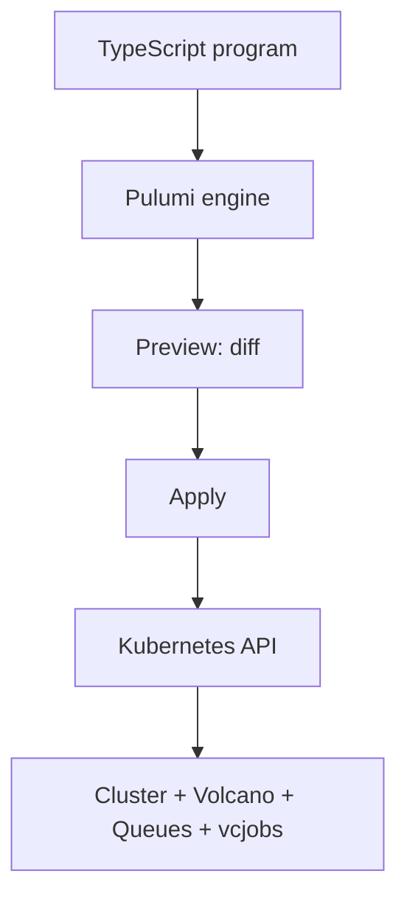
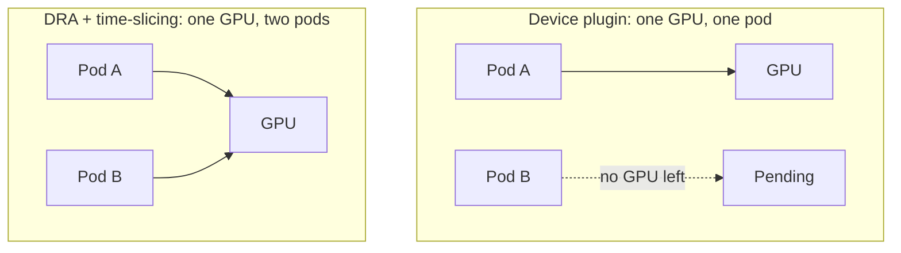

# GPU-aware batch scheduling

## for AI training on Kubernetes with Pulumi

Speaker Name · Role, Pulumi

<!--
1 min. By the end of this session you will have provisioned a GPU-aware
batch scheduler on Kubernetes with Pulumi, run a gang-scheduled multi-pod
training job, and shared a single GPU across two jobs with hardware-level
isolation. Everything on these slides is a command we are about to run, not
a diagram of something we are describing.
-->

---
layout: default
---

# Speaker

<div class="flex gap-8 items-center">

<div>

<h1 class="text-primary">Speaker Name</h1>

Role at **Pulumi**

@handle · linkedin.com/in/handle

Works with platform teams running Kubernetes for ML training, and has spent
the last year in Volcano and Dynamic Resource Allocation specifically.

</div>
</div>

<!-- TODO(presenter): replace photo, name, role, socials and bio -->

<!--
1 min. One speaker slide; the brief did not name a co-presenter, and no
session date or speaker roster is committed yet, so this is a placeholder.
Swap the photo, name, and bio before the talk.
-->

---
layout: default
---

# Before we start

- Chat tab for side comments, Q&A tab for questions
- Slides and demo scripts are in the handouts tab
- The session is recorded; a link goes out by email afterward

<!--
1 min. Point people at the right tab for questions so we are not
interrupted mid-demo, and tell them where the material lands afterward.
-->

---
layout: default
---

# Agenda

- Why the default scheduler fails AI training jobs
- Gang scheduling and fair-share, explained
- Volcano, and provisioning it with Pulumi
- Live demo: cluster, queues, gang scheduling, fair-share, fractional GPU
- Where this breaks, and what else is out there
- Teardown and recap

<!--
1 min. Five sections, then a teardown and a recap. The middle is almost
entirely a live terminal, not more slides.
-->

---
layout: default
---

# Prerequisites

- Docker (or another container runtime) and [`kind`](https://kind.sigs.k8s.io/) v0.33.0+
- `kubectl` and `helm` on your `PATH`
- The Pulumi CLI, logged in to a backend of your choice
- Node.js 22+ and npm

Steps 1-4 run entirely on your laptop, free, no cloud account needed. Step 5
(fractional GPU sharing) needs an AWS account with GPU instance quota. More
on that shortly.

<!--
2 min. Everything through fair-share queueing runs on kind, which is a
Kubernetes cluster inside Docker on your own machine. Nobody needs a cloud
account for four of this workshop's five outcomes. The fifth needs a real
GPU, which means AWS, which means quota, which is worth flagging now rather
than at the point in the demo where it would otherwise surprise you.
-->

---
layout: quote
author: "GPU Costs Are Killing AI Budgets"
role: independent industry analysis, April 2026
---

Volcano's unified scheduling cuts GPU waste that the default Kubernetes
scheduler cannot see, let alone reclaim.

<!--
5 min. That headline is from an independent article published in April
2026, and it is not describing a niche problem. The default Kubernetes
scheduler places one pod at a time, greedily, with no concept of a
distributed training job's actual shape. A training job that needs four
pods to make progress can end up with two pods running and two pods
Pending indefinitely, burning GPU-hours on workers with nothing to talk
to. A separate August 2026 academic paper on multi-tenant Kubernetes for
AI makes the same point from the research side, citing Armada's
gang-scheduling as one answer to exactly this failure mode. Two
independent signals, six months apart, converging on one root cause: the
scheduler was built for stateless web pods, not for jobs where every pod
has to start together or none of them should start at all.
-->

---
layout: default
---

# Gang scheduling and fair-share, defined

- **Gang scheduling**: a job's pods start together or not at all, with no
  partial start burning GPU-hours on workers waiting for peers that never
  arrived
- **Fair-share queueing**: each team gets a resource quota; an over-quota
  team's job waits instead of crowding out everyone else
- Both are entirely orthogonal to what the default scheduler does per pod

<!--
6 min. These are two separate problems and Volcano solves both with two
separate mechanisms. Gang scheduling is about a single job: a distributed
training job with four workers either gets all four pods placed, together,
or none of them, so you never pay for two workers idling because the
other two are stuck Pending. Fair-share is about multiple teams on one
cluster: if team A defines its own generous GPU budget and team B is
still working within a smaller one, B's job should wait its turn rather
than being starved out entirely, and A's job should not be able to run
forever at B's expense either. The default Kubernetes scheduler has no
concept of either: it schedules pod by pod, first-come-first-served,
which is exactly why AI training workloads outgrow it.
-->

---
layout: default
---

# Volcano

- CNCF's first, and to date only, official container batch scheduling
  project, CNCF Incubating since 2022
- Ships `Queue` and `Job` (`vcjob`) custom resources purpose-built for
  gang scheduling and fair-share
- KubeCon NA 2026 carries a dedicated session, "Volcano for the Agentic AI
  Era: Unified Scheduling Across Training, Inference, and Agents," one of
  eight sessions this year on batch/AI-training scheduling as a theme
- This workshop pins Volcano v1.15.2 (v1.15.0 and v1.15.1 carry a
  disclosed DRA-capacity-accounting denial-of-service, GHSA-j38h-7pfq-cxmw)

<!--
4 min. Volcano has been a CNCF project since 2020 and reached Incubating
status in 2022, which for CNCF specifically means multiple committers
from multiple organizations and a track record of production adoption,
not a one-team side project. Its own session at KubeCon this November is
about unifying scheduling across training, inference, and agent
workloads, which tells you where the maintainers think this is heading.
One version note worth saying out loud: v1.15.0 and v1.15.1 both carry a
disclosed denial-of-service in DRA capacity accounting, so this workshop
pins v1.15.2 specifically, not "latest 1.15."
-->

---
layout: diagram-right
---

# Why Pulumi, not `kubectl apply`

- Volcano's CRs are plain YAML, so you could `kubectl apply` them
- But four steps here share a cluster name, queue names, and a Helm
  release, passed as real values, not copy-pasted strings
- One `pulumi up` per step, and `pulumi preview` shows the diff before
  anything touches the cluster
- Teardown runs in the exact reverse order, every time, not "whichever
  `kubectl delete` you remember"

::diagram::



<!--
5 min. Every one of the five demo folders is its own Pulumi TypeScript
project, and folders 1 through 4 read each other's stack outputs (the
kind cluster's kubeconfig context, the queue names) instead of hardcoding
strings that would drift the moment someone changes them. The habit that
actually matters day to day is on the left of that diagram: preview always
runs before apply, so you see exactly what is about to change against the
Kubernetes API before it happens, which matters far more once a Queue's
capability or a vcjob's minAvailable is something a teammate can also
edit.
-->

---
layout: section
---

# Demo

## Five steps, one kind cluster, one AWS account

<!--
1 min. Steps one through four run on your laptop against a local kind
cluster and cost nothing. Step five needs a real GPU on AWS, and I will
say plainly, when we get there, whether we are running it live or showing
a recording.
-->

---
layout: code
---

# 1: cluster and scheduler

```bash
cd 01-cluster && npm install
pulumi stack init dev
pulumi up
```

```bash
# verify
kubectl --context kind-gpu-batch-demo get pods -n volcano-system
# -> scheduler, controller and admission pods all Running
```

<!--
8 min. `pulumi up` here does two things: a `local.Command` runs
`kind create cluster --name gpu-batch-demo` against the config in
kind-config.yaml, and once that cluster exists, a Kubernetes provider
targeting context kind-gpu-batch-demo installs the Volcano scheduler from
its official Helm chart, `volcano-sh/volcano`, into the volcano-system
namespace. Watch `kubectl get pods -n volcano-system` until all three
components (scheduler, controller, admission) report Running. Nothing
after this point works without all three up.
-->

---
layout: code
---

# 2: two team queues

```bash
cd 02-queues && npm install
pulumi stack init dev
pulumi up
```

```bash
# verify
kubectl --context kind-gpu-batch-demo get queue
# -> team-a and team-b both Open
```

<!--
5 min. This creates two Volcano Queue custom resources
(scheduling.volcano.sh/v1beta1), standing in for two teams sharing the
cluster. team-a gets capability { cpu: "2", memory: "4Gi" } at weight 2;
team-b gets { cpu: "1", memory: "2Gi" } at weight 1, a deliberately
smaller, lower-priority team. Nothing is running against these queues yet;
we are just establishing the quotas that steps 3 and 4 will bump against.
-->

---
layout: code
---

# 3: gang scheduling, all or nothing

```bash
cd 03-gang-scheduling && npm install
pulumi stack init dev
pulumi up
```

```bash
# verify
kubectl --context kind-gpu-batch-demo get pods
# -> all gang-demo pods Pending together, never partially started
```

<!--
9 min. This step creates its own small queue, sized to 2 CPU, then
submits a vcjob (batch.volcano.sh/v1alpha1) named gang-demo with 4
worker replicas at 1 CPU each and minAvailable set to 4, a job that,
by construction, needs more capacity than its own queue allows. Run
`kubectl get pods` right after `pulumi up` finishes. The default
Kubernetes scheduler would place the two pods that fit and leave the
other two Pending forever, which for a distributed training job is
worse than not starting at all: two workers running with no peers to
talk to, burning GPU-hours for nothing. Volcano's gang scheduling holds
every one of the four Pending together until all four can start at once.
That is the whole point of minAvailable, and it is the moment this
workshop is built around.
-->

---
layout: code
---

# 4: fair-share, one job per team

```bash
cd 04-fair-share && npm install
pulumi stack init dev
pulumi up
```

```bash
# verify
kubectl --context kind-gpu-batch-demo get vcjob
# -> under-quota Running, over-quota queued/Pending
```

<!--
8 min. Two vcjobs go in at once: under-quota, submitted into team-a's
queue, asks for exactly what team-a's capability allows and starts
immediately. over-quota, submitted into team-b's smaller queue, asks for
more than team-b's 1-CPU capability and stays queued. Nobody is
starved by an admin decision here. Volcano is enforcing the Queue
objects from step 2 automatically, at submission time, the same way it
would if team-b actually were the smaller, lower-priority group in a
real cluster. This is the fair-share half of the promise: an over-quota
team waits, an under-quota team does not wait on them.
-->

---
layout: diagram
---

# Dynamic Resource Allocation: whole GPU vs. fractional



<!--
6 min. The device-plugin model that most clusters run today allocates a
whole GPU to the first pod that claims it; a second pod asking for the
same GPU stays Pending even if the first pod is using ten percent of it.
Dynamic Resource Allocation is a Kubernetes core API, stable since
v1.35 as resource.k8s.io/v1, for expressing structured, driver-specific
device requests instead of a plain integer count. NVIDIA's Kubernetes DRA
driver, donated to kubernetes-sigs in April 2026, supports a time-slicing
strategy that interleaves two pods' CUDA contexts on one physical GPU. I
want to be precise about where that stands today: time-slicing sits
behind an Alpha feature gate, TimeSlicingSettings, disabled by default.
This is an evolving capability, not a production default you should
assume is on.
-->

---
layout: code
---

# 5: one GPU, two pods, DRA

```bash
cd 05-gpu-dra && npm install
pulumi stack init dev
pulumi up
```

```bash
# verify
kubectl get pods -n default
# -> gpu-share-a and gpu-share-b both Running on the one GPU node
```

<!--
8 min. This step is fully separate from steps 1-4: it provisions its own
AWS EKS cluster, gpu-batch-dra, with a one-node g4dn.xlarge GPU node
group (about $0.53/hr in us-east-1), installs NVIDIA's DRA driver via its
Helm chart, and submits two pods, gpu-share-a and gpu-share-b, each
claiming a slice of the same GPU through a ResourceClaimTemplate
configured for time-slicing. Both should land Running on the same node at
once, the payoff moment, and the direct contrast with the whole-GPU
diagram a minute ago. I want to be straight with you about this specific
run: building this deck, I did not have AWS credentials or GPU quota
available, so I verified this project by type-checking it
(`npx tsc --noEmit`) and reading it against current DRA and NVIDIA driver
docs, not by running `pulumi up` against a live GPU. That is exactly the
situation the demo's own README plans for: GPU quota is commonly zero on
a new AWS account and can take days to approve, so if it is not
approved in time, do not run this step live. Say so to the room and
play a recording of the segment instead. Whoever presents this should
rehearse step 5 against real hardware before doing it live.
-->

---
layout: default
---

# Where this breaks in production

- Starvation: a queue's `reclaimable` setting can let a high-priority job
  reclaim resources mid-run, which needs deliberate tuning, not the demo's
  defaults
- Priority inversion: a low-priority gang job holding partial capacity can
  block a high-priority job from ever reaching `minAvailable`
- GPU driver mismatches: a node pool's driver version and the DRA driver's
  supported CUDA range have to agree, or pods stay Pending with an opaque
  claim error

<!--
5 min. Say the awkward part. Volcano will enforce exactly what you
configure, correctly, which is not the same as configuring it correctly.
A queue set reclaimable without real thought about priority can let one
team's high-priority job take resources mid-run from a job that already
started. A gang-scheduled job holding some of its pods while waiting for
the rest can itself block a more important job from ever reaching its own
minAvailable, so two gang jobs can deadlock each other on a small cluster.
And on the GPU side, a node pool's driver version and the DRA driver's
supported CUDA range are two independently moving targets; when they
disagree, the failure is a stuck Pending pod with a claim error, not a
clear message telling you to upgrade a driver.
-->

---
layout: default
---

# Why Volcano, and not Armada or Kueue

- Armada (CNCF Sandbox) has its own gang-scheduling story, cited in the
  same August 2026 academic paper as a comparison point
- Kueue is shipping actively (v0.19.6 landed 2026-09-24) and solves
  fair-share queueing from a different angle, without a custom scheduler
- Volcano's more mature CNCF status (Incubating vs. Sandbox) and its own
  KubeCon 2026 session make it this workshop's pick, not a settled
  community consensus

<!--
4 min. I want to be honest about how firm this choice is. The evidence
behind this whole workshop is theme-level: two adjacent CNCF projects,
Volcano and Armada, each drew one independent, high-confidence signal,
and Kueue is a third project solving an overlapping problem with an
active release cadence of its own. Nothing in what I read said
practitioners are converging specifically on Volcano over the other two.
I picked Volcano because it carries the more mature CNCF status,
Incubating since 2022 versus Armada's Sandbox stage, and because it has
its own dedicated KubeCon NA 2026 session on unifying scheduling for
training, inference, and agents. If your evidence points elsewhere,
that is a legitimate reason to redirect this workshop toward Armada or
Kueue instead.
-->

---
layout: code
---

# Teardown

```bash
06-teardown/down.sh
```

```bash
# if step 5 ran:
06-teardown/down-gpu.sh
# verify: aws eks list-nodegroups --cluster-name gpu-batch-dra
#   -> empty, or ResourceNotFoundException once the cluster is gone
```

<!--
4 min. down.sh destroys 04, 03, and 02 in that order, then deletes the
kind cluster itself through 01-cluster's local.Command delete hook,
`kind delete cluster --name gpu-batch-demo`. If step 5 ran, run
down-gpu.sh too: it is the highest-cost resource in this whole workshop,
a real GPU instance billed per hour, and its own script tells you exactly
how to confirm the node group is really gone rather than just assuming
`pulumi destroy` succeeded. Run that verification command out loud before
you consider this done.
-->

---
layout: statement
---

You provisioned a Volcano scheduler with Pulumi, watched gang scheduling
and fair-share hold jobs back on purpose, and saw **one GPU serve two
jobs** through Dynamic Resource Allocation.

<!--
3 min. That is the promise from the first slide, delivered: a Kubernetes
cluster and Volcano provisioned in one pulumi up, a gang-scheduled job
that never half-starts, a Queue that makes an over-quota team wait its
turn, and DRA's fractional GPU sharing explained and either shown live or
walked through in a recording, depending on what quota allowed on the
day. The default scheduler could not have given you any of the last
three.
-->

---
layout: default
---

# Keep going

<div class="grid grid-cols-3 gap-8 items-center text-center">
<div>
<div class="w-32 h-32 mx-auto"><QRCode data="https://slack.pulumi.com" dark="#000000" /></div>
<p>Pulumi Community Slack</p>
</div>
<div>
<div class="w-32 h-32 mx-auto"><QRCode data="https://app.pulumi.com/signup" dark="#000000" /></div>
<p>Pulumi Cloud, free tier</p>
</div>
<div>
<div class="w-32 h-32 mx-auto"><QRCode data="https://github.com/pulumi/workshops/tree/main/gpu-aware-batch-scheduling-volcano" dark="#000000" /></div>
<p>This workshop's repo</p>
</div>
</div>

<!--
2 min. Three links, three QR codes: the community Slack for when
something in your own cluster does not match what you saw here, a free
Pulumi Cloud account if you do not have one yet, and the exact folder
this demo lives in, so you can rerun any of the five steps on your own
time.
-->

---
layout: end
---

# Questions?

<div class="grid grid-cols-2 gap-8 items-center">
<div>

<p>Speaker Name</p>
</div>
<div class="grid grid-cols-2 gap-4">

<div class="w-24 h-24 mx-auto"><QRCode data="https://github.com/pulumi/workshops/tree/main/gpu-aware-batch-scheduling-volcano" dark="#000000" /></div>

<div class="w-24 h-24 mx-auto"><QRCode data="https://volcano.sh/en/docs/Home/Introduction" dark="#000000" /></div>

</div>
</div>

<!-- TODO(presenter): replace speaker QR with a real LinkedIn or GitHub link -->

<!--
1 min. This slide stays up for questions, so it carries the two links
people actually photograph: the repo, and the Volcano introduction docs,
which answers most of the "does this work with my cluster" questions.
Swap the speaker's own QR in before presenting.
-->
