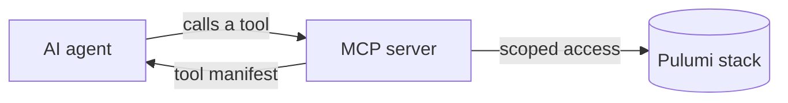
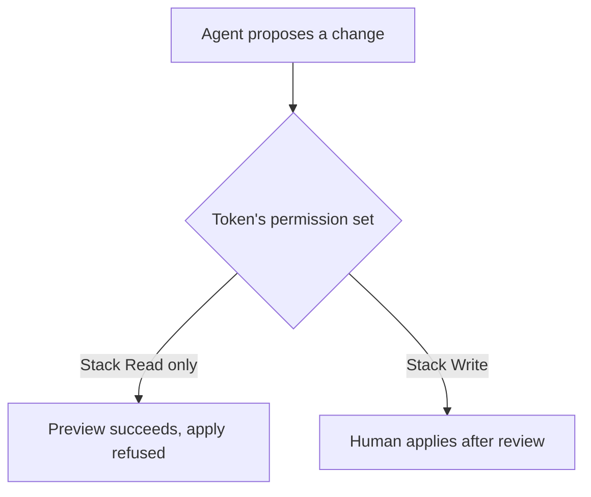

# Give your AI agent the keys, safely

Building and governing MCP-based infrastructure agents

<!--
[1 min] Cold open. State the title and one sentence on who this is for:
platform and DevOps engineers already running Pulumi or Terraform, who
want an agent's help without giving it unattended write access. Don't
oversell it here; the hook slide does that work.
-->

---
layout: default
---

<div class="speaker">
  
  <div class="speaker__info">
    <h1>Speaker Name</h1>
    <p>Role at <strong>Pulumi</strong></p>
    <p class="speaker__handles">@handle · github.com/handle</p>
    <p class="speaker__bio">Two lines on what this person actually does, filled in
    by the presenter before delivery.</p>
  </div>
</div>

<!-- TODO(presenter): replace photo, name, role, socials and bio. No speaker is assigned to this workshop yet. -->

<style scoped>
.speaker { display: flex; align-items: center; gap: 3rem; height: 100%; padding: 0 2rem; }
.speaker__photo { width: 16rem; height: 16rem; object-fit: cover; border-radius: 1.5rem; border: 4px solid color-mix(in srgb, var(--p-primary) 45%, transparent); box-shadow: 0 20px 40px rgba(0,0,0,0.18); }
.speaker__handles { font-family: var(--slidev-font-mono); color: var(--p-fg-muted); }
.speaker__bio { max-width: 28rem; }
</style>

<!--
[1 min] Say plainly that the speaker slot is not filled yet and this deck
ships with a placeholder. If a speaker is assigned before delivery, replace
this slide before anything else.
-->

---
layout: default
---

# Before we start

- Chat is open. Use it, we're not precious about interruptions.
- Save specific questions for the Q&A tab; we'll take them at the end.
- Slides and the demo scripts are in the handouts tab, and on GitHub.
- We're recording. It'll be emailed to registrants after the session.

<!--
[2 min] Four lines, read them, move on. Don't editorialize about the
recording or the chat policy; state the mechanics and go.
-->

---
layout: default
---

# Agenda

- Why agents want infrastructure now
- What an MCP server actually exposes
- The permission boundary that makes this safe
- Live: a scoped agent proposes a change, gets blocked, gets approved
- Where this still breaks
- Teardown and takeaways

<!--
[2 min] Read the six lines. This is the shape of the next 90 minutes, not
a table of contents with slide numbers. Land on "gets blocked" for a beat;
that's the part of the agenda most people haven't seen before.
-->

---
layout: statement
---

# Almost nobody lets an agent near production infrastructure. **That's changing, fast.**

<!--
[5 min] The hook. Open with a concrete number, not a vibe: at KubeCon EU
2026, 12 sessions touched agentic infrastructure; at AWS re:Invent 2026 it
was 171; at PlatformCon 2026, 112 of 416 sessions. QCon London went from 9
sessions on this theme to 16 in one year. That's the trend line, and it's
not vendor noise, it's what practitioners are choosing to submit talks
about. Then name the actual shift behind the numbers: Pulumi shipped agent
accounts and `pulumi do` this year under what Joe Duffy called "the
agentic infrastructure era," and Neo Security opened a research preview
that threat-models a live estate and files pull requests on its own. The
capability arrived before the governance did. Say that sentence exactly;
it's the thesis of the next 90 minutes. Sources: conference program
counts read 2026-09-21; Pulumi blog posts dated 2026-05-19 and 2026-08-28.
-->

---
layout: statement
class: dark
---

# The gap isn't capability. **It's whether you can trust what it did.**

<!--
[2 min] One beat, dark mode, let it sit. This is the pivot from "agents
can do infrastructure" to "here's the actual problem we're solving today":
not whether an agent can propose a change, but whether you can scope what
it's allowed to touch and verify what it touched. Don't over-explain; the
next three slides answer it.
-->

---
layout: diagram-right
---

# What an MCP server actually exposes

An MCP server doesn't hand an agent your cloud account. It hands it a
fixed menu: a tool manifest, each tool with a name and a schema.

- Pulumi's hosted server (`mcp.ai.pulumi.com`) exposes read, search, and a
  tool to launch a Pulumi Neo task
- Today's server is different: stdio, against a project on disk, with
  preview and update tools
- The manifest **is** the boundary

::diagram::



<!--
[6 min] Ground this before the demo touches it. Pull up the MCP
specification page (modelcontextprotocol.io) if there's time, and note the
server we run today negotiates protocol version 2025-11-25 against a spec
whose current revision is 2026-07-28, because the published package
hasn't shipped since 2025-09-26, and the protocol keeps moving even when a
given server doesn't. The distinction between hosted and local server
matters for the room: the hosted one at mcp.ai.pulumi.com is OAuth and
HTTP, and it has no preview or apply tools at all, by design, for a
different use case (asking Neo to do things, not running commands
in-process). Today's demo uses the local server because it's the one with
apply-shaped tools, which is exactly why it's the one worth scoping.
Source: pulumi.com/docs/ai/mcp-server, read 2026-09-24.
-->

---
layout: diagram-left
---

# The permission boundary that matters

The manifest says what tools exist. It doesn't say who can use the
destructive ones. That's a second, independent layer: what Pulumi Cloud
lets the agent's identity do.

- `Stack Read`: previews only, `pulumi preview`, nothing else
- `Stack Write` adds `pulumi up` and `pulumi destroy`
- Scope the agent's token to `Stack Read` and an apply attempt fails at
  the permission layer, not the agent's judgment

::diagram::



<!--
[6 min] This is the slide that names the actual solution: not "the agent
is well-behaved," but "the agent's credential structurally cannot apply."
Permission sets are a Pulumi Cloud RBAC feature, Pro and Enterprise only.
Say that plainly, because it's a real gap against the brief's assumption
that a free-tier participant can follow along on step 3. `Stack Read`
bundles stack:read, stack:export, stack:encrypt, stack:decrypt among other
read-shaped scopes; `Stack Write` adds stack:write and the update-shaped
scopes on top of it. Source: pulumi.com/docs/administration/concepts/rbac/
permission-sets, read 2026-09-24.
-->

---
layout: default
---

# Meet the stack

Everything today runs against one small, disposable stack: a VPC, one
subnet, and an S3 bucket for build artifacts, in `us-east-1`. Pulumi
TypeScript, nothing exotic.

- The artifact bucket is `protect`-ed and versioned. Teardown has to
  unprotect it and empty every version before it can go
- Full cost for the workshop: under $2. No NAT gateway, no interface
  endpoint, negligible S3 storage and request volume at this scale
- This stack is the thing the agent will propose a change against, never
  the thing it applies a change to directly

<!--
[4 min] Quick orientation before the live section starts. Don't dwell on
the Pulumi code; the audience will see it in the demo. The point of this
slide is naming the guardrail already built into the stack (protect: true
on the bucket) so that when teardown comes up later, the extra steps make
sense instead of looking like friction. Cost figures from AWS's published
S3 and VPC pricing pages, read 2026-09-24, not independently checked
against a real bill in this build.
-->

---
layout: section
---

# Live: propose, block, approve

## Six steps, one stack, no shortcuts

<!--
[1 min] Section divider. Say what the room is about to watch end to end:
an MCP server standing up, an agent connecting with a scoped token,
proposing a real change, that change getting reviewed, an apply attempt
getting blocked, and a human approving the same change. Then start.
-->

---
layout: code
---

# Standing up the MCP server

```bash
02-mcp-server/preflight.sh
02-mcp-server/tools-list.sh
```

`preflight.sh` starts the published `@pulumi/mcp-server` package over
stdio and confirms it answers. `tools-list.sh` runs a real `initialize`
plus `tools/list` round trip and prints whatever comes back, live.

<!--
[7 min] Run both scripts on stage. Do not read tool names off a slide;
the whole point of tools-list.sh is that it prints the live manifest, so
if the published package changes its tools tomorrow, this script still
tells the truth and a hardcoded slide wouldn't. This run counted 12
tools, including a Neo task launcher and AWS-scoped resource tools; say
"this run" out loud, because the count is exactly the kind of thing that
drifts. The server is pinned to `@pulumi/mcp-server@0.2.0` in
`lib.sh` on purpose, since the package hasn't published since
2025-09-26. Mention that pin, and that you'd bump it deliberately, not
chase `@latest`.
-->

---
layout: code
---

# Connecting the agent

```bash
export PULUMI_ACCESS_TOKEN=<the scoped token>
03-agent-client/verify-scope.sh
```

The token behind `PULUMI_ACCESS_TOKEN` is an organization access token
bound to a custom role carrying only the `Stack Read` permission set on
this stack. `verify-scope.sh` checks read access; it never attempts an
apply.

<!--
[6 min] Name the open question honestly here rather than skating past
it: custom roles and organization access tokens both require a Pulumi
Cloud Pro or Enterprise plan, and the brief assumed any participant could
follow along on a free account. That's not true today. The workaround for
a workshop is a presenter-hosted Pro or Enterprise org issuing tokens to
participants, which is what this repo's prerequisites say. Flag it as an
open item, don't paper over it with a confident-sounding workaround you
haven't verified.
-->

---
layout: code
---

# Asking for a change

```text
The artifact bucket in 01-base-stack does not have access logging
enabled. Add an S3 bucket for access logs next to it, keep it private,
and wire the artifact bucket's server access logging to write there. Do
not touch anything else in the stack, and do not apply the change
yourself, show me a preview.
```

```bash
04-propose-change/propose.sh
```

<!--
[6 min] Read the prompt to the room exactly as written on the slide; it's
the real ask given to the agent client in this build, not a paraphrase.
propose.sh copies the base stack into a scratch directory, applies the
agent's patch there, type-checks it, and previews against a throwaway
local backend, never the real stack. In this build it stops at AWS
credential resolution, the same wall the base stack hits on its own
without credentials, which is the expected and verified result; with real
AWS credentials in the room it produces a genuine diff adding the
access-logs bucket and wiring `aws.s3.BucketLogging`.
-->

---
layout: code
---

# Reading an agent's diff like a reviewer

```bash
05-review-diff/review-diff.sh 04-propose-change/logs-bucket.patch
```

Two questions a human-authored diff wouldn't usually need asked:

- Does every added resource trace back to the actual ask, or did
  something extra ride along?
- Does anything touch IAM, security groups, public access, or a wildcard
  that the ask didn't call for?

<!--
[9 min] This is the outcome the whole workshop earns: given an
agent-generated diff, name at least two things a reviewer has to check
that a human-authored diff wouldn't. review-diff.sh is a mechanical first
pass on those two questions, run for real against logs-bucket.patch in
this build, and it reports clean on both. Say plainly that the script is
a first pass, not a substitute for the group discussion; walk the room
through the actual patch on screen and ask them to find anything that
doesn't trace to the ask themselves before revealing the script's
answer. A false positive here is a teaching moment; a false negative
would be a bug in the checks, not a bug in the agent.
-->

---
layout: code
---

# Watching the boundary hold

```bash
06-blocked-apply/try-apply.sh
```

Same token as step 2, `Stack Read` only. This command is expected to
fail, and a non-zero exit is the success case.

<!--
[7 min] Run it and let it fail on camera; don't apologize for the
failure, it's the point. The error text itself isn't invented for this
slide since the exact wording Pulumi Cloud returns for a permission-denied
apply isn't documented anywhere the repo could verify against a live
account in this build; capture the real text the first time this runs
against a live org and use that going forward, don't guess at it now.
Point at the audit log next: a blocked attempt should show an
`auth-failure-stack-permission` event rather than a `Stack Update` event,
and audit logs themselves need an Essentials plan or above to view.
Source: pulumi.com/docs/administration/concepts/audit-logs, read
2026-09-24.
-->

---
layout: code
---

# Approving and applying

```bash
unset PULUMI_ACCESS_TOKEN
07-approve-and-apply/approve-and-apply.sh
cd 01-base-stack && pulumi up --stack dev && cd ..
```

`approve-and-apply.sh` applies the same reviewed patch to the real stack
and type-checks it. It prints the `pulumi up` command; it never runs it.
Running `pulumi up` is a human decision, made visible, not automated away.

<!--
[6 min] Switch identity out loud before running this, unset the scoped
token and use your own full-permission credentials, since that switch is
the whole point of the step. In this build the patch applies cleanly
against the real 01-base-stack layout and type-checks, verified; `pulumi
up` itself wasn't run end to end here because this build has no AWS
account behind it, and that's worth saying rather than implying it was.
With credentials, this step actually creates the access-logs bucket and
updates the artifact bucket's logging configuration.
-->

---
layout: two-cols
---

# Where this breaks today

- The audit trail proves *who* asked and *what* ran, not why the agent
  chose that specific plan over another correct one
- A second agent, or a second run, working against the same stack state
  can race the first; nothing here serializes agent access to a stack the
  way a human's single terminal session implicitly does

Neither of these is solved by scoping permissions tighter. They're
open problems, not implementation gaps in this demo.

::right::

<div class="limits">
  <div class="limits__item">
    <div class="limits__label">Audit completeness</div>
    <div class="limits__body">Logs record actions, not intent</div>
  </div>
  <div class="limits__item">
    <div class="limits__label">State races</div>
    <div class="limits__body">No lock stops two agents colliding</div>
  </div>
</div>

<style scoped>
.limits { display: flex; flex-direction: column; gap: 1.5rem; height: 100%; justify-content: center; }
.limits__item { background: var(--p-bg-elevated); border-radius: 1rem; padding: 1.25rem 1.5rem; border-left: 4px solid var(--p-primary); }
.limits__label { font-family: var(--slidev-font-mono); font-size: 0.85rem; color: var(--p-fg-muted); text-transform: uppercase; letter-spacing: 0.08em; }
.limits__body { font-size: 1.15rem; margin-top: 0.3rem; }
</style>

<!--
[8 min] Say the awkward part plainly, this is the credibility slide. The
first limitation: audit logs (pulumi.com/docs/administration/concepts/
audit-logs, read 2026-09-24) capture the timestamp, the actor, and the
event, which answers "who did what," but nothing in that record captures
why the agent proposed this particular change over some other correct
one. The second: nothing in this demo's setup stops a second agent, or a
second invocation of the same agent, from operating against the same
stack concurrently, the way a human's own terminal session naturally
doesn't collide with itself. Name these as open problems the industry
hasn't solved, not as gaps specific to this workshop's build.
-->

---
layout: code
---

# Teardown and takeaways

```bash
08-teardown/destroy.sh
```

Unprotects both buckets, empties every version and delete marker (the
artifact bucket is versioned, a plain empty isn't enough), then destroys.
Verify nothing's left in the AWS console before you close the laptop.

Five things to leave with:

1. Read a tool manifest, know exactly what an agent can and cannot reach
2. Stand up a minimal MCP server in under 15 minutes
3. Scope a token to propose, not apply, and watch the block actually hold
4. On an agent's diff, check it traces to the ask and check what it widens
5. Name what still isn't solved: audit intent, and concurrent access

<!--
[6 min] Run the teardown command and narrate why it's not a plain
`pulumi destroy`: both buckets carry `protect: true`, and the artifact
bucket is versioned, so a script has to unprotect, empty every version and
delete marker, and only then destroy. This build didn't run it against a
real AWS account, so say that rather than claiming a clean destroy you
haven't seen. Close by reading the five takeaways against the five
learning outcomes from the brief; they're written to match one for one.
-->

---
layout: default
---

# Keep going

<div class="followup">
  <div class="followup__item">
    <div class="followup__qr"><QRCode data="https://slack.pulumi.com" dark="#000000" /></div>
    <div class="followup__label">Pulumi Community Slack</div>
  </div>
  <div class="followup__item">
    <div class="followup__qr"><QRCode data="https://app.pulumi.com/signup" dark="#000000" /></div>
    <div class="followup__label">Pulumi Cloud, free tier</div>
  </div>
  <div class="followup__item">
    <div class="followup__qr"><QRCode data="https://github.com/pulumi/workshops/tree/main/iac-ai-agents-keys-safely" dark="#000000" /></div>
    <div class="followup__label">This workshop's repo</div>
  </div>
</div>

<style scoped>
.followup { display: flex; justify-content: center; gap: 4rem; height: 100%; align-items: center; }
.followup__item { display: flex; flex-direction: column; align-items: center; gap: 1rem; }
.followup__qr { width: 8rem; height: 8rem; padding: 0.5rem; background: #ffffff; border-radius: 0.75rem; box-shadow: 0 10px 24px rgba(0,0,0,0.18); }
.followup__label { font-family: var(--slidev-font-mono); font-size: 0.95rem; color: var(--p-fg-muted); text-align: center; max-width: 12rem; }
</style>

<!--
[2 min] Three QR codes, three destinations: the community Slack, a free
Pulumi Cloud signup, and this workshop's own repo so people can rerun the
demo themselves. Say each URL out loud in case someone's phone camera
struggles with the projector.
-->

---
layout: end
---

<div class="qa">
  <h1>Questions?</h1>
  <div class="qa__person">
    
    <div class="qa__name">Speaker Name</div>
    <div class="qa__org">Pulumi</div>
    <div class="qa__qr"><QRCode data="https://github.com/pulumi/workshops/tree/main/iac-ai-agents-keys-safely" dark="#000000" /></div>
    <div class="qa__label">Workshop repo</div>
  </div>
</div>

<!-- TODO(presenter): replace the photo, name and QR target (a personal LinkedIn or GitHub) once a speaker is assigned. -->

<style scoped>
.qa { display: flex; flex-direction: column; align-items: center; gap: 2rem; height: 100%; justify-content: center; }
.qa__person { display: flex; flex-direction: column; align-items: center; gap: 0.5rem; }
.qa__avatar { width: 7rem; height: 7rem; border-radius: 9999px; object-fit: cover; border: 3px solid color-mix(in srgb, var(--p-primary) 45%, transparent); }
.qa__org { color: var(--p-fg-muted); }
.qa__qr { width: 7rem; height: 7rem; margin-top: 1rem; padding: 0.4rem; background: #ffffff; border-radius: 0.75rem; box-shadow: 0 10px 24px rgba(0,0,0,0.18); }
.qa__label { font-family: var(--slidev-font-mono); font-size: 0.85rem; color: var(--p-fg-muted); }
</style>

<!--
[3 min] This slide stays up during questions, so it carries the links
people will actually photograph. Take questions from the Q&A tab first,
then the room. If nobody has a question, don't fill dead air with more
content, thank the room and end.
-->
