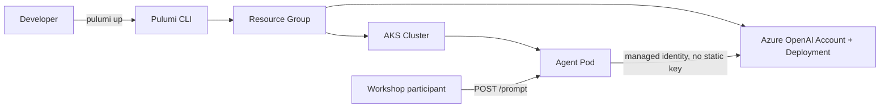
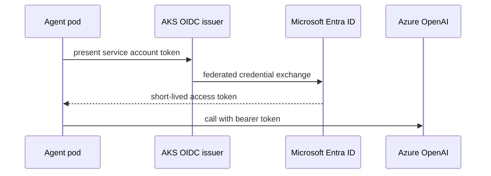

# AI Agents for IT Ops

A custom agent on AKS, calling Azure OpenAI, provisioned as one Pulumi program

<!--
2min: By the end of this session you will have provisioned an AKS cluster and an
Azure OpenAI deployment from one Pulumi program, deployed a small agent onto
that cluster, sent it a real prompt, and torn the whole stack down without a
bill running. Ninety minutes, one region, six numbered folders on disk, each
one a runnable Pulumi stack.
-->

---

<div class="absolute inset-0 flex items-center px-24 gap-20">
  <div class="flex-shrink-0">
    
  </div>
  <div class="flex-1">
    <h1 class="!text-[7rem] !leading-[1.02] !font-semibold !tracking-tight !mb-4 !text-[var(--p-primary)]">Speaker Name</h1>
    <p class="!text-[2.2rem] !leading-relaxed !m-0 opacity-90">
      Role at <strong class="!text-[var(--p-primary)]">Pulumi</strong>
    </p>
    <div class="!mt-8 flex items-center gap-8 !text-[1.5rem] opacity-70">
      <span class="flex items-center gap-2"><carbon-logo-x /> @handle</span>
      <span class="flex items-center gap-2"><carbon-logo-linkedin /> handle</span>
      <span class="flex items-center gap-2"><carbon-logo-github /> handle</span>
    </div>
    <p class="!mt-10 !text-[1.75rem] !leading-relaxed opacity-70 !m-0">
      Two lines on what this person actually does.
    </p>
  </div>
</div>

<!-- TODO(presenter): replace photo, name, role, socials and bio -->

<!--
1min: Speaker details are unknown at build time. Swap this card for the real
presenter before delivery.
-->

---

# Housekeeping

<div class="zoom-content">

<ul class="!mt-8 !text-[1.6rem] !leading-relaxed space-y-5">
  <li>Be chatty in the chat tab</li>
  <li>Ask questions in the Q&amp;A tab</li>
  <li>The handouts tab has slides and scripts</li>
  <li>The recording link comes by email</li>
</ul>

</div>

<style scoped>
.zoom-content { zoom: 1.8; }
</style>

<!--
1min: Quick, four lines, keep it moving.
-->

---

# Today's Agenda

<div class="zoom-content">

<ul class="!mt-8 !text-[1.6rem] !leading-relaxed space-y-5">
  <li>Why a custom agent</li>
  <li>Architecture and program structure</li>
  <li>Live demo: cluster, model, credentials, agent</li>
  <li>Cost and teardown</li>
  <li>What changes for production</li>
  <li>Wrap-up and Q&amp;A</li>
</ul>

</div>

<style scoped>
.zoom-content { zoom: 1.6; }
</style>

<!--
1min: The shape of the next ninety minutes.
-->

---

# Before we start

<div class="zoom-content">

<div class="info-card">
<div class="info-card__label">You'll need</div>
<ul>
<li>An Azure subscription with Owner or Contributor rights, Azure OpenAI access enabled</li>
<li>Pulumi CLI 3.263.0 or later</li>
<li>Python 3.11+</li>
<li><code>az</code> CLI logged in, <code>kubectl</code> installed</li>
</ul>
</div>

</div>

<style scoped>
.zoom-content { zoom: 1.5; }
</style>

<!--
3min: Azure OpenAI access is the one that trips people up. It has to be
enabled on the subscription ahead of time, not something you can turn on
mid-session. If your subscription does not have it, follow along on the
recording instead.
-->

---
layout: two-cols
---

# Why a custom agent, not a managed service

A managed "AI agent" product handles the loop for you, and hides where your prompts and your infrastructure state actually live.

- You own the runtime: the container, the identity, the network path
- No vendor-specific agent framework to learn or migrate off later
- The same Pulumi program that stands up your cluster stands up the model

::right::

Full control costs you the plumbing. That is the trade this workshop makes visible: five folders of infrastructure to get one prompt to one model, safely.

<!--
5min: Say plainly that this is more code than clicking through a managed
agent console. The payoff is that every piece (cluster, model, identity,
container) is a Pulumi resource you can read, review, and diff, not a
black box behind someone else's API.
-->

---
layout: diagram
---

# Architecture



<!--
6min: One resource group, two Azure services, one pod in between. The arrow
that matters is the one from the pod to Azure OpenAI: it carries a
short-lived token from a managed identity, never an API key. Walk the
diagram left to right before touching a terminal.
-->

---
layout: code
---

# Pulumi program structure

Six numbered folders, one per demo step, two providers.

```python
# 02-aks-cluster/__main__.py
oidc_issuer_profile=containerservice.ManagedClusterOIDCIssuerProfileArgs(
    enabled=True,
),
security_profile=containerservice.ManagedClusterSecurityProfileArgs(
    workload_identity=containerservice.ManagedClusterSecurityProfileWorkloadIdentityArgs(
        enabled=True,
    ),
),
```

<!--
5min: `pulumi-azure-native` builds the cluster and the model; `pulumi-kubernetes`
deploys into it once it exists. Point out the OIDC issuer and workload
identity flags here: they are what step 4's credential-free auth depends on,
turned on from the very first cluster resource.
-->

---
layout: section
---

# Live demo

## Six folders, six `pulumi up` runs

<!--
1min: Section divider. From here on we are in the terminal.
-->

---
layout: code
---

# Live demo: the AKS cluster

```bash
cd 02-aks-cluster && pulumi up --stack dev
```

Verify:

```bash
az aks show --resource-group rg-itops-agent-aks-azure-openai --name itops-agent-aks
```

- `ManagedCluster`, 2 nodes, `Standard_D2s_v5`, Kubernetes 1.31
- OIDC issuer and workload identity already enabled

<!--
10min: This step takes 5-10 minutes to provision, so it is pre-provisioned
before the session and this slide narrates it from a recording rather than
waiting on it live. If it does run live, this is the moment to talk through
the diagram again while Azure catches up. The `az aks show` verification is
the same command whether it ran live or ahead of time.
-->

---
layout: code
---

# Live demo: Azure OpenAI

```bash
cd 03-azure-openai && pulumi up --stack dev
```

Verify:

```bash
az cognitiveservices account show
az cognitiveservices account deployment list
```

```python
properties=cognitiveservices.AccountPropertiesArgs(
    custom_sub_domain_name=ACCOUNT_NAME,
    disable_local_auth=True,
),
```

<!--
9min: `disable_local_auth=True` is the line worth pausing on: this account
never issues an API key at all, by construction. GPT-4o, version 2024-11-20,
GlobalStandard SKU, capacity 10. Azure OpenAI quota approval can take days for
a fresh subscription, which is the other reason this step is usually
pre-provisioned; narrate from the recording if quota was not available ahead
of time.
-->

---
layout: diagram-right
---

# Credentials without secrets

- A user-assigned managed identity, not a service principal with a stored password
- A federated identity credential trusts the AKS OIDC issuer for one Kubernetes service account
- A role assignment grants that identity "Cognitive Services OpenAI User", scoped to the account
- Grep this program and the agent deployment for `accessKey` or `apiKey`: nothing

::diagram::



<!--
8min: cd 04-workload-identity && pulumi up --stack dev, after copying the
oidcIssuerUrl output from step 2 and the accountId output from step 3 into
Pulumi.dev.yaml. Verify with az role assignment list --assignee
<identityClientId>. This step is the fiddliest of the six to get right live,
if the OIDC exchange does not want to cooperate in the room, fall back to a
short-lived ESC-issued key shown once on screen, and say clearly that a
persisted static secret is never the right answer, even as a fallback.
-->

---
layout: code
---

# Live demo: deploying the agent

```bash
cd 05-agent-deployment && pulumi up --stack dev
```

```python
k8s_provider = k8s.Provider("itops-agent-k8s", kubeconfig=kubeconfig)
annotations={"azure.workload.identity/client-id": identity_client_id},
labels={"azure.workload.identity/use": "true"},
```

- `Namespace`, `ServiceAccount`, `Deployment`, `Service` (`ClusterIP`, no public IP)
- Container image built and pushed before the session

<!--
9min: Copy the identityClientId output from step 4 and the endpoint output
from step 3, plus the pushed image reference, into Pulumi.dev.yaml first.
ClusterIP only: a LoadBalancer here would provision a billable public IP
nobody needs for a workshop demo. The image was built and pushed ahead of
time so this step is a scheduling wait, not a docker build, while the room
watches.
-->

---
layout: code
---

# Live demo: a real call, end to end

```bash
kubectl get pods -n itops-agent
kubectl port-forward svc/itops-agent 8080:80 -n itops-agent
```

```bash
curl -X POST localhost:8080/prompt \
  -H 'Content-Type: application/json' \
  -d '{"prompt": "Say hello from AKS"}'
```

<!--
8min: This is the payoff slide: a pod running on the cluster we just built,
answering a prompt using a token it obtained without ever holding an API key.
Read the JSON response out loud when it comes back. If the port-forward is
flaky in the room, this is the one command worth a second attempt live rather
than falling back to the recording.
-->

---
layout: statement
---

# A month of this left running: **$150-$300**. One session, torn down: **a few dollars.**

<!--
4min: Directional figures from two Azure pricing pages, read 2026-09-22, not
a Pulumi-published number: a small 2-3 node AKS cluster plus workshop-scale
GPT-4o token volume. The monthly number only matters if teardown gets
skipped, which is exactly what the next slide exists to prevent.
-->

---
layout: code
---

# Live demo: destroy and verify

```bash
06-teardown/teardown.sh
```

```bash
az resource list --resource-group rg-itops-agent-aks-azure-openai --output tsv
```

- Destroys 05 → 04 → 03 → 02 → 01, in that order
- Purges any soft-deleted Cognitive Services account so the name can be reused

<!--
7min: The script runs pulumi destroy --yes --stack dev in each folder in
strict reverse dependency order. The resource-list check should come back
empty. Azure Cognitive Services accounts soft-delete by default, which blocks
reusing the same account name on the next delivery. The purge step exists
specifically for the second regional session already on the calendar.
-->

---
layout: two-cols
---

# What to change for production

- Network policy restricting pod-to-pod traffic inside the cluster
- Private endpoints on the Azure OpenAI account instead of a public endpoint
- Quota and rate-limit handling in the agent itself, not just at the Azure layer

::right::

Nothing in this demo is wrong for a workshop and nothing in it is a production checklist. Say that plainly before anyone copies the code into a real deployment.

<!--
4min: This is the "what we skipped and why" slide. None of these three are
hard to add. They are just out of scope for ninety minutes and a live
demo, and pretending otherwise would be the wrong lesson to teach.
-->

---

# What you built

<div class="zoom-content">

<ul class="!mt-8 !text-[1.6rem] !leading-relaxed space-y-5">
  <li>Provisioned an AKS cluster and an Azure OpenAI deployment from one Pulumi program</li>
  <li>Authenticated a workload to Azure OpenAI with managed identity, no static secret, ever</li>
  <li>Deployed a small containerized agent and had it make a real call to the model</li>
  <li>Tore the entire stack down and verified nothing billable was left running</li>
</ul>

</div>

<style scoped>
.zoom-content { zoom: 1.4; }
</style>

<!--
2min: The brief names three learning outcomes in its slide outline but lists
four in its learning-outcomes section; this recap carries all four, since all
four are true of what the room just watched.
-->

---

# Where to go next

<div class="grid grid-cols-3 gap-8 mt-8">
  <div class="flex flex-col items-center text-center">
    <div class="!text-[1.3rem] font-semibold mb-3">Pulumi Community Slack</div>
    <div class="p-2 bg-white rounded-lg" style="width: 8rem; height: 8rem;"><QRCode data="https://slack.pulumi.com" dark="#000000" /></div>
  </div>
  <div class="flex flex-col items-center text-center">
    <div class="!text-[1.3rem] font-semibold mb-3">Pulumi Cloud, free tier</div>
    <div class="p-2 bg-white rounded-lg" style="width: 8rem; height: 8rem;"><QRCode data="https://app.pulumi.com/signup" dark="#000000" /></div>
  </div>
  <div class="flex flex-col items-center text-center">
    <div class="!text-[1.3rem] font-semibold mb-3">This workshop's code</div>
    <div class="p-2 bg-white rounded-lg" style="width: 8rem; height: 8rem;"><QRCode data="https://github.com/pulumi/workshops/pull/230" dark="#000000" /></div>
  </div>
</div>

<!--
2min: The repo QR points at this workshop's pull request rather than a
tree URL on main, because the itops-agent-aks-azure-openai folder is not
merged to main yet at build time. Swap it for the tree URL once merged.
-->

---
layout: end
---

# Thank you.

<div class="grid grid-cols-2 gap-10 mt-10">
  <div class="flex flex-col items-center text-center">
    <div class="p-2 bg-white rounded-lg" style="width: 7rem; height: 7rem;"><QRCode data="https://github.com/pulumi" dark="#000000" /></div>
    <div class="mt-2 !text-[1rem] opacity-70">Speaker: replace with presenter's GitHub or LinkedIn</div>
  </div>
  <div class="flex flex-col items-center text-center">
    <div class="p-2 bg-white rounded-lg" style="width: 7rem; height: 7rem;"><QRCode data="https://github.com/pulumi/workshops/pull/230" dark="#000000" /></div>
    <div class="mt-2 !text-[1rem] opacity-70">Workshop repo</div>
  </div>
</div>

<!-- TODO(presenter): replace the speaker QR target with the real presenter's handle -->

<!--
2min: This slide stays on screen through Q&A, so it carries the links people
will actually use. Questions in the Q&A tab, as covered in housekeeping.
-->