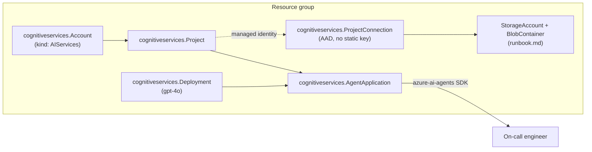

# AI Agents for IT Ops

Standing up a managed agent in Microsoft Foundry, with Pulumi

<!--
[0:00-2:00] Welcome. This workshop is about the managed path: instead of running
an agent yourself on a cluster, you hand the runtime to Microsoft Foundry and
provision it as Pulumi code. By the end you will have a Foundry project, a
managed agent, a real IT-ops runbook it can read, and a clean teardown.
-->

---
layout: default
---

<div class="flex h-full items-center">
  
  <div class="ml-12">
    <h1 class="text-[var(--p-primary)]">Speaker Name</h1>
    <p>Role at <strong>Pulumi</strong></p>
    <p class="opacity-70">@handle · linkedin.com/in/handle</p>
    <p class="mt-6">Two lines on what this speaker actually does, filled in once
    a presenter is assigned to the December 9 or the regional delivery.</p>
  </div>
</div>

<!-- TODO(presenter): replace photo, name, role, socials and bio -->

<!--
[2:00-4:00] Speaker introduction. No real speaker is assigned to either
delivery yet, so this slide and its photo are placeholders. Whoever presents
should swap this before going on stage.
-->

---
layout: default
---

# Housekeeping

- Chat: be chatty, ask anything
- Q&A tab: save questions you want answered live
- Handouts tab: slides and the demo repo
- Recording goes out by email after the session

<!--
[4:00-5:00] Housekeeping. Four lines, said quickly. Point at the tabs the
platform actually has for this delivery.
-->

---
layout: default
---

# Agenda

- Managed vs. self-managed agents
- Architecture: project, agent, connected data
- Where Pulumi's Foundry support stands today
- Live demo: build, connect, exercise, tear down
- Cost and cleanup
- Recap and where to find the code

<!--
[5:00-6:00] Agenda. Six lines, matching the sections that follow in order.
-->

---
layout: default
---

# "Why did the storage account cost more than the model calls?"

A question from the AKS workshop's Q&A. Nobody had budgeted for the cluster
the agent was running on.

<!--
[6:00-8:00] The hook. In the sibling AKS workshop, most of the surprise cost
and complexity came from the compute the agent needed to live somewhere, not
from the model itself: node pools, load balancers, an ingress controller. A
managed agent runtime removes that whole layer. That is the promise of this
workshop, and it is worth stating before naming the product.
-->

---
layout: two-cols
---

::left::

# A self-managed agent

The AKS sibling workshop's shape

- You provision the cluster
- You run the agent's container
- You patch it, scale it, and watch it
- The agent is one more workload on infrastructure you already operate

::right::

# A Foundry-managed agent

This workshop's shape

- Microsoft Foundry runs the agent
- You provision the project and the agent definition
- Foundry handles the runtime, scaling, and patching
- You still own the tools and data it connects to

<!--
[8:00-14:00] Contrast the two workshops directly. The AKS workshop is "you
run the agent"; this one is "Foundry runs the agent, you provision the
policy and the connections." Neither is universally right: self-managed
gives you the runtime, which matters if you need a custom base image or a
specific network posture. Managed gives you less to operate, which matters
for a team that does not want to own agent infrastructure. Say both, then
land on: this workshop is for teams choosing the second.
-->

---
layout: diagram
---

# What gets provisioned



<!--
[14:00-20:00] Walk the diagram left to right: the account and project are the
Foundry surface Pulumi provisions. The deployment is the underlying GPT-4o
model. The agent application is the managed agent itself, registered as a
first-class Azure resource. The connection to blob storage uses the
project's own managed identity, so there is no static key anywhere in this
stack. The on-call engineer talks to the agent through the azure-ai-agents
SDK, not through Pulumi; Pulumi's job ends at provisioning.
-->

---
layout: default
---

# Where Pulumi's Foundry support actually stands

- `azure.aifoundry.Project` / `.Hub` in the classic provider: **legacy**,
  incompatible with the current, non-hub Foundry
- The gap we flagged in September: standalone project support and
  `allowProjectManagement`, tracked as
  [pulumi-azure-native#4354](https://github.com/pulumi/pulumi-azure-native/issues/4354)
- That gap closed. `cognitiveservices.Account` now takes
  `allow_project_management=True`, and `cognitiveservices.Project` provisions
  a real, non-legacy project
- What is still not Pulumi-native: the agent's *behavior*, meaning the
  actual conversation and tool-calling loop, comes from the `azure-ai-agents` SDK,
  not a Pulumi resource. That split is normal for a managed service, the
  same way Pulumi provisions an AKS cluster but a workload still gets
  deployed onto it separately

<!--
[20:00-25:00] This is the honest-state slide. Say plainly that the classic
provider's Foundry resources are a dead end, name the issue we tracked, and
say it closed by the time we built this. Then draw the real boundary: Pulumi
provisions the account, the project, the model deployment and the agent
registration; the SDK is what makes the agent actually answer a question.
That is not a workaround, it is how Foundry is built. Do not present this as
"we used the fallback." We did not need to.
-->

---
layout: default
---

# Before we start: what you need

- An Azure subscription with **Foundry access enabled**. Some subscriptions
  need prior approval, so this had to be requested ahead of time
- Pulumi CLI 3.264.0 or later, Python 3.11+, `az` CLI logged in
- This repo, checked out locally

<!--
[25:00-28:00] Prerequisites, said once so nobody is stuck mid-demo. Foundry
access approval is the one that can bite: if a participant's subscription
was not pre-approved, they watch rather than follow along today.
-->

---
layout: section
---

# Demo

## Five steps, one resource group, one teardown

<!--
[28:00-29:00] Section divider. Five terminal steps, narrated as we go.
-->

---
layout: code
---

# Step 1 · The Foundry project

```bash
cd 01-foundry-project
pulumi stack init dev
pulumi up
```

Creates the resource group, a `cognitiveservices.Account` (kind
`AIServices`, `allow_project_management=True`), a `cognitiveservices.Project`,
and a role assignment granting the deploying user "Foundry User".

<!--
[29:00-41:00] Twelve minutes, the longest single step, because this is the
one that used to be broken. If `pulumi up` hits a 500 creating the Project
resource, that is a known intermittent issue even after the underlying gap
was fixed. Say so if it happens, retry once, and if it fails a second time
fall back to `az cognitiveservices account project create` followed by
`pulumi import` rather than retrying blindly. Do not let the audience think
this is a new failure.
-->

---
layout: code
---

# Step 2 · The managed agent

```bash
cd ../02-create-agent
pulumi stack init dev
pulumi config set accountName "$(pulumi stack output accountName --cwd ../01-foundry-project)"
pulumi config set projectName "$(pulumi stack output projectName --cwd ../01-foundry-project)"
pulumi config set resourceGroupName "$(pulumi stack output resourceGroupName --cwd ../01-foundry-project)"
pulumi up
```

Deploys `gpt-4o` (`2024-11-20`) and registers a
`cognitiveservices.AgentApplication`. The agent exists as an Azure resource,
but it cannot answer anything yet.

<!--
[41:00-51:00] Ten minutes. The config values come from step 1's stack
outputs, chained across folders the way the AKS sibling workshop also does
it, rather than hardcoding names. Land the point from the "where Pulumi's
support stands" slide again here: after this step, the agent exists, but it
is not connected to anything and cannot yet answer an on-call question.
That comes next.
-->

---
layout: code
---

# Step 3 · Connect a real data source

```bash
cd ../03-tool-connection
pulumi stack init dev
pulumi config set accountName "$(pulumi stack output accountName --cwd ../01-foundry-project)"
pulumi config set projectName "$(pulumi stack output projectName --cwd ../01-foundry-project)"
pulumi config set resourceGroupName "$(pulumi stack output resourceGroupName --cwd ../01-foundry-project)"
pulumi config set projectPrincipalId "$(pulumi stack output projectPrincipalId --cwd ../01-foundry-project)"
pulumi up
python upload_runbook.py
```

A storage account, a blob container, and a `cognitiveservices.ProjectConnection`
authenticated with the project's own managed identity, not a static key.

<!--
[51:00-61:00] Ten minutes. The role assignment grants "Storage Blob Data
Reader" to the project's managed identity, which is why projectPrincipalId
has to come from step 1's output. `upload_runbook.py` is a plain script, not
part of the Pulumi program. It puts a real runbook file in the container so
the agent has something true to read in step 4. Verify with
`az cognitiveservices account project connection list` and
`az storage blob list` if there is time; otherwise trust `pulumi up`'s own
output.
-->

---
layout: code
---

# Step 4 · Ask it something real

```bash
cd ../04-exercise-agent
pip install -r requirements.txt
export FOUNDRY_PROJECT_ENDPOINT=$(pulumi stack output projectEndpoint --cwd ../01-foundry-project)
export MODEL_DEPLOYMENT_NAME=itops-agent-gpt-4o
python exercise_agent.py
```

"The web frontend is returning 502s. What do I do?" Answered by a
`FunctionTool` that looks the question up in the runbook we just uploaded.

<!--
[61:00-71:00] Ten minutes. This step has no Pulumi in it at all, on purpose:
it uses the azure-ai-agents SDK directly against the project endpoint, which
is the point of the earlier "where Pulumi's support stands" slide made
concrete. Read the agent's answer aloud and point at the line that quotes
the runbook. That is the proof this worked, not just that the script exited
zero.
-->

---
layout: default
---

# Cost reality check

- GPT-4o (Global Standard): $2.50 / 1M input tokens, $10.00 / 1M output
  tokens. Re-verify against azure.microsoft.com/pricing before every
  delivery, since this changes without much notice
- Foundry Agent Service's own per-agent pricing is usage-based on top of
  that (storage, code interpreter, search tools). We could not pull an
  exact number from a plain page fetch this run, so treat it as an open
  question rather than a quoted total
- This workshop's own footprint: one model deployment, one small storage
  account, torn down inside the session

<!--
[71:00-76:00] Five minutes. Do not present a total dollar figure with false
confidence. Say plainly that the per-agent Foundry pricing was not sourced
to a number this run, and that the token cost is directional. The one
confident claim is the last one: whatever this costs, it does not outlive
the session.
-->

---
layout: code
---

# Step 5 · Teardown and verification

```bash
cd ..
./05-teardown/teardown.sh
```

Runs `pulumi destroy` across all three stacks in reverse order, then checks
that nothing billable remains.

<!--
[76:00-84:00] Eight minutes. Walk through what the script actually checks:
`az resource list --resource-group rg-itops-agent-foundry-managed` should
come back empty, and no soft-deleted Cognitive Services account should
linger and keep billing. This is the step people skip when they are in a
hurry to end a workshop. Do not skip it here.
-->

---
layout: default
---

# What you can do now

1. Explain when a managed agent runtime beats running your own
2. Provision a Foundry project and a managed agent as Pulumi code
3. Connect it to a real tool or data source with no static key
4. Tear it down and verify nothing billable remains

<!--
[84:00-87:00] Recap, matching the four learning outcomes from the workshop
page one for one. Ask the room which of the four feels least solid and spend
the last few minutes there instead of reading through all four evenly.
-->

---
layout: default
---

# Keep going

<div class="grid grid-cols-3 gap-8 mt-8">
  <div class="text-center">
    <div class="w-40 h-40 mx-auto">
      <QRCode data="https://slack.pulumi.com" />
    </div>
    <p class="mt-2">Pulumi Community Slack</p>
  </div>
  <div class="text-center">
    <div class="w-40 h-40 mx-auto">
      <QRCode data="https://app.pulumi.com/signup" />
    </div>
    <p class="mt-2">Pulumi Cloud, free tier</p>
  </div>
  <div class="text-center">
    <div class="w-40 h-40 mx-auto">
      <QRCode data="https://github.com/pulumi/workshops/pull/232" />
    </div>
    <p class="mt-2">This workshop's code (PR #232)</p>
  </div>
</div>

<!--
[87:00-88:30] Follow-up. The repo QR points at this build's pull request
rather than a merged tree/main path, since the folder is not on main yet.
Update this to the tree/main link once the PR merges.
-->

---
layout: end
---

# Questions?

<div class="grid grid-cols-2 gap-8 mt-8">
  <div class="text-center">
    
    <div class="w-32 h-32 mx-auto mt-4">
      <QRCode data="https://github.com/pulumi/workshops/pull/232" />
    </div>
    <p class="mt-2">Code and tracking issues</p>
  </div>
  <div class="text-center">
    <div class="w-32 h-32 mx-auto">
      <QRCode data="https://github.com/pulumi/pulumi-azure-native/issues/4354" />
    </div>
    <p class="mt-2">Track full Foundry support</p>
  </div>
</div>

<!-- TODO(presenter): replace speaker photo, name, and social QR before delivery -->

<!--
[88:30-90:00] Closing slide, left on screen during questions. Both QR codes
are real and confirmed reachable: the pull request for the code, and the
GitHub issue for anyone who wants to follow how Pulumi's Foundry support
keeps evolving after this workshop.
-->