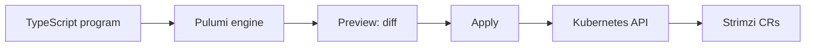
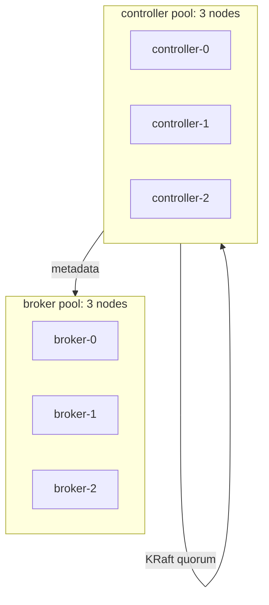
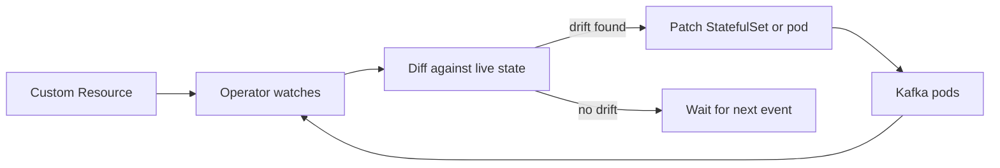

# Running Apache Kafka on Kubernetes

## with the Strimzi operator and Pulumi

Speaker Name · Role, Pulumi

<!--
1 min. Welcome everyone. Today we provision a real Kafka cluster on
Kubernetes, in KRaft mode, no ZooKeeper, and manage the whole thing as
Pulumi code: cluster, operator, topics, clients, a live scale, a live
upgrade, and a clean teardown.
-->

---
layout: default
---

# Speaker

<div class="flex gap-8 items-center">

<div>

<h1 class="text-primary">Speaker Name</h1>

Role at **Pulumi**

@handle · linkedin.com/in/handle

Works on Kubernetes and Kafka infrastructure, and has been running Strimzi
in production for two years.

</div>
</div>

<!-- TODO(presenter): replace photo, name, role, socials and bio -->

<!--
1 min. One speaker slide; the brief did not name a co-presenter, so this
placeholder is the only one. Swap the photo, name, and bio before the talk.
-->

---
layout: default
---

# Before we start

- Chat tab for side comments, Q&A tab for questions
- Slides and scripts are in the handouts tab
- The session is recorded; a link goes out by email afterward

<!--
1 min. Point people at the right tab for questions so we are not
interrupted mid-demo, and tell them where the material lands afterward.
-->

---
layout: default
---

# Agenda

- Why Kafka on Kubernetes is hard without an operator
- Strimzi and why it is a safe bet in 2026
- Why Pulumi instead of raw manifests
- Live demo: cluster, cluster, topic, clients, scale, upgrade, teardown
- Recap and where to go next

<!--
1 min. This is the shape of the next 90 minutes. Everything after the
demo divider maps to a folder in the repo, in this order.
-->

---
layout: default
---

# Prerequisites

- Docker, `kind`, `kubectl`, and the Pulumi CLI installed
- Node.js for the TypeScript programs in each demo folder
- `pulumi login` against a Pulumi Cloud account (the free tier works)
- Clone `pulumi/workshops`, folder `kafka-on-kubernetes-strimzi`

<!--
2 min. Give people a minute to check these off. Everything runs locally
against a kind cluster, so no cloud account or bill.
-->

---
layout: statement
---

# An operator can restart a broker at 2 a.m. so nobody has to.

<!--
4 min. Open with the actual failure mode. Kafka on Kubernetes without an
operator means someone hand-writing StatefulSets, PodDisruptionBudgets,
and a runbook for every broker restart, storage class, and version bump.
The first time a node drains during a rolling upgrade and a broker comes
back with the wrong config, that person is awake fixing it. A StatefulSet
gives you stable pod identity and ordered rollout; it does not know what a
partition leader is, or that draining two brokers from the same rack at
once loses a replica set. Kafka's operational rules live above the object
Kubernetes understands, and that gap is a person's job until an operator
fills it.
-->

---
layout: default
---

# Strimzi closes that gap

- Kafka-aware controller: partitions, ISR, and rack awareness, not just pods
- CNCF Sandbox project; reached its 1.0.0 release in 2026
- KRaft only going forward: ZooKeeper is gone from the supported path
- Backed by Red Hat's own Kafka-on-Kubernetes offering

<!--
4 min. Strimzi is not a hobby project: it has been running in production
for years, entered the CNCF Sandbox, and shipped 1.0.0 this year, which is
usually the signal a maintainer team gives when they consider the API
surface stable enough to commit to. It ships Custom Resources for the
cluster, node pools, topics, users, and connectors, and a controller that
reconciles all of them against the actual state of the brokers, not just
the pods. That is the layer a hand-rolled StatefulSet does not have.
-->

---
layout: diagram-right
---

# So why not just `kubectl apply` the CRs?

- You could. Strimzi's CRs are plain YAML.
- But this workshop already needs seven ordered steps, sharing config
- Pulumi gives that a real language: loops, conditionals, shared config, outputs
- One `pulumi up` per step, one `pulumi destroy` to undo it, in order

::diagram::



<!--
5 min. `kubectl apply` works until you need to compute a bootstrap
server name from a cluster name, or share a namespace across four
folders, or destroy things in the exact reverse order they were created.
Pulumi's program is real TypeScript: the demo folders read each other's
stack outputs instead of copy-pasting names. The other half is the loop
on the left: preview always runs before apply, so you see the diff
against the Kafka CR's actual spec before anything changes, which matters
a great deal once you are editing a live cluster in section six.
-->

---
layout: section
---

# Live demo

## Seven folders, one Kafka cluster, start to finish

<!--
1 min. Everything from here maps to a numbered folder in the repo. Follow
along locally if you want; the commands are on every slide.
-->

---
layout: code
---

# 01: kind cluster and the Strimzi operator

```bash
cd 01-cluster
npm install
pulumi up
```

```bash
kubectl --context kind-kafka-workshop-demo get pods -n kafka
```

<!--
8 min. This provisions a kind cluster named kafka-workshop-demo, one
control-plane node and three workers, then installs the Strimzi Cluster
Operator from its OCI Helm chart,
oci://quay.io/strimzi-helm/strimzi-kafka-operator, version 1.2.0, into the
kafka namespace, using Pulumi's helm.v4.Chart resource. Run pulumi up and
watch it build the kind cluster first, then the Helm release. The kubectl
command at the end should show one strimzi-cluster-operator pod running;
that is the controller that will reconcile every CR we create next. No
Kafka yet, just the thing that will manage it.
-->

---
layout: diagram-left
---

# 02: node pools and a KRaft cluster

```bash
cd 02-kafka
npm install
pulumi up
```

```bash
kubectl get kafka demo-cluster -n kafka
```

::diagram::



<!--
9 min. This is the heart of the cluster: two KafkaNodePool resources,
controller with three controller-only nodes and broker with three
broker-only nodes, plus a Kafka custom resource named demo-cluster,
apiVersion kafka.strimzi.io/v1, running Kafka 4.2.1 at metadataVersion
4.2-IV1. No ZooKeeper anywhere: the controller pool runs the KRaft quorum
that used to be ZooKeeper's job, and the broker pool only serves traffic.
Wait for pulumi up to finish, then run the kubectl command; you want to
see Ready True in the status before moving on, which can take a couple of
minutes as the KRaft quorum forms and the brokers register.
-->

---
layout: code
---

# 03: a topic, as a Custom Resource

```bash
cd 03-topic
npm install
pulumi up
```

```bash
kubectl get kafkatopic demo-events -n kafka
```

<!--
5 min. A KafkaTopic resource named demo-events, three partitions,
replication factor three. This is the point of the Custom Resource
approach: creating a topic is now a Pulumi resource with a diff and a
destroy, not a kafka-topics.sh command someone ran once and forgot. The
Topic Operator, part of the Strimzi operator we installed in step one,
watches this CR and creates the real topic on the brokers.
-->

---
layout: code
---

# 04: a consumer, and a live producer

```bash
cd 04-clients
npm install
pulumi up
```

```bash
kubectl --context kind-kafka-workshop-demo logs -n kafka -l app=demo-consumer -f
```

```bash
kubectl --context kind-kafka-workshop-demo -n kafka run demo-producer -it --rm \
  --restart=Never --image=quay.io/strimzi/kafka:1.2.0-kafka-4.2.1 -- \
  bin/kafka-console-producer.sh \
  --bootstrap-server demo-cluster-kafka-bootstrap:9092 --topic demo-events
```

<!--
7 min. pulumi up here only creates the consumer: a long-running Deployment
that tails demo-events and logs what it reads. The producer is not a
Pulumi resource, it is a one-off interactive pod you run by hand with
kubectl run, using the same Strimzi image the brokers run, so the Kafka
CLI tools are guaranteed to match. Open the consumer logs in one terminal,
run the producer command in another, type a few lines, and watch them
show up in the consumer's tail. This is the moment the room sees data
actually moving through the cluster we built.
-->

---
layout: code
---

# 05: scale the broker pool live

```bash
05-scale-brokers/scale-brokers.sh
```

```bash
# equivalent to, against the 02-kafka stack:
pulumi config set brokerReplicas 4 --cwd ../02-kafka
pulumi up --yes --cwd ../02-kafka
```

<!--
8 min. Keep the consumer log from step four open and visible; the point
of this slide is that message flow does not pause. The script sets
brokerReplicas to 4 on the 02-kafka stack and runs pulumi up. The Cluster
Operator reconciles the broker KafkaNodePool to the new replica count, a
fourth broker pod comes up and joins the cluster, and the script polls
kubectl until all four report Running. Partition rebalancing onto the new
broker is out of scope for this workshop; the point here is that the
broker joins and the cluster stays healthy, not rebalancing partitions
onto it.
-->

---
layout: code
---

# 06: upgrade Kafka, live, in two steps

```bash
06-rolling-upgrade/rolling-upgrade.sh
```

```bash
# step 1: bump the Kafka version, metadataVersion stays put
# step 2: once every pod is on 4.3.1, bump metadataVersion
```

<!--
10 min. Strimzi's documented upgrade procedure for a KRaft cluster is two
sequential changes, not one. First the script changes
Kafka.spec.kafka.version from 4.2.1 to 4.3.1 while leaving metadataVersion
at 4.2-IV1; that starts a rolling restart where old and new binaries
coexist because the metadata format has not changed yet. Once every pod
reports the new version, the script bumps metadataVersion to 4.3-IV0,
which triggers a second, usually much faster restart. The script waits for
each roll to settle before moving to the next step, matching Strimzi's own
procedure rather than changing both fields in one pulumi up. Watch the
pods roll one at a time with kubectl get pods -n kafka --context
kind-kafka-workshop-demo, and the consumer log should not gap.
-->

---
layout: diagram
---

# Under the hood: the reconciliation loop



<!--
5 min. Every scale and upgrade you just watched ran through this same
loop: the Cluster Operator watches the Kafka and KafkaNodePool CRs, diffs
the spec against what is actually running, and patches only what changed.
Pulumi's own preview loop sits one layer up: it diffs your program against
Pulumi's last-known state before it ever reaches Kubernetes. Two
reconciliation loops, one inside the cluster and one outside it, and
neither is a replacement for the other.
-->

---
layout: default
---

# Where this breaks in production

- A rolling upgrade mid-incident can compound an outage, not fix it
- Cross-AZ rack awareness needs real topology labels, not guesses
- Storage class matters: a slow default class stalls broker restarts
- The operator cannot tell you your retention policy is wrong

<!--
4 min. Say the awkward part. Strimzi will happily reconcile a broken
configuration correctly. It will not stop you from setting a retention
policy that fills a disk, or from upgrading during a live incident because
the runbook says to. Rack awareness needs strimzi.io/rack labels tied to
real failure domains, and if your storage class provisions slowly, a
broker restart during an upgrade takes longer than the workshop's demo
ever showed you.
-->

---
layout: default
---

# Beyond this workshop

- Schema Registry for contract-checked messages
- Kafka Connect for streaming data in and out of other systems
- MirrorMaker 2 for cross-cluster and cross-region replication

<!--
3 min. Mention only, not a demo: Strimzi ships CRs for Kafka Connect and
MirrorMaker 2 the same way it ships them for topics and users, so the
pattern from today extends to those without a new mental model. A schema
registry is not part of Strimzi itself, but is the natural next piece once
more than one team is producing to the same topic.
-->

---
layout: code
---

# 07: tear it all down

```bash
07-teardown/teardown.sh
07-teardown/verify-clean.sh
```

<!--
3 min. teardown.sh destroys the stacks in reverse dependency order, 04
then 03 then 02 then 01, and along the way checks for leftover
strimzi.io/cluster-labeled PVCs before deleting the kind cluster in the
01-cluster destroy hook. verify-clean.sh is read-only: it confirms with
kind get clusters that kafka-workshop-demo is really gone and fixes
nothing itself. Run both so the room sees a clean state, not just a
successful pulumi destroy.
-->

---
layout: statement
---

# You built a Kafka cluster today. It scaled and upgraded without dropping a message.

<!--
3 min. Recap: an operator that understands Kafka, not just pods; a Pulumi
program that made seven ordered steps repeatable instead of a runbook;
and a cluster that took a live scale and a live version upgrade with the
consumer log never gapping. That is the actual promise from the start of
the talk, delivered.
-->

---
layout: default
---

# Keep going

<div class="grid grid-cols-3 gap-6 text-center">
<div>

<div class="w-32 h-32 mx-auto"><QRCode data="https://slack.pulumi.com" dark="#000000" /></div>

Pulumi Community Slack

</div>
<div>

<div class="w-32 h-32 mx-auto"><QRCode data="https://app.pulumi.com/signup" dark="#000000" /></div>

Pulumi Cloud, free tier

</div>
<div>

<div class="w-32 h-32 mx-auto"><QRCode data="https://github.com/pulumi/workshops/pull/244" dark="#000000" /></div>

Workshop repo (pull request, until merged)

</div>
</div>

<!--
2 min. Three QR codes, three next steps: join the community Slack, sign
up for the Pulumi Cloud free tier if you have not, and pull the repo to
run this again on your own. The repo QR points at the pull request until
it merges to main; say that out loud so nobody is confused by a page that
still shows "Open".
-->

---
layout: end
---

# Questions?

<div class="grid grid-cols-2 gap-8 items-center">
<div>

<p>Speaker Name</p>
</div>
<div class="grid grid-cols-2 gap-4">

<div class="w-24 h-24 mx-auto"><QRCode data="https://github.com/pulumi/workshops/pull/244" dark="#000000" /></div>

<div class="w-24 h-24 mx-auto"><QRCode data="https://strimzi.io/docs/operators/latest/deploying" dark="#000000" /></div>

</div>
</div>

<!-- TODO(presenter): replace speaker QR with a real LinkedIn or GitHub link -->

<!--
3 min. This slide stays up for questions, so it carries the links people
actually photograph: the repo and the Strimzi deploying-and-managing
guide, which answers most of the "does this work with my setup" questions
that come up. Swap the speaker's own QR in before presenting; it currently
just repeats the repo link as a placeholder.
-->
