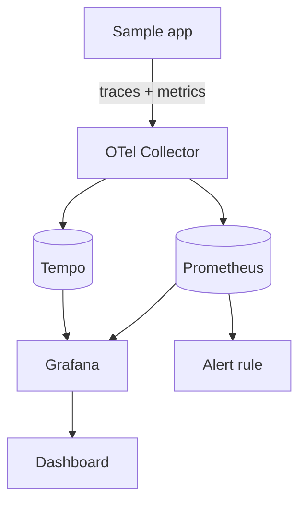
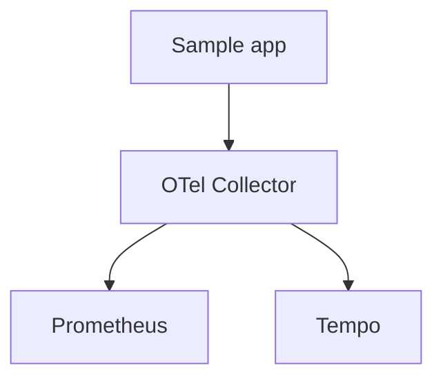

<div class="absolute inset-0 flex flex-col justify-center items-start px-20">
  <h1 class="!text-[5rem] !leading-[1.05] !font-semibold !tracking-tight !mb-6 !max-w-[95%]">
    Observability as Code
  </h1>
  <p class="!mt-1 !text-[2rem] text-[var(--p-fg-muted)] !m-0 !leading-relaxed !max-w-[90%]">
    OpenTelemetry, Prometheus and Grafana on Kubernetes with Pulumi
  </p>
  <p class="!mt-8 !text-[1.6rem] text-[var(--p-fg-muted)] !m-0 !leading-relaxed">
    Speaker name TBD &middot; Role, Pulumi
  </p>
</div>

<!--
Time budget: 1 min.
Welcome folks as they trickle in. State the promise in one sentence: by the end
of this session, you will have a working, code-defined observability stack
collecting real metrics and traces from a sample app, and you will know how to
extend it to your own workloads.
-->

---

<div class="absolute inset-0 flex items-center px-24 gap-20">
  <div class="flex-shrink-0">
    
  </div>
  <div class="flex-1">
    <h1 class="!text-[7rem] !leading-[1.02] !font-semibold !tracking-tight !mb-4 !text-[var(--p-primary)]">Speaker Name</h1>
    <p class="!text-[2.2rem] !leading-relaxed !m-0 opacity-90">
      Role at <strong class="!text-[var(--p-primary)]">Pulumi</strong>
    </p>
    <div class="!mt-8 flex items-center gap-8 !text-[1.5rem] opacity-70">
      <span class="flex items-center gap-2"><carbon-logo-github /> handle</span>
    </div>
    <p class="!mt-10 !text-[1.75rem] !leading-relaxed opacity-70 !m-0">
      A platform engineer who has stood up more observability stacks than they can count.
    </p>
  </div>
</div>

<!-- TODO(presenter): replace photo, name, role, socials and bio -->

<!--
Time budget: 1 min.
This is a placeholder slide. The brief did not name a speaker, so replace this
photo, name, role, and bio before the session runs.
-->

---

# Housekeeping

<div class="zoom-content">

<ul class="!mt-8 !text-[1.6rem] !leading-relaxed space-y-5">
  <li>Be chatty in the chat tab</li>
  <li>Ask questions in the Q&amp;A tab</li>
  <li>The handouts tab has slides and scripts</li>
  <li>The recording link comes by email</li>
</ul>

</div>

<style scoped>
.zoom-content { zoom: 1.8; }
</style>

<!--
Time budget: 1 min.
Quick and mechanical. Point at the tabs, then move on.
-->

---

# Today's Agenda

<div class="zoom-content">

<ul class="!mt-8 !text-[1.6rem] !leading-relaxed space-y-5">
  <li>Why "we have Grafana" isn't the same as "we can rebuild it"</li>
  <li>The stack we're building: Collector, Prometheus, Grafana, Tempo</li>
  <li>Standing it up with Pulumi, step by step</li>
  <li>Watching real traces and metrics land</li>
  <li>What to change on your own team on Monday</li>
  <li>Q&amp;A</li>
</ul>

</div>

<style scoped>
.zoom-content { zoom: 1.6; }
</style>

<!--
Time budget: 1 min.
Six lines, matches the six sections that follow. Don't read it verbatim, just
orient the room.
-->

---
layout: statement
---

# "We have Grafana" is not the same claim as "we can reproduce our observability stack."

<!--
Time budget: 3 min.
The hook. Most teams in the room have a Grafana instance somebody clicked
together eighteen months ago. Nobody remembers which panels were added by
hand, which alert thresholds were tuned during an incident and never
documented, or whether the dashboard JSON in git actually matches what's
live. Ask: "if your Grafana org vanished right now, how long to get back to
where you are today?" Let the silence answer it. That gap, between having
observability and being able to rebuild it, is what this workshop closes.
-->

---
layout: diagram
---

# The stack we're building



<!--
Time budget: 3 min.
Walk it left to right. The app emits traces and metrics; both go to one
place, the Collector, which is the single ingestion point. Prometheus holds
the metrics, Tempo holds the traces, Grafana reads from both. An alert rule
watches Prometheus directly. Every one of these boxes is a Pulumi resource
you'll see defined in code in the next hour, not a chart you ran once from
a terminal and then forgot about.
-->

---
layout: default
---

# Before we start

<div class="zoom-content">

<ul class="!mt-8 !text-[1.5rem] !leading-relaxed space-y-4">
  <li>Docker Desktop or an equivalent daemon running</li>
  <li><code>kind</code> v0.33.0 installed and on PATH</li>
  <li><code>kubectl</code> installed and on PATH</li>
  <li>Node.js 22 and npm</li>
  <li>Pulumi CLI, logged in (<code>pulumi whoami</code> returns something)</li>
  <li>A clone of the workshop repo, dependencies not yet installed</li>
</ul>

</div>

<style scoped>
.zoom-content { zoom: 1.5; }
</style>

<!--
Time budget: 2 min.
Check the room before typing anything. Ask for a show of hands on each item.
If more than a couple of people are missing Docker or kind, that's a
five-minute pause now rather than a fifteen-minute one mid-demo.
-->

---
layout: section
---

# Live demo

## Seven steps, one cluster, one running stack

<!--
Time budget: 1 min.
Say what's about to happen: seven numbered Pulumi projects, run in order,
each one standing up the next piece of the stack.
-->

---
layout: code
---

# Step 1: stand up the cluster

```bash
cd 01-cluster && npm install && pulumi up
```

A local `kind` cluster, plus a `monitoring` namespace and a `demo` namespace.
Nothing observability-specific yet, just the ground everything else sits on.

<!--
Time budget: 5 min.
This is a `kind` cluster (node image `kindest/node:v1.37.0`), not a managed
cloud service, chosen for zero cost and no cloud account requirement. The
Pulumi program uses `@pulumi/command` to shell out to `kind create cluster`
and `@pulumi/kubernetes` for the two namespaces. Let this one finish before
moving on; the cluster has to exist before anything else can target it.
-->

---
layout: code
---

# Step 2: Prometheus, Grafana and Tempo

```bash
cd ../02-metrics-stack && npm install
pulumi config set --secret grafanaAdminPassword <password>
pulumi up
```

Two Helm charts as `kubernetes.helm.v3.Release` resources: kube-prometheus-stack
91.8.1 and grafana/tempo 1.24.4, both defined as ordinary Pulumi resources.

<!--
Time budget: 7 min.
kube-prometheus-stack is what the brief named; Tempo is a judgment call this
build made, not something the brief asked for. The reason: step 7 ends with a
live trace waterfall, and kube-prometheus-stack has no trace store of its own.
Say that plainly rather than pretending Tempo was always in the brief.
Risk: kube-prometheus-stack can be slow to reconcile on a fresh kind node,
since it pulls a handful of large images. If this hangs, either pre-pull the
images before the session or have a talking point ready to fill 60-90 seconds
of dead air. Don't apologize for it, just talk over it.
-->

---
layout: two-cols
---

::header::

# Why a Pulumi resource instead of `helm install`

::left::

**A CLI install:**

- Lives in your shell history, or nowhere
- No preview before it changes your cluster
- No dependency graph to the rest of the stack
- Rollback means remembering the last-known-good values file

::right::

**A `helm.v3.Release` resource:**

- Lives in git, reviewed like any other change
- `pulumi preview` shows the diff before it applies
- Downstream resources can depend on its outputs
- Rollback is `pulumi up` against an older commit

<!--
Time budget: 3 min.
This is the argument for the whole workshop, said out loud once. A `helm
install` from the CLI is invisible to Pulumi's dependency graph and to
anyone reviewing your change. A `helm.v3.Release` resource is a first-class
node in the graph: other resources can depend on it, its diff shows up in
`pulumi preview`, and reverting it is reverting a commit rather than
remembering which values file you used last time.
-->

---
layout: diagram-right
---

# Step 3: the Collector sits in the middle

Plain Kubernetes resources, no Helm chart: a `ConfigMap` for the pipeline, a
`Deployment`, a `Service`, and a `ServiceMonitor` custom resource so Prometheus
finds it.

```bash
cd ../03-collector && npm install && pulumi up
```

::diagram::



<!--
Time budget: 6 min.
Everything the app emits goes to one place, the Collector, which then fans
out to Prometheus and Tempo. That's the whole reason to run a Collector
instead of pointing the app straight at Prometheus: the app's code never
needs to know where telemetry ends up.
Risk: Collector pipeline misconfiguration is the single most common failure
in this demo, because the pipeline config is a nested YAML block inside the
ConfigMap and a typo in a receiver or exporter name fails silently rather
than with a clear error. Keep a known-good ConfigMap on hand to diff against
if the collector pod isn't receiving anything. This step deliberately avoids
Helm so the pipeline config can be rendered and read back before it ever
touches the cluster.
-->

---
layout: code
---

# Step 4: instrument the sample app

```bash
cd ../04-sample-app && ./build-and-load.sh
npm install && pulumi up
```

An Express app wired with OpenTelemetry's Node SDK and auto-instrumentation,
exporting traces and metrics to the Collector over OTLP/gRPC.

<!--
Time budget: 7 min.
`build-and-load.sh` builds the app image and loads it into the kind node,
since kind doesn't pull from a registry by default. Once the Deployment is
up, exec into the collector pod's logs and point at the first trace landing;
that's the moment this stops being abstract.
Risk: venue Wi-Fi. Image pulls for the base Node image and the Collector
image both need network access on the day. Mitigate with pre-cached images,
a local registry mirror, or a recorded fallback segment as a last resort if
the room's network genuinely fails.
-->

---
layout: code
---

# Step 5: a dashboard, not a click-through

```bash
cd ../05-dashboard && npm install && pulumi up
```

A Grafana dashboard defined as a Pulumi-managed `ConfigMap`, holding the
dashboard JSON model directly. Grafana's sidecar picks it up automatically.

<!--
Time budget: 7 min.
The dashboard JSON model is versioned right alongside the resource that
provisions Grafana, so a change to the dashboard shows up in `pulumi
preview` exactly like a change to any other resource.
Risk: Grafana dashboard JSON model drift. The JSON schema for panels changes
between Grafana versions, and a dashboard built against a newer Grafana can
render broken panels on an older one. This build pins the chart version and
tests the dashboard JSON against that specific pin, not against `latest`.
-->

---
layout: code
---

# Step 6: an alert rule as code

```bash
cd ../06-alert-rule && npm install && pulumi up
```

A `PrometheusRule` custom resource watching the sample app's latency,
delivered as a `kubernetes.apiextensions.CustomResource`, same as any other
resource in the program.

<!--
Time budget: 5 min.
This is the same argument as the Helm slide, applied to an alert instead of
a chart: an alert rule written by hand in the Prometheus UI has no history
and no review. Written as a Pulumi resource, its threshold change is a diff
in a pull request, same as the code it's alerting on.
-->

---
layout: code
---

# Step 7: generate load, watch it land

```bash
cd ../07-load-and-observe && ./port-forward.sh &
./generate-load.sh
```

`port-forward.sh` opens Grafana and Prometheus locally; `generate-load.sh`
sends traffic at the sample app so the dashboard and the alert have
something real to show.

<!--
Time budget: 20 min.
This is the exploration block, not just a step: open the Grafana dashboard
from step 5, watch the metrics panel move as load lands, then open the
Tempo trace view and click into one request's full waterfall. Then check
the alert rule from step 6 in Prometheus's own alert view and, if load is
high enough, watch it fire. Give the room time to click around themselves;
this is the payoff for the previous 60 minutes.
Risk: same Wi-Fi risk as step 4, since port-forwarding depends on the
cluster staying reachable. If the room's network is a known problem, this
is the step to have a recorded fallback ready for.
-->

---
layout: two-cols
---

::header::

# What you'd change on Monday

::left::

Point this at a real workload instead of the sample app:

- Swap the app's OTel SDK config for your service's actual instrumentation
- Add the alert thresholds your team already argues about
- Fork the dashboard JSON for your service's own metrics

::right::

The pattern doesn't change:

- Every resource in `pulumi preview` before it touches a cluster
- Every dashboard and alert reviewable in a pull request
- One `pulumi up` reproduces the whole stack, not a checklist

<!--
Time budget: 2 min.
Ask the room directly: what's the one thing about your own team's
observability setup you'd change after seeing this built end to end as
code? Don't answer for them; let a couple of people say it out loud.
-->

---
layout: default
---

# Common pitfalls

- **Collector pipeline misconfiguration**: a receiver or exporter typo in
  the ConfigMap fails silently. Keep a known-good config to diff against.
- **Helm chart version drift**: pin every chart version explicitly; `latest`
  today is not the same chart as `latest` at demo time.
- **Grafana dashboard JSON model mismatches**: a dashboard built for one
  Grafana version can render broken panels on another. Test against the
  pinned version, not against whatever's newest.

<!--
Time budget: 2 min.
These three are the ones most likely to bite in front of a room. Say them
plainly rather than letting the audience discover them live.
-->

---
layout: default
---

# What you can do now

1. Provision Prometheus and an OTel Collector on Kubernetes with Pulumi's
   Kubernetes provider, Helm-chart resources included
2. Instrument an app to emit OTel traces and metrics, and confirm the
   Collector is actually receiving them
3. Deploy Grafana with Pulumi, wire up a data source, and import a working
   dashboard through a Pulumi-managed resource
4. Write a Prometheus alerting rule as code and explain how that differs
   from clicking through a UI
5. Name one thing about your own team's observability setup you'd change,
   now that you've seen it built end to end as code

<!--
Time budget: 2 min.
Read these fast; the room just watched all five happen. This slide is a
receipt, not a new lesson.
-->

---
layout: two-cols
---

::header::

# Keep going

::left::

<div class="qr-block">
<div class="w-32 h-32 mx-auto"><QRCode data="https://slack.pulumi.com" dark="#000000" /></div>
<p class="text-center !mt-2">Pulumi Community Slack</p>
</div>

<div class="qr-block !mt-6">
<div class="w-32 h-32 mx-auto"><QRCode data="https://app.pulumi.com/signup" dark="#000000" /></div>
<p class="text-center !mt-2">Pulumi Cloud, free tier</p>
</div>

::right::

<div class="qr-block">
<div class="w-32 h-32 mx-auto"><QRCode data="https://github.com/pulumi/workshops/pull/248" dark="#000000" /></div>
<p class="text-center !mt-2">This workshop's code and slides</p>
</div>

<p class="!mt-6">
The demo folders and this deck live in one pull request until it merges to
the workshop repo's main branch. The QR code above points at that pull
request.
</p>

<!--
Time budget: 1 min.
This folder hasn't merged to the workshop repo's main branch yet, so the QR
code points at the open pull request rather than a folder path on main.
Update it once the PR merges.
-->

---
layout: end
---

<div class="flex flex-col items-center gap-6">


# Questions?

<div class="flex gap-10 !mt-4">
<div class="flex flex-col items-center">
<div class="w-24 h-24"><QRCode data="https://github.com/pulumi/workshops/pull/248" dark="#000000" /></div>
<p class="!mt-1 text-sm">This workshop</p>
</div>
<div class="flex flex-col items-center">
<div class="w-24 h-24"><QRCode data="https://slack.pulumi.com" dark="#000000" /></div>
<p class="!mt-1 text-sm">Community Slack</p>
</div>
</div>

</div>

<!-- TODO(presenter): replace photo, name, role, socials and bio -->

<!--
Time budget: 10 min.
Leave this slide up for the whole Q&A block. Both QR codes stay live so
people can scan while they wait to ask.
-->
