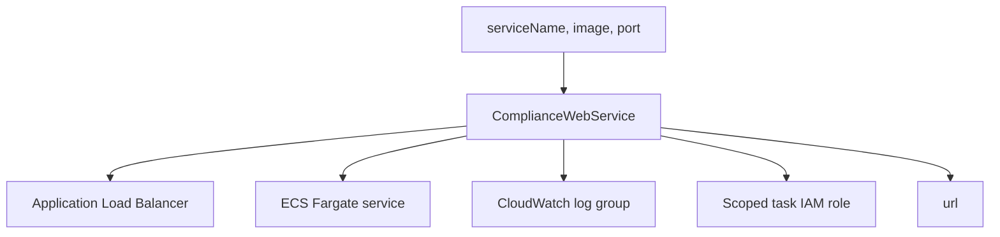
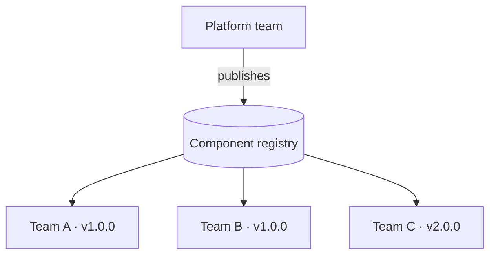

<div class="absolute inset-0 flex flex-col justify-center items-start px-20">
  <h1 class="!text-[5rem] !leading-[1.02] !font-semibold !tracking-tight !mb-6 !max-w-[95%]">
    Building a Golden Path
  </h1>
  <p class="!mt-1 !text-[2.2rem] text-[var(--p-fg-muted)] !m-0 !leading-relaxed !max-w-[90%]">
    Self-service infrastructure platforms with Pulumi
  </p>
  <p class="!mt-8 !text-[1.6rem] text-[var(--p-fg-muted)] !m-0 !leading-relaxed">
    Speaker Name · Role, Pulumi
  </p>
</div>

<!--
[1 min] Welcome. This workshop is about building one reusable Pulumi component
that a platform team publishes once, and a consuming team uses without ever
reading its internals.
-->

---

<div class="absolute inset-0 flex items-center px-24 gap-20">
  <div class="flex-shrink-0">
    
  </div>
  <div class="flex-1">
    <h1 class="!text-[7rem] !leading-[1.02] !font-semibold !tracking-tight !mb-4 !text-[var(--p-primary)]">Speaker Name</h1>
    <p class="!text-[2.2rem] !leading-relaxed !m-0 opacity-90">
      Role at <strong class="!text-[var(--p-primary)]">Pulumi</strong>
    </p>
    <div class="!mt-8 flex items-center gap-8 !text-[1.5rem] opacity-70">
      <span class="flex items-center gap-2"><carbon-logo-x /> @handle</span>
      <span class="flex items-center gap-2"><carbon-logo-linkedin /> handle</span>
    </div>
    <p class="!mt-10 !text-[1.75rem] !leading-relaxed opacity-70 !m-0">
      Two lines on what this person actually does, filled in once a speaker
      is confirmed.
    </p>
  </div>
</div>

<!-- TODO(presenter): replace photo, name, role, socials and bio. No speaker is confirmed for this workshop as of this build. -->

<!--
[1 min] Introduce yourself briefly and say what you do day to day with Pulumi
or with platform teams.
-->

---

# Housekeeping

<div class="zoom-content">

<ul class="!mt-8 !text-[1.6rem] !leading-relaxed space-y-5">
  <li>Be chatty in the chat tab</li>
  <li>Ask questions in the Q&amp;A tab</li>
  <li>The handouts tab has slides and scripts</li>
  <li>The recording link comes by email</li>
</ul>

</div>

<style scoped>
.zoom-content { zoom: 1.8; }
</style>

<!--
[2 min] Cover logistics quickly. Point out where questions go so the live
demo isn't constantly interrupted, then move on.
-->

---

# Agenda

<div class="zoom-content">

<ul class="!mt-8 !text-[1.6rem] !leading-relaxed space-y-5">
  <li>The problem: every team hand-rolling infrastructure</li>
  <li>What a golden path is</li>
  <li>Live demo: authoring and publishing a component</li>
  <li>Live demo: a team consuming it, then a breaking change</li>
  <li>What this looks like at scale</li>
  <li>Recap and Q&amp;A</li>
</ul>

</div>

<style scoped>
.zoom-content { zoom: 1.6; }
</style>

<!--
[2 min] Walk the agenda in one breath. Say up front that most of the next
90 minutes is spent in a terminal, not on slides.
-->

---
layout: statement
---

# Every team hand-rolls its own infrastructure. **Inconsistently.**

<!--
[5 min] Make this concrete: three teams at the same company each write their
own Fargate-behind-an-ALB setup. One tags its resources, one doesn't. One
scopes its IAM role tightly, one attaches a managed AdministratorAccess
policy because it was faster. None of this shows up until an audit, an
incident, or a bill. This is the problem a platform team exists to solve,
and it's also the reason "just write good docs" doesn't work: docs don't
enforce anything.
-->

---

# What a golden path is

- A **golden path**: the supported, paved way to get a common piece of
  infrastructure, with the guardrails already built in
- In Pulumi, the mechanism is a **component**: a class that wraps several
  resources behind a small, typed interface
- A consuming team sees the interface. They never see, and don't need to
  read, the resources behind it
- The platform team owns the guardrails once, centrally, instead of asking
  every consuming team to remember them

<!--
[6 min] Define "component" precisely: it's a `pulumi.ComponentResource`
subclass. Inputs and outputs are typed. Everything created inside the
constructor is a child resource, invisible to the consumer unless they go
looking. This is the mechanism the rest of the workshop demonstrates.
-->

---
layout: diagram-right
---

# One component, three guardrails

- `ComplianceWebService` takes three inputs: `serviceName`, `image`, `port`
- It returns one output: `url`
- Behind that interface: an ECS Fargate service behind an Application Load
  Balancer, a dedicated CloudWatch log group, and a task IAM role scoped to
  only what the container needs: writing its own logs
- Every resource it creates carries the platform's mandatory tags

::diagram::



<!--
[6 min] Walk the diagram left to right. The consumer only ever sees the left
box and the output on the right; everything in the middle is the platform
team's decision, made once. Point out that the IAM role only grants
CreateLogStream and PutLogEvents on that service's own log group, nothing
broader.
-->

---
layout: section
---

# Live demo

## Authoring, publishing, consuming, and a breaking change

<!--
[1 min] Frame the demo: three folders, one component and two consumers, run
from a terminal for the rest of the workshop.
-->

---
layout: code
---

# Step 1: the component's interface

```ts
export interface ComplianceWebServiceArgs {
    serviceName: pulumi.Input<string>;
    image: pulumi.Input<string>;
    port: pulumi.Input<number>;
}

export class ComplianceWebService extends pulumi.ComponentResource {
    public readonly url: pulumi.Output<string>;
    constructor(name: string, args: ComplianceWebServiceArgs,
                opts?: pulumi.ComponentResourceOptions) {
        super("platform-golden-path:index:ComplianceWebService",
              name, args, opts);
```

<!--
[7 min] This is `01-component/complianceWebService.ts`. Three inputs, one
output: that's the entire contract a consuming team has to understand.
`PulumiPlugin.yaml` in the same folder is what makes this discoverable as a
package rather than just a TypeScript file; show it briefly if there's time.
-->

---
layout: code
---

# Step 2: the component's body, and checking it

```bash
cd 01-component && npm install
npx tsc --noEmit                 # confirms the component compiles
pulumi package get-schema .      # confirms it's discoverable and well-formed
```

- The constructor creates a `LogGroup`, a task `Role` and `RolePolicy`, an
  `ecs.Cluster`, an `ApplicationLoadBalancer`, and a `FargateService`
- Every one of them is a **child resource** (`{ parent: this }`), so none
  of it shows up as a top-level resource for the consumer to manage

<!--
[9 min] Run both commands live. `pulumi package get-schema` is the check
that matters here: it's what proves the component is well-formed enough to
be discovered and instantiated by name, which is the whole point of a
golden path. Its output names `ComplianceWebService` with the three inputs
and the one output, matching the diagram from three slides back.
-->

---

# Publishing for discovery

<div class="grid grid-cols-2 gap-8 !mt-6 !text-[1.35rem]">
<div>

**With a Pulumi Cloud Pro/Enterprise org:**

```bash
git tag v1.0.0
pulumi package publish \
  github.com/<org>/compliance-web-service@1.0.0
```

Publishes to the IDP Private Registry. A consuming team runs
`pulumi package add` and never touches this repo.

</div>
<div>

**What this build actually used:**

```yaml
packages:
  compliance-web-service: ../01-component
```

A local path, in the consumer's own `Pulumi.yaml`. Resolves the
same schema, no registry or network required.

</div>
</div>

<!--
[7 min] Be straightforward about this one: this build had no Pulumi Cloud
Pro/Enterprise org available, so `pulumi package publish` was never
executed. The local-path fallback on the right is what every check in this
demo actually ran, and it resolves a component's schema the same way a
published-and-discovered one would. If you have a registry available,
rehearse the left-hand command before presenting live.
-->

---
layout: code
---

# Step 4: a consuming team, in 12 lines

```yaml
name: acme-checkout
runtime: yaml
packages:
  compliance-web-service: ../01-component
resources:
  checkout:
    type: compliance-web-service:ComplianceWebService
    properties:
      serviceName: checkout
      image: nginx:latest
      port: 80
outputs:
  url: ${checkout.url}
```

<!--
[9 min] This is the entirety of `02-consume/Pulumi.yaml`. Run
`pulumi login "file://$HOME/.pulumi-state"`, `pulumi stack init dev`, then
`pulumi preview`. It resolves the component's schema cleanly and then stops
on `No valid credential sources found`. That's expected, since this session
has no AWS credentials. Contrast this file with the ~90 lines of TypeScript in
`complianceWebService.ts` two slides back: the consuming team never writes
any of that, and never sees the log group, the IAM role, or the tags.
`pulumi up` would create the real service with real AWS credentials; not
run in this build.
-->

---

# Versioning is the part that actually matters

- A golden path is only as good as a platform team's ability to change it
- The moment a component has more than one consumer, a "small" rename is a
  **breaking change** for everyone downstream
- Pulumi validates a consumer's properties against the component's schema
  **before** any provider call, so a breaking change fails fast, with a
  specific, readable error, not a half-applied deployment

<!--
[6 min] This is the slide that separates "we wrote a nice component" from
"we run a platform." Ask the room: who owns fixing the seventeen consumers
when the eighteenth field gets renamed? That's what the next demo shows.
-->

---
layout: code
---

# Step 5: the platform team ships v2

```diff
 export interface ComplianceWebServiceArgs {
-    serviceName: pulumi.Input<string>;
+    name: pulumi.Input<string>;
     image: pulumi.Input<string>;
     port: pulumi.Input<number>;
 }
```

```text
$ pulumi preview
compliance-web-service:index:ComplianceWebService is not assignable
from {serviceName: string, image: string, port: number}
... Missing required property 'name'
```

<!--
[9 min] This is `03-breaking-change/component-v2`, with `serviceName`
renamed to `name`. The original v1 consumer, unmodified, is pointed at v2 in
`03-breaking-change/Pulumi.yaml`. Run `pulumi preview` live: this error is
reproducible with no AWS credentials at all, because schema validation runs
before any provider call. Then `cp Pulumi.fixed.yaml Pulumi.yaml` and
`pulumi preview` again: it clears validation and reaches the same AWS
credential error as the earlier consumer, which is what confirms the fix is
structurally correct. Restore `Pulumi.yaml` to the v1 state afterward so the
demo stays reproducible for the next run-through.
-->

---
layout: diagram-left
---

# What this looks like with ten consuming teams

- One platform team, one published component, versioned like any other
  dependency
- Each consuming team pins a version and upgrades on its own schedule
- A breaking change is visible immediately, per team, as a schema error,
  not discovered three weeks later in a postmortem

::diagram::



<!--
[6 min] Scale is where the "few lines" promise from the title either holds
or falls apart. Ten teams each hand-rolling their own ECS-behind-an-ALB
setup is ten inconsistent implementations to audit. Ten teams consuming one
versioned component is one implementation and ten version pins. That is a
much smaller problem, and one that shows up as a diff, not an incident.
-->

---
layout: code
---

# Teardown

```bash
cd 03-breaking-change && pulumi destroy && cd ..
cd 02-consume && pulumi destroy && cd ..
```

<!--
[4 min] Destroy the breaking-change stack first, then the original consumer.
Order matters if either created real AWS resources. This build had no AWS
credentials, so neither `pulumi up` nor `pulumi destroy` was executed
against real infrastructure; rehearse both live with real credentials
before the first delivery.
-->

---

# What you can take back to your platform team

1. Design a component behind a small, opinionated interface
2. Publish it so a consuming team instantiates it without reading internals
3. Instantiate it and see the guardrails enforced automatically
4. Version it, and reason about how a breaking change reaches consumers

<!--
[5 min] Recap each point against what was just shown: the three-input
interface, the local-path fallback standing in for a real publish, the
12-line consumer, and the schema-validation error from the breaking-change
step. These four are the learning outcomes this workshop was built against.
-->

---

# Stay connected

<div class="grid grid-cols-3 gap-10 !mt-10 text-center">
<div>
  <div class="w-32 h-32 mx-auto"><QRCode data="https://slack.pulumi.com" dark="#000000" /></div>
  <p class="!mt-4 !text-[1.3rem]">Pulumi Community Slack</p>
</div>
<div>
  <div class="w-32 h-32 mx-auto"><QRCode data="https://app.pulumi.com/signup" dark="#000000" /></div>
  <p class="!mt-4 !text-[1.3rem]">Pulumi Cloud, free tier</p>
</div>
<div>
  <div class="w-32 h-32 mx-auto"><QRCode data="https://github.com/pulumi/workshops/tree/main/platform-engineering-golden-path" dark="#000000" /></div>
  <p class="!mt-4 !text-[1.3rem]">This workshop's repo</p>
</div>
</div>

<!--
[2 min] Point out the repo QR specifically: it has the component, both
consumers, and the breaking-change scenario, so anyone can rerun this at
their own desk.
-->

---
layout: end
---

# Thank you. Questions?

<div class="grid grid-cols-2 gap-10 !mt-10 text-center max-w-2xl mx-auto">
<div>
  
  <div class="w-24 h-24 mx-auto !mt-3"><QRCode data="https://github.com/pulumi/workshops/tree/main/platform-engineering-golden-path" dark="#000000" /></div>
  <p class="!mt-2 !text-[1.1rem]">Speaker Name</p>
</div>
<div>
  <div class="w-24 h-24 mx-auto"><QRCode data="https://github.com/pulumi/workshops/tree/main/platform-engineering-golden-path" dark="#000000" /></div>
  <p class="!mt-2 !text-[1.1rem]">Workshop repo</p>
</div>
</div>

<!-- TODO(presenter): replace the speaker QR with a personal LinkedIn or GitHub link once a speaker is confirmed. -->

<!--
[2 min] This slide stays up during Q&A. Point at the repo QR again if
someone asks where to find the code.
-->
