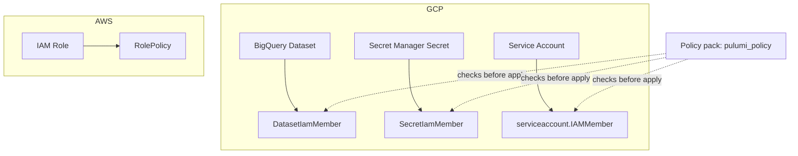

# Access governance as code

## BigQuery, Secret Manager and service-account bindings without console clicks

<!--
[0:00-1:30] Welcome. This workshop is about IAM: least-privilege access on
GCP and AWS, managed as Pulumi code instead of console clicks. By the end
you will have provisioned three GCP bindings and one AWS role, previewed a
diff before applying it, and watched a policy check block an over-broad
grant before it ever reaches the cloud.
-->

---
layout: default
---

# Speaker

<div class="flex gap-8 items-center">

<div>

<h1 class="text-4xl">Speaker Name</h1>

<p>Role at <strong>Pulumi</strong></p>

<p>@handle · linkedin.com/in/handle</p>

<p>Two lines on what they actually do, day to day.</p>

</div>
</div>

<!-- TODO(presenter): replace photo, name, role, socials and bio -->

<!--
[1:30-3:00] Speaker introduces themselves: role at Pulumi, how long they've
worked on IAM/policy tooling, why this problem is the one they keep hitting
with customers.
-->

---
layout: default
---

# Housekeeping

- Chat is open, be chatty
- Questions go in the Q&A tab
- Slides and the demo repo are in the handouts tab
- The recording comes by email afterward

<!--
[3:00-4:00] Point people at the Q&A tab specifically, not the chat, if the
platform has both. Mention the repo link goes out at the end too, so no
need to screenshot commands.
-->

---
layout: default
---

# Agenda

- The problem with console-click IAM
- Where it shows up at scale
- The architecture: three GCP resources, one AWS role
- Demo: provisioning least-privilege bindings across two clouds
- Demo: catching an over-broad grant with policy as code
- Recap and where to go next

<!--
[4:00-5:00] Walk the agenda in one breath. Do not read every bullet aloud
word for word; name the shape of the next hour instead.
-->

---
layout: statement
---

# A binding granted by clicking through a console leaves no diff, no reviewer, and no record of who approved it.

<!--
[5:00-8:00] Ground this in something concrete: someone opens the GCP
console, adds a role binding to fix an access request, and ships it. No
pull request, no reviewer, nothing in version control. Six months later
nobody remembers why that binding exists or whether it is still needed.
That is the starting point for this workshop: access control that behaves
like every other change to production, which means it goes through a diff
and a review before it takes effect.
-->

---
layout: default
---

# IAM bindings are one of the fastest-growing resource types we see

Dataset-level, secret-level, and service-account bindings are showing up
in customer stacks more than almost anything else we track.

<!-- TODO(presenter): the internal adoption figures for this claim are in
the workshop brief and are marked Internal. They have not been cleared for
a public repo, so this slide states the trend without the numbers. Ask the
workshop owner before adding any figure here. -->

<!--
[8:00-10:00] Say plainly that the exact figures are internal and are not
on the slide by design. What you can say publicly: fine-grained IAM
bindings (dataset, secret, service account) are one of the fastest-growing
categories of resource we see provisioned through Pulumi, which tracks
with more teams treating access control as code rather than a one-off
console change.
-->

---
layout: two-cols
---

# It shows up outside Pulumi too

Search interest and conference talks on policy as code and access
governance have grown alongside the shift to infrastructure as code
generally.

- Cloud security teams are asking for guardrails, not just provisioning
- "Shift left" now includes who can touch what, not only what gets deployed

::right::

# What that means for this workshop

- The demo is small on purpose: three resource types, one policy pack
- The pattern generalizes to any IAM surface with a Pulumi provider

<!--
[10:00-12:00] The point here isn't the exact search numbers, it's that this
is a live concern for the audience's peers, not a hypothetical. Keep this
slide brief and move to the architecture.
-->

---
layout: diagram
---

# What we're building



<!--
[12:00-16:00] Walk left to right: a BigQuery dataset with one viewer
binding, a secret with one accessor binding, a service account with one
narrowly-scoped binding, and an AWS role that mirrors the same idea. The
policy pack sits in front of all three GCP bindings and runs during
`pulumi preview`, before anything is created. Name the exact resource
types now, since the audience will see them again in the demo.
-->

---
layout: section
---

# Demo

## Provisioning least-privilege access, then catching a mistake

<!--
[16:00-16:30] Section break. Say we're switching to the terminal and the
repo is the seven numbered folders in the handout.
-->

---
layout: code
---

# Step 1-2: a dataset binding, then a secret binding

```sh
cd 01-bigquery-dataset/
python3 -m venv venv && source venv/bin/activate
pip install -r requirements.txt
pulumi stack init dev
pulumi preview
pulumi up --yes
```

- `gcp.bigquery.Dataset` + `gcp.bigquery.DatasetIamMember`
- Role: `roles/bigquery.dataViewer`, one principal

<!--
[16:30-24:00] Run step 1 for real. Show the preview diff before the apply,
narrating what pulumi preview is telling you: what gets created, and
nothing else. Then repeat the same five commands in 02-secret/, swapping
in gcp.secretmanager.Secret and SecretIamMember with
roles/secretmanager.secretAccessor. Same shape, same review step, twice.
-->

---
layout: code
---

# Step 3: a service account, and a casing trap

```sh
cd 03-service-account/
python3 -m venv venv && source venv/bin/activate
pip install -r requirements.txt
pulumi stack init dev
pulumi preview
pulumi up --yes
```

- `gcp.serviceaccount.Account` + `gcp.serviceaccount.IAMMember`
- Role: `roles/iam.serviceAccountUser`
- Note the casing: `DatasetIamMember` and `SecretIamMember` use `Iam`; this
  one uses `IAM`

<!--
[24:00-31:00] This casing difference has caught real users, so call it out
explicitly: gcp.bigquery.DatasetIamMember and
gcp.secretmanager.SecretIamMember spell it "Iam", but
gcp.serviceaccount.IAMMember and gcp.projects.IAMMember spell it "IAM". It
is easy to typo one for the other and get an import error, not a silent
bug, so it fails loud. Worth a slow read of the resource name on screen.
-->

---
layout: code
---

# Step 4: the same pattern on AWS

```sh
cd 04-aws-role/
python3 -m venv venv && source venv/bin/activate
pip install -r requirements.txt
pulumi stack init dev
pulumi preview
pulumi up --yes
```

- `aws.iam.Role` trusting `ec2.amazonaws.com`
- `aws.iam.RolePolicy` with a fixed action and resource, no wildcards

<!--
[31:00-37:00] Point out this is the same three-command loop as every GCP
step: preview, read the diff, apply. The provider changed, the workflow
didn't. Also flag that the policy an instance assumes has no `*` in either
the action list or the resource ARN, which sets up the policy pack later.
-->

---
layout: statement
---

# A diff you can read before it applies is the difference between "we approved this" and "we found out afterward."

<!--
[37:00-40:00] This is the pitch for pulumi preview as a review artifact:
paste it into a pull request, have a teammate read it, and only then run
pulumi up. That is the audit trail a console click never produces.
-->

---
layout: code
---

# Step 5: write the policy pack

```sh
cd 05-policy-pack/
python3 -m venv venv && source venv/bin/activate
pip install -r requirements.txt
pytest tests/ -v
```

```py
from pulumi_policy import (
    ResourceValidationPolicy,
    ResourceValidationArgs,
    ReportViolation,
    EnforcementLevel,
)
```

- Rejects project-level or wildcard IAM bindings, `EnforcementLevel.MANDATORY`
- Runs locally with the open-source CLI, no Pulumi Cloud required

<!--
[40:00-48:00] Run the fifteen-test pytest suite for real and let it pass on
screen; that's the fast feedback loop for policy logic, separate from
running it against real infrastructure. Then explain the mechanism: a
PolicyPack made of ResourceValidationPolicy instances, each inspecting one
resource type's args and reporting a violation through ReportViolation if
it looks wrong. Say plainly that local execution needs no Pulumi Cloud
account; centrally managed policy groups and audit history are a paid
Pulumi Cloud feature, and this workshop only uses the local, free path.
-->

---
layout: code
---

# Step 6: catch an over-broad binding before it applies

```sh
cd 03-service-account/
git apply ../06-over-broad-binding/widen-service-account-to-project-owner.patch
pulumi preview --policy-pack ../05-policy-pack
git apply -R ../06-over-broad-binding/widen-service-account-to-project-owner.patch
```

- The patch adds a `gcp.projects.IAMMember` granting `roles/owner` at
  project scope
- `pulumi preview --policy-pack` runs the checks before anything applies
- Revert the patch immediately after; it exists to prove the check works

<!-- TODO(presenter): this session's run had no GCP credentials configured,
so the live policy violation output could not be captured. The 05-policy-pack
test suite (15 tests) exercises the same rule and passed; describe what the
audience will see rather than reading a captured line as if it were real
output. -->

<!--
[48:00-54:00] Apply the patch, run the preview with --policy-pack pointed
at 05-policy-pack, and narrate what MANDATORY enforcement does: the
preview reports the violation and pulumi up would refuse to proceed. This
is the payoff of the whole demo, so give it room. Revert the patch right
after so the stack is clean again.
-->

---
layout: code
---

# Step 7: teardown

```sh
GCP_PROJECT=your-gcp-project-id ./07-teardown/teardown.sh
```

- Destroys stacks in reverse order: 04, then 03, 02, 01
- `verify-clean.sh` confirms nothing billable is left running

<!-- TODO(presenter): teardown was not run live in this session for lack of
GCP and AWS credentials. Run it before or after the live session so nothing
keeps billing. -->

<!--
[54:00-56:00] Quick slide, mostly a courtesy: nobody wants a workshop that
leaves cloud resources running. Mention the reverse order matters because
of the trust relationships between resources.
-->

---
layout: default
---

# What you can do now

- Model least-privilege IAM as code, across GCP and AWS
- Read a diff of a proposed IAM change before it applies, and use it as a
  review artifact
- Catch and block an over-broad binding with a policy pack, locally, before
  anything is created
- Name the exact resource types this touches: `DatasetIamMember`,
  `SecretIamMember`, `serviceaccount.IAMMember`, `aws.iam.RolePolicy`

<!--
[56:00-58:00] Recap in the order the demo actually ran. Take one question
here if time allows, otherwise move straight to follow-up.
-->

---
layout: default
---

# Keep going

<div class="grid grid-cols-3 gap-6 text-center">
<div>

<div class="w-32 h-32 mx-auto"><QRCode data="https://slack.pulumi.com" /></div>

Pulumi Community Slack

</div>
<div>

<div class="w-32 h-32 mx-auto"><QRCode data="https://app.pulumi.com/signup" /></div>

Pulumi Cloud, free tier

</div>
<div>

<div class="w-32 h-32 mx-auto"><QRCode data="https://github.com/pulumi/workshops/pull/234" /></div>

The workshop repo (this pull request; folds into `main` on merge)

</div>
</div>

<!--
[58:00-59:00] The repo QR points at this workshop's pull request for now,
since the folder doesn't exist on main until it merges. Mention that
explicitly if anyone scans it before merge day.
-->

---
layout: end
---

# Questions?

<div class="grid grid-cols-2 gap-6 text-center mt-8">
<div>

<div class="w-32 h-32 mx-auto"><QRCode data="https://github.com/pulumi/workshops/pull/234" /></div>

Workshop repo

</div>
<div>


<div class="w-24 h-24 mx-auto mt-2"><QRCode data="https://github.com/pulumi" /></div>

Speaker (placeholder link)

</div>
</div>

<!-- TODO(presenter): replace the speaker QR target with their real
LinkedIn or GitHub once known. -->

<!--
[59:00-60:00] Leave this slide up while taking questions; it's the one
people photograph, so it carries every link they'd want.
-->
