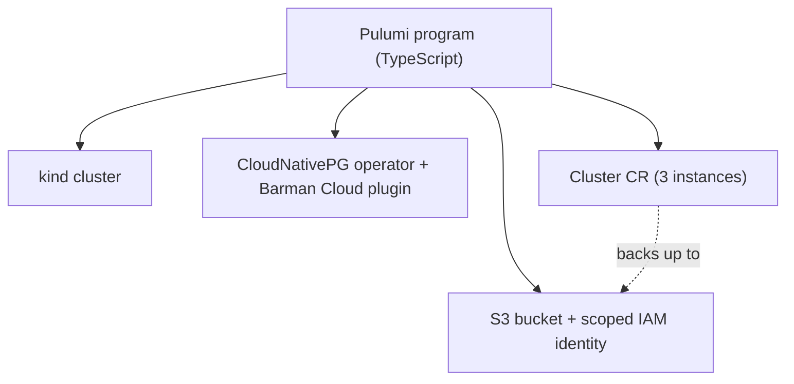
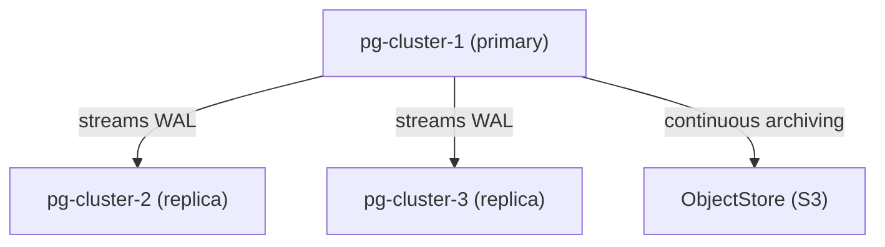
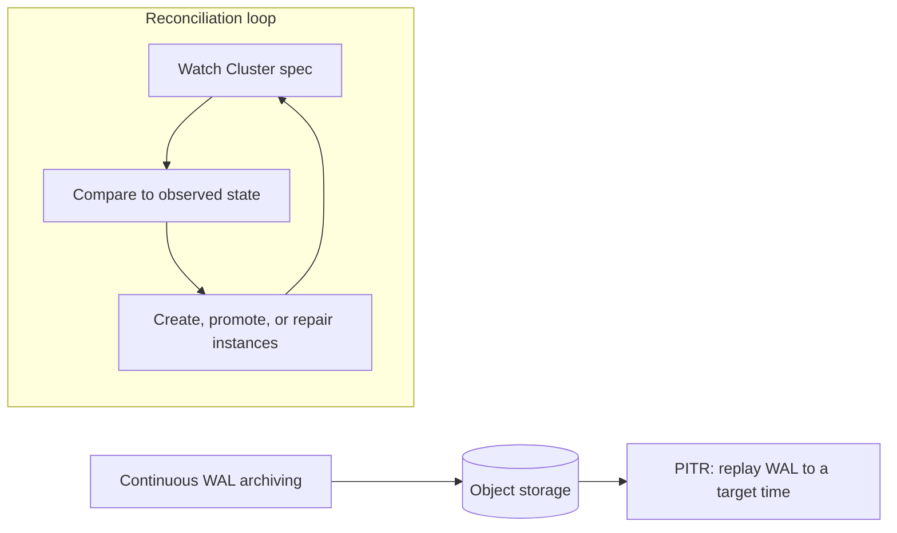

<div class="absolute inset-0 flex flex-col justify-center items-start px-20">
  <h1 class="!text-[4.6rem] !leading-[1.05] !font-semibold !tracking-tight !mb-6 !max-w-[95%]">
    Running production PostgreSQL on Kubernetes with CloudNativePG and Pulumi
  </h1>
  <p class="!mt-1 !text-[2rem] text-[var(--p-fg-muted)] !m-0 !leading-relaxed !max-w-[90%]">
    Provision a self-healing, backed-up Postgres cluster, then break it on purpose and watch it heal
  </p>
  <p class="!mt-8 !text-[1.5rem] text-[var(--p-fg-muted)] !m-0 !leading-relaxed">
    Speaker · Role, Pulumi
  </p>
</div>

<!--
(1 min) Welcome. Say the promise once, plainly: by the end of this session
you will have provisioned a self-healing, backed-up Postgres cluster on
Kubernetes with Pulumi, and you will have triggered a failover and a
point-in-time restore live. Do not over-explain yet; the next 89 minutes do
that. Speaker name and role are placeholders pending confirmation.
-->

---

<div class="absolute inset-0 flex items-center px-24 gap-20">
  <div class="flex-shrink-0">
    
  </div>
  <div class="flex-1">
    <h1 class="!text-[6rem] !leading-[1.02] !font-semibold !tracking-tight !mb-4 !text-[var(--p-primary)]">Speaker Name</h1>
    <p class="!text-[2rem] !leading-relaxed !m-0 opacity-90">
      Role at <strong class="!text-[var(--p-primary)]">Pulumi</strong>
    </p>
    <div class="!mt-8 flex items-center gap-8 !text-[1.4rem] opacity-70">
      <span class="flex items-center gap-2"><carbon-logo-x /> @handle</span>
      <span class="flex items-center gap-2"><carbon-logo-github /> github.com/handle</span>
    </div>
    <p class="!mt-10 !text-[1.4rem] !leading-relaxed opacity-80 !max-w-[85%]">
      Two lines on what this person actually does, and why they are the
      right person to run a live failover in front of a room.
    </p>
  </div>
</div>

<!-- TODO(presenter): replace photo, name, role, socials and bio -->

<!--
(2 min) Introduce yourself the way you actually would: what you work on day
to day, and one line on why you reach for CloudNativePG specifically. This
slide is a placeholder; speaker assignment for the 2026-11-18 session has
not landed yet, so present your own details here before delivery.
-->

---
layout: default
---

# Housekeeping

- Chat: be chatty, ask anything
- Q&A tab: save questions for the section breaks
- Handouts tab: slides and scripts land there after the session
- Recording: comes to registered attendees by email

<!--
(1 min) Quick and dry. Point at each tab as you name it if the platform
shows them. Do not spend more than a minute here; the audience wants the
demo, not the logistics.
-->

---
layout: default
---

# Agenda

- The problem with Postgres on bare Kubernetes
- CloudNativePG: what it is, where it stands
- Why Pulumi, not `kubectl apply`
- Live demo: cluster, replication, failover, backup, restore, teardown
- Failure modes and where this fits in a bigger platform
- Recap and resources

<!--
(1 min) Read the shape of the next 90 minutes, not each bullet's content.
The audience should leave this slide knowing there is a long live demo
coming, which is the part they showed up for.
-->

---
layout: statement
---

# An on-call engineer got paged at 3am because a **StatefulSet** doesn't know what a primary is.

<!--
(2 min) This is the hook, so make it concrete rather than abstract. Postgres
went down. Kubernetes rescheduled the pod exactly as designed: onto a node
with an empty volume, no replica promotion, no one told the load balancer
which pod is now the database. The StatefulSet did its job perfectly and the
job was the wrong one. That gap is what the next few slides are about.
-->

---
layout: default
---

# Postgres in a bare StatefulSet

- One pod, one PVC, one point of failure
- No replica, no failover, no automatic promotion
- Backup is a CronJob someone wrote and now maintains
- Restore is a runbook, tested the day it was written and never again
- The StatefulSet manages pod identity. Nothing manages the database

<!--
(4 min) Walk through each line as a real failure mode, not a bullet to
read aloud. A StatefulSet gives you stable pod names and stable storage,
full stop. It has no idea that pod 0 was the primary and pod 1 was a
replica; if pod 0 dies, Kubernetes just restarts pod 0, empty WAL and all,
and nothing promotes pod 1. Teams patch this with sidecars, CronJobs and
runbooks, and every one of those is a thing a human has to remember to
maintain. Land on: the gap is that nothing understands Postgres itself.
-->

---
layout: default
---

# CloudNativePG closes that gap

- A Kubernetes operator that models a Postgres cluster as a CRD
- Replication, failover, and backup become operator behavior, not scripts
- CNCF Sandbox project since January 2025; applied to move to Incubating
- The Cluster you declare is the cluster the operator reconciles, continuously

<!--
(4 min) Name the product plainly before explaining it. CloudNativePG (CNPG)
watches a `Cluster` custom resource and drives real Postgres instances
toward it: it starts replication, it notices a primary is gone, it runs
backups on a schedule you declare instead of a script someone owns. CNCF
status, confirmed today (2026-09-27) against the live CNCF landscape data:
accepted to Sandbox on 2026-01-21, and it has applied to progress to
Incubating, not yet confirmed at that level. Say that distinction plainly;
don't round it up to "incubating" on stage.
-->

---
layout: diagram-right
---

# Why Pulumi, not `kubectl apply`

- One `pulumi up`: cluster, operator, storage, and the `Cluster` CR together
- The plan shows drift before you apply it, not after
- Teardown is the same graph, run backward
- Typed resources where the ecosystem has them; explicit CRDs where it doesn't yet

::diagram::



<!--
(5 min) A pile of YAML applied with `kubectl apply -f` has no memory of what
it created last time; a Pulumi program does. One program, one `pulumi up`,
and the plan tells you exactly what changes before anything runs. On typed
resources: Pulumi Kubernetes v4.34.0 (2026-08-28) added CRDs as provider
extensions, so a CRD schema can generate a typed SDK via
`pulumi package add kubernetes --extension`. This build evaluated that path
for the CNPG `Cluster` CRD and chose the untyped `kubernetes.apiextensions.
CustomResource` instead, because the extension mechanism generates several
megabytes of committed SDK code for a single CRD, and it matched the closest
reference workshop's own choice. Say why plainly if asked; it's a real
tradeoff, not a limitation of the feature.
-->

---
layout: default
---

# What you need for today

- Docker or a container runtime, for `kind`
- `kubectl`, matching Kubernetes 1.37
- Pulumi CLI and Node.js 20+
- The `kubectl cnpg` plugin, matching operator v1.30.1
- No AWS account needed: the presenter's account provisions one disposable bucket per run

<!--
(3 min) Everything in the demo runs on your own machine against a local
`kind` cluster; you do not need cloud credentials to follow along. The one
piece of real cloud infrastructure, an S3 bucket for backups, is provisioned
and destroyed by the presenter's own account, scoped to a single low-
privilege IAM identity created just for this run. If you want to run this
again after today, the repo's README has the exact versions this build was
tested against.
-->

---
layout: section
---

# Live demo

## Seven steps, from an empty cluster to a restored one

<!--
(1 min) Section break. Say what's coming: bring up the operator, declare a
cluster, watch it replicate, break it on purpose, back it up, restore it to
a point in time, then tear it all down. Real terminal, real cluster, no
slides for the next stretch except the ones marking each step.
-->

---
layout: code
---

# Step 1: cluster and operator

```bash
cd 01-cluster-and-operator
npm install
pulumi up --stack dev
```

Brings up: a `kind` cluster, cert-manager, the CloudNativePG operator, and
the Barman Cloud plugin, in one `pulumi up`.

**Verify:** `kubectl --context kind-pg-workshop-demo get pods -n cnpg-system`
shows the operator pod `Running`.

<!--
(6 min) Run the command live. While it provisions, narrate what's actually
happening: kind is standing up a real Kubernetes control plane in Docker,
cert-manager is a dependency of the Barman Cloud plugin's webhook
certificates, and the CNPG operator's Helm chart registers the CRDs we use
in the next step. When it finishes, run the verify command and point at the
Running status. This is one Pulumi program covering four separate pieces of
infrastructure that would otherwise be four separate install steps.
-->

---
layout: diagram-left
---

# Step 2: the Postgres cluster

- S3 bucket, scoped IAM identity, and an `ObjectStore` CR for backups
- A 3-instance `Cluster` CR: one primary, two synchronous replicas
- **Verify:** `kubectl get cluster` reports "Cluster in healthy state"

::diagram::



```bash
cd 02-postgres-cluster
npm install
pulumi up --stack dev
```

<!--
(7 min) Second `pulumi up`. This one declares the actual database: a
`Cluster` custom resource with three instances, backed by the `ObjectStore`
CR this program also creates. Point out that "Cluster in healthy state" is
the operator's own words, not ours; it means all three instances are
running and replicating. Name the pods: pg-cluster-1, -2, -3. This is the
moment the promise from slide 1 starts to be real: a database, not a
StatefulSet.
-->

---
layout: code
---

# Step 3: verify replication

```bash
cd 03-replication
./status.sh
```

```
kubectl cnpg status pg-cluster -n postgres-demo --context kind-pg-workshop-demo
```

Look for: both replicas **Streaming replication**, lag at or near zero.

<!--
(4 min) A read-only check, nothing changes here. Run it and read the output
with the room: two replica rows, both marked "Streaming replication," and a
lag column sitting near zero bytes or seconds. This is the state the next
two steps are going to deliberately disturb, so make sure everyone actually
sees it healthy first.
-->

---
layout: code
---

# Step 4: trigger a failover

```bash
cd 04-failover
./failover.sh
```

```
kubectl cnpg promote pg-cluster 2
```

Instance 2 reports primary within seconds. No manual intervention beyond
the promote command itself.

<!--
(7 min) This is a scripted switchover through the operator's own supported
command, not a `kill -9` on the primary pod, since that would be unscripted and
unrepeatable on stage, and it isn't really testing what we want to show.
The script polls `kubectl cnpg status` after issuing the promote and reports
when instance 2 shows as primary. Watch it happen live, then run
03-replication/status.sh again to show the old primary rejoined as a
streaming replica. That round trip, demote and rejoin without a human
writing a runbook step, is the whole pitch for this operator.
-->

---
layout: code
---

# Step 5: back it up

```bash
cd 05-backup
./backup.sh
```

```
kubectl cnpg backup -n postgres-demo pg-cluster \
  --method=plugin --plugin-name=barman-cloud.cloudnative-pg.io
```

**Verify:** `kubectl get backup` reaches phase `completed`.

<!--
(6 min) An on-demand backup through the Barman Cloud Plugin, CNPG's current
recommended path, not the deprecated in-tree `barmanObjectStore` field. Run
the script and let it poll until the Backup object hits "completed." The
script also prints the `aws s3 ls` command for you to run on your own
machine with your own AWS credentials, since this environment has neither
installed; say that plainly rather than pretending you checked it here.
Note the exact timestamp the backup completes at: the next step needs it.
-->

---
layout: code
---

# Step 6: restore to a point in time

```bash
cd 06-pitr-restore
npm install
pulumi config set recoveryTargetTime "<timestamp from step 5>"
pulumi up --stack dev
```

A second `Cluster` CR, `pg-cluster-restore`, recovers from the same backup
target to that exact moment.

<!--
(10 min) The payoff step, and the longest one, so give it room. A brand-new
`Cluster` CR reads from the same `ObjectStore` and replays WAL up to the
timestamp you pass in `recoveryTargetTime`. When it reports healthy, exec
into it and run a row count; it should match the source cluster as it stood
at that timestamp, not whatever it holds now. That distinction, the state
at a moment versus the current state, is the entire point of point-in-time
recovery, and it's worth saying out loud twice.
-->

---
layout: diagram
---

# Under the hood



<!--
(5 min) No live demo here, just the mechanism you just watched run twice.
The operator's reconciliation loop is the same control pattern as every
other Kubernetes controller: watch the desired state in the `Cluster` spec,
compare it to what's actually running, and act to close the gap, including
promoting a replica when the primary disappears. Backup and restore ride on
the same loop: continuous WAL archiving to object storage is what made the
point-in-time restore possible, not a snapshot taken at backup time. This is
CNPG v1.30 documentation as of 2026-09-27, so if the internals shift in a
future version, this slide is the one to revisit first.
-->

---
layout: default
---

# Failure modes in production

- Pod eviction: the operator reschedules, replays WAL, rejoins as a replica
- Node loss: same recovery path, slower, bounded by PVC reattachment
- Storage class without fast snapshot support: your restore time inflates
- The failover you saw here was scripted. Unscripted ones look the same, just less polite

<!--
(4 min) Say the awkward part out loud: the failover demo used a supported
promote command, and that's deliberate, not a dodge. An actual crash looks
similar from the operator's point of view, an instance stops responding and
a replica gets promoted, but it takes longer to detect and the exact timing
is not something you can put on a slide. Storage class matters more than
people expect: CNPG's recovery path depends on how fast a new pod can get a
working volume, and a slow storage class is the most common reason a
"self-healing" cluster still causes a page.
-->

---
layout: default
---

# Where this fits in a bigger platform

- Connection pooling: a `Pooler` (PgBouncer) resource, not built today
- Monitoring: CNPG ships Prometheus metrics out of the box
- Multi-cluster replication across regions, for disaster recovery
- All mentioned, none demoed. The 90 minutes went to the five outcomes on slide 4

<!--
(3 min) Be honest about scope. A `Pooler` resource was in the original demo
plan as a stretch goal and got cut to keep the run time real. Monitoring and
cross-region replication are both things CNPG supports and neither made it
into today's session; if either is what you actually came for, the CNPG
docs (linked on the recap slide) cover both in more depth than 90 minutes
allows.
-->

---
layout: code
---

# Step 7: teardown

```bash
cd 07-teardown
./teardown.sh
./verify-clean.sh
```

Destroys stacks in reverse build order, checks for and deletes any leftover
PVCs, deletes the `kind` cluster. Estimated cost for this whole run: under
a dollar in S3 storage, for a few minutes.

<!--
(3 min) Run it live to close the loop: nothing from this session should
still be running or billing after this command. CNPG's own docs don't say
definitively whether a deleted Cluster CR always cleans up its PVCs, so the
teardown script checks explicitly rather than assuming and deletes anything
left over. `verify-clean.sh` is the final proof, not a formality; let it
finish and show the empty output.
-->

---
layout: default
---

# What you did today

- Explained what an operator gives you that a bare StatefulSet doesn't
- Provisioned a cluster and operator in one `pulumi up`
- Declared a 3-instance `Cluster` and verified real streaming replication
- Triggered a live failover and watched the cluster self-heal
- Backed up to object storage and restored to a point in time

<!--
(3 min) Read this against slide 4's promise, because it's the same list. If
any of these five feels shaky, that's the thing to go back and re-run on
your own machine before it matters; the repo has every command you saw
today, in the same folders, with the same flags.
-->

---
layout: default
---

# Follow up

<div class="grid grid-cols-3 gap-10 mt-6">
  <div class="flex flex-col items-center gap-3">
    <div class="w-32 h-32 mx-auto"><QRCode data="https://slack.pulumi.com" dark="#000000" /></div>
    <p class="text-center !text-[1.1rem] !m-0">Pulumi Community Slack</p>
  </div>
  <div class="flex flex-col items-center gap-3">
    <div class="w-32 h-32 mx-auto"><QRCode data="https://app.pulumi.com/signup" dark="#000000" /></div>
    <p class="text-center !text-[1.1rem] !m-0">Pulumi Cloud, free tier</p>
  </div>
  <div class="flex flex-col items-center gap-3">
    <div class="w-32 h-32 mx-auto"><QRCode data="https://github.com/pulumi/workshops/tree/main/postgres-on-kubernetes-cloudnativepg" dark="#000000" /></div>
    <p class="text-center !text-[1.1rem] !m-0">This workshop's repo</p>
  </div>
</div>

<p class="!mt-10 !text-[1.2rem] opacity-80">Further reading: cloudnative-pg.io/documentation, and the Pulumi Kubernetes CRDs-as-provider-extensions blog post</p>

<!--
(2 min) Three codes, three destinations, said plainly: join the community
Slack if you have follow-up questions after today, sign up for Pulumi
Cloud's free tier if you want to run this beyond a local kind cluster, and
the repo has every file you saw on screen. All three URLs were opened and
confirmed live during this build.
-->

---
layout: end
---

<div class="flex flex-col items-center justify-center h-full gap-10">
  <h1>Thank you.</h1>
  <div class="flex items-center gap-16">
    <div class="flex flex-col items-center gap-3">
      
      <p class="!m-0 !text-[1.3rem]">Speaker Name</p>
      <div class="w-24 h-24"><QRCode data="https://github.com/handle" dark="#000000" /></div>
    </div>
    <div class="flex flex-col items-center gap-3">
      <div class="w-28 h-28"><QRCode data="https://github.com/pulumi/workshops/tree/main/postgres-on-kubernetes-cloudnativepg" dark="#000000" /></div>
      <p class="!m-0 !text-[1.1rem]">Workshop repo</p>
    </div>
  </div>
</div>

<!-- TODO(presenter): replace photo, name and social QR target -->

<!--
(6 min) Stays on screen for questions, so it's the slide people photograph.
Both QR codes point somewhere real: the repo link is confirmed, and the
speaker's own GitHub or LinkedIn QR is a placeholder pending the actual
speaker assignment for 2026-11-18. If a question needs a source you didn't
bring, it's fine to say you'll follow up in Slack rather than guessing.
-->