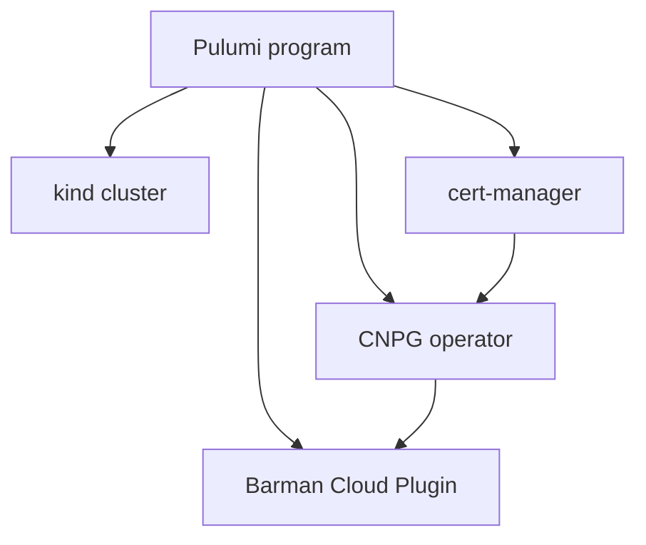
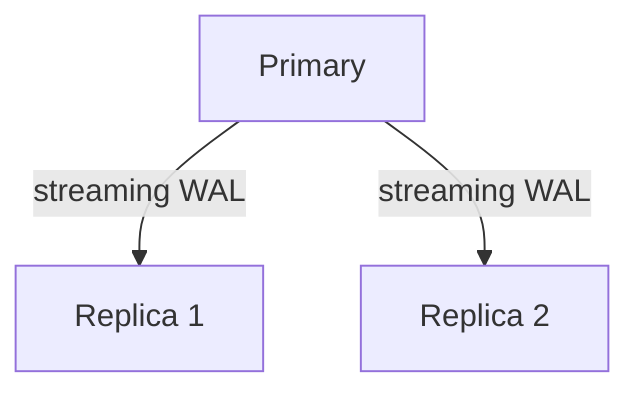
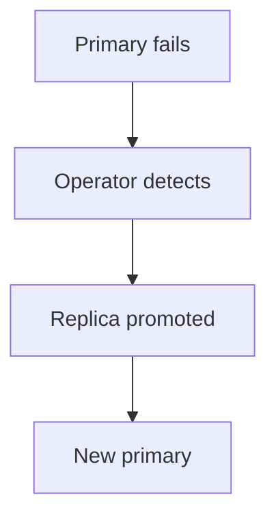
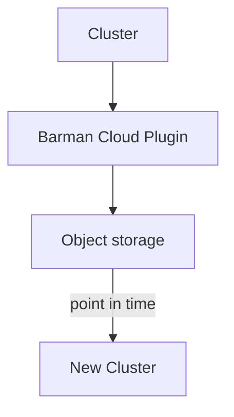
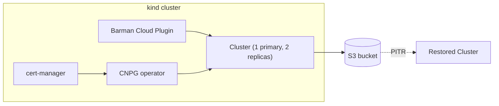

# Running production PostgreSQL on Kubernetes

## with CloudNativePG and Pulumi

<p class="opacity-70">Provision a self-healing, backed-up Postgres cluster, then fail it over and restore it, live</p>

<!--
Time: 1.5 min. Welcome. Set expectations: this is hands-on, everyone builds a real
cluster on their own laptop, and by the end we will have broken it on purpose twice
and fixed it both times.
-->

---
layout: default
---

<div class="flex items-center gap-8">

<div>

# Speaker Name

<p>Role at <strong>Pulumi</strong></p>

<p>github.com/handle &middot; linkedin.com/in/handle</p>

<p>Builds infrastructure platforms and spends most of that time teaching people to stop hand-rolling what an operator already does well.</p>

</div>
</div>

<!-- TODO(presenter): replace photo, name, role, socials and bio before delivery -->

<!--
Time: 0.5 min. Quick self-introduction, in your own words.
-->

---
layout: default
---

# Before we start

- This is hands-on: clone the repo now if you have not already
- Questions any time, out loud
- Ask a neighbor or raise a hand if your cluster gets stuck
- We break for five minutes around the halfway point

<!--
Time: 1.5 min. Get everyone cloning the repo while you talk. Point out where the
folder is and that every step is numbered.
-->

---
layout: default
---

# Agenda

- The problem with running Postgres by hand
- The pieces: CNPG, Pulumi, and how they fit together
- What we are going to build
- Live: cluster, replication, failover, backup, restore, teardown
- Where this still breaks, and what to read next

<!--
Time: 1 min. Walk the agenda once, do not linger.
-->

---
layout: default
---

# Prerequisites

- `kind`, `kubectl`, the Pulumi CLI (3.255 or newer), and Node.js 20 or newer
- Clone `pulumi/workshops` and open `postgresql-on-kubernetes-cloudnativepg/`
- Each numbered folder is `npm install` then `pulumi up`, in order

<div class="mt-6 p-4 rounded-lg bg-primary/10 border border-primary/30 text-sm">
Steps 5 and 6, backup and point-in-time restore, need a real AWS bucket and credentials. The presenter runs those two live; everyone else follows along on screen.
</div>

<!--
Time: 1.5 min. Confirm everyone has the tools installed; this is the moment to fix a
missing `kind` or an old Pulumi CLI before the room falls behind. Explain the
hands-on split for steps 5 and 6 so nobody wonders later why the credentials
prompt never comes.
-->

---
layout: quote
author: GitLab.com, postmortem of the outage
role: January 31, 2017
---

Hoping they could restore the database the engineers involved went to look for the database backups, and asked for help on Slack. Unfortunately the process of both finding and using backups failed completely.

<!--
Time: 3 min. Tell the story straight: an engineer trying to fix PostgreSQL
replication lag meant to wipe the data directory on the secondary and re-sync it
with pg_basebackup. He ran the wipe on the primary instead, and by the time he
stopped it, about 300 GB of production data was gone. Then came the part that
actually matters for this room: every backup method GitLab had turned out to be
either broken, empty, or too old to help. Source: GitLab's own engineering
postmortem, published 2017-02-10, read this week at
about.gitlab.com/blog/2017/02/10/postmortem-of-database-outage-of-january-31.
This was 2017, on regular servers, not Kubernetes. The point isn't the platform,
it's what happens when replication and backup are things a tired engineer does by
hand under pressure.
-->

---
layout: statement
---

A bad deploy: <strong>revert in seconds.</strong>

<!--
Time: 1 min. Let it sit for a second before moving on.
-->

---
layout: statement
---

A wiped database: <strong>gone in seconds, restored in hours, if you're lucky.</strong>

<!--
Time: 1.5 min. Git gives you a revert button. A database does not have one; a
restore is a whole procedure, and that procedure has to have been tested before
the day it matters.
-->

---
layout: two-cols
---

::header::

# Why this is hard

::left::

### A StatefulSet knows

- How many pods to run
- What to name pod-0, pod-1, pod-2
- How to restart a pod that dies

::right::

### A StatefulSet has no idea

- Which pod holds the primary
- Whether replication is caught up
- What to do when the primary disappears

<!--
Time: 2.5 min. A StatefulSet is built for stable identity, not database roles. It
will happily restart a dead primary's pod with the same name and the same volume,
and call that a fix. Whether it actually still has a working Postgres inside is
not something a StatefulSet checks.
-->

---
layout: default
---

# Five questions

1. What does a StatefulSet not know about running Postgres?
2. How do you stand up the whole platform with one command?
3. How do you know replication is healthy without watching it yourself?
4. What happens the moment the primary goes away?
5. How do you get back to the second before the mistake?

<!--
Time: 2 min. These five questions are the spine of the next half hour. We will
come back to this exact slide twice, each time with more of them answered.
-->

---
layout: section
---

# Question 1

What a StatefulSet doesn't know

<!--
Time: 1 min.
-->

---
layout: two-cols
---

::header::

# Kubernetes manages pods. CNPG manages Postgres.

::left::

### Kubernetes restarts pod-0 as pod-0

Same ordinal, same volume claim. It has no concept of primary or replica, and no
opinion about whether the pod it just restarted is healthy as a database.

::right::

### CNPG's Cluster tracks roles

Primary, replica, and switchover are fields the operator watches and acts on.
That judgment used to live in an engineer's head; now it lives in a controller
that never sleeps.

<!--
Time: 4.5 min. CNPG (CloudNativePG) is a Kubernetes operator: it extends the API
with a Cluster resource type, then runs a controller that reconciles what you
declared against what actually exists. Worth naming plainly here that this is the
CNCF sandbox project pattern, a purpose-built operator instead of a generic
StatefulSet plus a pile of scripts.
-->

---
layout: section
---

# Question 2

One command, the whole platform

<!--
Time: 1 min.
-->

---
layout: diagram-left
---

# One `pulumi up` provisions the platform

Cert-manager issues the certificates the operator needs to run its admission
webhooks. The CNPG operator turns Postgres into a Kubernetes resource type. The
Barman Cloud Plugin adds backup and restore. One Pulumi program declares all
three, in dependency order, into the kind cluster.

::diagram::



<!--
Time: 5 min. This is the Pulumi Kubernetes provider doing what it always does:
declare the desired resources, let Pulumi work out the order from their
dependencies, and run pulumi up once. Worth a side note that Pulumi's newer
CRDs-as-provider-extensions feature (Kubernetes provider 4.34.0, announced
2026-08-28) lets you get typed classes for a CRD instead of the untyped
CustomResource this demo uses; we used the untyped form here because CNPG's CRD
schema was not fully covered by the typed path at the time this was built. Say
that plainly if asked, do not oversell it.
-->

---
layout: default
---

# Two of five answered, three to go

1. What does a StatefulSet not know about running Postgres? (answered)
2. How do you stand up the whole platform with one command? (answered)
3. How do you know replication is healthy without watching it yourself?
4. What happens the moment the primary goes away?
5. How do you get back to the second before the mistake?

<!--
Time: 1 min. Quick checkpoint, then straight into the next question.
-->

---
layout: section
---

# Question 3

Replication you don't have to watch

<!--
Time: 1 min.
-->

---
layout: diagram
---

# A three-instance Cluster keeps itself in sync



One CNPG Cluster resource, three Postgres pods, continuous streaming replication.
The operator elected the primary; nobody had to.

<!--
Time: 4.5 min. This is what we will actually build in the first two demo steps.
Worth being concrete: CNPG uses Postgres's own streaming replication, not a
homegrown mechanism, and it exposes replica status through both the Cluster's
own status field and a kubectl plugin, which is what step 3 of the demo reads
from.
-->

---
layout: section
---

# Question 4

When the primary goes away

<!--
Time: 1 min.
-->

---
layout: diagram-right
---

# CNPG promotes a replica automatically

Nobody runs a manual failover at 2am. The operator watches the primary's health,
and when it disappears, promotes the replica with the most caught-up WAL position.
The old primary rejoins as a replica once it recovers.

::diagram::



<!--
Time: 4.5 min. In the demo we trigger this with a graceful promotion command, not
a killed pod: kill -9 on a Postgres process can leave a corrupted data directory
behind, which teaches the wrong lesson about what failover looks like. The
demo's failover.sh uses `kubectl cnpg promote`, and the exact time it takes to
complete is not fully deterministic, so do not promise a specific number of
seconds on stage.
-->

---
layout: default
---

# Four of five answered, one to go

1. What does a StatefulSet not know about running Postgres? (answered)
2. How do you stand up the whole platform with one command? (answered)
3. How do you know replication is healthy without watching it yourself? (answered)
4. What happens the moment the primary goes away? (answered)
5. How do you get back to the second before the mistake?

<!--
Time: 1 min. One question left, and it is the one with the most moving parts.
-->

---
layout: section
---

# Question 5

Getting the data back

<!--
Time: 1 min.
-->

---
layout: diagram-left
---

# Restore is a config, not a scramble

The Barman Cloud Plugin streams continuous WAL archives from the cluster to
object storage in the background, the whole time the cluster is running.
Recovering to a point in time means pointing a new Cluster at that archive and
naming a timestamp, not hoping a backup from last night still works.

::diagram::



<!--
Time: 4.5 min. This answers the GitLab story directly: the failure there was not
that they lacked a backup command, it was that nobody had verified the backups
actually worked until the day they needed them. Continuous WAL archiving plus a
tested restore path is the difference. Least-privilege IAM matters here too: the
demo's AWS credentials are scoped to one bucket only, nothing broader.
-->

---
layout: diagram
---

# Everything the demo builds



<!--
Time: 3.5 min. This is the whole picture, one Pulumi program building a kind
cluster, cert-manager, the CNPG operator, the Barman Cloud Plugin, a
three-instance Cluster, and, once backups are enabled, an S3 bucket and a second
Cluster that can restore from it. Everything from here on is this diagram coming
to life on screen.
-->

---
layout: code
---

# Three instances and a plugin reference, declared once

```typescript
const cluster = new k8s.apiextensions.CustomResource("cluster", {
  apiVersion: "postgresql.cnpg.io/v1",
  kind: "Cluster",
  spec: {
    instances: 3,
    storage: { size: "1Gi", storageClass },
    plugins: [{ name: "barman-cloud.cloudnative-pg.io",
                isWALArchiver: true }],
  },
});
```

<!--
Time: 2.5 min. This is a trimmed excerpt of the real 02-cluster/index.ts (it also
sets bootstrap.initdb and resource requests, left out here for space). The
plugins array is the one line that turns on continuous backup; it is absent
until backupsEnabled is set to true, which is exactly the hands-on/presenter-only
split from the prerequisites slide.
-->

---
layout: section
---

# Let's run it

<!--
Time: 1 min. Get everyone's terminal open to the repo root.
-->

---
layout: two-cols
---

::header::

# What we are going to do

::left::

1. Stand up the platform
2. Declare a three-instance cluster
3. Watch replication
4. Fail over, live

::right::

5. Back up to S3 (presenter)
6. Restore to a point in time (presenter)
7. Tear down clean

<!--
Time: 2 min. Steps 1, 2, 3, 4, and 7 are hands-on for everyone. Steps 5 and 6
need real AWS credentials, so the presenter runs those two and everyone watches
the same screen.
-->

---
layout: default
---

# One `pulumi up` builds the platform

`01-platform/`: the kind cluster, cert-manager, the CNPG operator, and the
Barman Cloud Plugin.

```bash
npm install && pulumi up
```

You should see: the cert-manager, CNPG operator, and Barman Cloud Plugin pods all
`Running` in their namespaces.

<!--
Time: 4 min. This step takes the longest to converge, mostly waiting on
cert-manager's webhook to become ready before the operator can register its own.
If venue wifi is slow and kind is pulling images from scratch, have a pre-built
cluster or a recording ready rather than stalling the room.
-->

---
layout: default
---

# The Cluster goes in, three pods come up

`02-cluster/`: a three-instance CNPG Cluster.

```bash
npm install && pulumi up
```

You should see: three Postgres pods, one primary and two replicas.

<!--
Time: 4 min. Everyone runs this as shown, with backups off. The presenter, on a
second terminal, runs the same folder with `pulumi config set backupsEnabled
true` set first, which is what brings the S3 bucket and the ObjectStore
resource into that copy of the stack for steps 5 and 6 later.
-->

---
layout: default
---

# Replication status is one script away

`03-replication/`: streaming replication state and lag.

```bash
./status.sh
```

You should see: both replicas streaming, with lag at or near zero.

<!--
Time: 3.5 min. This script wraps the CNPG kubectl plugin's status output. Point
out that this is exactly the information an engineer would otherwise be
querying pg_stat_replication for by hand.
-->

---
layout: default
---

# A graceful promotion, not a simulated crash

`04-failover/`: CNPG promotes a replica to primary.

```bash
./failover.sh
```

You should see: a new primary elected, and the old primary rejoining the cluster
as a replica once it catches up.

<!--
Time: 4.5 min. This calls `kubectl cnpg promote`, a real supported operation, not
a killed process. Say plainly that the exact timing varies and resist the urge to
promise it will finish in any specific number of seconds.
-->

---
layout: default
---

# An on-demand backup lands in the bucket

`05-backup/` (presenter only): triggers a backup through the Barman Cloud Plugin
and checks that it landed.

```bash
./backup.sh
```

You should see: a new backup object appear in the S3 bucket.

<!--
Time: 3.5 min. This is the first of the two presenter-only steps. Say why out
loud: it needs real AWS credentials scoped to one bucket, and handing those to a
room of workshop laptops is not something we do.
-->

---
layout: default
---

# PITR restore rehydrates a second cluster

`06-restore/` (presenter only): a new Cluster recovers from the object store to a
chosen point in time.

```bash
npm install && pulumi up
```

You should see: a second Cluster come up with data as of the restore point.

<!--
Time: 4.5 min. This is the highest-complexity step in the whole demo. Have a
recording of a successful run ready and say so plainly if anything looks
off, rather than debugging a restore live in front of the room.
-->

---
layout: default
---

# Teardown reverses cleanly

`07-teardown/`: tears down the restore cluster, then the primary cluster, then
the platform, and checks for orphaned volumes.

```bash
./teardown.sh && ./verify-clean.sh
```

You should see: no Cluster resources left, and `verify-clean.sh` reporting no
orphaned PVCs.

<!--
Time: 3 min. CNPG's persistent volume claims can outlive the Cluster that made
them, by design, since a deleted database is not something you want a garbage
collector to feel casual about. verify-clean.sh is the honest check for that.
-->

---
layout: default
---

# Five questions, answered

1. A StatefulSet doesn't know Postgres roles. The Cluster resource does.
2. One command stands up the whole platform: `pulumi up`.
3. Replication status comes from a script, not a manual query.
4. The primary going away triggers automatic promotion.
5. Continuous WAL archiving plus point-in-time restore gets you back to the
   second before the mistake.

<!--
Time: 2.5 min. Read these straight through; this is the recap the room came for.
-->

---
layout: two-cols
---

::header::

# Where this breaks today

::left::

### Still real work

- A deleted PVC can leave storage behind after teardown
- The backup credentials are scoped to one bucket, but they still exist and
  still need managing

::right::

### Still out of scope today

- `kind` is not a real cluster: no real node loss, no cloud storage class
  quirks
- Point-in-time restore is the highest-complexity step shown here; production
  needs more rehearsal than a workshop can give it

<!--
Time: 2.5 min. Worth naming the bigger platform here too, briefly and without
demoing it: a connection pooler, cluster-wide monitoring, and multi-cluster
setups are all things CNPG supports that this workshop did not have time for.
-->

---
layout: default
---

# Resources

<div class="grid grid-cols-3 gap-8 mt-8">
<div class="text-center">
<div class="w-32 h-32 mx-auto"><QRCode data="https://slack.pulumi.com" dark="#000000" /></div>
<p>Pulumi Community Slack</p>
</div>
<div class="text-center">
<div class="w-32 h-32 mx-auto"><QRCode data="https://app.pulumi.com/signup" dark="#000000" /></div>
<p>Pulumi Cloud, free tier</p>
</div>
<div class="text-center">
<div class="w-32 h-32 mx-auto"><QRCode data="https://github.com/pulumi/workshops" dark="#000000" /></div>
<p>github.com/pulumi/workshops</p>
</div>
</div>

<!--
Time: 1.5 min. The repo QR points at the repo root, not today's folder, because
the folder's URL will not resolve until this workshop's pull request merges.
Say the folder name out loud: postgresql-on-kubernetes-cloudnativepg.
-->

---
layout: end
---

# Thanks. Questions?

<div class="w-32 h-32 mx-auto mt-4"><QRCode data="https://github.com/pulumi/workshops" dark="#000000" /></div>

<p class="text-center opacity-70">github.com/pulumi/workshops</p>

<!--
Time: 1.5 min. Leave this slide up for the whole Q&A; it is the one with the
link people actually want.
-->
