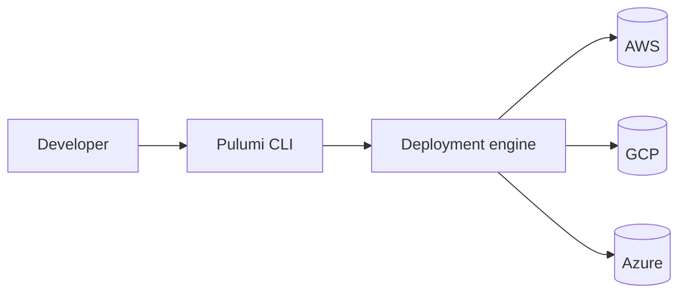
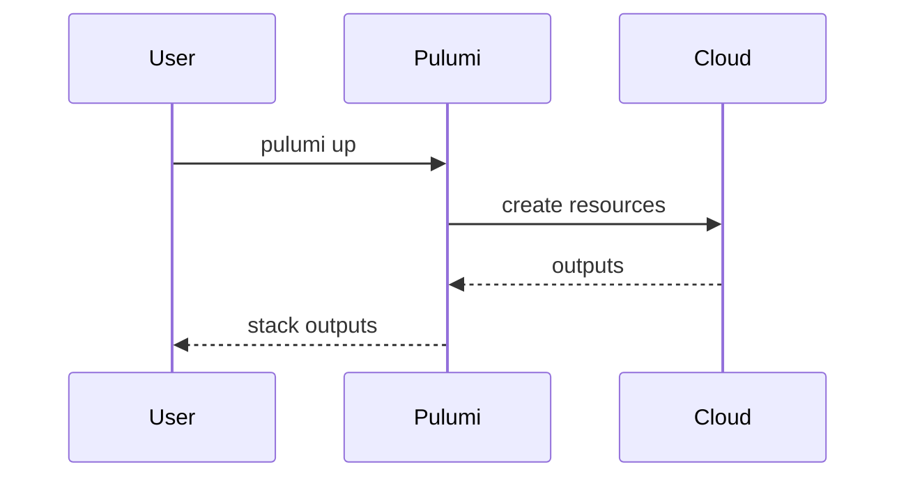
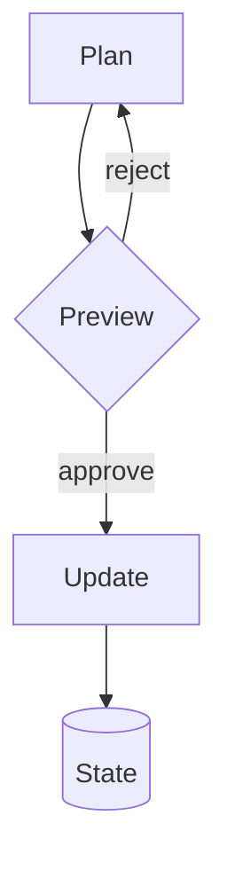

# Pulumi Theme

A Slidev presentation theme for Pulumi.

---
layout: section
---

# Section heading

## A subtitle that orients the audience

---
layout: default
---

# Default layout

The default layout is the workhorse of any deck. Use it for content slides
with a heading, body copy, and lists.

- Inter for body and headings
- Monaspace Neon for code
- Violet primary accents
- Light and dark color schemas

---
layout: two-cols
---

# Two columns

Use the `two-cols` layout when you need to compare or pair ideas.

- Left side narrative
- Right side detail
- Default bullets in violet

::right::

# On the right

Anything you can put in a default slide also fits in a column.

```ts
export const greeting = "Hello, Pulumi";
```

---
layout: image-right
image: https://images.unsplash.com/photo-1518770660439-4636190af475?w=1200
---

# Image on the right

Pair body copy with a supporting image. The `image` frontmatter accepts any
URL or asset path resolved by Vite.

- Frontmatter-driven
- Background-cover sizing
- Rounded corners

---
layout: image-left
image: https://images.unsplash.com/photo-1451187580459-43490279c0fa?w=1200
---

# Image on the left

Same idea, mirrored.

---
layout: code
---

# Code-focused layout

```ts
import * as pulumi from "@pulumi/pulumi";
import * as aws from "@pulumi/aws";

const bucket = new aws.s3.BucketV2("site", {
  tags: { Project: "marketing-web" },
});

export const bucketName = bucket.id;
```

---
layout: diagram
---

# Diagram layout



---
layout: diagram-right
---

# Diagram on the right

Pair narrative with a brand-themed Mermaid diagram. Put your text in the default
slot and the diagram in the `diagram` slot; scale it with `{scale: …}`.

- Brand-themed out of the box
- Light + dark from one config
- Works on any `class: dark` slide

::diagram::



---
layout: diagram-left
class: dark
---

# Diagram on the left

The mirrored layout, forced dark with `class: dark`. The Mermaid theme repaints
from brand tokens — no separate dark config needed.

::diagram::



---
layout: quote
author: Joe Duffy
role: Co-founder & CEO, Pulumi
---

The infrastructure required to build superintelligence demands superintelligence
for infrastructure.

---
layout: statement
---

# Build cloud infrastructure **in code**.

---
layout: default
class: dark
---

# Dark mode — default

The same layout with `class: dark` on the slide. Body copy, lists, and code all pick up the dark token set.

- Violet accents hold across both modes
- Background switches to `--color-background-dark`
- Text inverts to near-white

---
layout: section
class: dark
---

# Dark mode — section

## A section divider in dark mode

---
layout: end
---

# Thank you.

pulumi.com
