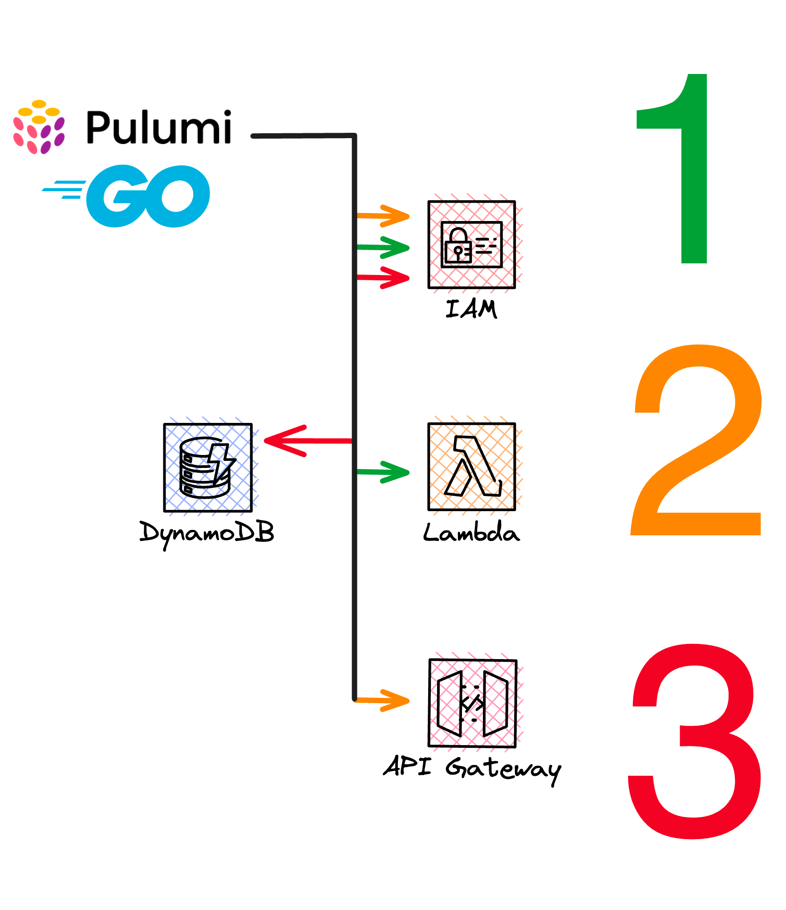

# Workshop Content

The scenario of this workshop is to create a very simple high score service for a game. The service consists of a REST
API that is backed by a DynamoDB table. The REST API is implemented as a Lambda function and is exposed through an API
Gateway. The Lambda function is written in Node.js and the infrastructure is described in Go.



The whole infrastructure is deployed to AWS using Pulumi. The workshop is divided into several steps. Where the
infrastructure is deployed in three steps:

- Step 1: Deploy the Lambda function
- Step 2: Deploy the API Gateway
- Step 3: Deploy the DynamoDB table

## Create a Pulumi Project

We will start by creating a new Pulumi project. The project will be created in a new directory called `workshop-aws` and
will be based on the `aws-go` template. The `aws-go` template is a simple AWS Go Pulumi program that creates a single S3
bucket. No worries, we will add more resources later on.

```bash
pulumi new aws-go --dir workshop-aws
```

You will be now guided through the creation of the project:

```bash
This command will walk you through creating a new Pulumi project.

Enter a value or leave blank to accept the (default), and press <ENTER>.
Press ^C at any time to quit.

project name: aws-go-workshop
project description: (A minimal AWS Go Pulumi program) 
Created project 'aws-go-workshop'

Please enter your desired stack name.
To create a stack in an organization, use the format <org-name>/<stack-name> (e.g. `acmecorp/dev`).
stack name: (dev) 
Created stack 'dev'

aws:region: The AWS region to deploy into: (us-east-1) eu-central-1
Saved config

Installing dependencies...

Finished installing dependencies

Your new project is ready to go! ✨

To perform an initial deployment, run 'cd workshop-aws', then, run `pulumi up`
```

Update the dependencies if needed, I do this always to make sure I have the latest dependencies installed.

```bash
cd workshop-aws
go get -u && go mod tidy
```

The project is now ready to go. Open the `main.go` file and delete the S3 bucket resource. We will add our own
resources!

```go
package main

import (
	"github.com/pulumi/pulumi/sdk/v3/go/pulumi"
)

func main() {
	pulumi.Run(func(ctx *pulumi.Context) error {

		return nil
	})
}
```

We are ready to head over to the next step.

## Add AWS Resources to the Project

Now we start with our first AWS resources. We will add them one by one.

### Add the Lambda Function

Create a new folder called `function` and create a new file `index.js` in it. Add the following code to the file:

```javascript
const AWS = require('aws-sdk');
const dynamo = new AWS.DynamoDB.DocumentClient();

exports.handler = async (event) => {
    const params = {
        TableName: 'HighScores',
        Key: {
            'UserId': event.queryStringParameters.UserId,
            'GameTitle': event.queryStringParameters.GameTitle
        }
    };

    try {
        const data = await dynamo.get(params).promise();
        const response = {
            statusCode: 200,
            body: JSON.stringify(data.Item),
        };
        return response;
    } catch (error) {
        console.log(error);
        throw new Error('Error occurred while accessing DynamoDB');
    }
};
```

This is a simple Lambda function that will read a record from a DynamoDB table based on the `UserId` and `GameTitle`
that is passed in the query string. The function will return the record as JSON.

Now we can add the Lambda function to the Pulumi project. Open the `main.go` file and add the following code:

```go
package main

import (
	"encoding/json"

	"github.com/pulumi/pulumi-aws/sdk/v5/go/aws"
	"github.com/pulumi/pulumi-aws/sdk/v5/go/aws/iam"
	"github.com/pulumi/pulumi-aws/sdk/v5/go/aws/lambda"
	"github.com/pulumi/pulumi/sdk/v3/go/pulumi"
)

func main() {
	pulumi.Run(func(ctx *pulumi.Context) error {
		lambdaRawPolicy, err := json.Marshal(map[string]interface{}{
			"Version": "2012-10-17",
			"Statement": []map[string]interface{}{
				map[string]interface{}{
					"Action": "sts:AssumeRole",
					"Effect": "Allow",
					"Principal": map[string]interface{}{
						"Service": "lambda.amazonaws.com",
					},
				},
			},
		})
		if err != nil {
			return err
		}

		lambdaRole, err := iam.NewRole(ctx, "lambda-role", &iam.RoleArgs{
			AssumeRolePolicy: pulumi.String(lambdaRawPolicy),
			ManagedPolicyArns: pulumi.StringArray{
				iam.ManagedPolicyAWSLambdaBasicExecutionRole,
			},
		})
		if err != nil {
			return err
		}

		readHighscoreLambda, err := lambda.NewFunction(ctx, "read-highscore-lambda", &lambda.FunctionArgs{
			Code:    pulumi.NewFileArchive("./function"),
			Name:    pulumi.String("highscore"),
			Role:    lambdaRole.Arn,
			Handler: pulumi.String("index.handler"),
			Runtime: pulumi.String("nodejs16.x"),
		})
		if err != nil {
			return err
		}
		ctx.Export("readHighscoreLambdaArn", readHighscoreLambda.Arn)
		return nil
	})
}
```

The code above will create a new IAM role for the Lambda function and then create the Lambda function itself. The Lambda
function will be created from the code in the `./function` folder. The code will be zipped and uploaded to AWS. The IAM
role will be created with the `AWSLambdaBasicExecutionRole` managed policy attached to it.

Now we can preview the changes and deploy them to AWS.

```bash
pulumi preview
pulumi up
```

This should give you the following similar output:

```bash
pulumi up                                                                                                 
Previewing update (dev)

View in Browser (Ctrl+O): https://app.pulumi.com/dirien/aws-go-workshop/dev/previews/809a8edc-0105-4b2e-819a-f55de26ded7b

     Type                    Name                   Plan       
 +   pulumi:pulumi:Stack     aws-go-workshop-dev    create     
 +   ├─ aws:iam:Role         lambda-role            create     
 +   └─ aws:lambda:Function  read-highscore-lambda  create     


Outputs:
    readHighscoreLambdaArn: output<string>

Resources:
    + 3 to create

Do you want to perform this update? yes
Updating (dev)

View in Browser (Ctrl+O): https://app.pulumi.com/dirien/aws-go-workshop/dev/updates/44

     Type                    Name                   Status            
 +   pulumi:pulumi:Stack     aws-go-workshop-dev    created (19s)     
 +   ├─ aws:iam:Role         lambda-role            created (1s)      
 +   └─ aws:lambda:Function  read-highscore-lambda  created (14s)     


Outputs:
    readHighscoreLambdaArn: "arn:aws:lambda:eu-central-1:052848974346:function:highscore"

Resources:
    + 3 created

Duration: 22s
```

### Add the API Gateway

With the Lambda function in place, we can now add the API Gateway. This will allow us to call the Lambda function from
the outside world.

Open the `main.go` file and add the following code:

```go
package main

import (
	"encoding/json"
	"fmt"

	"github.com/pulumi/pulumi-aws/sdk/v5/go/aws"
	"github.com/pulumi/pulumi-aws/sdk/v5/go/aws/apigateway"
	"github.com/pulumi/pulumi-aws/sdk/v5/go/aws/iam"
	"github.com/pulumi/pulumi-aws/sdk/v5/go/aws/lambda"
	"github.com/pulumi/pulumi/sdk/v3/go/pulumi"
	"github.com/pulumi/pulumi/sdk/v3/go/pulumi/config"
)

func main() {
	pulumi.Run(func(ctx *pulumi.Context) error {
		// cut for brevity

		highscoreRestApi, err := apigateway.NewRestApi(ctx, "highscore-rest-api", &apigateway.RestApiArgs{
			Name:        pulumi.String("HighscoreAPI"),
			Description: pulumi.String("This API serves the Highscore of different games"),
		})
		if err != nil {
			return err
		}
		highscoreResource, err := apigateway.NewResource(ctx, "highscore-resource", &apigateway.ResourceArgs{
			RestApi:  highscoreRestApi.ID(),
			ParentId: highscoreRestApi.RootResourceId,
			PathPart: readHighscoreLambda.Name,
		})
		if err != nil {
			return err
		}
		highscoreMethod, err := apigateway.NewMethod(ctx, "highscore-method", &apigateway.MethodArgs{
			RestApi:       highscoreRestApi.ID(),
			ResourceId:    highscoreResource.ID(),
			HttpMethod:    pulumi.String("GET"),
			Authorization: pulumi.String("NONE"),
		})
		if err != nil {
			return err
		}
		highscoreIntegration, err := apigateway.NewIntegration(ctx, "highscore-integration", &apigateway.IntegrationArgs{
			RestApi:               highscoreRestApi.ID(),
			ResourceId:            highscoreResource.ID(),
			HttpMethod:            highscoreMethod.HttpMethod,
			IntegrationHttpMethod: pulumi.String("POST"),
			Type:                  pulumi.String("AWS_PROXY"),
			Uri:                   readHighscoreLambda.InvokeArn,
		})
		if err != nil {
			return err
		}

		highscoreDeployment, err := apigateway.NewDeployment(ctx, "highscore-deployment", &apigateway.DeploymentArgs{
			RestApi:   highscoreRestApi.ID(),
			StageName: pulumi.String("test"),
		}, pulumi.DependsOn([]pulumi.Resource{highscoreIntegration}))
		if err != nil {
			return err
		}

		current, err := aws.GetCallerIdentity(ctx, nil, nil)
		if err != nil {
			return err
		}

		_, err = lambda.NewPermission(ctx, "apigateway-lambda-permission", &lambda.PermissionArgs{
			Action:      pulumi.String("lambda:InvokeFunction"),
			Function:    readHighscoreLambda.Name,
			Principal:   pulumi.String("apigateway.amazonaws.com"),
			StatementId: pulumi.String("AllowExecutionFromAPIGateway"),
			SourceArn:   pulumi.Sprintf("arn:aws:execute-api:%v:%v:%v/*/*/%v", config.Get(ctx, "aws:region"), current.AccountId, highscoreRestApi.ID(), highscoreResource.PathPart),
		})
		if err != nil {
			return err
		}
		ctx.Export("url", pulumi.Sprintf("%s/%s", highscoreDeployment.InvokeUrl, highscoreResource.PathPart))
		ctx.Export("readHighscoreLambdaArn", readHighscoreLambda.Arn)
		return nil
	})
}

```

Let's go through this piece of code step by step to understand what it does:

- The first block of code creates an Amazon API Gateway, which will be used to create a REST
  API. This API is given the name 'HighscoreAPI' and a brief description.
- The next block creates a "Resource". In API Gateway, a Resource refers to a specific endpoint
  on your API (like "/highscore").
- Next, a Method is defined for the created Resource. Here, the HTTP method is set to "GET" and it
  has no authorization requirement. In simple terms, it is defining that we can make a GET request to the "/highscore"
  endpoint of our API.
- This piece of code is creating an Integration. In API Gateway, an Integration defines how
  requests to a specific Resource and Method should be handled, i.e., it determines what should happen when someone
  makes a GET request to the "/highscore" endpoint. Here, the Integration is set to trigger the `readHighscoreLambda`
  function, which presumably contains the logic for handling such requests.
- Next, we define the stage to which the API should be deployed. A stage is a logical reference
  to a lifecycle state of your API (e.g., dev, test, prod). Here, we are defining a stage called "test".
- Finally, the code grants API Gateway permission to trigger the `readHighscoreLambda`
  function. This permission is necessary because AWS services are secure by default and won't allow one service to
  interact with another unless explicitly allowed.

Now, run `pulumi up` again to deploy the API Gateway:

```bash
pulumi up
```

You should see the following output including the URL of the API Gateway:

```
pulumi up
Previewing update (dev)

View in Browser (Ctrl+O): https://app.pulumi.com/dirien/aws-go-workshop/dev/previews/200f4d87-7607-4958-806a-9fd12ae0cf13

     Type                             Name                                  Plan       
     pulumi:pulumi:Stack              aws-go-workshop-dev                              
 +   ├─ aws:apigateway:RestApi        highscore-rest-api                    create     
 +   ├─ aws:apigateway:Resource       highscore-resource                    create     
 +   ├─ aws:apigateway:Method         highscore-method                      create     
 +   ├─ aws:apigateway:Integration    highscore-integration                 create     
 +   ├─ aws:apigateway:Deployment     highscore-deployment                  create     
 +   └─ aws:lambda:Permission         apigateway-lambda-permission          create     


Outputs:
  + url                   : output<string>

Resources:
    + 6 to create
    3 unchanged

Do you want to perform this update? yes
Updating (dev)

View in Browser (Ctrl+O): https://app.pulumi.com/dirien/aws-go-workshop/dev/updates/45

     Type                             Name                                  Status              
     pulumi:pulumi:Stack              aws-go-workshop-dev                                       
 +   ├─ aws:apigateway:RestApi        highscore-rest-api                    created (1s)        
 +   ├─ aws:apigateway:Resource       highscore-resource                    created (0.39s)     
 +   ├─ aws:apigateway:Method         highscore-method                      created (0.37s)     
 +   ├─ aws:lambda:Permission         apigateway-lambda-permission          created (0.90s)     
 +   ├─ aws:apigateway:Integration    highscore-integration                 created (0.44s)     
 +   └─ aws:apigateway:Deployment     highscore-deployment                  created (0.82s)     
 

Outputs:
    readHighscoreLambdaArn: "arn:aws:lambda:eu-central-1:052848974346:function:highscore"
  + url                   : "https://zvh08kbui5.execute-api.eu-central-1.amazonaws.com/test/highscore"

Resources:
    + 6 created
    3 unchanged

Duration: 15s
```

Try to curl the API Gateway URL:

```bash
curl $(pulumi stack output url)
```

You should see the following output:

```bash
{"message": "Internal server error"}% 
```

This is expected, as we haven't yet deployed the DynamoDB table that the Lambda function needs to read the highscore.

### Add the DynamoDB Table

Now, let's add the DynamoDB table that the Lambda function needs to read the highscore. Add the following code to
the `main.go` file:

```go
package main

import (
	"encoding/json"
	"fmt"

	"github.com/pulumi/pulumi-aws/sdk/v5/go/aws"
	"github.com/pulumi/pulumi-aws/sdk/v5/go/aws/apigateway"
	"github.com/pulumi/pulumi-aws/sdk/v5/go/aws/dynamodb"
	"github.com/pulumi/pulumi-aws/sdk/v5/go/aws/iam"
	"github.com/pulumi/pulumi-aws/sdk/v5/go/aws/lambda"
	"github.com/pulumi/pulumi/sdk/v3/go/pulumi"
	"github.com/pulumi/pulumi/sdk/v3/go/pulumi/config"
)

func main() {
	pulumi.Run(func(ctx *pulumi.Context) error {
		// cut for brevity

		highscoreDB, err := dynamodb.NewTable(ctx, "highscore-dynamodb-table", &dynamodb.TableArgs{
			Name:        pulumi.String("HighScores"),
			BillingMode: pulumi.String("PAY_PER_REQUEST"),
			HashKey:     pulumi.String("UserId"),
			RangeKey:    pulumi.String("GameTitle"),
			Attributes: dynamodb.TableAttributeArray{
				&dynamodb.TableAttributeArgs{
					Name: pulumi.String("UserId"),
					Type: pulumi.String("S"),
				},
				&dynamodb.TableAttributeArgs{
					Name: pulumi.String("GameTitle"),
					Type: pulumi.String("S"),
				},
			},
		})
		if err != nil {
			return err
		}

		highscoreDBRawPolicy := highscoreDB.Arn.ApplyT(func(arn string) string {
			dynamoPolicy, err := json.Marshal(map[string]interface{}{
				"Version": "2012-10-17",
				"Statement": []map[string]interface{}{
					{
						"Action": []string{
							"dynamodb:GetItem",
						},
						"Effect": "Allow",
						"Resource": []string{
							fmt.Sprintf("%v", arn),
						},
					},
				},
			})
			if err != nil {
				return ""
			}
			return string(dynamoPolicy)
		})

		highscoreDBPolicy, err := iam.NewPolicy(ctx, "highscore-dynamodb-policy", &iam.PolicyArgs{
			Name:   pulumi.String("dynamodb-policy"),
			Policy: highscoreDBRawPolicy,
		})
		if err != nil {
			return err
		}

		_, err = iam.NewRolePolicyAttachment(ctx, "highscore-dynamodb-policy-attachment", &iam.RolePolicyAttachmentArgs{
			PolicyArn: highscoreDBPolicy.Arn,
			Role:      lambdaRole.Name,
		})
		if err != nil {
			return err
		}
		ctx.Export("url", pulumi.Sprintf("%s/%s", highscoreDeployment.InvokeUrl, highscoreResource.PathPart))
		ctx.Export("readHighscoreLambdaArn", readHighscoreLambda.Arn)
		return nil
	})
}
```

What did we do here?

- We created a DynamoDB table with the name `HighScores` and the primary key `UserId` and `GameTitle`.
- We created a policy that allows the Lambda function to read from the DynamoDB table.
- We attached the policy to the Lambda function's role.

Now, let's deploy the changes:

```bash
pulumi up
```

You should see the following output:

```bash
pulumi up         
Previewing update (dev)

View in Browser (Ctrl+O): https://app.pulumi.com/dirien/aws-go-workshop/dev/previews/d24c87d3-ec49-4a86-abe9-786a1a101678

     Type                             Name                                  Plan       
     pulumi:pulumi:Stack              aws-go-workshop-dev                              
 +   ├─ aws:dynamodb:Table            highscore-dynamodb-table              create     
 +   ├─ aws:iam:Policy                highscore-dynamodb-policy             create     
 +   └─ aws:iam:RolePolicyAttachment  highscore-dynamodb-policy-attachment  create     


Resources:
    + 3 to create
    9 unchanged

Do you want to perform this update? yes
Updating (dev)

View in Browser (Ctrl+O): https://app.pulumi.com/dirien/aws-go-workshop/dev/updates/48

     Type                             Name                                  Status              
     pulumi:pulumi:Stack              aws-go-workshop-dev                                       
 +   ├─ aws:dynamodb:Table            highscore-dynamodb-table              created (13s)       
 +   ├─ aws:iam:Policy                highscore-dynamodb-policy             created (1s)        
 +   └─ aws:iam:RolePolicyAttachment  highscore-dynamodb-policy-attachment  created (0.62s)     


Outputs:
    readHighscoreLambdaArn: "arn:aws:lambda:eu-central-1:052848974346:function:highscore"
    url                   : "https://zvh08kbui5.execute-api.eu-central-1.amazonaws.com/test/highscore"

Resources:
    + 3 created
    9 unchanged

Duration: 23s
```

Finally we can test our API Gateway endpoint, by adding the query parameters `UserId` and `GameTitle` to the URL:

```bash
curl "https://zvh08kbui5.execute-api.eu-central-1.amazonaws.com/test/highscore?UserId=2&GameTitle=Halo" 
```

This should return an empty response, as we haven't yet added any highscores to the table.

Let's add a highscore to the table:

```bash
aws dynamodb put-item --table-name HighScores --item '{"UserId": {"S": "2"}, "GameTitle": {"S": "Halo"}, "TopScore": {"N": "9001"}}'
```

Now, let's try to read the highscore again:

```bash
curl -s "https://zvh08kbui5.execute-api.eu-central-1.amazonaws.com/test/highscore?UserId=2&GameTitle=Halo" | jq
```

This should return the following response:

```json
{
  "UserId": "2",
  "GameTitle": "Halo",
  "TopScore": 9001
}

```

## Destroy the Project

To clean up all resources, run `pulumi destroy` and answer the confirmation question at the prompt.

```bash
pulumi destroy -y -f
```

> **Note:**: we use the `-y` flag to skip the confirmation prompt and the `-f` flag to skip the preview step.
> At the end, we know what we are doing, right?

This will delete all resources that we created during this workshop, you should see the following output:

```bash
Destroying (dev)

View in Browser (Ctrl+O): https://app.pulumi.com/dirien/aws-go-workshop/dev/updates/49

     Type                             Name                                  Status              
 -   pulumi:pulumi:Stack              aws-go-workshop-dev                   deleted             
 -   ├─ aws:apigateway:Deployment     highscore-deployment                  deleted (1s)        
 -   ├─ aws:apigateway:Integration    highscore-integration                 deleted (0.45s)     
 -   ├─ aws:apigateway:Method         highscore-method                      deleted (0.38s)     
 -   ├─ aws:lambda:Permission         apigateway-lambda-permission          deleted (0.88s)     
 -   ├─ aws:iam:RolePolicyAttachment  highscore-dynamodb-policy-attachment  deleted (0.87s)     
 -   ├─ aws:apigateway:Resource       highscore-resource                    deleted (0.69s)     
 -   ├─ aws:iam:Policy                highscore-dynamodb-policy             deleted (0.59s)     
 -   ├─ aws:lambda:Function           read-highscore-lambda                 deleted (0.81s)     
 -   ├─ aws:apigateway:RestApi        highscore-rest-api                    deleted (0.51s)     
 -   ├─ aws:iam:Role                  lambda-role                           deleted (1s)        
 -   └─ aws:dynamodb:Table            highscore-dynamodb-table              deleted (2s)        


Outputs:
  - readHighscoreLambdaArn: "arn:aws:lambda:eu-central-1:052848974346:function:highscore"
  - url                   : "https://zvh08kbui5.execute-api.eu-central-1.amazonaws.com/test/highscore"

Resources:
    - 12 deleted

Duration: 11s
```
