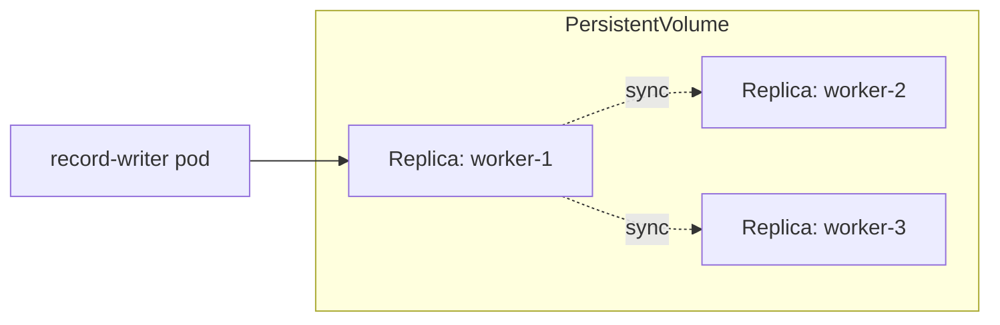
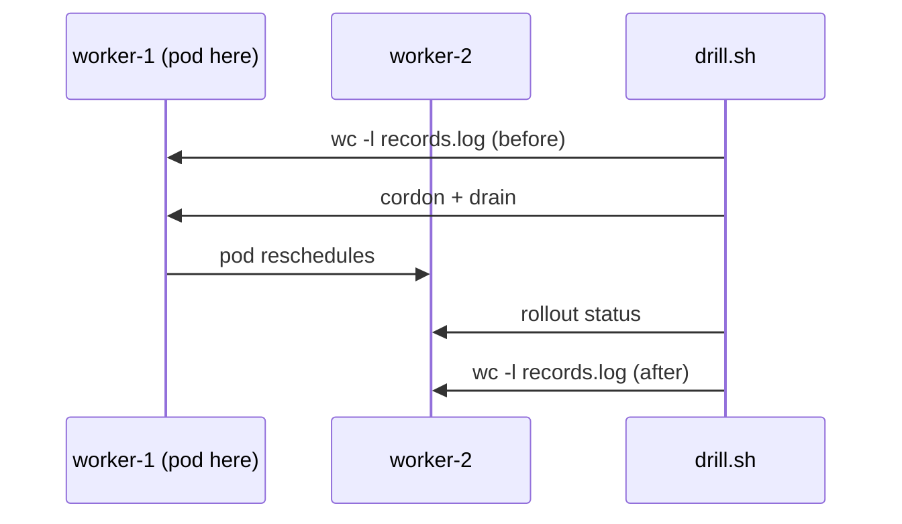

# Storage and Caching as Code

Longhorn and Dragonfly on Kubernetes with Pulumi

Speaker Name · Role, Company

<!--
Title. 1 minute.
Say the title, say who's presenting, then move straight to the speaker slide.
-->

---
layout: image-left
image: /img/speaker-placeholder.png
---

# Speaker Name

Role at **Pulumi**

github.com/handle · linkedin.com/in/handle

Two lines on what they actually do and why this topic is theirs to teach.

<!-- TODO(presenter): replace photo, name, role, socials and bio -->

<!--
Speaker introduction. 1 minute.
Presenter note: swap this placeholder for the real speaker's photo and bio before delivery. No speaker has been assigned to this session yet.
-->

---
layout: default
---

# Before we start

- Chatty in the chat tab, questions in the Q&A tab
- Slides and demo scripts are in the handouts tab
- This session is recorded; the recording goes out by email
- Everything you see here also lives in the workshop repo

<!--
Housekeeping. 1 minute.
Standard framing, no content changes needed unless the platform differs on the day.
-->

---
layout: default
---

# Agenda

- The stateful-workload problem
- Longhorn and Dragonfly, what they are and why
- Guided build: cluster, storage, cache
- Live failover drill
- Comparison, pitfalls, and what to do Monday

<!--
Agenda. 1 minute.
Read it, don't explain it yet. The explaining happens in the next few slides.
-->

---
layout: statement
---

# A pod restarts on a different node.

# Its data does not come with it.

<!--
The hook. 3 minutes.
Open with the concrete failure: a stateful app gets rescheduled after a node
problem, and the new pod starts with an empty disk, because the old disk was
local to the node that's now gone. Ask the room: who has actually watched
this happen at 2am. Most platform teams have a war story here, so use it to
earn the next few slides instead of asserting the problem.
-->

---
layout: two-cols
---

::header::

# Why the obvious fixes don't hold

::left::

**hostPath**
- Tied to one node, by definition
- Node drains, data is gone
- Fine for cache, wrong for state

**A single cloud-managed disk**
- Survives a node failure
- Still one disk: one zone, one failure domain
- Attached to exactly one pod at a time

::right::

**What you actually want**

- Data replicated across nodes, not zones you don't control
- A volume that can re-attach to a *different* node automatically
- The same behavior on a laptop, on-prem, or any cloud

<!--
The pain, part one of two. 2 minutes.
hostPath and a single managed disk both fail the same test: they tie your
data to one place. The fix isn't a bigger disk, it's replication across
failure domains you actually control.
-->

---
layout: default
---

# And the fix has to run everywhere

- Your `kind` laptop cluster
- A bare-metal rack with no cloud API
- Three different clouds, because that's how the contract turned out

A storage layer that only works on one cloud's disks doesn't solve this.
A storage layer defined in code, provisioned the same way everywhere, does.

<!--
The pain, part two of two. 2 minutes.
This is the bridge to naming Longhorn: the requirement is portability, and
that's exactly the gap Longhorn and Pulumi's Kubernetes provider close
together: one program, any cluster.
-->

---
layout: diagram-right
---

# Meet Longhorn

- Distributed block storage for Kubernetes, CNCF **incubating**
- Replicates each volume across multiple nodes
- Runs as pods inside your own cluster, no external storage array
- A volume survives losing the node it was last attached to

::diagram::



<!--
Naming the solution. 5 minutes.
Longhorn is a set of pods running inside the cluster: a manager, an engine
per volume, and a replica per node you ask for. Three replicas means the
volume survives losing any one of them. It's CNCF incubating, not
experimental: SUSE/Rancher-backed, widely deployed. Say plainly that it's
one of several options; the comparison slide later covers Rook/Ceph and
cloud disks.
-->

---
layout: default
---

# Meet Dragonfly

- A Redis-compatible in-memory store, CNCF **graduated**
- Speaks the Redis protocol, so your client code doesn't change
- Single multi-threaded process, not a client-side shard map
- Today's demo: no persistence, cache semantics only

Same story as Longhorn: run it in your own cluster, in your own code,
instead of depending on a managed Redis you don't control.

<!--
Naming the cache half. 4 minutes.
Dragonfly is a drop-in for anything speaking the Redis protocol. It
graduated CNCF status this year, which is a stronger governance signal than
incubating, worth contrasting with Longhorn's incubating status if asked.
We deploy it here with no persistence: it's a cache, not a system of record,
so losing it on a restart is the expected behavior, not a bug.
-->

---
layout: default
---

# Prerequisites check

- Docker running, at least 4 cores / 8GB RAM allocated
- `kind`, `kubectl`, Node.js, `redis-cli`, the Pulumi CLI
- No cloud account, no cloud spend: everything runs on this laptop
- `npm install` already run in each numbered folder

If your laptop can't spare 8GB to Docker today, watch the live build and
you'll have the repo to run later.

<!--
Prerequisites check. 3 minutes.
Say plainly that a 3-worker kind cluster is heavier than most workshop
demos. Anyone who can't run it locally still gets the full value by
watching. The point is understanding the pattern, not everyone's laptop
surviving four Kubernetes nodes at once.
-->

---
layout: section
---

# Live demo

## Seven Pulumi programs, one `kind` cluster, one failure on purpose

<!--
Section divider. 1 minute.
No content, just the turn from concept to terminal. Move to the actual
terminal window now.
-->

---
layout: code
---

# 01 · The cluster

A 4-node `kind` cluster (1 control-plane, 3 workers), provisioned with
`@pulumi/command`, plus the two namespaces the rest of the demo uses.

```bash
cd 01-cluster && pulumi up --yes
```

```bash
kubectl --context kind-storage-caching-workshop-demo get nodes
```

<!--
01-cluster. 5 minutes.
This step doesn't use a Pulumi Kubernetes-provider resource for the cluster
itself: kind has no Pulumi provider, so this wraps `kind create cluster`
in a `local.Command`. Point out kind.yaml: three workers each get a
hostPath mount at /var/lib/longhorn, which is what lets Longhorn claim disk
on each node. Verify: kubectl shows 4 Ready nodes.
-->

---
layout: code
---

# 02 · Longhorn

Longhorn v1.12.1, installed via its own Helm chart with Pulumi's
`helm.v4.Chart`, into the `longhorn-system` namespace.

```bash
longhornctl --kubeconfig ~/.kube/config \
  --image longhornio/longhorn-cli:v1.12.1 install preflight
```

```bash
cd 02-longhorn && pulumi up --yes
```

<!--
02-longhorn. 6 minutes.
The longhornctl preflight line runs on the presenter's host, not as a
Pulumi resource. It checks each node for open-iscsi and the other
kernel-level requirements Longhorn needs, and Longhorn dropped the old
standalone DaemonSet-based installer for this CLI after v1.8. The chart
itself sets persistence.defaultClass to false on purpose: we don't want
Longhorn silently becoming the cluster's default storage class yet, we
provision that explicitly next. Verify: kubectl -n longhorn-system get
pods shows manager and engine pods Running across all three workers.
-->

---
layout: code
---

# 03 · The StorageClass

`StorageClass/longhorn-workshop`: 3 replicas, ext4, not cluster-default.

```bash
cd 03-storage-class && pulumi up --yes
```

```bash
kubectl get storageclass longhorn-workshop
```

<!--
03-storage-class. 4 minutes.
Three replicas is a deliberate choice for a 3-worker cluster: one replica
per worker, so losing any single node still leaves two copies. Not marking
this the cluster default is also deliberate: workshop hygiene, so nothing
else in the cluster accidentally starts using it.
-->

---
layout: code
---

# 04 · The stateful app

A 1Gi PVC on `longhorn-workshop`, and a `record-writer` Deployment that
appends a timestamped line to `/data/records.log` every 5 seconds.

```bash
cd 04-stateful-app && pulumi up --yes
```

```bash
kubectl -n caching-workshop exec deploy/record-writer -- cat /data/records.log
```

<!--
04-stateful-app. 6 minutes.
This is the app we're about to break. Run the exec command twice, a few
seconds apart, and show the line count going up. That's the baseline
we'll compare against after the drill. busybox and a five-second loop is
deliberately the simplest possible stateful workload; the point is the
volume's behavior, not the app.
-->

---
layout: statement
---

# Now we break it on purpose.

<!--
Beat. 1 minute.
One sentence, then move to the terminal for the drill. Let the room sit
with it for a second before running the script.
-->

---
layout: diagram-left
---

# 05 · The failover drill

- Read `/data/records.log` on the node currently holding the pod
- `kubectl cordon` and `kubectl drain` that node
- Wait for `record-writer` to reschedule
- Read the log again on the new node

```bash
cd 05-failover-drill && ./drill.sh
```

::diagram::



<!--
05-failover-drill, the centerpiece. 20 minutes.
This is pure bash, no Pulumi resource. drill.sh wraps kubectl directly.
Walk through what it's actually doing: find the node hosting the pod, read
the line count and last three lines before touching anything, cordon and
drain that node (--ignore-daemonsets --delete-emptydir-data --force,
120-second timeout), wait for the rollout to report healthy on whatever
node it landed on, then read the line count and first three lines again.
The number goes up, not down, across the drain. That's the proof the
Longhorn volume followed the pod rather than staying behind on the drained
node. If the drain is slow to reschedule, that's Longhorn's rebuild timing
on a resource-constrained kind node, not a bug. Give it the full
120-second timeout before assuming something's wrong. Uncordon the node at
the end either way, live or not. Cap live retries at two before falling
back to a recording of a previous run.
-->

---
layout: code
---

# 06 · Dragonfly

A single-replica Dragonfly deployment plus a ClusterIP service. No
persistence: it's a cache, not a system of record.

```bash
cd 06-dragonfly && pulumi up --yes
```

```bash
kubectl -n caching-workshop get pods -l app=dragonfly
```

<!--
06-dragonfly. 5 minutes.
Notice this one doesn't depend on Longhorn or the StorageClass at all --
it only references the cluster stack. No PVC, no volume, because a cache
that loses its data on restart is working as intended. The IPC_LOCK
capability lets Dragonfly lock memory pages so the OS can't swap them out
mid-request.
-->

---
layout: code
---

# 07 · The cache client

A Kubernetes `Job` running `redis-cli`: PING, then five SET/GET
round-trips against Dragonfly, using the plain Redis wire protocol.

```bash
cd 07-cache-client && pulumi up --yes
```

```bash
kubectl -n caching-workshop logs job/cache-client
```

<!--
07-cache-client. 4 minutes.
Expected output: PONG, then five value-N reads matching the five keys just
written. This is the moment that proves the "your client code doesn't
change" claim from the Dragonfly slide. redis-cli doesn't know or care
that it's talking to Dragonfly instead of Redis.
-->

---
layout: two-cols
---

::header::

# Longhorn vs. the alternatives

::left::

**Rook / Ceph**
- More features: object + block + file
- Heavier to operate, steeper learning curve
- Better fit at real scale, on real hardware

**A cloud-managed disk**
- Zero operational burden
- Locked to one cloud, one zone
- Can't run the same way on `kind` or bare metal

::right::

**Longhorn, here**
- Simpler operational model than Ceph
- Portable: same behavior on `kind`, on-prem, any cloud
- Right fit for this workshop's teaching goal, not a claim it beats Ceph everywhere

<!--
Comparison. 4 minutes.
Say plainly: this workshop picked Longhorn for its simpler operational
model and because independent tutorial evidence backed it specifically,
not because Rook/Ceph is worse. A team already running Ceph at scale has
no reason to switch. The point of this slide is helping the room choose,
not selling Longhorn as universally correct.
-->

---
layout: default
---

# Common pitfalls

- Replica count below your worker count: no failure to survive
- Forgetting `persistence.defaultClass: false`: Longhorn silently
  becomes the cluster default and grabs volumes you didn't intend
- No node affinity: replicas can end up co-located, defeating the point
- Testing failover with `kubectl delete pod` instead of draining the node.
  That skips the part that actually matters

<!--
Pitfalls. 3 minutes.
Each of these came up somewhere in this build or in Longhorn's own docs.
The delete-pod pitfall is worth emphasizing: deleting the pod directly
just reschedules it on the same node in most kind setups, which looks like
success but tests nothing. Draining the node is what actually proves
replication.
-->

---
layout: default
---

# What you can now do

1. Explain why a distributed storage layer beats a single disk for
   surviving node failure
2. Provision Longhorn with Pulumi's Kubernetes provider
3. Create a Longhorn-backed StorageClass and PVC as Pulumi resources
4. Deploy Dragonfly and confirm a Redis client round-trips against it
5. Run a real node failure and confirm the data survived it

<!--
Recap. 2 minutes.
These are the five outcomes from the brief, read back as things attendees
just did rather than things they were told about.
-->

---
layout: statement
---

# What would you change on Monday?

<!--
Discussion. 2 minutes.
Open floor. If nobody bites in a few seconds, prompt with: which of your
current stateful workloads is still on a single disk today?
-->

---
layout: default
---

# Keep going

<div class="grid grid-cols-3 gap-8 mt-8">
  <div class="text-center">
    <div class="w-32 h-32 mx-auto"><QRCode data="https://slack.pulumi.com" dark="#000000" /></div>
    <p class="mt-2 font-semibold">Pulumi Community Slack</p>
    <p class="text-sm opacity-70">slack.pulumi.com</p>
  </div>
  <div class="text-center">
    <div class="w-32 h-32 mx-auto"><QRCode data="https://app.pulumi.com/signup" dark="#000000" /></div>
    <p class="mt-2 font-semibold">Pulumi Cloud, free tier</p>
    <p class="text-sm opacity-70">app.pulumi.com/signup</p>
  </div>
  <div class="text-center">
    <div class="w-32 h-32 mx-auto"><QRCode data="https://github.com/pulumi/workshops/pull/247" dark="#000000" /></div>
    <p class="mt-2 font-semibold">This workshop</p>
    <p class="text-sm opacity-70">pulumi/workshops PR #247</p>
  </div>
</div>

<!--
Follow-up. 2 minutes.
The repo QR points at the pull request for now, since this folder hasn't
merged to main yet, so swap it for the tree URL once it has.
-->

---
layout: end
---

# Questions?

<div class="grid grid-cols-2 gap-12 mt-8 max-w-2xl mx-auto">
  <div class="text-center">
    <div class="w-28 h-28 mx-auto"><QRCode data="https://github.com/pulumi/workshops/pull/247" dark="#000000" /></div>
    <p class="mt-2 text-sm opacity-70">Workshop repo</p>
  </div>
  <div class="text-center">
    <div class="w-28 h-28 mx-auto"><QRCode data="https://slack.pulumi.com" dark="#000000" /></div>
    <p class="mt-2 text-sm opacity-70">Ask us on Slack</p>
  </div>
</div>

<!--
Q&A / thanks. 2 minutes.
This slide stays up during questions. Both QR codes work standalone if
someone photographs the slide and leaves before the end.
-->