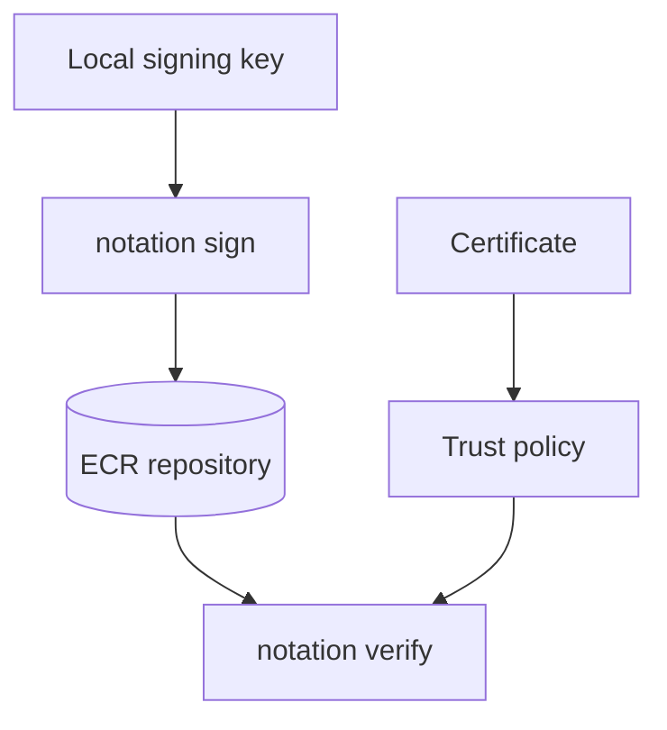
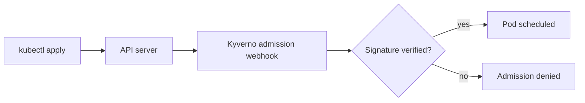
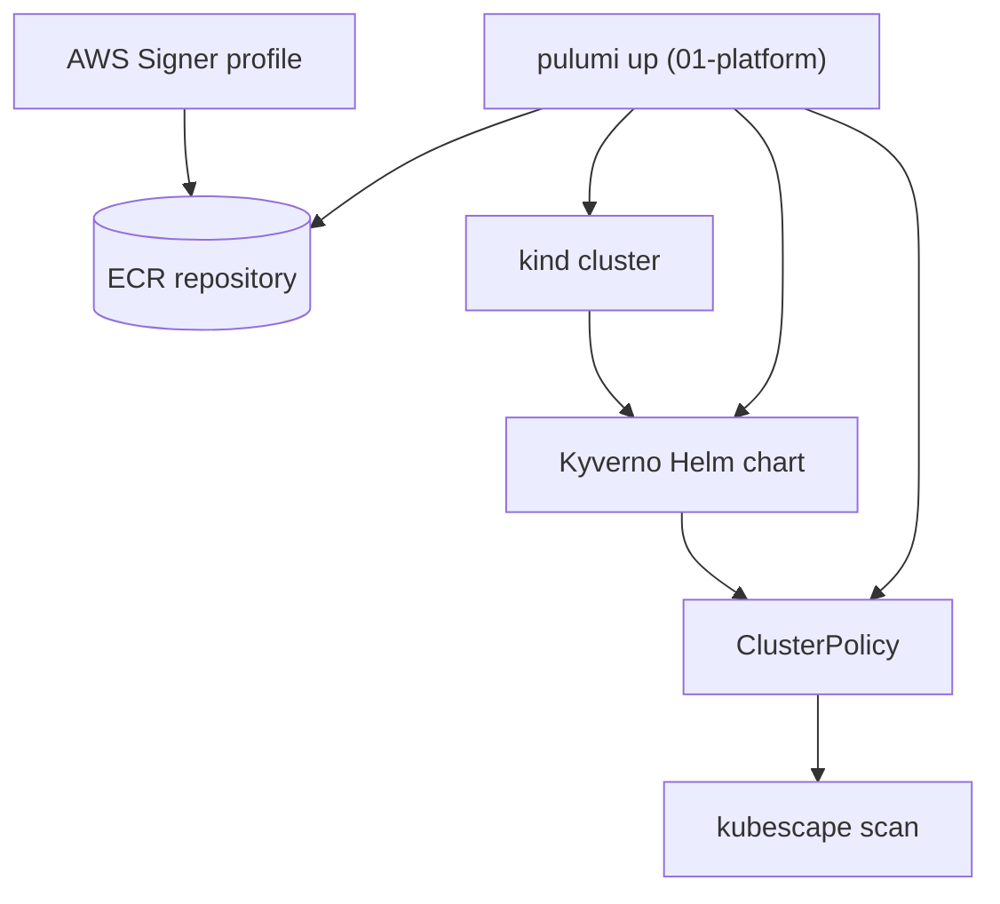

<div class="absolute inset-0 flex flex-col justify-center items-start px-20">
  <h1 class="!text-[5.0rem] !leading-[1.02] !font-semibold !tracking-tight !mb-6 !max-w-[95%]">
    Supply chain signing as code
  </h1>
  <p class="!mt-1 !text-[2.0rem] text-[var(--p-fg-muted)] !m-0 !leading-relaxed !max-w-[90%]">
    Notation image signing, Kyverno admission enforcement and Kubescape posture scanning with Pulumi
  </p>
  <p class="!mt-8 !text-[1.6rem] text-[var(--p-fg-muted)] !m-0 !leading-relaxed">
    Speaker Name · Role, Pulumi
  </p>
</div>

<!-- TODO(presenter): confirm speaker name, role and photo before delivery. -->

<!--
Time budget: 0.5 min.
Welcome everyone. Read the title and subtitle, nothing more. Do not summarize
the whole workshop here, that's what the agenda slide is for.
-->

---

<div class="absolute inset-0 flex items-center px-24 gap-20">
  <div class="flex-shrink-0">
    
  </div>
  <div class="flex-1">
    <h1 class="!text-[6rem] !leading-[1.02] !font-semibold !tracking-tight !mb-4 !text-[var(--p-primary)]">Speaker Name</h1>
    <p class="!text-[2.2rem] !leading-relaxed !m-0 opacity-90">
      Role at <strong class="!text-[var(--p-primary)]">Pulumi</strong>
    </p>
    <div class="!mt-8 flex items-center gap-8 !text-[1.5rem] opacity-70">
      <span class="flex items-center gap-2"><carbon-logo-x /> @handle</span>
      <span class="flex items-center gap-2"><carbon-logo-linkedin /> handle</span>
      <span class="flex items-center gap-2"><carbon-logo-github /> handle</span>
    </div>
    <p class="!mt-10 !text-[1.75rem] !leading-relaxed opacity-70 !m-0">
      Two lines on what this speaker actually does.<br/>
      Replace before delivery.
    </p>
  </div>
</div>

<!-- TODO(presenter): replace photo, name, role, socials and bio. Speaker count is unknown; add one slide per confirmed speaker. -->

<!--
Time budget: 1 min.
Say who you are and why you're the one running this. Keep it to two sentences,
the slide already carries the detail.
-->

---

# Housekeeping

- Chat freely in the chat tab
- Questions go in the Q&A tab
- Slides and demo scripts are in the Handouts tab
- Recording follows by email

<!--
Time budget: 1 min.
Point at each tab as you name it if the platform shows tabs on screen.
Mention that a prerequisites reminder is on the next slide, so latecomers
aren't lost by minute five.
-->

---

# Prerequisites

Follow along, or watch, either is fine.

- Docker installed and running
- `kind` installed, or an existing EKS cluster with `kubectl` configured
- AWS CLI installed and configured with credentials
- `notation` CLI v1.3.2 or newer
- `kubescape` CLI v4.0.14 or newer
- Pulumi CLI installed and authenticated
- Node.js and npm

<!--
Time budget: 1.5 min.
These are the participant prerequisites from the workshop repo's README, not
guesses. If someone is missing a tool, tell them to watch rather than scramble
to install mid-session, we move fast after this.
-->

---

# Agenda

- Why this, why now
- The pain: "it built, therefore it's fine"
- Signing images with Notation
- Enforcing signatures with Kyverno
- Scanning posture with Kubescape
- Live demo, start to teardown
- Recap and next steps

<!--
Time budget: 1 min.
Read the list once, don't editorialize on each line, that happens later.
-->

---

# A patch that shipped without a headline

On 2026-02-20, a FreeBSD ports advisory shipped a remediation for a
vulnerability in `py310-tuf`, the reference implementation of The Update
Framework.

TUF is the trust model Notation's signing and verification build on.

<!--
Time budget: 3 min.
This isn't a Notation vulnerability, it's evidence that the trust
infrastructure underneath image signing is real production software that
gets patched, not a whitepaper concept. Source:
progressiverobot.com/2026/02/20/freebsd-15-py310-tuf-vulnerability-patch-remediation,
read 2026-09-26. Use this to earn the room's attention before naming any
Pulumi product.
-->

---
layout: statement
---

# "It built, therefore it's fine."

<!--
Time budget: 5 min.
State the belief, then take it apart out loud: a successful `docker build`
proves the Dockerfile ran, nothing about who pushed the tag, whether it
matches what was reviewed, or whether the cluster will even ask. Three gaps,
in order: no signing means no proof of origin, no admission-time check means
an unsigned image runs exactly as well as a signed one, and no posture
scanning means nobody is watching the cluster's configuration once it's
running. Each gap gets fixed by one of the next three sections, in the same
order they're named here.
-->

---
layout: diagram-right
---

# Signing with Notation

An AWS Signer profile holds the certificate. A local `notation` key signs the
image by digest. A trust policy tells anyone verifying which certificate to
believe.

- Signature is an OCI artifact, attached by digest
- Trust policy pins the certificate, not a bare public key
- Verification is a local `notation verify`, no network call to AWS

::diagram::



<!--
Time budget: 6 min.
The provisioned AWS Signer profile follows the Safeguard tutorial's pattern
(read 2026-09-27) for a production signing setup with a managed, HSM-backed
key. The live demo signs with a local Notation test key instead, because
generating and trusting a throwaway key live is safe to show and an AWS
Signer call is not something to demonstrate casually against a real account.
Say that split explicitly, it's the kind of detail an attendee will otherwise
notice and doubt the demo over.
-->

---
layout: diagram
---

# Enforcing signatures with Kyverno



<!--
Time budget: 6 min.
Kyverno's ClusterPolicy intercepts every pod create at admission time, before
the scheduler ever sees it, and checks the image's Notation signature against
the trust policy's certificate. A signed image is admitted, an unsigned one
is rejected with a message printed straight into kubectl's own output, no
extra tooling needed to see why it failed. Name that this ClusterPolicy shape
is marked deprecated in Kyverno's current docs in favor of a CEL-based
ImageValidatingPolicy, but still documented and functional, and it matches
the pattern this repo's other Kyverno workshop already uses.
-->

---

# Scanning posture with Kubescape

Admission control answers one question: is this image signed. Posture
scanning answers a different one: is the cluster, as configured right now,
following the practices you'd want it to.

- Runs against the live cluster, not a single admission event
- Surfaces findings you didn't write a policy for yet
- Complements Kyverno, doesn't replace it

<!--
Time budget: 6 min.
Be direct that Kubescape isn't a signing tool and isn't an admission
controller, it's a separate check that runs on demand or on a schedule and
reports on the cluster's overall configuration. This is the distinction the
brief specifically calls for on this slide, don't let the audience conflate
it with Kyverno just because they show up back to back.
-->

---
layout: diagram
---

# The full stack



<!--
Time budget: 5 min.
One Pulumi program in 01-platform provisions everything on this diagram: the
ECR repository, the kind cluster (driven through @pulumi/command's
local.Command, since kind has no native Pulumi provider), the Kyverno Helm
chart, and the ClusterPolicy that reads the certificate 00-signing-key
produced. Walk left to right once, then say the demo runs this exact stack
starting next slide.
-->

---
layout: section
---

# Live demo

## Nine steps, start to teardown

<!--
Time budget: 0.5 min.
Say what's coming: provision, build, sign, push both variants, watch Kyverno
admit and reject, scan with Kubescape, tear everything down. Then start
running commands.
-->

---
layout: code
---

# Step 0 · generate the signing key

```bash
notation cert generate-test --default "$IDENTITY"
```

Presenter pre-step, run before the session. The Kyverno ClusterPolicy this
demo provisions next embeds the certificate this command produces.

<!--
Time budget: 2 min.
This was already run before the session per the risk log, don't wait on it
live. Narrate what it did: generated a local test key pair and a self-signed
certificate under notation's own config directory, then exported the
certificate so 01-platform's Pulumi program can read it into the
ClusterPolicy.
-->

---
layout: code
---

# Step 1 · provision the platform

```bash
cd 01-platform && pulumi up
```

One `pulumi up` provisions the ECR repository, the `kind` cluster, the
Kyverno Helm chart, and the ClusterPolicy that verifies Notation signatures
at admission time.

<!--
Time budget: 8 min.
This is the biggest single step, let it run and narrate the plan while it
does. If AWS credentials or quota fail live, switch to the pre-provisioned
repository and narrate the steps that would normally run against it, per the
risk log. Point out that the ClusterPolicy could not exist yet without the
certificate from step 0, that's why the ordering matters.
-->

---
layout: code
---

# Step 2 · build the demo image

```bash
docker build -t "$IMAGE" "$DIR"
```

A trivial "hello" web server, nothing more. The point of this workshop is the
pipeline around the image, not the image itself.

<!--
Time budget: 3 min.
Mention the image was already pre-built once as a backup per the risk log,
in case a live rebuild runs long. Move quickly, there's no interesting output
here.
-->

---
layout: code
---

# Step 3 · push, then sign

```bash
docker push "$IMAGE"
notation sign "$IMAGE"
```

Push before sign, on purpose: a Notation signature attaches to the image by
its digest, so the digest has to exist in the registry first.

<!--
Time budget: 5 min.
This reverses the brief's stated step order (sign, then push), and that's
deliberate, not a mistake, say so on screen. Show `notation verify` locally
right after signing to prove the signature is readable before moving on to
the unsigned variant.
-->

---
layout: code
---

# Step 4 · push an unsigned variant

```bash
docker push "$IMAGE_UNSIGNED"
```

A second tag of the same image, pushed without ever running `notation sign`
against it.

<!--
Time budget: 3 min.
This is the control for the next two steps: same image, same registry, one
difference. Keep it brief, the interesting part is what Kyverno does with it
next.
-->

---
layout: code
---

# Step 5 · Kyverno admits the signed image

```bash
kubectl get pod hello-signed -w --request-timeout=30s
```

If the pod reaches Running, Kyverno verified the signature and admitted it.

<!--
Time budget: 5 min.
Apply the manifest referencing the signed tag, then watch the pod come up.
Running is the whole proof here, no extra tooling needed, that's the point of
admission-time enforcement.
-->

---
layout: code
---

# Step 6 · Kyverno rejects the unsigned image

```bash
kubectl apply -f pod.yaml
```

Expect this command to fail. That failure is the demo: kubectl's own output
is Kyverno's admission-webhook rejection message.

<!--
Time budget: 5 min.
Let the failure happen on screen, don't apologize for it or rerun it, read
the rejection message out loud, it names the policy that blocked the pod.
If the webhook is instead blocking everything, including the signed pod from
the last step, run the scripted reset from the risk log and move on.
-->

---
layout: code
---

# Step 7 · scan the cluster

```bash
kubescape scan --format json --output "$REPORT" --kube-context "$CONTEXT"
kubescape scan --kube-context "$CONTEXT" | tail -n 20
```

Open the report and read at least one finding against the cluster's current
configuration.

<!--
Time budget: 7 min.
If the live scan is slow or the report looks thin against a freshly
provisioned cluster, switch to the saved report from a prior dry run per the
risk log, say plainly that you're doing so. Pick one finding, read what it
flags and why it applies to this cluster specifically, don't just scroll
past a wall of JSON.
-->

---
layout: code
---

# Step 8 · teardown

```bash
aws ecr batch-delete-image --repository-name "$REPO_NAME" --image-ids "$IMAGE_IDS"
pulumi destroy --cwd 01-platform --yes
notation key delete "$IDENTITY" --yes
```

Images first, then infrastructure, then local key material. A tag pushed
outside Pulumi's management isn't always removed by `pulumi destroy` alone.

<!--
Time budget: 4 min.
Say the ordering out loud and why: ECR images pushed directly by
docker push aren't Pulumi-managed resources, so pulumi destroy won't
necessarily catch them, the script deletes them first as a belt-and-braces
step. This closes the loop on the fifth learning outcome: nothing signed,
provisioned or key-shaped is left behind.
-->

---

# Recap

- Provisioned an ECR repository, a Notation trust policy and a Kyverno
  ClusterPolicy, all from one Pulumi program
- Signed a container image locally and pushed both a signed and unsigned
  variant
- Watched Kyverno admit the signed image and reject the unsigned one
- Ran a Kubescape scan and read a real posture finding
- Tore down every provisioned resource and every local key

<!--
Time budget: 5 min.
This maps one line to one learning outcome from the brief, in order, don't
add anything not already demonstrated. Close by naming what to try next:
swap kind for an existing EKS cluster, or try the CEL-based
ImageValidatingPolicy Kyverno now recommends over the ClusterPolicy shape
this demo used.
-->

---

# Continue your Pulumi journey!

<div class="zoom-content">

<div class="grid grid-cols-3 gap-6 mt-6">
  <div class="gpu-card gpu-card--primary journey-card">
    <div class="journey-card__title">Join the Pulumi Community Slack!</div>
    <div class="w-24 h-24 mx-auto"><QRCode data="https://slack.pulumi.com" dark="#000000" /></div>
    <p class="journey-card__body">
      <a class="text-[var(--p-primary)]" href="https://slack.pulumi.com">slack.pulumi.com</a>
    </p>
  </div>
  <div class="gpu-card gpu-card--primary journey-card">
    <div class="journey-card__title">Sign up for a Pulumi Cloud account!</div>
    <div class="w-24 h-24 mx-auto"><QRCode data="https://app.pulumi.com/signup" dark="#000000" /></div>
    <p class="journey-card__body">
      <a class="text-[var(--p-primary)]" href="https://app.pulumi.com/signup">app.pulumi.com/signup</a>
    </p>
  </div>
  <div class="gpu-card gpu-card--accent journey-card">
    <div class="journey-card__title">Get the workshop code!</div>
    <div class="w-24 h-24 mx-auto"><QRCode data="https://github.com/pulumi/workshops/tree/anvil/supply-chain-signing-as-code/supply-chain-signing-as-code" dark="#000000" /></div>
    <p class="journey-card__body">
      Link in the <strong>Handouts</strong> tab
    </p>
  </div>
</div>

</div>

<style scoped>
.zoom-content { zoom: 1.3; }
.journey-card { display: flex; flex-direction: column; align-items: center; gap: 0.6rem; }
.journey-card .qr-code { background: #ffffff; padding: 0.4rem; border-radius: 10px; box-shadow: 0 10px 24px rgba(0, 0, 0, 0.18); }
.journey-card__title { font-size: 1.4rem; font-weight: 600; line-height: 1.25; color: var(--p-fg); text-align: center; }
.journey-card__body { font-size: 1.05rem; line-height: 1.55; margin: 0 !important; color: var(--p-fg); text-align: center; }
</style>

<!--
Time budget: 1.5 min.
Point at each QR code as you name it, this slide is meant to be photographed,
not read aloud line by line.
-->

---
layout: end
---

<div class="absolute inset-0 flex flex-col justify-center items-center px-16">
  <h1 class="!text-[4.5rem] !font-semibold !tracking-tight !mb-10">Thank you.</h1>
  <div class="grid grid-cols-2 gap-16 mt-4">
    <div class="thanks__person">
      
      <div class="thanks__name">Speaker Name</div>
      <div class="thanks__org">Pulumi</div>
      <div class="w-24 h-24 mx-auto"><QRCode data="https://github.com/pulumi/workshops/tree/anvil/supply-chain-signing-as-code/supply-chain-signing-as-code" dark="#000000" /></div>
      <div class="thanks__qr-label">workshop repo</div>
    </div>
    <div class="thanks__person">
      <div class="thanks__avatar thanks__avatar--icon"><carbon-logo-github /></div>
      <div class="thanks__name">Questions?</div>
      <div class="thanks__org">Use the Q&amp;A tab</div>
      <div class="w-24 h-24 mx-auto"><QRCode data="https://slack.pulumi.com" dark="#000000" /></div>
      <div class="thanks__qr-label">Pulumi Community Slack</div>
    </div>
  </div>
</div>

<!-- TODO(presenter): replace with confirmed speaker photo, name and social QR codes once known. -->

<style scoped>
.thanks__person { display: flex; flex-direction: column; align-items: center; text-align: center; }
.thanks__avatar { width: 7rem; height: 7rem; border-radius: 9999px; object-fit: cover; border: 3px solid color-mix(in srgb, var(--p-primary) 45%, transparent); }
.thanks__avatar--icon { display: flex; align-items: center; justify-content: center; font-size: 3.6rem; color: var(--p-fg); background: var(--p-bg-elevated); }
.thanks__name { margin-top: 0.9rem; font-size: 1.45rem; font-weight: 700; color: var(--p-fg); }
.thanks__org { font-size: 1.1rem; color: var(--p-fg-muted); }
.thanks__qr-label { display: inline-flex; align-items: center; gap: 0.35rem; margin-top: 0.55rem; font-family: var(--slidev-font-mono); font-size: 0.85rem; color: var(--p-fg-muted); }
</style>

<!--
Time budget: 5 min.
Stay on this slide while questions come in, it carries the links people will
want. Thank the room, then open the floor.
-->
