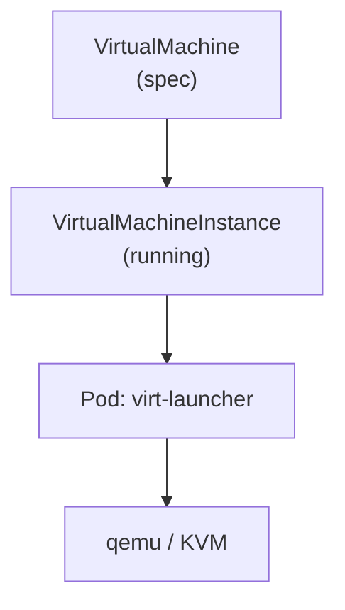
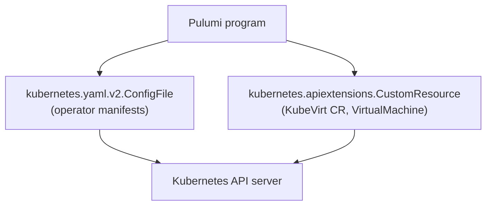

# VMs on Kubernetes as Code

## Provisioning and live-migrating a KubeVirt VM with Pulumi

Pulumi

<!--
(~1 min) Welcome everyone. By the end of this session you will have provisioned a
virtual machine on Kubernetes and moved it, live, to a different node, using
nothing but a Pulumi program. No separate hypervisor, no second control plane.
-->

---
layout: image-left
---


# Speaker Name

Role at **Pulumi**

<div class="mt-8 flex items-center gap-8 text-lg opacity-70">
  <span>@handle</span>
  <span>linkedin.com/in/handle</span>
  <span>github.com/handle</span>
</div>

Two lines on what the speaker actually does, filled in before the session.

<!-- TODO(presenter): replace photo, name, role, socials and bio. No speaker was assigned to this workshop as of this build. -->

<!--
(~2 min) Introduce yourself: what you build day to day, and why VMs-on-Kubernetes
is the problem you keep running into.
-->

---
layout: default
---

# Before we start

- Chat tab: be loud, ask anything
- Q&A tab: the questions we'll answer out loud
- Handouts tab: these slides and the workshop repo
- Recording goes out by email after the session

<!--
(~2 min) Point people at the right tab for the right thing so the chat doesn't
turn into a support queue. Recording lands in everyone's inbox, so nobody
needs to take notes on the commands.
-->

---
layout: two-cols
---

::left::

# Follow along

If you want to run this yourself:

- A laptop with 4+ CPUs and 8+ GB RAM free
- Docker or Podman, and `kind` v0.33.0
- `kubectl`, `pulumi` CLI, `virtctl` v1.9.0
- Node.js 22.x and npm

::right::

# One thing to check now

Nested virtualization has to be on, or KubeVirt falls back to software
emulation and everything gets slow.

```bash
# Linux
cat /sys/module/kvm_intel/parameters/nested
cat /sys/module/kvm_amd/parameters/nested
```

If that's a problem on your machine, watch instead. Everything here also
runs from a single terminal on the presenter's machine.

<!--
(~3 min) This is the one prerequisite that actually bites people: no nested
virtualization means KubeVirt runs the VM in software emulation, which still
works but crawls. Emulation is on by default in this demo's `vms-kubevirt`
config precisely so a laptop without nested virt can still follow along, just
slower. If someone's machine can't do it, tell them to watch, not to fight it
live.
-->

---
layout: default
---

# Where we're headed

- The problem: two control planes for containers and VMs
- KubeVirt's answer: a VM as a Kubernetes object
- Where Pulumi fits, with no dedicated VM provider
- Live demo: cluster, VM, live migration
- What breaks, what's next, and how to try it yourself

<!--
(~2 min) Five beats, ninety minutes. The demo is the long middle; everything
before it is earning the right to skip the sales pitch once we get there.
-->

---
layout: statement
---

Most platforms run containers and VMs on **two separate control planes**.

<!--
(~3 min) Two sets of tooling, two RBAC models, two monitoring pipelines, and
two on-call rotations that don't talk to each other. Ask the room: who here
still has a VM fleet that containers never touch? Most hands go up. That gap
is the whole reason this workshop exists.
-->

---
layout: two-cols
---

::left::

# The pain, concretely

- A team ships containers on Kubernetes
- The same team runs a database VM, or a legacy app, on VMware or bare metal
- Access control, quotas, and audit logs don't line up between the two
- Migrating that VM to Kubernetes usually means rewriting it as a container

::right::

# Why the obvious fix doesn't work

`kubevirt` isn't a converter. It doesn't turn your VM image into a container
image. It runs the VM you already have, unmodified guest OS and all, as a
first-class Kubernetes object, next to your pods.

<!--
(~4 min) The instinct is "just containerize it." Some VMs genuinely can't be:
old kernels, licensing tied to a specific OS instance, an app nobody wants to
touch. KubeVirt doesn't ask you to solve that. It gives the VM a Kubernetes
identity without changing what's inside it.
-->

---
layout: diagram-left
---

# A VM is a Kubernetes object

- You submit a `VirtualMachine` manifest, like any other resource
- KubeVirt's controller creates a `VirtualMachineInstance` while it runs
- That instance is backed by an ordinary pod running `virt-launcher`
- Inside the pod: qemu and KVM, doing what they've always done

::diagram::



<!--
(~5 min) Walk the diagram top to bottom. `VirtualMachine` is the thing you
manage: start, stop, update. `VirtualMachineInstance` exists only while the
VM is running, the same relationship a `Deployment` has to its `Pods`. The
pod itself never runs your guest OS as a process on the node; it runs
`virt-launcher`, which drives an ordinary qemu/KVM VM inside that pod's
namespace. Nothing about qemu changed. What changed is that Kubernetes now
schedules it, watches it, and can move it.
-->

---
layout: diagram-right
---

# Where Pulumi fits

- KubeVirt ships CRDs: `VirtualMachine`, `VirtualMachineInstance`, `KubeVirt`
- Pulumi's `@pulumi/kubernetes` provider applies those CRDs like any manifest
- No dedicated KubeVirt provider exists, and this workshop doesn't need one
- The operator install is a pinned `ConfigFile`; the VM is a typed `CustomResource`

::diagram::



<!--
(~5 min) This is the point that surprises people: there's no `@pulumi/kubevirt`
package, and there doesn't need to be. KubeVirt is Kubernetes objects all the
way down, so the generic Kubernetes provider already speaks its language. The
operator's release YAML goes through `yaml.v2.ConfigFile`, pinned to v1.9.0.
The `KubeVirt` custom resource and the `VirtualMachine` itself go through a
typed `apiextensions.CustomResource`. Same provider, same program, two
different Pulumi resource types.
-->

---
layout: section
---

# Live demo

## Cluster, VM, live migration

<!--
(~1 min) Terminal time. Everything from here runs from the workshop repo,
folder by folder.
-->

---
layout: code
---

# Cluster and operator

```bash
cd 02-cluster && npm install && pulumi up --stack dev && cd ..
cd 03-kubevirt && npm install && pulumi up --stack dev && cd ..
```

```bash
kubectl -n kubevirt get kubevirt kubevirt \
  -o jsonpath='{.status.phase}'
```

<!--
(~15 min) `02-cluster` stands up a three-node `kind` cluster: one control
plane, two workers, modeled in Pulumi through `@pulumi/command`'s
`local.Command`, which is what makes `pulumi destroy` actually delete it
later. `03-kubevirt` applies the pinned v1.9.0 operator release YAML and the
`KubeVirt` custom resource, then waits. The phase check should land on
`Deployed`. If it sits on `Deploying` for more than a couple of minutes, that
is almost always the operator image still pulling, which `01-preflight`'s
`prepull-images.sh` exists to avoid; check `kubectl -n kubevirt get pods` for
a pod stuck in `ImagePullBackOff` while this runs.
-->

---
layout: code
---

# The VM, and its console

```bash
cd 04-vm && npm install && pulumi up --stack dev && cd ..
cd 05-console && ./console.sh   # or ./ssh.sh
```

```bash
kubectl get vmi demo-vm
```

<!--
(~14 min) `04-vm` provisions `demo-vm`: a `containerDisk` image plus
`cloudInitNoCloud` for guest setup, and a NodePort `Service` named
`demo-vm-ssh` in front of port 22. Not a `DataVolume`. Stock `kind`'s
`local-path` storage class is ReadWriteOnce, and KubeVirt's own docs are
explicit that a PVC-backed VM needs ReadWriteMany to be live-migrated, which
would break the whole point of this workshop. `05-console` drops into the
guest, over `virtctl console` or straight SSH through the NodePort. Either
way, show the room a real login prompt: that's a running kernel, not a
description of one.
-->

---
layout: code
---

# Live migration

```bash
cd 06-live-migration
./hold-uptime.sh &
./migrate.sh
./watch-migration.sh
```

```bash
kubectl get vmi -o wide
kubectl get vmim -w
```

<!--
(~11 min) `hold-uptime.sh` keeps a session open inside the guest so the room
can watch its uptime counter never reset. `migrate.sh` creates a
`VirtualMachineInstanceMigration` object; `watch-migration.sh` follows it
through to completion. `kubectl get vmi -o wide` shows the node field flip.
The guest's own clock and uptime don't reset, because the migration moves
running memory pages to the new node before cutting over, not a
stop-and-restart. If a migration stalls, it's almost always memory pressure
on the destination node from running both workers on a laptop; the fallback
is `kubectl get vmim` to show a status field frozen mid-transfer and narrate
what it would show on real hardware.
-->

---
layout: statement
---

The VM never noticed. **Same VM, same disk, different node.**

<!--
(~4 min) That's outcome one and outcome three from the brief: a VM reaching
`Running` as a Kubernetes object, and a live migration you can point at in
`kubectl get vmim`. Nothing about the guest changed. What moved was the
`virt-launcher` pod underneath it, and Kubernetes did the scheduling the same
way it would for any other pod eviction.
-->

---
layout: default
---

# Where this breaks today

- `containerDisk` VMs have no persistent state; a real deployment needs a
  `DataVolume` on RWX storage, which stock `kind` doesn't provide
- This demo runs on local emulation by default; real workloads want
  nested virtualization or bare-metal nodes for KVM to run natively
- `virtctl` and the KubeVirt operator have to match versions, or the console
  and migration commands can fail in ways that don't explain themselves
- Nobody has run this exact demo against live infrastructure yet; every
  command here is what the code runs, not a rehearsed recording

<!--
(~3 min) Say this part plainly. A `containerDisk` VM forgets everything on
restart, which is fine for a demo and wrong for a database. Emulation mode
works everywhere but is slow enough that a real deployment wants nested
virtualization turned on, or bare metal. And this build has not been run
against a live cluster: docker, kind, and virtctl aren't available on the
machine that built it, so nothing here is a claim about observed timing.
-->

---
layout: default
---

# Where this goes next

- Swap `containerDisk` for a `DataVolume` on RWX storage (NFS, Ceph, or a
  cloud block store that supports RWX) for a VM that keeps its disk
- Turn on nested virtualization, or move to bare-metal nodes, to get real
  KVM performance instead of emulation
- Add a `MigrationPolicy` to control bandwidth and timeout per VM, instead
  of the defaults this demo uses
- Wire the whole thing into a `StackReference` chain across environments,
  the same pattern `02-cluster` → `03-kubevirt` → `04-vm` already uses

<!--
(~3 min) This is the honest roadmap, not a sales pitch. The `DataVolume` and
CDI path is documented in `04-vm/AGENTS.md` in the workshop repo for anyone
who wants to take it further after today.
-->

---
layout: code
---

# Cleaning up

```bash
cd 07-teardown && ./teardown.sh && ./verify-clean.sh && cd ..
```

```bash
kind get clusters
```

<!--
(~4 min) Teardown runs in reverse order: VM, then KubeVirt, then the kind
cluster itself, because `02-cluster` models `kind create cluster` and
`kind delete cluster` as a Pulumi `local.Command`, so `pulumi destroy` really
removes the cluster. `verify-clean.sh` and `kind get clusters` confirm
nothing is left behind. If you're running this back to back with another
group, this is the reset button.
-->

---
layout: default
---

# Keep going

<div class="grid grid-cols-3 gap-8 mt-8">
  <div class="text-center">
    <div class="w-32 h-32 mx-auto"><QRCode data="https://slack.pulumi.com" /></div>
    <p class="mt-2">Pulumi Community Slack</p>
  </div>
  <div class="text-center">
    <div class="w-32 h-32 mx-auto"><QRCode data="https://app.pulumi.com/signup" /></div>
    <p class="mt-2">Pulumi Cloud, free tier</p>
  </div>
  <div class="text-center">
    <div class="w-32 h-32 mx-auto"><QRCode data="https://github.com/pulumi/workshops" /></div>
    <p class="mt-2">pulumi/workshops<br/>(this folder lands after merge)</p>
  </div>
</div>

<!--
(~2 min) Slack is where to ask the question you didn't get to today. The free
tier gets you a Pulumi Cloud backend without the `file://` login this demo
used. The repo QR points at the workshops repo root; this specific folder is
still on its pull request as of this session, so mention that and offer to
follow up with the direct link once it merges.
-->

---
layout: end
---

# Thanks

<div class="grid grid-cols-2 gap-8 mt-8">
  <div class="text-center">
    
    <div class="w-24 h-24 mx-auto mt-4"><QRCode data="https://github.com/pulumi/workshops" /></div>
  </div>
  <div class="text-center">
    <div class="w-32 h-32 mx-auto"><QRCode data="https://github.com/pulumi/workshops" /></div>
    <p class="mt-2">Questions? Find the repo</p>
  </div>
</div>

<!--
(~6 min) This slide stays up through Q&A, so it's the one people photograph.
Speaker socials go on the left once assigned; for now it repeats the repo QR
so nobody leaves without a way to find the code.
-->
