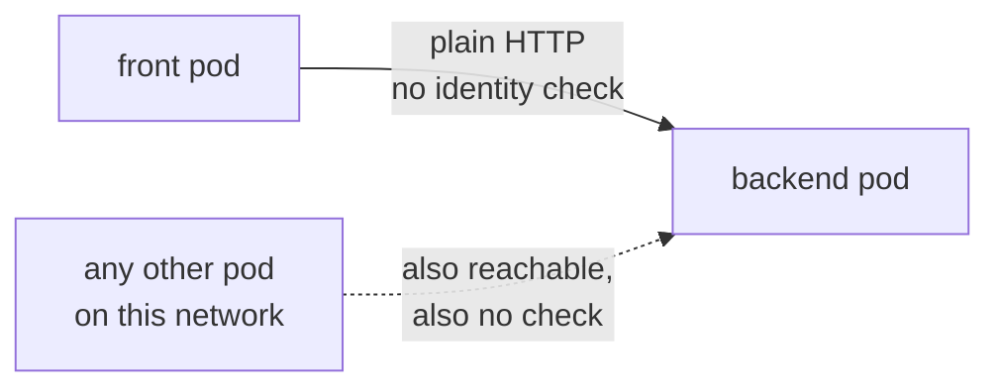
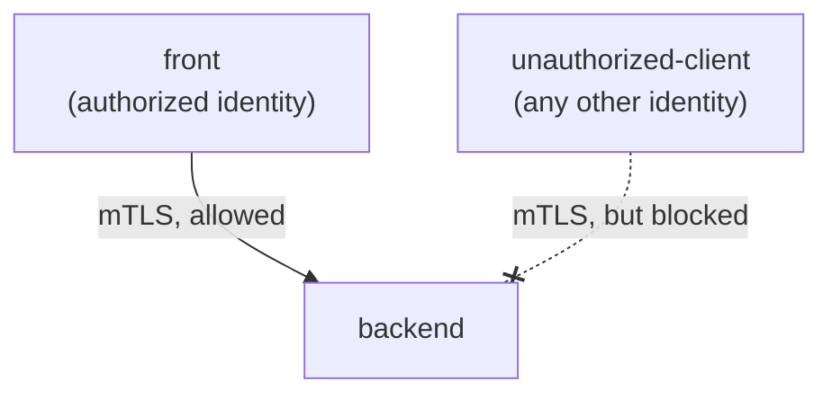

# Zero-trust networking as code

Mutual TLS and traffic policy with Linkerd and Pulumi

Speaker · Role, Pulumi

---
layout: default
---

<div class="flex gap-10 items-center h-full">
  
  <div class="flex-1">
    <h1 class="!text-[3.5rem] !leading-tight !font-semibold !mb-2 !text-[var(--p-primary)]">Speaker Name</h1>
    <p class="!text-[1.5rem] !m-0 opacity-90">Role at <strong>Pulumi</strong></p>
    <p class="!mt-6 !text-[1.15rem] opacity-70">github.com/handle &middot; linkedin.com/in/handle</p>
    <p class="!mt-6 !text-[1.15rem] opacity-70 max-w-lg">Two lines on what they actually do go here once the session is staffed.</p>
  </div>
</div>

<!-- TODO(presenter): replace photo, name, role, socials and bio. No session is staffed yet, so this is a placeholder, not a real person. -->

<!--
No speaker note with a time budget here: this slide is filled in once a presenter is assigned, and does not consume session time on its own.
-->

---
layout: default
---

# Housekeeping

- Chat is open the whole session; use it
- Questions go in the Q&A tab
- Slides and scripts are in the Handouts tab
- The recording link comes by email afterward

<!--
[1 min] Say this once, fast, and move on. Nobody needs elaboration on where the Q&A tab is.
-->

---
layout: default
---

# Agenda

- Why plain HTTP inside a cluster is not safe by default
- Where Linkerd fits next to Istio, Cilium, and Envoy
- What you need to follow along
- Demo: trust anchor, control plane, meshed services, mTLS proof
- Demo: an authorization policy, and watching it reject a call
- Cleanup, recap, and where to go next

<!--
[1 min] Read it once, in order. This is the shape of the next 90 minutes, not a table of contents to dwell on.
-->

---
layout: statement
---

# A pod that can reach another pod **can call it**.

<!--
[4 min] That is the pain, plainly. Kubernetes' network policy, where it exists at all, stops at the IP address and the port. It has no idea which service account made the call, and by default it does not check. In a cluster with no mesh and no network policy, any pod that shares a network with your payments service can open a socket to it and start sending requests. No certificate, no identity, no policy in the way. That is the gap this workshop closes: not "encrypt the wire," which VPNs and cloud load balancers already do at the edge, but "know who is calling, and decide whether they are allowed to," inside the cluster, between your own services. Google Cloud's and Buoyant's recent writing on this (see the deck's sources) both land on the same point from different directions: as more of what calls a service is itself automated (another workload, an agent, a pipeline), the absence of per-call identity stops being a theoretical gap and starts being the actual attack surface. This is the problem a service mesh exists to close.
-->

---
layout: diagram
---

# Two pods, one cluster, no mesh



<!--
[5 min] This is the starting state `04-meshed-services` begins from, before anything is meshed: two plain Kubernetes Deployments and Services, talking over ordinary HTTP. Nothing here is misconfigured. This is what a default Kubernetes network looks like. The dotted line is the point: any third pod on the same network path can reach `backend` exactly the same way `front` does, because reachability is the only thing being checked. A mesh's job is to add two things this diagram is missing: a cryptographic identity per workload (so `backend` can prove who is calling, not just that something is calling) and a policy layer that turns "reachable" into "reachable and authorized" as two separate questions. That is the whole arc of today: first we get identity, mutual TLS between `front` and `backend`; then we get policy, a rule that makes the dotted line fail even though the network path is still open.
-->

---
layout: default
---

# The mesh landscape, briefly

| Project | Approach | In this workshop |
| --- | --- | --- |
| **Linkerd** | Sidecar proxy, added by annotation to a running cluster | Hands-on |
| Istio (ambient mode) | Node-level proxy, needs a cluster-bootstrap install | Landscape only |
| Cilium | Replaces the CNI itself, needs a cluster-bootstrap install | Landscape only |
| Envoy | The proxy underneath Istio and much of the ecosystem, not a mesh on its own | Landscape only |

<!--
[5 min] All four names come up whenever this topic does, so it is worth being honest about why only one gets hands-on time today. Istio's newer ambient mode and Cilium's CNI-replacement approach are both real, well-regarded ways to do this, but both need to be part of how the cluster is bootstrapped, which does not fit a 90-minute session that starts from a plain `kind` cluster already running. Linkerd's proxy goes in by adding an annotation to a namespace or a workload that is already deployed, which is exactly the shape of demo this slot allows. Envoy is not really a competitor in this table; it is the data-plane proxy that Istio (and several other projects) build on, so it shows up here as context, not as an alternative. If your own cluster is already on Istio or Cilium, the ideas in this workshop (identity, mTLS, authorization policy) transfer directly; the CLI commands will not.
-->

---
layout: default
---

# Before you touch a command

- Docker (or another `kind`-compatible runtime), ~4 vCPU / 6 GB free
- `kind` v0.33.0+, `kubectl` matching the cluster's Kubernetes minor version
- The `linkerd` CLI, stable channel
- Node.js LTS and npm, plus the Pulumi CLI (v3.264.0+) and a Pulumi Cloud account or local backend

<!--
[3 min] This is the full checklist from the folder's README, and it is worth reading out loud once rather than assuming everyone pre-read it. The resource number matters more than it looks: 4 vCPU / 6 GB is roughly what the kind cluster, the Linkerd control plane, linkerd-viz, and two sample services need running at once, and a laptop that is short on either will show it as pods stuck in Pending rather than a clean error. If you are following along rather than watching, get `kind create cluster` and a `linkerd check --pre` done before this slide, not during it. A cold image pull mid-session can eat several minutes of a tight 90.
-->

---
layout: section
---

# Demo

## Building this cluster's zero trust, one Pulumi program at a time

---
layout: code
---

# Step 2 · The mesh's own root of trust, as code

```bash
cd 02-trust-anchor && npm install
pulumi stack init dev
pulumi up
```

Exports `trustAnchorPem`, `issuerCertPem`, `issuerKeyPem`. No `openssl`, no manual cert files.

<!--
[9 min] `02-trust-anchor` is a small Pulumi TypeScript program using `@pulumi/tls`: a `tls.PrivateKey` and a self-signed `tls.SelfSignedCert` that together become Linkerd's identity trust anchor, the root of the certificate chain every meshed workload's identity ultimately traces back to. This is the part of the promise from the title slide that is easy to skip past: the mesh's own root certificate is Pulumi code, not a file someone generated once with `openssl` and pasted into a Secret. `pulumi up` here needs no live cluster at all; it only needs the TLS provider, so this step's `pulumi preview` succeeds in full even with no `kubectl` context configured, which is worth pointing out if anyone asks why we have not touched Kubernetes yet. The three stack outputs it exports are consumed by the next step through a Pulumi `StackReference`, not by copying files between folders by hand.
-->

---
layout: code
---

# Step 3 · Install the control plane, wired to that anchor

```bash
cd 03-control-plane && npm install
pulumi stack init dev
pulumi up
kubectl --context kind-mesh-demo -n linkerd get pods
```

`linkerd-identity`, `linkerd-destination`, `linkerd-proxy-injector` → `Running`

<!--
[9 min] This program installs two Helm charts as `kubernetes.helm.v4.Chart` resources: `linkerd-crds` then `linkerd-control-plane`, both pinned to the chart version tied to the Linkerd 2.20 stable milestone. That pin matters enough to say out loud: Linkerd ships from an edge channel roughly weekly, and this program deliberately does not track the newest edge tag, it tracks the one the 2.20 announcement called stable. The control plane's Helm values wire in step 2's trust anchor directly (`identityTrustAnchorsPEM`, `identity.issuer.tls.crtPEM`/`keyPEM`), read through a Pulumi `StackReference` to `02-trust-anchor`, so there is no copy-pasted PEM file anywhere in this repository. Once `pulumi up` finishes, `linkerd-identity`, `linkerd-destination`, and `linkerd-proxy-injector` should all show `Running`; `linkerd check` (not shown on this slide, but worth running live if time allows) gives a readable pass/fail on the whole control plane.
-->

---
layout: code
---

# Step 4 · Mesh two services by annotation, not by rewrite

```bash
cd 04-meshed-services && npm install
pulumi stack init dev
pulumi up
kubectl --context kind-mesh-demo -n mesh-demo get pods
```

`front` and `backend` → `2/2` (application container + `linkerd-proxy`)

<!--
[9 min] `04-meshed-services` deploys two ordinary Deployments and Services, `front` and `backend`, and the only thing that meshes them is the `linkerd.io/inject: enabled` annotation on their pod spec. Nothing about the application containers changes. Linkerd's admission webhook sees that annotation at pod creation and adds two containers automatically: `linkerd-init`, which sets up traffic redirection, and `linkerd-proxy`, the actual sidecar that terminates and originates mTLS on the pod's behalf. That is why the pod count reads `2/2` instead of `1/1` once this succeeds: the application never asked for a sidecar, the annotation did. One detail worth calling out: `front` and `backend` each get their own `ServiceAccount` here, on purpose, rather than sharing a default one; the authorization policy in step 6 only means something if the two identities are actually distinct.
-->

---
layout: code
---

# Step 5 · Prove the mTLS is real

```bash
cd 05-mtls-proof && npm install
pulumi stack init dev
./wait-for-control-plane.sh
pulumi up
./verify-mtls.sh
```

`linkerd viz edges` → `front -> backend` shows **SECURED**

<!--
[9 min] This step installs the `linkerd-viz` extension as its own Helm chart, then runs `verify-mtls.sh`, which wraps `linkerd viz edges -n mesh-demo`, the command that reports, per edge in the mesh, whether traffic between two workloads is secured with mTLS. `front -> backend` should read `SECURED` here, which is the actual proof, not an inference: nobody configured a certificate on either service, no TLS library was added to the application code, and the connection is still mutually authenticated because both proxies hold identities issued from the trust anchor built in step 2. If a projector makes `linkerd viz tap` output hard to read live, a captured run showing the same `tls=true` field is an acceptable fallback; say so if you use it, rather than presenting a screenshot as a live result.
-->

---
layout: diagram
---

# Authenticated is not the same as authorized



<!--
[5 min] Here is the distinction the whole second half of the demo rests on. Step 5 proved that `front` and `backend` talk over mTLS. That is authentication: each side can cryptographically prove which workload it is. Nothing so far has said which identities are *allowed* to call `backend`. By default, once two workloads are meshed, any other meshed workload can still reach either of them over mTLS: the mesh terminates TLS for everyone, indiscriminately. An authorization policy is the separate, explicit step that turns "this caller proved who it is" into "and that caller is on the list." Step 6 writes that policy; step 7 proves it by using it to reject a caller that is not `front`.
-->

---
layout: code
---

# Step 6 · Only `front` may call `backend`

```bash
cd 06-authorization-policy && npm install
pulumi stack init dev
pulumi up
./verify-policy.sh
```

`Server` + `AuthorizationPolicy` + `MeshTLSAuthentication` created. `front → backend` still succeeds.

<!--
[9 min] This program creates three Linkerd custom resources through Pulumi's `CustomResource`: a `Server` (API version `policy.linkerd.io/v1beta1`) that names the port on `backend` the policy governs, a `MeshTLSAuthentication` that names the mesh identity allowed to call it, specifically `front`'s ServiceAccount, and an `AuthorizationPolicy` (both at `v1alpha1`) tying the two together. `verify-policy.sh` re-runs the `front -> backend` call and confirms it still succeeds, which is the point: applying a policy that scopes access to one identity should not break the one caller that identity actually is. Nothing here needed a code change in `front` or `backend` themselves; the policy layer sits entirely at the mesh, expressed as Kubernetes objects that Pulumi manages the same way it manages everything else in this program.
-->

---
layout: code
---

# Step 7 · Watch the mesh reject a caller, live

```bash
07-deny-in-action/run-deny-demo.sh
07-deny-in-action/cleanup.sh
```

`curl-client → backend`: **HTTP 403** · `front → backend`: **HTTP 200**

<!--
[9 min] `run-deny-demo.sh` applies a throwaway pod, an `unauthorized-client` running `curlimages/curl`, that is meshed like everything else but was never named in step 6's `MeshTLSAuthentication`. It calls `backend` and gets HTTP 403: the mesh identifies it correctly, confirms it is not `front`, and blocks the request. The same script re-checks that `front -> backend` is unaffected and still returns HTTP 200, side by side with the rejection, so the audience sees both halves of the policy in the same run. This manifest lives outside every Pulumi program on purpose: `07-deny-in-action/` is deliberately plain `kubectl`, applied live, because the point of this step is the rejection happening in real time, not a change to infrastructure state. `cleanup.sh` removes the throwaway client immediately after so it does not linger in the cluster.
-->

---
layout: default
---

# What this does not cover

- Istio's ambient mode and Cilium's CNI-replacement approach both need a cluster bootstrapped around them from the start
- Neither fits a 90-minute session that starts from a plain, already-running `kind` cluster
- If your cluster is already on one of them, today's ideas (identity, mTLS, authorization policy) still apply; the CLI does not

<!--
[3 min] Say this plainly rather than skip past it. This workshop picked Linkerd because its injection model matches a live demo slot, not because it is unconditionally the right choice for every cluster. A session built around Istio ambient or Cilium is a real, different workshop. If that is what a room actually wants, that is a new topic for the team that decides what gets built next, not a scope change to make here on the fly.
-->

---
layout: statement
---

# Same identity work. Same policy shape. Every mesh.

<!--
[1 min] A beat, not a topic. Let it sit in silence for a second before moving to cleanup. The pause is the point, not a new idea.
-->

---
layout: default
---

# Cleanup, and what you actually built

```bash
08-teardown/teardown.sh
```

- Destroys all five Pulumi stacks, in reverse dependency order, then deletes the `kind` cluster
- A mesh trust anchor, generated and installed as Pulumi code
- Two services meshed by annotation, proven to speak mTLS with `linkerd viz`
- An authorization policy that turned "reachable" into "reachable and allowed," and a rejection to prove it

<!--
[5 min] `teardown.sh` destroys the stacks from `06-authorization-policy` back through `02-trust-anchor`, then deletes the `kind` cluster itself, so nothing from this session is still running afterward. `kind get clusters` and `pulumi stack ls` in each folder should both come back empty. The four bullets below the command are the actual recap: a mesh's root of trust as ordinary, reviewable Pulumi code; two services meshed without a line of application code changing; mTLS you can point to and verify with the mesh's own tooling, not take on faith; and a policy that draws a line between "the mesh can prove who's calling" and "the mesh has decided that caller is allowed." That gap, authentication without authorization, is the one thing worth remembering if nothing else survives from today.
-->

---
layout: default
---

# Keep going

<div class="grid grid-cols-3 gap-6 mt-6">
  <div class="flex flex-col items-center text-center gap-3">
    <div class="w-32 h-32 mx-auto"><QRCode data="https://slack.pulumi.com" dark="#000000" /></div>
    <div class="font-semibold">Pulumi Community Slack</div>
    <div class="text-sm opacity-70">slack.pulumi.com</div>
  </div>
  <div class="flex flex-col items-center text-center gap-3">
    <div class="w-32 h-32 mx-auto"><QRCode data="https://app.pulumi.com/signup" dark="#000000" /></div>
    <div class="font-semibold">Pulumi Cloud, free tier</div>
    <div class="text-sm opacity-70">app.pulumi.com/signup</div>
  </div>
  <div class="flex flex-col items-center text-center gap-3">
    <div class="w-32 h-32 mx-auto"><QRCode data="https://github.com/pulumi/workshops/tree/anvil/zero-trust-networking-linkerd/zero-trust-networking-linkerd" dark="#000000" /></div>
    <div class="font-semibold">This workshop's repo</div>
    <div class="text-sm opacity-70">pulumi/workshops</div>
  </div>
</div>

<!--
[2 min] Three things, three QR codes, said in one breath: the community Slack if you want to ask a question after today, a free Pulumi Cloud account if you want to run any of this yourself, and the repo folder this whole demo lives in, on the branch it shipped on. That link stays live once the pull request merges to `main`.
-->

---
layout: end
---

# Questions?

<div class="grid grid-cols-2 gap-8 mt-8 max-w-2xl mx-auto">
  <div class="flex flex-col items-center text-center gap-3">
    
    <div class="w-24 h-24 mx-auto"><QRCode data="https://github.com/pulumi" dark="#000000" /></div>
    <div class="text-sm opacity-70">TODO(presenter): real handle</div>
  </div>
  <div class="flex flex-col items-center text-center gap-3">
    <div class="w-24 h-24 mx-auto"><QRCode data="https://github.com/pulumi/workshops/tree/anvil/zero-trust-networking-linkerd/zero-trust-networking-linkerd" dark="#000000" /></div>
    <div class="text-sm opacity-70">Workshop repo</div>
  </div>
</div>

<!--
[1 min] This slide stays up through Q&A, so it carries the links people actually photograph: the speaker's own profile (placeholder until a presenter is assigned) and the repo one more time. Nothing new to say here beyond "thank you": let the room ask.
-->
